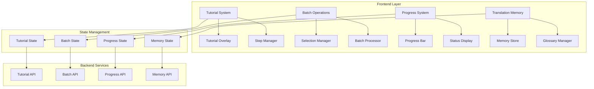

# Design Document - GameStringer UX Enhancements

## Overview

Questo documento descrive l'architettura e il design per implementare quattro miglioramenti UX chiave in GameStringer: sistema tutorial interattivo, operazioni batch, indicatori di progresso avanzati e translation memory/glossary.

## Architecture

### High-Level Architecture



## Components and Interfaces

### 1. Tutorial System

#### TutorialProvider Component
```typescript
interface TutorialStep {
  id: string;
  title: string;
  description: string;
  target: string; // CSS selector
  position: 'top' | 'bottom' | 'left' | 'right';
  action?: 'click' | 'hover' | 'input';
  validation?: () => boolean;
}

interface TutorialState {
  isActive: boolean;
  currentStep: number;
  steps: TutorialStep[];
  completed: boolean;
  canSkip: boolean;
}
```

#### TutorialOverlay Component
- Spotlight effect con backdrop scuro
- Tooltip posizionabile con frecce
- Controlli navigazione (Next, Previous, Skip)
- Progress indicator per passi tutorial

### 2. Batch Operations System

#### BatchSelectionProvider
```typescript
interface BatchSelection {
  selectedItems: Set<string>;
  selectAll: () => void;
  selectNone: () => void;
  toggleItem: (id: string) => void;
  isSelected: (id: string) => boolean;
}

interface BatchOperation {
  id: string;
  name: string;
  icon: React.ComponentType;
  action: (items: string[]) => Promise<BatchResult>;
  requiresConfirmation: boolean;
}
```

#### BatchProcessor Component
- Queue di operazioni batch
- Progress tracking per ogni item
- Error handling e retry logic
- Results summary con export

### 3. Progress Indicators System

#### ProgressProvider
```typescript
interface ProgressState {
  operations: Map<string, OperationProgress>;
  startOperation: (id: string, config: ProgressConfig) => void;
  updateProgress: (id: string, progress: number, status?: string) => void;
  completeOperation: (id: string, result?: any) => void;
  failOperation: (id: string, error: Error) => void;
}

interface OperationProgress {
  id: string;
  title: string;
  progress: number; // 0-100
  status: string;
  startTime: Date;
  estimatedEndTime?: Date;
  canMinimize: boolean;
  error?: Error;
}
```

#### ProgressModal Component
- Modal overlay per operazioni lunghe
- Progress bar animata con percentuale
- Status text dinamico
- Tempo stimato rimanente
- Pulsante minimize/cancel

### 4. Translation Memory & Glossary

#### TranslationMemoryProvider
```typescript
interface TranslationMemoryEntry {
  id: string;
  sourceText: string;
  targetText: string;
  sourceLanguage: string;
  targetLanguage: string;
  context?: string;
  confidence: number;
  createdAt: Date;
  usageCount: number;
}

interface GlossaryEntry {
  id: string;
  term: string;
  translation: string;
  sourceLanguage: string;
  targetLanguage: string;
  definition?: string;
  category?: string;
  project?: string;
}
```

#### MemorySuggestions Component
- Fuzzy search per traduzioni simili
- Confidence scoring
- Quick apply suggestions
- Context matching

## Data Models

### Tutorial Progress Model
```typescript
interface UserTutorialProgress {
  userId: string;
  completedTutorials: string[];
  currentTutorial?: {
    id: string;
    currentStep: number;
    startedAt: Date;
  };
  preferences: {
    showHints: boolean;
    autoAdvance: boolean;
  };
}
```

### Batch Operation Model
```typescript
interface BatchOperationResult {
  operationId: string;
  totalItems: number;
  successCount: number;
  failureCount: number;
  results: Array<{
    itemId: string;
    success: boolean;
    result?: any;
    error?: string;
  }>;
  duration: number;
  completedAt: Date;
}
```

### Translation Memory Model
```typescript
interface TranslationMemoryDatabase {
  entries: TranslationMemoryEntry[];
  glossary: GlossaryEntry[];
  projects: Array<{
    id: string;
    name: string;
    sourceLanguage: string;
    targetLanguages: string[];
    glossaryIds: string[];
  }>;
}
```

## Error Handling

### Tutorial System
- Graceful degradation se target elements non esistono
- Auto-recovery da passi falliti
- Fallback a tutorial statico se interattivo fallisce

### Batch Operations
- Partial failure handling con detailed reporting
- Retry mechanism per operazioni fallite
- Rollback capability per operazioni critiche

### Progress System
- Timeout handling per operazioni bloccate
- Error recovery con user notification
- Background operation persistence

### Translation Memory
- Fuzzy matching fallback se exact match fallisce
- Conflict resolution per traduzioni duplicate
- Data corruption recovery

## Testing Strategy

### Unit Tests
- Tutorial step validation logic
- Batch operation processing
- Progress calculation algorithms
- Memory search and matching

### Integration Tests
- Tutorial flow end-to-end
- Batch operations con real data
- Progress tracking accuracy
- Memory persistence

### E2E Tests
- Complete user onboarding flow
- Batch translation workflow
- Long-running operation handling
- Memory suggestion accuracy

### Performance Tests
- Large batch operation handling
- Memory database query performance
- Tutorial rendering performance
- Progress update frequency impact