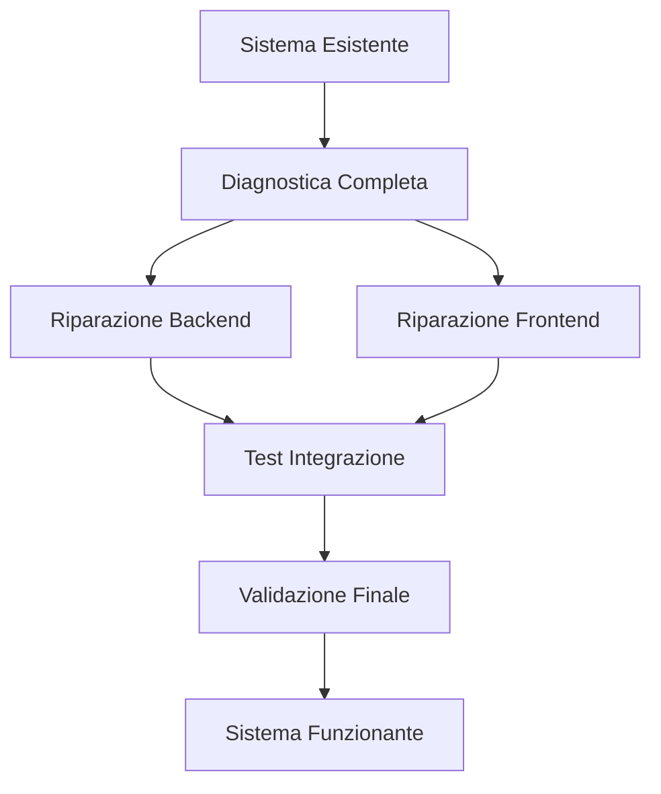
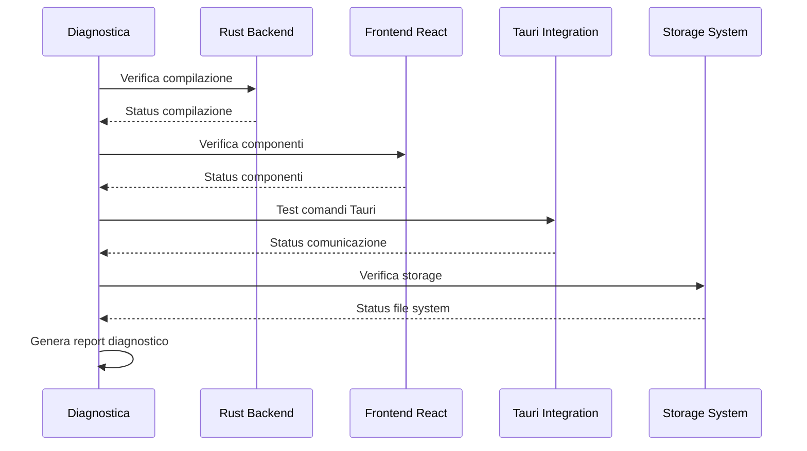

# Design Document - Ripristino Sistema Profili

## Overview

Il design per il ripristino del sistema profili si basa su un approccio sistematico di diagnostica, riparazione e validazione. Il sistema esistente ha un'architettura completa ma presenta problemi di integrazione o configurazione che impediscono il funzionamento corretto. L'approccio sarà incrementale: prima diagnosticare, poi riparare componente per componente, infine validare l'integrazione completa.

## Architecture

### Strategia di Ripristino



### Flusso di Diagnostica



## Components and Interfaces

### 1. Sistema di Diagnostica

**Responsabilità:**
- Verificare stato di tutti i componenti del sistema profili
- Identificare errori specifici e loro cause
- Generare report dettagliato con priorità di riparazione

**Componenti da verificare:**
- Compilazione Rust backend senza errori
- Registrazione comandi Tauri in main.rs
- Componenti React e hooks TypeScript
- Integrazione ProfileWrapper in layout
- File di configurazione e dipendenze

### 2. Sistema di Riparazione Backend

**Responsabilità:**
- Risolvere errori di compilazione Rust
- Verificare e riparare ProfileManager
- Controllare integrazione comandi Tauri
- Validare sistema di storage e crittografia

**Strategie di riparazione:**
- Analisi errori di compilazione e risoluzione
- Verifica dipendenze Cargo.toml
- Test unitari per ogni componente
- Validazione integrazione con main.rs

### 3. Sistema di Riparazione Frontend

**Responsabilità:**
- Risolvere errori TypeScript nei componenti
- Verificare hooks e context providers
- Controllare routing e protezione pagine
- Validare integrazione con Tauri API

**Strategie di riparazione:**
- Analisi errori TypeScript e risoluzione
- Verifica dipendenze package.json
- Test rendering componenti
- Validazione chiamate Tauri API

### 4. Sistema di Integrazione

**Responsabilità:**
- Verificare comunicazione frontend-backend
- Testare flusso completo utente
- Validare persistenza dati
- Controllare gestione errori

**Test di integrazione:**
- Startup applicazione → selezione profilo
- Creazione nuovo profilo → salvataggio
- Autenticazione → caricamento dati
- Cambio profilo → pulizia stato

## Data Models

### Diagnostic Report

```typescript
interface DiagnosticReport {
  timestamp: string;
  overallStatus: 'healthy' | 'warning' | 'error';
  components: {
    rustBackend: ComponentStatus;
    reactFrontend: ComponentStatus;
    tauriIntegration: ComponentStatus;
    storage: ComponentStatus;
  };
  errors: DiagnosticError[];
  recommendations: string[];
}

interface ComponentStatus {
  status: 'healthy' | 'warning' | 'error';
  details: string;
  issues: string[];
}

interface DiagnosticError {
  component: string;
  severity: 'low' | 'medium' | 'high' | 'critical';
  message: string;
  solution?: string;
}
```

### Repair Plan

```typescript
interface RepairPlan {
  phase: 'diagnostic' | 'backend' | 'frontend' | 'integration' | 'validation';
  tasks: RepairTask[];
  dependencies: string[];
  estimatedTime: number;
}

interface RepairTask {
  id: string;
  description: string;
  component: string;
  priority: 'low' | 'medium' | 'high' | 'critical';
  status: 'pending' | 'in_progress' | 'completed' | 'failed';
  solution: string;
}
```

## Error Handling

### Strategia di Gestione Errori

1. **Errori di Compilazione**
   - Cattura output compilatore Rust
   - Analizza errori TypeScript
   - Identifica dipendenze mancanti
   - Propone soluzioni automatiche

2. **Errori di Runtime**
   - Monitora console browser
   - Cattura eccezioni Tauri
   - Analizza log applicazione
   - Traccia stack traces

3. **Errori di Integrazione**
   - Verifica comunicazione Tauri-React
   - Testa persistenza dati
   - Valida stato applicazione
   - Controlla sincronizzazione

### Recovery Strategies

```typescript
interface RecoveryStrategy {
  errorType: string;
  detection: string;
  automaticFix: boolean;
  manualSteps: string[];
  rollbackPlan: string[];
}
```

## Testing Strategy

### 1. Diagnostic Tests

- **Compilation Tests**: Verifica compilazione senza errori
- **Component Tests**: Rendering e funzionalità componenti
- **Integration Tests**: Comunicazione frontend-backend
- **Storage Tests**: Lettura/scrittura file profili

### 2. Repair Validation

- **Unit Tests**: Ogni componente riparato
- **Integration Tests**: Flusso completo dopo riparazione
- **Regression Tests**: Nessuna regressione funzionalità esistenti
- **Performance Tests**: Prestazioni dopo riparazione

### 3. End-to-End Validation

- **User Journey Tests**: Flusso completo utente
- **Data Persistence Tests**: Salvataggio e caricamento dati
- **Error Handling Tests**: Gestione errori e recovery
- **Security Tests**: Crittografia e protezione dati

## Implementation Phases

### Phase 1: Comprehensive Diagnostic
- Eseguire diagnostica completa sistema
- Identificare tutti i problemi e loro priorità
- Generare piano di riparazione dettagliato

### Phase 2: Backend Restoration
- Risolvere errori compilazione Rust
- Riparare ProfileManager e componenti core
- Validare integrazione Tauri commands

### Phase 3: Frontend Restoration
- Risolvere errori TypeScript
- Riparare componenti React e hooks
- Validare routing e protezione pagine

### Phase 4: Integration Restoration
- Testare comunicazione completa
- Validare flusso utente end-to-end
- Verificare persistenza dati

### Phase 5: Final Validation
- Eseguire tutti i test di validazione
- Verificare conformità ai requirements originali
- Documentare stato finale e eventuali limitazioni

## Success Criteria

Il ripristino sarà considerato completato quando:

1. **Compilazione**: Backend Rust compila senza errori/warning
2. **Frontend**: Componenti React renderizzano correttamente
3. **Integrazione**: Comunicazione Tauri-React funziona perfettamente
4. **Funzionalità**: Tutti i requirements originali sono soddisfatti
5. **Stabilità**: Sistema funziona stabilmente senza crash o errori
6. **Performance**: Prestazioni accettabili per uso normale
7. **Sicurezza**: Crittografia e protezione dati funzionano correttamente