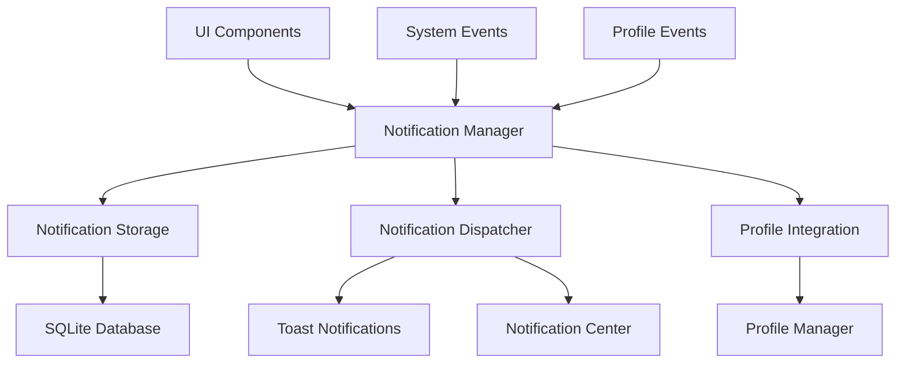
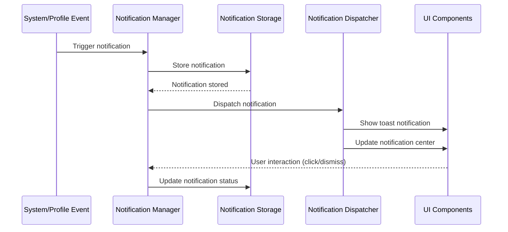

# Documento di Design - Sistema Notifiche In-App

## Overview

Il sistema di notifiche in-app fornirà un meccanismo centralizzato per gestire e visualizzare notifiche all'interno dell'applicazione GameStringer. Il sistema si integrerà perfettamente con l'architettura esistente dei profili utente, fornendo notifiche personalizzate per profilo e supportando diversi tipi di notifiche (sistema, profilo, sicurezza, aggiornamenti).

## Architecture

### Componenti Principali



### Flusso delle Notifiche



## Components and Interfaces

### 1. Notification Manager (Rust)

```rust
pub struct NotificationManager {
    storage: NotificationStorage,
    dispatcher: NotificationDispatcher,
    profile_integration: ProfileIntegration,
    settings_cache: HashMap<String, NotificationPreferences>,
}

impl NotificationManager {
    pub async fn create_notification(&self, notification: CreateNotificationRequest) -> Result<Notification, NotificationError>;
    pub async fn get_notifications(&self, profile_id: &str, filter: NotificationFilter) -> Result<Vec<Notification>, NotificationError>;
    pub async fn mark_as_read(&self, notification_id: &str, profile_id: &str) -> Result<(), NotificationError>;
    pub async fn delete_notification(&self, notification_id: &str, profile_id: &str) -> Result<(), NotificationError>;
    pub async fn get_unread_count(&self, profile_id: &str) -> Result<u32, NotificationError>;
    pub async fn clear_all_notifications(&self, profile_id: &str) -> Result<(), NotificationError>;
    pub async fn update_preferences(&self, profile_id: &str, preferences: NotificationPreferences) -> Result<(), NotificationError>;
}
```

### 2. Notification Storage (Rust)

```rust
pub struct NotificationStorage {
    db_path: PathBuf,
    connection: Option<rusqlite::Connection>,
}

pub struct Notification {
    pub id: String,
    pub profile_id: String,
    pub notification_type: NotificationType,
    pub title: String,
    pub message: String,
    pub icon: Option<String>,
    pub action_url: Option<String>,
    pub priority: NotificationPriority,
    pub created_at: DateTime<Utc>,
    pub read_at: Option<DateTime<Utc>>,
    pub expires_at: Option<DateTime<Utc>>,
    pub metadata: NotificationMetadata,
}

impl NotificationStorage {
    pub async fn save_notification(&self, notification: &Notification) -> Result<(), StorageError>;
    pub async fn load_notifications(&self, profile_id: &str, filter: NotificationFilter) -> Result<Vec<Notification>, StorageError>;
    pub async fn update_notification(&self, notification: &Notification) -> Result<(), StorageError>;
    pub async fn delete_notification(&self, id: &str) -> Result<(), StorageError>;
    pub async fn cleanup_expired(&self) -> Result<u32, StorageError>;
}
```

### 3. Notification UI Components (React)

```typescript
// Componente toast notifica
interface NotificationToastProps {
  notification: Notification;
  onDismiss: (id: string) => void;
  onAction: (id: string, action: string) => void;
}

// Centro notifiche
interface NotificationCenterProps {
  isOpen: boolean;
  onClose: () => void;
  notifications: Notification[];
  onMarkAsRead: (id: string) => void;
  onDelete: (id: string) => void;
  onClearAll: () => void;
}

// Impostazioni notifiche
interface NotificationSettingsProps {
  preferences: NotificationPreferences;
  onUpdatePreferences: (preferences: NotificationPreferences) => void;
}

// Indicatore notifiche
interface NotificationIndicatorProps {
  unreadCount: number;
  onClick: () => void;
}
```

## Data Models

### Notification Data Structure

```typescript
interface Notification {
  id: string;
  profileId: string;
  type: NotificationType;
  title: string;
  message: string;
  icon?: string;
  actionUrl?: string;
  priority: NotificationPriority;
  createdAt: string;
  readAt?: string;
  expiresAt?: string;
  metadata: NotificationMetadata;
}

enum NotificationType {
  SYSTEM = 'system',
  PROFILE = 'profile',
  SECURITY = 'security',
  UPDATE = 'update',
  GAME = 'game',
  STORE = 'store',
  CUSTOM = 'custom'
}

enum NotificationPriority {
  LOW = 'low',
  NORMAL = 'normal',
  HIGH = 'high',
  URGENT = 'urgent'
}

interface NotificationMetadata {
  source: string;
  category: string;
  tags: string[];
  customData?: Record<string, any>;
}

interface NotificationPreferences {
  profileId: string;
  globalEnabled: boolean;
  soundEnabled: boolean;
  desktopEnabled: boolean;
  typeSettings: Record<NotificationType, TypePreference>;
  quietHours: QuietHoursSettings;
  maxNotifications: number;
  autoDeleteAfterDays: number;
}

interface TypePreference {
  enabled: boolean;
  priority: NotificationPriority;
  showToast: boolean;
  playSound: boolean;
  persistInCenter: boolean;
}

interface QuietHoursSettings {
  enabled: boolean;
  startTime: string; // HH:MM format
  endTime: string;   // HH:MM format
  allowUrgent: boolean;
}
```

### Database Schema

```sql
-- Tabella notifiche
CREATE TABLE notifications (
    id TEXT PRIMARY KEY,
    profile_id TEXT NOT NULL,
    notification_type TEXT NOT NULL,
    title TEXT NOT NULL,
    message TEXT NOT NULL,
    icon TEXT,
    action_url TEXT,
    priority TEXT NOT NULL DEFAULT 'normal',
    created_at DATETIME NOT NULL,
    read_at DATETIME,
    expires_at DATETIME,
    metadata TEXT, -- JSON
    FOREIGN KEY (profile_id) REFERENCES profiles(id) ON DELETE CASCADE
);

-- Tabella preferenze notifiche
CREATE TABLE notification_preferences (
    profile_id TEXT PRIMARY KEY,
    global_enabled BOOLEAN NOT NULL DEFAULT 1,
    sound_enabled BOOLEAN NOT NULL DEFAULT 1,
    desktop_enabled BOOLEAN NOT NULL DEFAULT 1,
    type_settings TEXT NOT NULL, -- JSON
    quiet_hours TEXT, -- JSON
    max_notifications INTEGER NOT NULL DEFAULT 50,
    auto_delete_after_days INTEGER NOT NULL DEFAULT 30,
    updated_at DATETIME NOT NULL,
    FOREIGN KEY (profile_id) REFERENCES profiles(id) ON DELETE CASCADE
);

-- Indici per performance
CREATE INDEX idx_notifications_profile_created ON notifications(profile_id, created_at DESC);
CREATE INDEX idx_notifications_type ON notifications(notification_type);
CREATE INDEX idx_notifications_read ON notifications(profile_id, read_at);
CREATE INDEX idx_notifications_expires ON notifications(expires_at);
```

## Error Handling

### Tipi di Errore

```rust
#[derive(Debug, thiserror::Error)]
pub enum NotificationError {
    #[error("Notifica non trovata: {0}")]
    NotificationNotFound(String),
    
    #[error("Profilo non autorizzato per questa notifica")]
    UnauthorizedProfile,
    
    #[error("Tipo di notifica non valido: {0}")]
    InvalidNotificationType(String),
    
    #[error("Priorità notifica non valida: {0}")]
    InvalidPriority(String),
    
    #[error("Contenuto notifica non valido: {0}")]
    InvalidContent(String),
    
    #[error("Errore storage: {0}")]
    StorageError(#[from] StorageError),
    
    #[error("Errore serializzazione: {0}")]
    SerializationError(#[from] serde_json::Error),
    
    #[error("Errore database: {0}")]
    DatabaseError(#[from] rusqlite::Error),
}
```

### Gestione Errori UI

- **Notifica non trovata**: Rimuovi dalla UI e mostra messaggio informativo
- **Errore di rete**: Mostra notifica offline e riprova automaticamente
- **Storage pieno**: Suggerisci pulizia notifiche vecchie
- **Errore preferenze**: Ripristina impostazioni predefinite

## Testing Strategy

### Unit Tests

1. **NotificationManager Tests**
   - Creazione e gestione notifiche
   - Filtri e ordinamento
   - Integrazione con profili

2. **NotificationStorage Tests**
   - Salvataggio e caricamento notifiche
   - Pulizia notifiche scadute
   - Performance query database

3. **UI Component Tests**
   - Rendering componenti notifica
   - Interazioni utente (click, dismiss)
   - Gestione stati (loading, error)

### Integration Tests

1. **End-to-End Notification Flow**
   - Evento sistema → Notifica → UI → Azione utente
   - Cambio profilo → Notifiche specifiche profilo
   - Impostazioni → Comportamento notifiche

2. **Profile Integration Tests**
   - Notifiche per eventi profilo
   - Preferenze per profilo
   - Pulizia notifiche al cambio profilo

### Performance Tests

1. **Scalability Tests**
   - Performance con molte notifiche (1000+)
   - Tempo di caricamento centro notifiche
   - Memoria utilizzata per notifiche attive

2. **Database Performance**
   - Query performance con grandi dataset
   - Efficienza pulizia notifiche scadute
   - Indici database ottimizzati

## Security Considerations

### Protezione Dati

- **Isolamento**: Notifiche isolate per profilo
- **Validazione**: Validazione input per prevenire XSS
- **Sanitizzazione**: Sanitizzazione contenuto notifiche
- **Autorizzazione**: Controllo accesso notifiche per profilo

### Privacy

- **Contenuto Sensibile**: Evitare informazioni sensibili in notifiche
- **Retention**: Pulizia automatica notifiche vecchie
- **Logging**: Log minimi senza contenuto notifiche
- **Export**: Esclusione notifiche da export profilo

## Integration with Existing Systems

### Profile System Integration

```rust
// Eventi profilo che generano notifiche
pub enum ProfileEvent {
    ProfileCreated(String),
    ProfileAuthenticated(String),
    ProfileSwitched(String, String),
    ProfileLocked(String),
    ProfileUnlocked(String),
    CredentialAdded(String, String),
    CredentialError(String, String),
    SettingsUpdated(String),
    BackupCreated(String),
    BackupRestored(String),
}

impl NotificationManager {
    pub async fn handle_profile_event(&self, event: ProfileEvent) -> Result<(), NotificationError> {
        match event {
            ProfileEvent::ProfileCreated(profile_id) => {
                self.create_welcome_notification(&profile_id).await?;
            },
            ProfileEvent::ProfileLocked(profile_id) => {
                self.create_security_notification(&profile_id, "Profilo bloccato per troppi tentativi").await?;
            },
            ProfileEvent::CredentialError(profile_id, store) => {
                self.create_error_notification(&profile_id, &format!("Errore credenziali {}", store)).await?;
            },
            // ... altri eventi
        }
        Ok(())
    }
}
```

### System Events Integration

```typescript
// Hook per eventi sistema
export function useSystemNotifications() {
  const { createNotification } = useNotifications();
  
  useEffect(() => {
    // Ascolta eventi Tauri
    const unlisten = listen('system-event', (event) => {
      handleSystemEvent(event.payload);
    });
    
    return () => {
      unlisten.then(fn => fn());
    };
  }, []);
  
  const handleSystemEvent = (event: SystemEvent) => {
    switch (event.type) {
      case 'update-available':
        createNotification({
          type: NotificationType.UPDATE,
          title: 'Aggiornamento Disponibile',
          message: `Versione ${event.version} disponibile`,
          priority: NotificationPriority.NORMAL,
          actionUrl: '/settings/updates'
        });
        break;
      // ... altri eventi
    }
  };
}
```

## Accessibility Features

### Screen Reader Support

- **ARIA Labels**: Etichette appropriate per screen reader
- **Live Regions**: Annunci automatici nuove notifiche
- **Focus Management**: Gestione focus per navigazione tastiera
- **Semantic HTML**: Struttura HTML semantica

### Keyboard Navigation

- **Shortcuts**: Scorciatoie tastiera per centro notifiche
- **Tab Navigation**: Navigazione tab tra notifiche
- **Action Keys**: Tasti per azioni rapide (dismiss, mark read)
- **Escape**: Chiusura rapida centro notifiche

### Visual Accessibility

- **High Contrast**: Supporto modalità alto contrasto
- **Font Scaling**: Rispetto impostazioni dimensione font
- **Color Blind**: Icone oltre ai colori per priorità
- **Reduced Motion**: Rispetto preferenze animazioni ridotte

## Performance Optimizations

### Frontend Optimizations

- **Virtual Scrolling**: Per liste lunghe di notifiche
- **Lazy Loading**: Caricamento progressivo notifiche
- **Memoization**: Cache componenti notifica
- **Debouncing**: Debounce azioni utente frequenti

### Backend Optimizations

- **Connection Pooling**: Pool connessioni database
- **Batch Operations**: Operazioni batch per performance
- **Indexing**: Indici database ottimizzati
- **Cleanup Jobs**: Job automatici pulizia notifiche

### Memory Management

- **Notification Limits**: Limite notifiche in memoria
- **Garbage Collection**: Pulizia automatica notifiche scadute
- **Cache Eviction**: Rimozione cache notifiche vecchie
- **Resource Cleanup**: Pulizia risorse componenti smontati