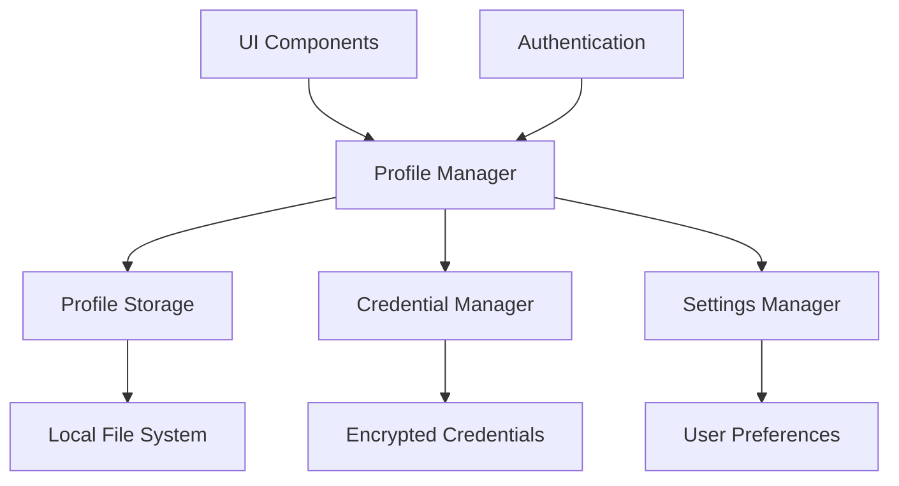
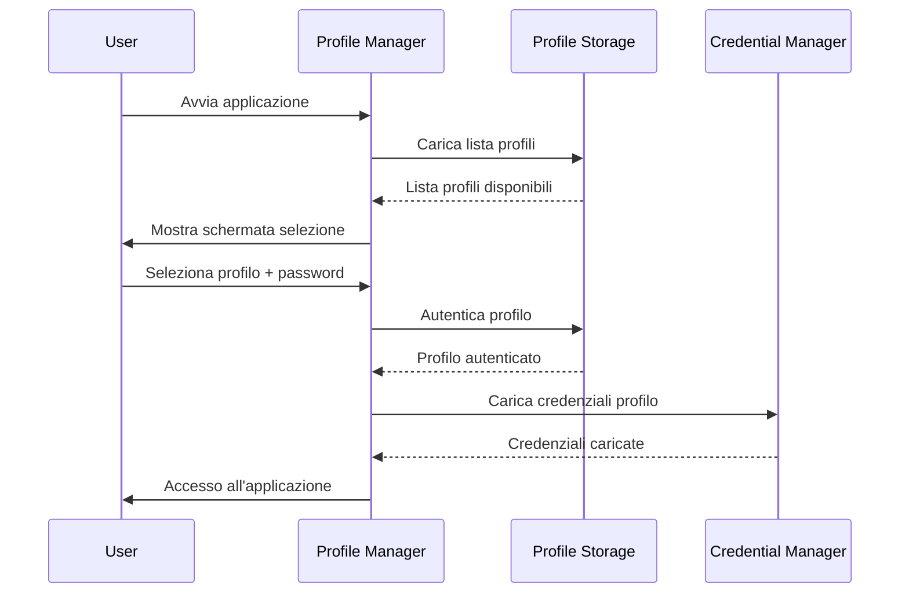

# Design Document - Sistema Profili Utente

## Overview

Il sistema profili utente sarà implementato come un layer di astrazione sopra il sistema di credenziali esistente. Ogni profilo avrà il proprio spazio di archiviazione crittografato e le proprie configurazioni, permettendo a più utenti di condividere la stessa installazione di GameStringer mantenendo i dati separati e sicuri.

## Architecture

### Componenti Principali



### Flusso di Autenticazione



## Components and Interfaces

### 1. Profile Manager (Rust)

```rust
pub struct ProfileManager {
    current_profile: Option<UserProfile>,
    profiles_storage: ProfileStorage,
    credential_manager: CredentialManager,
}

impl ProfileManager {
    pub async fn list_profiles() -> Result<Vec<ProfileInfo>, ProfileError>;
    pub async fn create_profile(info: CreateProfileRequest) -> Result<UserProfile, ProfileError>;
    pub async fn authenticate_profile(name: &str, password: &str) -> Result<UserProfile, ProfileError>;
    pub async fn switch_profile(profile_id: &str, password: &str) -> Result<(), ProfileError>;
    pub async fn delete_profile(profile_id: &str, password: &str) -> Result<(), ProfileError>;
    pub async fn export_profile(profile_id: &str, password: &str) -> Result<Vec<u8>, ProfileError>;
    pub async fn import_profile(data: &[u8], password: &str) -> Result<UserProfile, ProfileError>;
}
```

### 2. Profile Storage (Rust)

```rust
pub struct ProfileStorage {
    profiles_dir: PathBuf,
    encryption_key: Option<[u8; 32]>,
}

pub struct UserProfile {
    pub id: String,
    pub name: String,
    pub avatar_path: Option<String>,
    pub created_at: DateTime<Utc>,
    pub last_accessed: DateTime<Utc>,
    pub settings: ProfileSettings,
    pub credentials: HashMap<String, EncryptedCredential>,
}

impl ProfileStorage {
    pub async fn save_profile(&self, profile: &UserProfile, password: &str) -> Result<(), StorageError>;
    pub async fn load_profile(&self, id: &str, password: &str) -> Result<UserProfile, StorageError>;
    pub async fn list_profile_info(&self) -> Result<Vec<ProfileInfo>, StorageError>;
    pub async fn delete_profile(&self, id: &str) -> Result<(), StorageError>;
}
```

### 3. Profile UI Components (React)

```typescript
// Componente selezione profilo
interface ProfileSelectorProps {
  profiles: ProfileInfo[];
  onProfileSelect: (profileId: string, password: string) => void;
  onCreateProfile: () => void;
}

// Componente creazione profilo
interface CreateProfileProps {
  onProfileCreate: (data: CreateProfileData) => void;
  onCancel: () => void;
}

// Componente gestione profili
interface ProfileManagerProps {
  currentProfile: UserProfile;
  onSwitchProfile: () => void;
  onExportProfile: () => void;
  onImportProfile: (file: File) => void;
}
```

## Data Models

### Profile Data Structure

```typescript
interface UserProfile {
  id: string;
  name: string;
  avatarPath?: string;
  createdAt: string;
  lastAccessed: string;
  settings: ProfileSettings;
  credentials: Record<string, EncryptedCredential>;
}

interface ProfileSettings {
  theme: 'light' | 'dark' | 'auto';
  language: string;
  autoLogin: boolean;
  notifications: NotificationSettings;
  gameLibrary: LibrarySettings;
}

interface EncryptedCredential {
  store: string;
  encryptedData: string;
  nonce: string;
  createdAt: string;
}
```

### File System Structure

```
~/.gamestringer/
├── profiles/
│   ├── profile_1234.json.enc     # Profilo crittografato
│   ├── profile_5678.json.enc     # Altro profilo
│   └── profiles.index            # Indice profili (non crittografato)
├── avatars/
│   ├── avatar_1234.png
│   └── avatar_5678.jpg
└── backups/
    └── exported_profiles/
```

## Error Handling

### Tipi di Errore

```rust
#[derive(Debug, thiserror::Error)]
pub enum ProfileError {
    #[error("Profilo non trovato: {0}")]
    ProfileNotFound(String),
    
    #[error("Password errata per il profilo")]
    InvalidPassword,
    
    #[error("Profilo già esistente: {0}")]
    ProfileAlreadyExists(String),
    
    #[error("Errore di crittografia: {0}")]
    EncryptionError(String),
    
    #[error("Errore I/O: {0}")]
    IoError(#[from] std::io::Error),
    
    #[error("Errore serializzazione: {0}")]
    SerializationError(#[from] serde_json::Error),
}
```

### Gestione Errori UI

- **Password errata**: Mostra messaggio di errore e permette retry
- **Profilo corrotto**: Offre opzione di ripristino da backup
- **Spazio insufficiente**: Suggerisce pulizia o spostamento dati
- **Errore importazione**: Mostra dettagli specifici dell'errore

## Testing Strategy

### Unit Tests

1. **ProfileManager Tests**
   - Creazione e autenticazione profili
   - Cambio profilo e gestione stato
   - Export/import profili

2. **ProfileStorage Tests**
   - Crittografia/decrittografia dati
   - Salvataggio e caricamento profili
   - Gestione file system

3. **UI Component Tests**
   - Rendering componenti profilo
   - Interazioni utente
   - Gestione stati di errore

### Integration Tests

1. **End-to-End Profile Flow**
   - Creazione profilo → Autenticazione → Uso applicazione
   - Cambio profilo con credenziali diverse
   - Export/import profilo completo

2. **Security Tests**
   - Verifica crittografia dati sensibili
   - Test resistenza attacchi brute force
   - Validazione isolamento tra profili

### Performance Tests

1. **Startup Performance**
   - Tempo caricamento lista profili
   - Tempo autenticazione profilo
   - Memoria utilizzata per profilo

2. **Storage Performance**
   - Velocità salvataggio/caricamento
   - Dimensione file profilo
   - Efficienza crittografia

## Security Considerations

### Crittografia

- **Algoritmo**: AES-256-GCM per crittografia simmetrica
- **Key Derivation**: PBKDF2 con salt random per derivare chiavi da password
- **Nonce**: Nonce unico per ogni operazione di crittografia
- **Integrity**: Verifica integrità dati con MAC

### Protezione Password

- **Hashing**: Password hashate con Argon2id
- **Salt**: Salt unico per ogni profilo
- **Timeout**: Logout automatico dopo inattività
- **Retry Limit**: Limite tentativi password errata

### Isolamento Dati

- **Separazione**: Ogni profilo ha directory separata
- **Permissions**: File profilo accessibili solo al proprietario
- **Memory**: Pulizia memoria quando si cambia profilo
- **Logs**: Nessun dato sensibile nei log