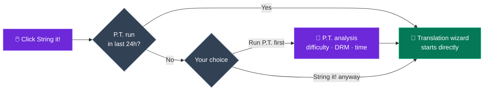
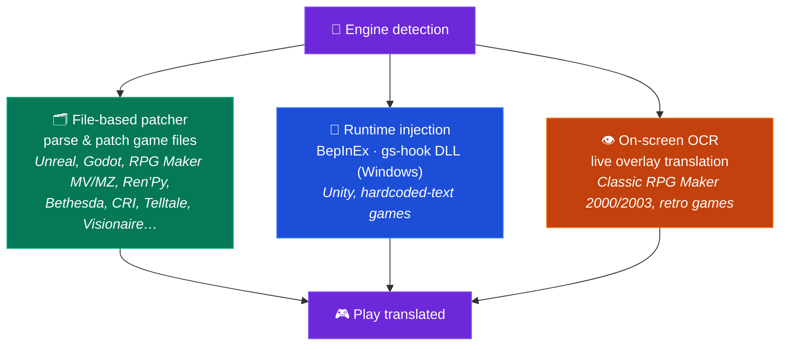

<p align="center">
  
</p>

<h1 align="center">GameStringer</h1>

<p align="center">
  <strong>Desktop app that translates video games into any language using AI.</strong><br>
  Pick a game from your library, choose a language, click translate — done.
</p>

<p align="center">
  <a href="https://www.gamestringer.ai"></a>
  <a href="https://discord.gg/SjnD3Z7Uf8"></a>
  
  
  
  
  
  
</p>

<p align="center">
  <a href="https://www.gamestringer.ai">Website</a> ·
  <a href="https://discord.gg/SjnD3Z7Uf8"><strong>💬 Discord</strong></a> ·
  <a href="#help-wanted"><strong>🙏 Help wanted</strong></a> ·
  <a href="#-what-is-gamestringer">What is it</a> ·
  <a href="#-download">Download</a> ·
  <a href="#-how-it-works">How it works</a> ·
  <a href="#-the-prediction-tool-pt">P.T.</a> ·
  <a href="#-supported-game-engines">Engines</a> ·
  <a href="#-features">Features</a> ·
  <a href="#-build-from-source">Build</a>
</p>

> ⚠️ **Upgrading from v1.8.x?** v1.9.0 migrated from Tauri v1 to **Tauri v2** — auto-updater won't work for this jump. Download **v1.9.1** manually: [GameStringer_1.9.1_x64-setup.exe](https://github.com/rouges78/GameStringer/releases/download/v1.9.1/GameStringer_1.9.1_x64-setup.exe). Future updates (v1.9.1 → v1.9.x) will work automatically.

<p align="center">
  <strong>🌍 Available in 12 languages</strong> — switch language inside the app (IT, EN, ES, FR, DE, PT, PL, RU, JA, ZH, KO, EL) or on the <a href="https://www.gamestringer.ai">website</a> (11 languages).
</p>

---

> ### 💜 A note from the developer
>
> GameStringer is built by **one person — me — and I have Parkinson's**, so updates sometimes land slower than I'd like. **Thank you for your patience.** I'm **not doing this for money**: I just want to change the way game translation works and put a genuinely useful tool in players' hands. **The Discord is now open** 🎉 — [come join us](https://discord.gg/SjnD3Z7Uf8) so we can talk, swap ideas, and make GameStringer better, together. 🙏
>
> — *Davide ([@rouges78](https://github.com/rouges78))*

---

<a name="help-wanted"></a>

## 🙏 Help Wanted — Test it on real games & send feedback

> **GameStringer is a solo, source-available project and it's still young.** It already handles 20+ engines, but real games are messy — every title stores its text a little differently. **The single most useful thing you can do right now is run GameStringer on a real game and tell me what happened.** Even *"it failed at step X"* is gold.

**Why this matters:** I can't possibly test the thousands of games out there alone. Continuous, real-world **testing and feedback** is what turns *"works on my fixtures"* into *"works on your game."* Your reports directly shape the roadmap — this is the part where the community makes or breaks the project.

### 🧪 Three ways to help (pick any)

- **🎮 Test a game & report.** Run it on something in your library and file a quick [compatibility report](https://github.com/rouges78/GameStringer/discussions) — was the engine detected correctly? was the text extracted? did the patch apply and the game still boot?
- **📦 Share a pack.** If a translation works, publish it to the in-app **Patch Hub** so others can use it — your name goes on it (reputation + "verified translator").
- **🛠️ Contribute.** New engine parsers, locale fixes, QA scripts — look for `good first issue` in the repo.

### 📋 What we especially need tested & feedback on

- [ ] **Engine coverage on real titles** — Unity (Mono **and** IL2CPP), Unreal (`.locres`, `_P.pak`, IoStore), Godot, RPG Maker **MV/MZ**, Ren'Py, Bethesda (BSA/BA2/ESP), CRI (CPK), Wolf RPG, TyranoScript, Visionaire, Danganronpa
- [ ] **Classic RPG Maker (2000/2003)** via the on-screen **OCR overlay** — how readable is the result?
- [ ] **Encoding & control codes** — correct accents/CJK in-game, and in-game tags/variables left intact?
- [ ] **Fonts** — do non-Latin scripts (CJK, Cyrillic, Greek) render in-game, or is a font swap needed?
- [ ] **Translation quality per language** — which AI provider gives the best results for your language/genre?
- [ ] **Patch Hub** — publishing and downloading `.gspack` packs end-to-end
- [ ] **First-run onboarding & UX** — was it clear how to translate your first game? what confused you?
- [ ] **Update tracker** — after a store update, did it correctly flag that the patch needs re-applying?

### 📝 Compatibility report template (copy-paste)

```
- Game / store / version:
- Engine detected (by GameStringer):
- Step reached: Scan / Detect / Extract / Translate / Patch / Played
- Result: ✅ works / ⚠️ partial / ❌ fails
- AI provider used:
- Language:
- Notes (what broke, encoding, screenshots):
- OS + GameStringer version:
```

**Where to post:** [GitHub Discussions](https://github.com/rouges78/GameStringer/discussions) · the in-app **Community Hub** (Supporto / Showcase / Richieste) · bugs → [Issues](https://github.com/rouges78/GameStringer/issues).

GameStringer is free and source-available; the website and AI costs come out of my own pocket, so if it saves you time a coffee is appreciated but **never** expected: [Buy Me a Coffee](https://buymeacoffee.com/gamestringer) · [Ko-fi](https://ko-fi.com/gamestringer) · [GitHub Sponsors](https://github.com/sponsors/rouges78).

---

## 🎮 What is GameStringer?

> **In simple terms:** pick a game → pick your language → click one button. GameStringer finds the game's text, translates it with AI, and puts it back — making a backup first. No modding, no command line, no technical knowledge.

GameStringer is a **desktop application** (Windows, Linux & macOS) that lets you translate video games that don't have your language.

Most games store their text in files — JSON, XML, CSV, `.locres`, `.rpy`, BSA/BA2, CPK, Unity Localization StringTables, and many other formats. GameStringer **scans your game folder**, finds those files, sends the text through an **AI translation provider** of your choice (OpenAI, Claude, Gemini, DeepSeek, Ollama, 20+ more), and **patches the translated text back** into the game. One click, no technical knowledge needed.

For **Unity games** that lock text inside compiled assets, GameStringer **automatically installs BepInEx + XUnity.AutoTranslator** — no manual setup. For **Bethesda games** (Skyrim, Fallout, Starfield) it parses BSA/BA2/ESP natively. For **CRI Middleware games** (Persona, Yakuza) it handles CPK/CRILAYLA/MSG/BMD. For **Unreal Engine** it edits `.locres` directly.

**It's not a machine translation website.** It's a full pipeline: **analyze with P.T. → detect engine → extract text → translate with AI → quality check → patch back → play.**

---

## 📥 Download

Get the latest release from **[GitHub Releases](https://github.com/rouges78/GameStringer/releases)**:

| Platform | File | Notes |
|----------|------|-------|
| **Windows** | `GameStringer_1.15.0_x64-setup.exe` | Installer (recommended) |
| **Windows** | `GameStringer_1.15.0_x64-portable.zip` | No install needed |
| **Windows** | `GameStringer_1.15.0_x64_en-US.msi` | MSI alternative |
| **macOS** | `GameStringer_1.15.0_x64.dmg` | Intel Mac |
| **macOS** | `GameStringer_1.15.0_aarch64.dmg` | Apple Silicon |
| **Linux** | `GameStringer_1.15.0_amd64.AppImage` | Universal (recommended) |
| **Linux** | `GameStringer_1.15.0_amd64.deb` | Debian / Ubuntu |
| **Linux** | `GameStringer-1.15.0-1.x86_64.rpm` | Fedora / RHEL |

**Requirements:** Windows 10+, macOS 10.15+, or Linux (Ubuntu 22.04+, Fedora 38+). 4 GB RAM (8 GB+ for local AI), 500 MB disk. Updates are **cryptographically signed** and delivered via Tauri Updater (the app verifies each update against a bundled public key).

> 🛡️ **Antivirus or SmartScreen warning?** That's a known **false positive** — runtime translation uses DLL injection (BepInEx / gs-hook), a technique heuristic scanners are suspicious of, and every new release starts with zero SmartScreen reputation. **[Read docs/ANTIVIRUS.md](docs/ANTIVIRUS.md)** for what triggers it, how to verify your download, and how to report the false positive.

---

## 🚀 How it works

1. **Install** GameStringer and launch it
2. **Your game library loads automatically** — Steam, Epic, GOG, Origin, Ubisoft, Amazon, itch.io, Humble App, Game Jolt, Big Fish (800+ games detected in seconds)
3. **Pick a game** → optionally run **P.T. (Prediction Tool)** to see difficulty, estimated time, best LLM chain
4. Click **"String it!"** — GameStringer scans, extracts, translates, and patches automatically
5. **Play in your language** — backups are always created before patching

That's it. No command line, no manual file editing, no modding experience needed.

### The pipeline at a glance


---

## 🧠 The Prediction Tool (P.T.)

> **The most powerful feature in GameStringer.** Don't start a translation blind — analyze first.

P.T. is a deep analysis engine that runs *before* any translation. It scans your game folder, detects the engine, estimates the volume of translatable text, and tells you:

- **Difficulty Score 0–100** — combined weight of string volume, engine complexity, DRM, encoding, linguistic challenges
- **Estimated time** across **18 LLM models** — Ollama (Gemma 4, Qwen 3, Llama), OpenAI GPT-4/4o, Claude 3.5, Gemini, DeepL, DeepSeek, Groq
- **5 recommended LLM chains**: Local (privacy), Cloud (quality), Hybrid (balanced), Budget, Premium — each with cost and quality score
- **DRM detection**: Denuvo, VMProtect, Steam DRM, EAC, BattlEye — warns before you try
- **Encoding analysis**: Shift-JIS, UTF-8, UTF-16, Big5, EUC-KR detected per-file
- **Translation complexity**: honorifics, gender agreement, RTL, ruby/furigana, CJK-specific handling
- **Confidence score** and **workflow plan** — the exact steps that will run when you click "String it!"
- **Export report** (JSON + Markdown) for sharing or archiving

### P.T.Rank — Quick Ranking

After running P.T. on multiple games, open **P.T.Rank** to see all analyzed titles sorted by difficulty. Perfect for planning your translation queue: start from the easy wins, save the 800k-string RPGs for last.

### Dry Run Scanner

Don't want to analyze one game at a time? Run **Dry Run** from the Library page to scan your **entire Steam library (800+ games) in batch**, with **zero file modification**. You get a JSON report categorizing every game as **Ready** (engine supported + strings extractable), **Errors** (manifest issues / DRM blocker), or **Unsupported** (unknown engine / no text). Progress is real-time, and no backup is needed because nothing gets touched.

### String it! Smart Gate

The **"String it!"** button on the game detail page is smart: if the game has already been analyzed by P.T. within the last 24h, it launches the translation wizard directly. Otherwise it suggests running P.T. first (with a one-click "Run P.T. first" / "String it! anyway" choice). No more wasted runs on games that turn out to be DRM-locked or 5-minute affairs.



---

## 🎯 Supported Game Engines

One engine detection, **three translation roads** — GameStringer picks the best one automatically:



GameStringer supports **20+ engines** with varying levels of depth:

| Engine | Support | How it works |
|--------|---------|--------------|
| **Unity** | ✅ Full | Auto-installs BepInEx + XUnity.AutoTranslator + Unity Localization Package pipeline (StringTable, SharedTableData, Addressables, Smart Strings) |
| **Unreal Engine** | ✅ Full | `.locres` extraction and patching with UnrealLocres |
| **Unreal _P.pak** | ✅ Full | Mod packaging as `<GameStringer>_P.pak` loaded via Paks folder |
| **Godot** | ✅ Full | Native `.translation` file support |
| **RPG Maker** | ✅ Full | MV/MZ JSON, VX/Ace via Trans, XP via RMXP |
| **Ren'Py** | ✅ Full | Native `.rpy` script parsing with dialogue detection |
| **GameMaker** | ⚡ Partial | Via UndertaleModTool integration |
| **Telltale** | ✅ Full | `.langdb` / `.dlog` support |
| **Wolf RPG** | ✅ Full | WolfTrans integration |
| **Kirikiri** | ✅ Full | `.ks` / `.scn` parsing |
| **TyranoScript** | ✅ Full | Fast-path extractor with JSON patching |
| **Electron** | ✅ Full | ASAR unpacking + i18n JSON detection |
| **Bethesda (Skyrim/Fallout/Oblivion/Starfield)** | ✅ **NEW v1.9.0** | BSA v103-105 + BA2 GNRL/DX10 + ESP/ESM (FULL/DESC/NAM1) parser, STRINGS/DLSTRINGS/ILSTRINGS |
| **CRI Middleware (Persona/Yakuza/Tales of/Dragon Ball)** | ✅ **NEW v1.9.0** | CPK + CRILAYLA + MSG/BMD/FTD with Shift-JIS/UTF-8/UTF-16 auto-detection |
| **Visionaire Studio** | ✅ Full | Daedalic adventures (Deponia, Edna, etc.) |
| **Danganronpa WAD** | ✅ Full | WAD archive parser + STX dialogue patching |

> **Unity games** get special treatment: if no translatable files are found, GameStringer detects it's a Unity game and offers to **automatically install BepInEx + XUnity.AutoTranslator** with one click. Just launch the game once after install, then re-scan — all text becomes translatable.
>
> ⚠️ **Anti-Cheat Warning**: BepInEx (DLL injection) can trigger anti-cheat systems (EAC, BattlEye, Vanguard). GameStringer includes anti-cheat detection and will warn you. **Only use on single-player / offline games.** P.T. detects DRM before any modification.

---

## ✨ Features

### 🆕 New in v1.15.0 — Ollama tuning & Projects ↔ Patch Hub

- **🎚 Ollama inference parameters panel** — fine-tune local Ollama translations with **Faithful / Balanced / Creative presets**, or flip to **expert mode** for direct control over temperature, top-p and the rest of the sampling knobs; the choice is wired non-destructively into every Ollama translation call
- **🔗 Projects ↔ Patch Hub integration** — **import a `.gspack` as a completed project**, publish to the Hub **pre-filled straight from a project**, switch between an **Explore / My patches** toggle, and **Apply to game** in one click (with automatic backup)
- **💬 In-app feedback widget** — send feedback or report a problem without ever leaving the app
- **⚡ Faster Patch Hub** — response **caching + rate-limiting** for snappier browsing and downloads under load
- **🐛 Fixes** — the RSS news webview is no longer blocked by CORS, plus a fresh **WCAG 2.1 AA accessibility audit** pass

### 🆕 New in v1.14.0 — community compatibility & bulletproof packs

- **🧭 Compatibility telemetry (opt-in)** — the "ProtonDB of translations": report whether a translation worked and see **compatibility badges on game cards**, backed by community reports with abuse guards and a [public stats page](https://gamestringer.ai/compatibilita.html)
- **🔤 Missing-glyph detection + automatic font fix** — GameStringer parses the game font's character map, detects when your language's glyphs are missing, and **auto-installs a matching Noto font** for file-based engines (Ren'Py, RPG Maker) — no more tofu squares instead of text
- **🛡 Verifiable pack integrity** — community packs are verified with an **aggregated SHA-256**, path-traversal protection and automatic flagging of tampered packs
- **💥 Opt-in crash reporting** — anonymous reports with recurring-crash signatures so crashes get fixed faster
- **📚 Robust library language scan** — more reliable detection of the languages a game already ships, plus a manual "Detect languages" button
- **💬 Discord is live** — join at [discord.gg/SjnD3Z7Uf8](https://discord.gg/SjnD3Z7Uf8)
- **🧪 Parser regression suite** — shared binary fixtures (Godot, .locres, STX, RPG Maker, CRI CPK, Bethesda) exercised by both the Rust and TS parsers; 2 real bugs found and fixed
- **📰 Cleaner news feed** — MediaWiki diff noise removed, deal posts filtered out

### 🆕 New in v1.13.0

- **🖥 Real-time UE translator marked experimental** — the Unreal real-time tool now states its experimental status up front, and checks the game is actually running before it starts
- **🎛 Quality controls in Settings** — switches for the new translation-quality features (reflection pass, semantic retrieval) plus a broadened provider allowlist
- **🌐 Site + i18n** — v1.12.0 section on the site with infographics and a developer note, in 12 languages; `aiQuality` / `semantic` / `lore` keys backfilled across all locales
- **🐛 Fixes** — CI now builds the release from the current branch instead of a not-yet-created tag; Supabase forum INSERT policies recreated under RLS hardening, with a graceful bridge bailout; deduplicated migration version `20260626`

### 🆕 New in v1.12.0 — smarter, self-checking translations

- **👁️ Visual-context translation (VLM)** — for live / on-screen translation, an AI vision model now *sees the frame* and translates with that context, so it stops guessing on ambiguous words (is *"Chest"* a treasure chest or a body part?). Works with a **local** model (Ollama) or **OpenAI / Gemini**. Screenshots are cropped and resized natively for speed.
- **🪞 Self-correcting translations (Reflection)** — after translating, GameStringer can run a quick second pass that reviews its own work against your **glossary, tone and formatting** and fixes only the lines that actually need it. Selective by default, so it stays fast and cheap.
- **🧠 Semantic memory (RAG)** — your Translation Memory and glossary are now matched by **meaning**, not just exact words, so a phrase you translated before is reused even when it's worded differently — keeping terminology consistent across a whole game. Fully local (Ollama embeddings); falls back to keyword matching if it's not available.
- **⚡ Smoother live translation** — reworked live overlay pipeline and native image handling for a faster, cleaner on-screen result.
- **🔌 More providers out of the box** — broadened the allowlist so more backends just work: DeepL, Groq, Cerebras, Cohere, Together, Fireworks, Hugging Face, Azure Translator, DashScope, LibreTranslate, Lingva, MyMemory.

### 🆕 New in v1.11.2

- **More stores** — local install detection for **Humble App, Game Jolt and Big Fish Games**, on top of the existing launchers
- **Translation lookup** — check whether a game already ships your language via **PCGamingWiki**, plus quick **Italian fan-patch search links** from the game view
- **Publish to Patch Hub** — send a completed project to the community **Patch Hub** in one step (`app/projects` → publish, reuses `publishPack`)
- **Community Hub overview** — new landing panel with recent activity, latest packs and categories
- **Italian translation news** — added curated fan-translation RSS feeds (Ctrl+Trad, OldGamesItalia, Romhacking.it, Language Pack Italia, Q-Gin, …)
- **String it! everywhere** — one-click routing for Unity/Unreal/Godot + a **TyranoScript** cloud pipeline
- **Unity** — local **Ollama** bridge for XUnity (CustomTranslate); BepInEx/XUnity/TMP/UABEA downloads resolve from the GitHub API
- **Godot** — rewritten `.pck` parser reads real **Godot 4.4+** archives (verified on *Slay the Spire 2*)
- **Desktop reliability** — removed the last web `/api` calls: editor uses the local TM, and translate/export/voice/store calls go through the native backend

### 🆕 New in v1.10.2

- **Auto-updater fix** — resolved a stuck "Preparing…" state where the update never started downloading. A stale React update object was passed to `downloadAndInstall` and the `updating` flag was never reset; now auto-update reliably starts, downloads, and installs (`components/notifications/auto-updater.tsx`, `hooks/use-tauri-updater.ts`)
- **Reliable settings persistence** — app settings and AI provider API keys are now saved reliably to disk (`data_dir/GameStringer/settings.json`) via the `save_app_settings` / `load_app_settings` Tauri commands; previously some settings were not persisted
- **Add games manually from disk** — you can now add a game by picking its folder from disk, without relying solely on library auto-detection (Steam/Epic/etc.) (`lib/manual-games.ts`, `app/library/page.tsx`)

### 🆕 New in v1.9.1

- **Fix CSP blocking Supabase** — Community Chat was silently blocked by Tauri v2's strict Content Security Policy. Added `https://*.supabase.co` and `wss://*.supabase.co` to `connect-src`
- **Fix chat auto-connect** — Coordinated auth between `main-layout` and `persistent-chat` via custom events, eliminating race conditions
- **Fix timeout error** — Stale closure in max-timeout caused false "Tempo di caricamento troppo lungo" even when chat loaded successfully
- **macOS builds** — DMG (Intel) and `.app.tar.gz` (Apple Silicon) now available

### 🆕 New in v1.9.0

- **Unified Online Presence** — Supabase Realtime + DB fallback, auto-away/auto-online, heartbeat every 30s
- **System Tray Notifications** — Native OS notifications for chat, translations, errors, updates, games, friends, news with configurable quiet hours
- **Error Boundaries + Crash Recovery** — WidgetErrorBoundary (auto-retry 5s, max 3), AppErrorBoundary with reload
- **Network Resilience / Offline Mode** — Network monitor, status bar (red/amber/green), exponential backoff retry, offline queue
- **Character Voice Profiles (Voice Cloning)** — Auto-extract character style from dialogue, 16 tones, prompt injection for consistent translation
- **Fine-Tuning Infrastructure** — Datasets from human corrections (Adaptive MT), 4 export formats, per-game model management with Ollama
- **Code Splitting / Lazy Loading** — 8 heavy components converted to React.lazy + Suspense for faster startup
- **Bug Fixes** — NetworkResilience double-init + listener leak, Supabase 400 user_profiles, tray version strings, quiet hours bypass for critical notifications

### 🤖 AI Translation

- **20+ providers**: OpenAI, Claude, Gemini, DeepSeek, Mistral, Groq, DeepL, Ollama (local), LM Studio, TranslateGemma, HY-MT, Qwen 3, NLLB-200, Cerebras, Together AI, Fireworks, OpenRouter, Cohere, Lingva, MyMemory
- **Context-aware**: understands game genre, character voice, tone, narrative vs UI vs dialogue
- **Translation Memory & Glossary**: consistency across the project with auto-glossary extraction
- **Auto-Select Engine** (NEW v1.7.0): `auto` preset that dynamically ranks providers by target language + game genre (DeepL for European, Claude for CJK, genre-aware boost)
- **Multi-LLM Compare**: run multiple providers in parallel, pick the best result per string
- **Quality gates**: automatic QA scoring on every translated string (0-100) with ContentTypeBadge
- **Vision LLM Translator**: uses in-game screenshots for context (Ollama, Gemini, GPT-4o)
- **Live Quality Preview**: see quality scores in real-time during batch translation
- **RTL support**: automatic direction detection and `dir` attribute handling

### 🧠 P.T. — Prediction Tool (v1.9.0)

- **Difficulty Score 0-100** with weighted factors (volume, engine, DRM, encoding, complexity)
- **Time estimates for 18 LLM models** including Gemma 4 (27B MoE A4B / E4B / E2B)
- **5 LLM chains** (Local / Cloud / Hybrid / Budget / Premium) with cost and quality estimates
- **DRM / Anti-Cheat detection** (Denuvo, VMProtect, Steam DRM, EAC, BattlEye, Vanguard)
- **Encoding analysis** per-file (Shift-JIS, UTF-8/16, Big5, EUC-KR)
- **Translation complexity analysis** (honorifics, gender, CJK, ruby, RTL)
- **P.T.Rank / Quick Ranking** — sort all analyzed games by difficulty
- **Dry Run Scanner** — batch scan of entire Steam library (800+ games) without modification
- **Workflow Orchestrator** — real execution engine with universal fast path for 6+ engines and real-time progress
- **Prediction cache** (24h) — instant re-open of previously analyzed games
- **Export report** (JSON + Markdown) for sharing and archiving

### 📚 Game Library

- **Auto-detect**: Steam (with Family Sharing), Epic, GOG Galaxy, Origin/EA, Ubisoft Connect, Amazon Games, itch.io, Humble App, Game Jolt, Big Fish Games
- **800+ games** recognized from installed libraries in seconds
- **Game cards** with cover art, metadata, engine badge, VR badge, install status
- **Hover quick actions**: String it!, Batch, Community, P.T. — all one click
- **Game Update Tracker**: detects when Steam updates a translated game (via `buildid`), verifies patch integrity (BepInEx files, `_P.pak` presence), warns if re-patching is needed
- **"Stop monitoring"** button to untrack a specific game

### 🔧 Translation Tools

- **One-Click Translate** ("String it!"): scan → translate → patch in a single flow
- **Batch Translation**: translate entire games or folders at once
- **Subtitle Translator**: SRT, VTT, ASS/SSA with timing preservation
- **OCR Translator**: extract text from retro games (8-bit, 16-bit, DOS presets) with real Tauri Tesseract backend
- **Voice Pipeline**: speech-to-text → translate → text-to-speech with **Duration Matching** (NEW v1.7.0) — auto-adjusts speed to match original audio duration
- **Lip Sync** (NEW v1.7.0): Rhubarb integration for viseme generation (A-X), interactive timeline, export for Unity (blend shapes) and Unreal (FaceFX)
- **Gridly CSV Export/Import** (NEW v1.7.0): multi-language column format compatible with Gridly, Lokalise, and Crowdin
- **Real-time Overlay**: see translations while playing via VR/screen overlay
- **Auto-Translate Review**: "Translate all untranslated" button with progress bar
- **Lore Assistant**: RAG chat that knows the game's lore and dialogues
- **Character Voice Profiles**: define personality, tone, speech patterns per character
- **Translation Confidence Heatmap**: visual quality overview of all translations

### 🎮 Game Engine Patchers

- **Unity**: BepInEx + XUnity.AutoTranslator auto-installer, Unity Localization Package (StringTable, SharedTableData, Addressables catalog, Smart Strings validator)
- **Unreal Engine**: `.locres` extraction + `_P.pak` mod packaging
- **Bethesda Engine Patcher** (NEW v1.9.0): Skyrim LE/SE/AE, Fallout 3/NV/4, Oblivion, Starfield — BSA v103-105 + BA2 GNRL/DX10 + ESP/ESM (FULL/DESC/NAM1)
- **CRI Middleware Patcher** (NEW v1.9.0): Persona 5 Royal, Yakuza, Tales of, Dragon Ball — CPK + CRILAYLA + MSG/BMD/FTD
- **Ren'Py**, **RPG Maker**, **Godot**, **GameMaker**, **Kirikiri**, **Wolf RPG**, **Telltale**, **Visionaire**, **Danganronpa WAD** — all with native parsers
- **Wizard Stepper**: shared multi-step UI for all patchers
- **Universal PO Export** (gettext `.po`) for every patcher with project/language/source/engine metadata
- **Auto-backup**: before every patch, with one-click restore

### 🔌 Advanced

- **Auto-Hook Scanner**: process memory scanning (Windows WinAPI) for hardcoded strings
- **System Monitor**: real-time VRAM/RAM usage for local LLM planning
- **Ollama Setup Wizard**: step-by-step local AI installation
- **Ollama Manager**: auto-discovery of models from the ollama.com registry + auto-refresh on focus/navigation
- **Debug Console**: integrated console with log intercept
- **Video Extractor** (v1.7.0): extract and convert FMV video from retro/modern games (VMD, BIK, SMK, USM, ROQ) with AI upscaling (Real-ESRGAN), direct link from game detail page
- **Plugin System**: design doc for third-party plugins (see `docs/PLUGIN_SYSTEM.md`)
- **Community Hub**: share and download translation memories + GitHub Discussions integration
- **Public API v1**: REST endpoints for integration (`/api/v1/translate`, `/api/v1/batch`)

### 💬 Community Chat

- **Real-time chat** with other translators via Supabase Realtime
- **4 default rooms**: General, Translations, Feedback & Bugs, Announcements
- **Custom rooms**: create rooms for specific games or projects
- **Auto-Bridge Auth**: your GameStringer profile auto-syncs to Supabase — zero extra login
- **Online presence**: see who's online in each room
- **Reply / edit / delete** messages with RLS-enforced ownership
- **Expandable drawer widget** in the bottom-right corner

### ♿ Accessibility (v1.9.0)

- **WCAG 2.1 AA sweep** — `aria-label` on icon buttons, semantic `CardTitle` headings, `focus-visible` on all primitives, skip-to-content link, `main` landmark, Italian `sr-only` helpers
- **`prefers-reduced-motion`** respected throughout animations
- **`forced-colors`** (Windows High Contrast Mode) respected
- **12-language UI**: IT, EN, ES, FR, DE, JA, ZH, KO, PT, RU, PL, EL (Greek added in v1.10.0)
- **RTL layout** support with automatic direction detection

### 🎨 Design System (v1.9.0)

- **Card variants** via `cva`: default, muted, highlight, success, error, warning
- **Button sizes** including `xs` and `icon-sm`
- **Text utilities**: `text-micro` (9px), `text-2xs` (10px) — no more arbitrary Tailwind
- **Radix UI unified**: migrated 37 files from `@radix-ui/react-*` to `radix-ui`, 27 packages removed
- **Optimized bundle**: `optimizePackageImports` for radix-ui, framer-motion, recharts, cmdk

### 🖥️ App

- **Signed auto-updates**: one-click update from the app via Tauri Updater
- **Profiles**: multiple user profiles with recovery keys
- **Global Hotkeys**: `Ctrl+Shift+T` OCR, `Ctrl+Shift+Q` Quick Translate, `Ctrl+Alt+O` Overlay, `Alt+T` XUnity toggle
- **System Tray**: quick actions, live Ollama status, tools submenu, native OS notifications with preferences
- **Cross-platform**: Windows, macOS & Linux with native builds
- **Windows tray fix**: prevents console flash loop on child process spawn

---

## 🔧 AI Providers

| Provider | API Key | Free Tier | Best for |
|----------|---------|-----------|----------|
| **Ollama** | No (local) | ✅ Unlimited | Privacy, offline |
| **LM Studio** | No (local) | ✅ Unlimited | Privacy, GGUF models |
| **TranslateGemma** | No (Ollama) | ✅ Unlimited — 55 languages, Google | **Recommended start** |
| **HY-MT1.5** | No (Ollama) | ✅ Unlimited — ~1GB RAM, Tencent | Low-RAM machines |
| **Qwen 3** | No (Ollama) | ✅ Unlimited — multilingual | CJK languages |
| **Gemma 4** | No (Ollama) | ✅ Unlimited — 27B MoE A4B/E4B/E2B | Quality local |
| **Gemini** | Yes | ✅ Free tier (15 RPM) | **Recommended cloud** |
| **DeepSeek** | Yes | ✅ $0.14/1M input | Budget cloud |
| **Groq** | Yes | ✅ 14,400 req/day | Speed |
| **Mistral** | Yes | ✅ Free tier | EU cloud |
| **OpenAI** | Yes | Paid | GPT-4o quality |
| **Claude** | Yes | Paid | Nuance, long context |
| **DeepL** | Yes | ✅ 500k chars/month | European languages |
| **MyMemory** | No | ✅ Unlimited | Fallback |
| **Lingva** | No | ✅ Unlimited | Google MT mirror |
| **Cerebras** | Yes | ✅ Free tier | Speed |
| **Together AI** | Yes | ✅ $25 free credit | Open models |
| **Fireworks** | Yes | ✅ Free tier | Open models |
| **OpenRouter** | Yes | ✅ Free models | Model variety |
| **NLLB-200** | Yes | ✅ 200 languages | Rare languages |
| **Cohere** | Yes | ✅ Free trial | RAG |

**Recommended to start**: **TranslateGemma** via Ollama (free, local, 55 languages) or **Gemini** (free tier, cloud). Low RAM: **HY-MT1.5** (~1GB). Best quality: **Claude 3.5** or **GPT-4o**. Best CJK: **Qwen 3**.

---

## 📖 Documentation

### User Guides (12 languages)

| | | |
|---|---|---|
| 🇮🇹 [Italiano](docs/GUIDA_UTENTE.md) | 🇬🇧 [English](docs/USER_GUIDE_EN.md) | 🇪🇸 [Español](docs/USER_GUIDE_ES.md) |
| 🇫🇷 [Français](docs/USER_GUIDE_FR.md) | 🇩🇪 [Deutsch](docs/USER_GUIDE_DE.md) | 🇯🇵 [日本語](docs/USER_GUIDE_JA.md) |
| 🇨🇳 [中文](docs/USER_GUIDE_ZH.md) | 🇰🇷 [한국어](docs/USER_GUIDE_KO.md) | 🇧🇷 [Português](docs/USER_GUIDE_PT.md) |
| 🇷🇺 [Русский](docs/USER_GUIDE_RU.md) | 🇵🇱 [Polski](docs/USER_GUIDE_PL.md) | 🇮🇷 [فارسی](docs/USER_GUIDE_FA.md) |

### Project Docs

- **[CHANGELOG.md](CHANGELOG.md)** — full version history
- **[ROADMAP.md](ROADMAP.md)** — prioritized roadmap (P0/P1/P2)
- **[docs/VERSIONING.md](docs/VERSIONING.md)** — versioning policy
- **[docs/PROJECT_STATUS.md](docs/PROJECT_STATUS.md)** — current status at a glance
- **[docs/ANTIVIRUS.md](docs/ANTIVIRUS.md)** — antivirus / SmartScreen false positives
- **[PLUGIN_SYSTEM.md](docs/PLUGIN_SYSTEM.md)** — plugin architecture design
- **[LICENSE](LICENSE)** — Source-Available License v1.1
- **[docs/LEGAL.md](docs/LEGAL.md)** — legal position & acceptable-use policy

---

## 🛠️ Build from Source

**Prerequisites**: Node.js 18+, Rust 1.70+, npm. On Linux also: `libwebkit2gtk-4.1-dev`, `libayatana-appindicator3-dev`, `librsvg2-dev`.

```bash
git clone https://github.com/rouges78/GameStringer.git
cd GameStringer
npm install
npm run dev          # development
npm run tauri:build  # production build
```

Rust backend: `cd src-tauri && cargo check` to verify the Tauri commands compile on your platform.

---

## 💖 Support

If GameStringer helped you play games in your language:

<p align="center">
  <a href="https://buymeacoffee.com/gamestringer">
    
  </a>
  <a href="https://ko-fi.com/gamestringer">
    
  </a>
  <a href="https://github.com/sponsors/rouges78">
    
  </a>
</p>

---

## 📜 License

**Source-Available License v1.1** — the source code is public and you can build it yourself, but it is not OSI-approved "Open Source".

- ✅ Free for personal use
- ✅ Free to inspect, build, and modify for yourself
- ❌ Commercial use requires written permission
- ❌ Redistribution of modified versions requires written permission

See [LICENSE](LICENSE) for details, and **[docs/LEGAL.md](docs/LEGAL.md)** for the project's legal position & acceptable-use policy. Questions? Open a [Discussion](https://github.com/rouges78/GameStringer/discussions).

---

## 🙏 Credits

- **[BepInEx](https://github.com/BepInEx/BepInEx)** — Unity modding framework (BepInEx Team)
- **[XUnity.AutoTranslator](https://github.com/bbepis/XUnity.AutoTranslator)** — Unity translation framework (bbepis)
- **[UnrealLocres](https://github.com/akintos/UnrealLocres)** — Unreal `.locres` parser (akintos)
- **[UndertaleModTool](https://github.com/krzys-h/UndertaleModTool)** — GameMaker modding (krzys-h)
- **[Tauri](https://tauri.app)** — Desktop app framework
- **[Tesseract.js](https://github.com/naptha/tesseract.js)** — OCR engine
- **[Ollama](https://ollama.com)** — Local LLM runtime
- **[Supabase](https://supabase.com)** — Realtime backend for Community Chat

---

<p align="center">
  Made with ❤️ for gamers who want to play in their own language<br>
  <strong>GameStringer v1.15.0</strong> · <a href="https://www.gamestringer.ai">gamestringer.ai</a> · © 2025-2026 GameStringer Team
</p>
