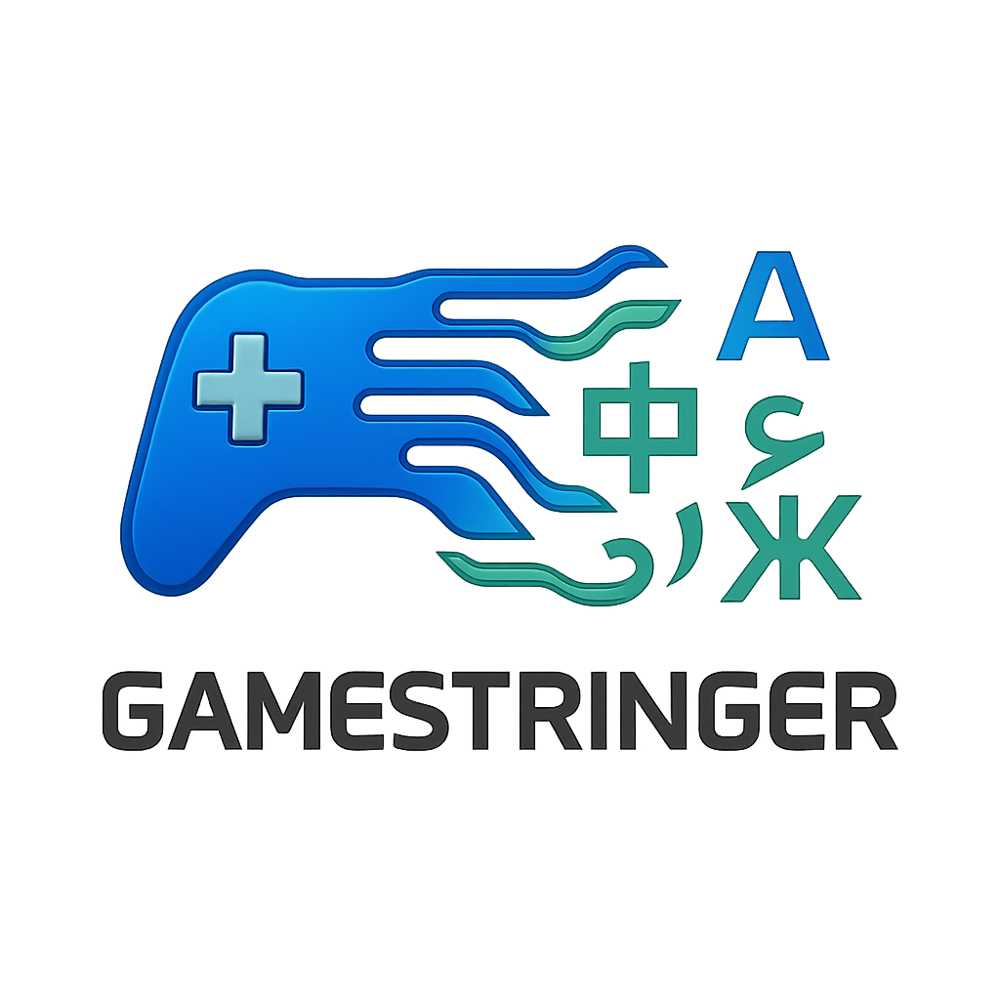
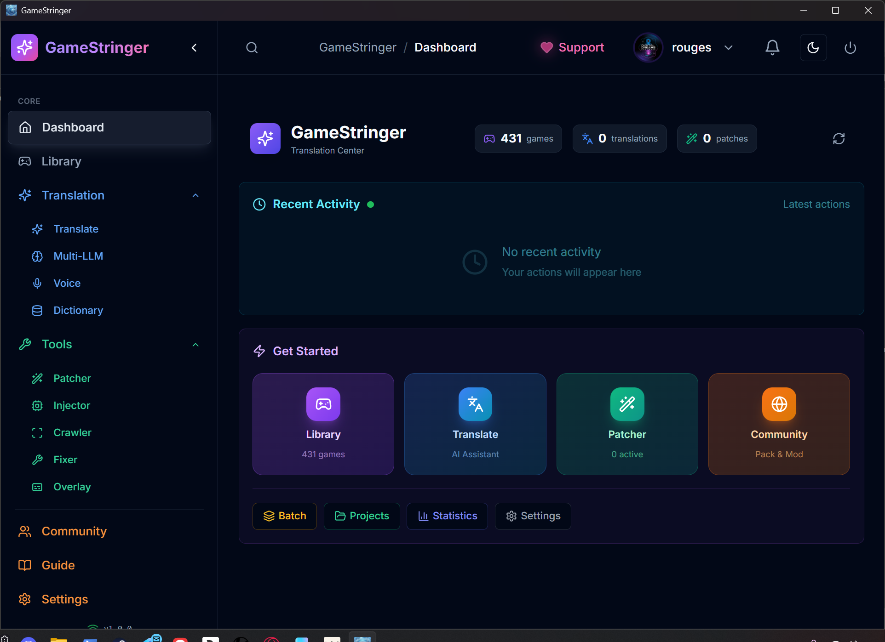
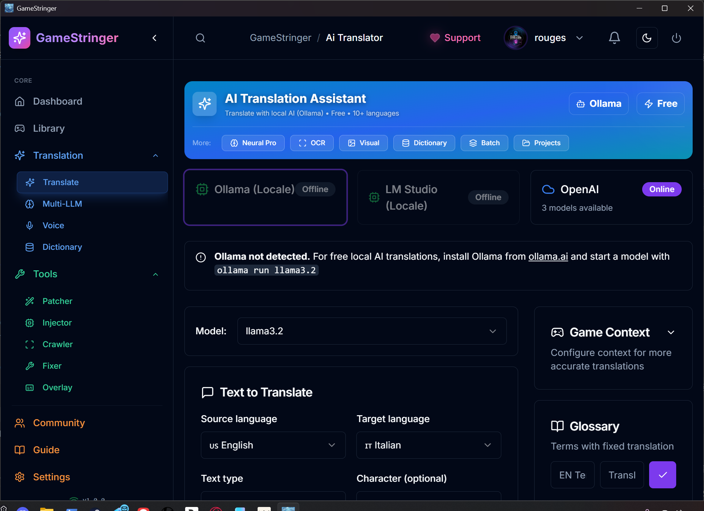
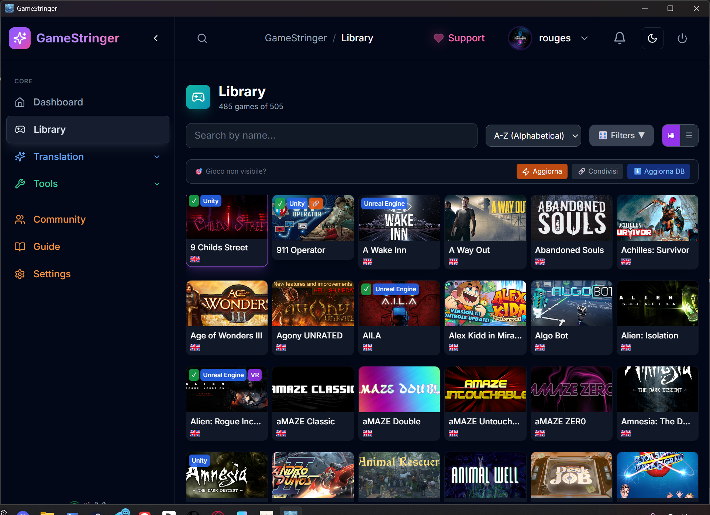
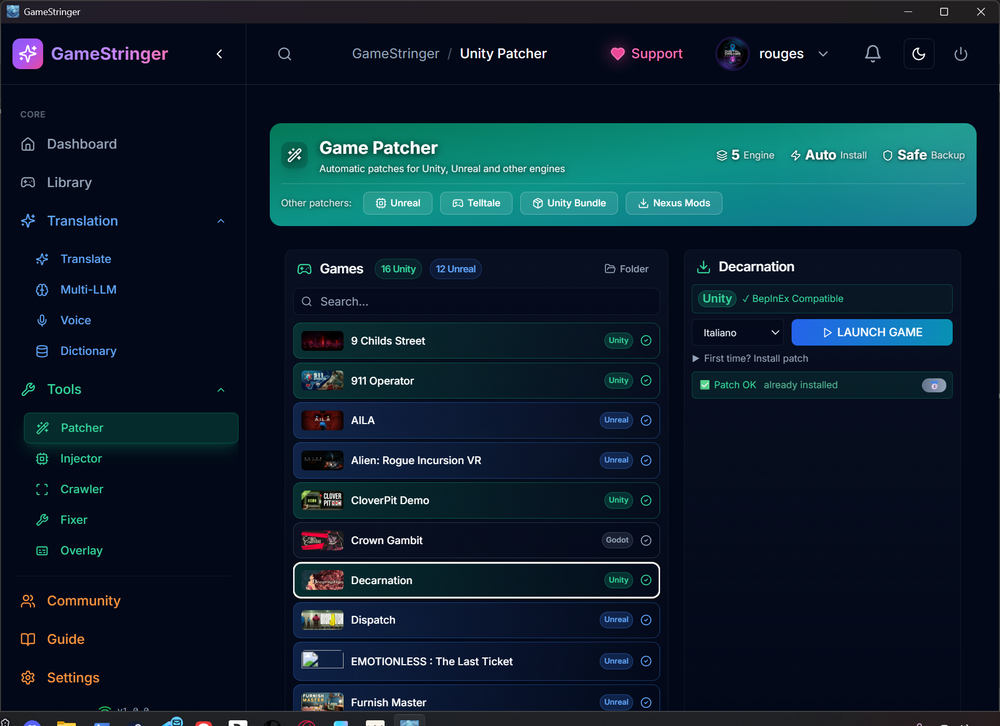

<p align="center">
  
</p>

<h1 align="center">🎮 GameStringer</h1>

<p align="center">
  <strong>Strumento gratuito di localizzazione videogiochi con AI</strong><br>
  Traduci i tuoi giochi preferiti in qualsiasi lingua con AI neurale
</p>

<p align="center">
  
  
  
  
  
  
</p>

<p align="center">
  <a href="#-funzionalità">Funzionalità</a> •
  <a href="#-download">Download</a> •
  <a href="#-guida-rapida">Guida Rapida</a> •
  <a href="#-engine-supportati">Engine</a> •
  <a href="#-screenshot">Screenshot</a> •
  <a href="#-supporta">Supporta</a>
</p>

---

## ✨ Funzionalità

### 🤖 Traduzione AI Neurale

- **15+ Provider AI**: OpenAI, Claude, Gemini, DeepSeek, Mistral, Groq, Cohere, DeepL, Ollama (locale), LM Studio, e altri
- **Consapevole del contesto**: Comprende genere del gioco, voce del personaggio e tono
- **Memoria di Traduzione**: Riutilizza traduzioni precedenti per coerenza
- **Supporto Glossario**: Definisci termini personalizzati per il tuo progetto

### 🎮 Supporto Engine di Gioco

| Engine | Supporto | Metodo |
|--------|----------|--------|
| **Unity** | ✅ Completo | BepInEx + XUnity.AutoTranslator |
| **Unreal Engine** | ✅ Completo | Integrazione UnrealLocres |
| **Godot** | ✅ Completo | File .translation nativi |
| **RPG Maker** | ✅ Completo | MV/MZ JSON, VX/Ace via Trans |
| **Ren'Py** | ✅ Completo | Parsing .rpy nativo |
| **GameMaker** | ⚡ Parziale | UndertaleModTool |
| **Telltale** | ✅ Completo | Supporto .langdb/.dlog |

### 📚 Integrazione Librerie

- **Steam**: Rilevamento automatico 600+ giochi con supporto Family Sharing
- **Epic Games**: Via Legendary CLI
- **GOG Galaxy**: Integrazione nativa
- **Origin/EA**: Rilevamento registry
- **Ubisoft Connect**: Supporto completo
- **Amazon Games**: Supporto completo
- **itch.io**: Supporto giochi indie

### 🛠️ Strumenti Pro

- **Traduzione Batch**: Traduci interi giochi con un click
- **Traduttore OCR**: Estrai testo da giochi retro (8-bit, 16-bit, DOS)
- **Pipeline Vocale**: Speech-to-text → Traduzione → Text-to-speech
- **Overlay Real-time**: Vedi le traduzioni mentre giochi
- **Confronto Multi-LLM**: Confronta traduzioni da più provider AI
- **Context Crawler**: Estrazione contesto gioco con AI per traduzioni migliori
- **Translation Fixer**: Fix automatico tag markup nelle traduzioni
- **Community Hub**: Condividi e scarica memorie di traduzione
- **Universal Injector**: Inietta mod in qualsiasi engine di gioco

---

## 📥 Download

### Windows

Scarica l'ultima release da [GitHub Releases](https://github.com/rouges78/GameStringer/releases):

- **GameStringer-Setup.exe** - Installer (consigliato)
- **GameStringer-Portable.zip** - Versione portatile

### Requisiti

- Windows 10/11 (64-bit)
- 4GB RAM minimo
- 500MB spazio disco

---

## 🚀 Guida Rapida

1. **Scarica e installa** GameStringer
2. **Avvia l'app** e crea un profilo
3. **Connetti i tuoi store** (Steam si rileva automaticamente, altri opzionali)
4. **Seleziona un gioco** dalla tua libreria
5. **Clicca Traduci** e scegli la lingua di destinazione
6. **Applica la patch** con un click

Fatto! Il tuo gioco è ora tradotto. 🎉

---

## 🔧 Configurazione

### Provider AI

GameStringer supporta multipli provider AI. Configura il tuo preferito nelle Impostazioni:

| Provider | API Key Richiesta | Tier Gratuito |
|----------|------------------|---------------|
| Ollama | ❌ No (locale) | ✅ Illimitato |
| LM Studio | ❌ No (locale) | ✅ Illimitato |
| Gemini | ✅ Sì | ✅ Tier gratuito disponibile |
| DeepSeek | ✅ Sì | ✅ Molto economico |
| OpenAI | ✅ Sì | ❌ Solo a pagamento |
| Claude | ✅ Sì | ❌ Solo a pagamento |
| Mistral | ✅ Sì | ✅ Tier gratuito disponibile |
| Groq | ✅ Sì | ✅ Tier gratuito disponibile |
| DeepL | ✅ Sì | ✅ Tier gratuito (500k caratteri/mese) |
| MyMemory | ❌ No | ✅ 1000 parole/giorno |

**Consigliato per principianti**: Usa **Ollama** (gratuito, esegue localmente) o **Gemini** (tier gratuito).

---

## 🎯 Engine Supportati

### Giochi Unity (Automatico)

GameStringer installa automaticamente BepInEx + XUnity.AutoTranslator:

- Estrae tutto il testo del gioco
- Traduce con l'AI scelta
- Crea file di traduzione
- Nessun patching manuale richiesto

### Unreal Engine

Usa UnrealLocres per manipolazione file .locres:

- Estrazione testo automatica
- Preserva formattazione
- Creazione patch con un click

### RPG Maker MV/MZ

Traduzione JSON diretta:

- Mappe, Eventi, Attori, Oggetti
- Messaggi di sistema
- Compatibilità plugin

### Giochi Retro (OCR)

Per giochi senza testo estraibile:

- Cattura screenshot
- OCR potenziato da AI (Tesseract.js)
- Traduzione overlay real-time

---

## 📸 Screenshot

<p align="center">
  
  
</p>

<p align="center">
  
  
</p>

---

## 🛠️ Compila da Sorgente

### Prerequisiti

- Node.js 18+
- Rust 1.70+
- pnpm o npm

### Passaggi

```bash
# Clona il repository
git clone https://github.com/rouges78/GameStringer.git
cd GameStringer

# Installa dipendenze
npm install

# Esegui in modalità sviluppo
npm run dev

# Compila per produzione
npm run tauri:build
```

---

## 💖 Supporta

Se GameStringer ti ha aiutato a goderti i giochi nella tua lingua, considera di supportare il progetto:

<p align="center">
  <a href="https://ko-fi.com/gamestringer">
    
  </a>
  <a href="https://github.com/sponsors/rouges78">
    
  </a>
</p>

---

## 📜 Licenza

GameStringer è rilasciato sotto una **Licenza Source-Available**.

- ✅ Gratuito per uso personale
- ✅ Gratuito per modifiche personali
- ❌ Uso commerciale richiede permesso
- ❌ Ridistribuzione di versioni modificate richiede permesso

Vedi [LICENSE](LICENSE) per i dettagli completi.

---

## 🙏 Crediti

- **XUnity.AutoTranslator** - Framework traduzione Unity
- **BepInEx** - Framework modding Unity
- **Tesseract.js** - Motore OCR
- **Tauri** - Framework app desktop

---

<p align="center">
  Fatto con ❤️ per i gamer che vogliono giocare nella propria lingua
</p>

<p align="center">
  <strong>GameStringer v1.0.3</strong><br>
  © 2025-2026 GameStringer Team
</p>
