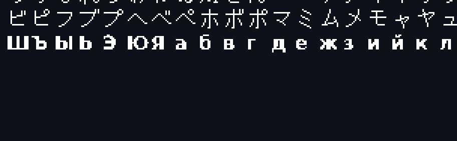

# ADR-005 — Glifi mancanti nei font GameMaker (cirillico e accenti)

**Data:** 2026-07-26 · **Stato:** **verificato sperimentalmente** · **Contesto misurato su:** DELTARUNE demo (Chapter 1 & 2)

> **Esito della verifica del 26/07, sera.** L'ipotesi regge: decoder e encoder della
> variante GM-QOI ricostruiti, **round-trip byte-identico** sulla texture vera
> (1.888.553 byte), 66 lettere cirilliche disegnate nell'atlante al posto di
> altrettanti kanji, e blob ricompresso **più piccolo dell'originale**. I numeri e le
> due sorprese sono nella sezione «Verifica sperimentale» in fondo.
>
> 

## Il problema, con i numeri

Una traduzione può essere perfetta e restare **illeggibile**: se il font del gioco non
contiene i glifi della lingua di destinazione, il giocatore vede caselle vuote.

Letto il chunk `FONT` del `data.win` di Deltarune e contati i glifi realmente presenti
(non il range dichiarato, che mente):

| Font | Glifi | ASCII | Accenti latini | Cirillico | Kana | Kanji |
|---|---:|---:|---:|---:|---:|---:|
| `fnt_main` | 96 | 95 | 0 | **0** | 0 | 0 |
| `fnt_small` | 96 | 95 | 0 | **0** | 0 | 0 |
| `fnt_ja_main` | 1.768 | 95 | 0 | **0** | 173 | 1.347 |
| `fnt_ja_small` | 1.714 | 95 | 0 | **0** | 173 | 1.296 |

Tutti dichiarano `rangeStart..rangeEnd = 0x20..0xFF9F`, ma i glifi effettivi sono
ASCII più kana e kanji. **Nessun font contiene il cirillico o le lettere accentate**,
nemmeno quelli giapponesi.

Conseguenza: russo (la lingua della maggioranza dei nostri utenti), tedesco, francese,
spagnolo e italiano sono oggi **non traducibili in modo utilizzabile** su questo gioco —
e la stessa struttura si ritrova in gran parte dei giochi GameMaker.

La community di fan-translation è ferma esattamente qui **dal 2021**: nel thread Steam
ufficiale la richiesta è testuale — *«someone will need to figure out how to add new
characters to the in-game fonts»* — e non ha mai avuto risposta. Nessuno strumento
esistente (UndertaleModTool incluso) automatizza questo passaggio.

## Perché non è come Ren'Py o RPG Maker

Lì un font è un file `.ttf` sul disco: `font_installer.rs` lo sostituisce con un Noto
che ha i glifi giusti e il gioco riparte. In GameMaker il font è **bitmap**: i glifi
sono pixel dentro una texture page, e una tabella li mappa (`char` → rettangolo +
metriche). Non c'è nessun file da sostituire: vanno **generati i pixel** e **riscritta
la tabella**.

## Il formato, verificato

- **Texture**: chunk `TXTR`, 27 texture. Il formato non è PNG ma **QOI compresso con
  BZip2** — magic `2zoq`, poi width/height in `u16`, poi lo stream `BZh9`. La texture
  del font giapponese è 2048×2048.

  > **Precisato il 27/07 su `GMImage.cs` (UndertaleModLib), e va letto prima di
  > scrivere.** Il contenitore `2zoq` ha **due varianti**:
  >
  > | offset | campo | note |
  > |---|---|---|
  > | 0 | magic `2zoq` | 4 byte |
  > | 4 | width `i16` LE | |
  > | 6 | height `i16` LE | |
  > | 8 | **lunghezza del QOI decompresso, `i32` LE** | **solo GM ≥ 2022.5** |
  > | 8 o 12 | stream BZip2 | lunghezza NON memorizzata |
  >
  > **(a) Il campo a offset 8 è la trappola.** Su GM 2022.5+ l'header è di 12 byte e
  > contiene la dimensione del QOI *decompresso*. Iniettare glifi cambia quel valore, e
  > il piano «si riscrive tutto in place della stessa dimensione» non lo copre: il campo
  > è a dimensione fissa, quindi si aggiorna senza spostare nulla, ma **va aggiornato**.
  > Dimenticarlo produce un file che sembra corretto e si rompe alla lettura. Prima di
  > scrivere il patcher va accertata la versione del runtime di Deltarune.
  >
  > **(b) La lunghezza dello stream BZip2 non è scritta da nessuna parte.** Il lettore
  > la ricava cercando *all'indietro* il magic di fine BZip2 (`17 72 45 38 50 90`, la
  > radice di π) **a livello di bit, non di byte**. È il motivo meccanico per cui il
  > riempimento con zeri funziona: i byte dopo il footer non vengono mai letti come
  > stream.
  >
  > **(c) Il riempimento DEVE essere di zeri.** Le texture sono allineate a 0x80 e il
  > lettore verifica il padding byte per byte (`throw new IOException("Padding error!")`
  > al primo byte non nullo). Riempire con altro rompe il file.
- **Posizione del font nella texture**: chunk `TPAG`. `fnt_main` occupa un'area di
  **128×128** a `(1806, 1274)` nella texture 24; `fnt_ja_main` occupa **1024×512** a
  `(2, 1030)` nella texture 25.
- **Tabella dei glifi**: dentro l'entry `FONT`, un array di puntatori a strutture a
  campi fissi (`char: u16`, posizione, dimensione, `shift`, `offset`).

## Decisione proposta: sostituzione in place, senza rebuild

L'ostacolo che ha bloccato tutto finora è che **cambiare la dimensione di qualsiasi cosa
dentro `data.win` obbliga a ricalcolare tutti gli offset** (è il lavoro di ADR-004, non
ancora fatto). La proposta qui evita del tutto quel problema:

1. **Sacrificare glifi che non servono.** `fnt_ja_main` contiene 1.347 kanji. A un
   traduttore russo non serve nemmeno uno. I 66 caratteri cirillici (А–я) e i ~30
   accenti latini stanno comodamente in quello spazio.
2. **Riscrivere i pixel dentro l'area esistente.** Si decodifica la texture
   (BZip2 → QOI), si ridisegnano le celle dei kanji scelti con i glifi nuovi renderizzati
   da un TTF, si ricodifica. **Le dimensioni dell'immagine non cambiano.**
3. **Cambiare solo il `char` nella tabella.** Per ogni glifo riusato si riscrivono 2
   byte: da code point kanji a code point cirillico, più le metriche. **Struttura a
   dimensione fissa: nessuno spostamento.**
4. **Pareggiare la dimensione del blob compresso.** È l'unico punto delicato: BZip2 non
   dà una lunghezza prevedibile. Ma i glifi cirillici sono più semplici dei kanji, quindi
   il ricompresso sarà quasi certamente **più corto**; e poiché lo stream BZip2 ha un
   marcatore di fine, i byte residui fino alla lunghezza originale possono essere
   riempiti di zeri e vengono ignorati dal decoder. **Se invece risultasse più lungo, si
   abortisce con un messaggio chiaro** — mai scrivere un `data.win` corrotto.

Con questi quattro passi l'intervento è **byte-per-byte della stessa dimensione**, quindi
non richiede ADR-004 e non tocca nessun offset.

## Conseguenze

- Sblocca il cirillico e gli accenti su Deltarune e su ogni gioco GameMaker con font
  bitmap, che è la classe di giochi più richiesta dai nostri utenti.
- Dà a GameStringer una capacità che **nessun altro strumento di quella community ha**.
- Il font giapponese perde i kanji sostituiti: irrilevante per chi installa una patch
  russa, ma va **dichiarato** e va garantito il ripristino da backup.
- Serve un renderer di glifi. Crate mature e già compatibili: `qoi`, `bzip2`,
  `ab_glyph` o `fontdue` per la rasterizzazione.

## Rischi e come contenerli

| Rischio | Contenimento |
|---|---|
| Blob ricompresso più grande dell'originale | Verifica prima di scrivere; in caso, si annulla senza toccare il file |
| Metriche sbagliate → testo sovrapposto | Ricavare `shift`/`offset` dal rasterizzatore e provare su un sottoinsieme |
| Backup mancante → gioco rotto | Backup obbligatorio del `data.win` prima di ogni scrittura, come già fa il patcher |
| Stile incoerente (font pixel-art vs TTF moderno) | Scegliere un TTF pixel compatibile e rendere la scelta configurabile |

## Alternative scartate

- **Sostituire l'intera texture del font con una rigenerata**: più semplice, ma cambia
  l'aspetto anche delle lettere latine — su un gioco il cui stile è metà della sua
  identità, è una perdita che i fan non accettano.
- **Translitterare in ASCII** (Привет → Privet): leggibile, ma è una resa che nessun
  giocatore russo considererebbe una traduzione.
- **Aspettare ADR-004** e aggiungere i glifi allungando le strutture: corretto in teoria,
  ma rimanda tutto a un lavoro molto più grande e rischioso.

## Verifica sperimentale (26/07/2026, sera)

Fatta in C e Python sulla texture 25 del `data.win` vero, prima di scrivere una riga
di Rust. Sorgenti di appoggio: `qoigm.c` (decoder) e `qoienc.c` (encoder).

### 1. Il formato non è QOI standard

Il primo decoder, scritto sulla specifica QOI 1.0, ha prodotto **rumore**. Il sintomo
che ha smascherato l'errore non è stato un crash ma un numero troppo bello: il
re-encode risultava la metà dell'originale. Guardare l'immagine è costato trenta
secondi ed è stata l'unica verifica che contava.

La variante GameMaker usa i **tag QOI pre-1.0** e un hash diverso
(fonte: `UndertaleModLib/Util/QoiConverter.cs`, a sua volta port da dog-scepter):

| | GM (pre-1.0) | QOI 1.0 |
|---|---|---|
| INDEX | `0x00`, mask 2 | `0x00`, mask 2 |
| RUN | `0x40` a 5 bit · `0x60` a 13 bit | `0xC0` a 6 bit |
| DIFF | `0x80` 8 bit · `0xC0` 16 bit · `0xE0` 24 bit | `0x40` · LUMA `0x80` |
| COLOR | `0xF0` + bitmask dei canali | `0xFE` RGB · `0xFF` RGBA |
| hash | `(r ^ g ^ b ^ a) & 63` | `(r*3 + g*5 + b*7 + a*11) % 64` |
| pixel | **BGRA** | RGBA |

Header: `fioq` (4) + width u16 + height u16 + length u32 = 12 byte, poi lo stream.

**Round-trip byte-identico verificato**: `encode(decode(originale))` produce gli stessi
1.888.553 byte. È la prova che il formato è capito, e la precondizione per poter
modificare i pixel senza rischi.

### 2. I glifi sono bicolore, e questo decide la dimensione

Nell'atlante ogni pixel è `[0,0,0,0]` oppure `[255,255,255,255]`: **nessun
antialiasing**. Il primo tentativo li ha scritti antialiasati e con RGB pieno anche
sotto i pixel trasparenti: il blob è cresciuto di **4.256 byte** ed è finito fuori
budget. Rasterizzando in binario (soglia 128) e rispettando la convenzione dei due
soli valori, il conto è tornato.

È il dettaglio da non perdere: **come si scrivono i pixel conta quanto quali pixel si
scrivono.**

### 2-bis. In un atlante bicolore la tabella INDEX non serve a niente

Emerso il 27/07 scrivendo il codec in Rust, da un test che sbagliava soglia.

L'hash di GM-QOI è `(r ^ g ^ b ^ a) & 63`. Per il bianco pieno fa
`255^255^255^255 = 0`; per il trasparente puro fa `0`. **I due soli colori di un
atlante di font collidono nello stesso slot** e si sfrattano a vicenda a ogni
transizione, quindi `QOI_INDEX` non viene mai emesso: ogni passaggio bianco↔vuoto
costa un chunk `QOI_COLOR` da **5 byte** invece di 1.

Conseguenza pratica sul budget: la dimensione del blob **non dipende da quanti pixel
sono accesi, ma da quante transizioni ha il disegno**. È la spiegazione del perché
svuotare i kanji rimasti libera 32 KB (toglie transizioni, non pixel), ed è il motivo
per cui un glifo dai contorni frastagliati può costare più di uno pieno e compatto.
Da tenere presente quando si sceglie il TTF di partenza.

### 3. Le misure

66 lettere cirillico (А–я più Ёё) al posto di altrettanti kanji, su 1.478 disponibili:

| Strategia | Blob bz2 | vs originale (230.197) | Esito |
|---|---:|---:|---|
| A — solo sostituzione | 230.017 | **+180 byte** | ci sta, ma il margine è un'inezia |
| B — sostituzione + svuotamento dei kanji restanti | 198.125 | **+32.072 byte** | ci sta comodamente |

**Si adotta B.** Svuotare i kanji che restano è gratis per chi installa una patch russa,
e trasforma un margine di 180 byte — che su un altro gioco sparirebbe — in 32 KB. Il
riempimento fino alla dimensione originale si fa con zeri dopo il marcatore di fine
dello stream BZip2, che il decoder ignora.

### Cosa resta da fare, ora che la strada è verificata

Il pezzo dimostrato è la **texture**. Manca la **tabella dei glifi**: per ogni cella
riusata vanno riscritti il `char` (2 byte) e le metriche (`w`, `h`, `shift`, `offset`),
tutte a dimensione fissa e quindi in place. E va aggiunta la stessa cosa per
`fnt_ja_small` e per i font non giapponesi, se si vuole coprire anche gli accenti
latini su giochi senza font JA.

## Passi

1. ~~Estrattore/reinseritore texture QOI+BZip2 con test sulla texture reale di Deltarune.~~
   **Fatto e verificato** — vedi sopra. Da portare in Rust con le crate `bzip2` e un
   codec GM-QOI scritto a mano (le crate `qoi` implementano la 1.0, che qui non serve).
2. Lettore/scrittore della tabella glifi, con test che verifichi il round-trip
   byte-identico su un `data.win` non modificato.
3. Rasterizzatore dei glifi mancanti a partire dalla lingua di destinazione.
4. Comando Tauri `gm_inject_glyphs`, backup obbligatorio, e verifica della dimensione
   prima della scrittura.
5. Prova sul campo: una frase russa dentro Deltarune, letta a schermo.
