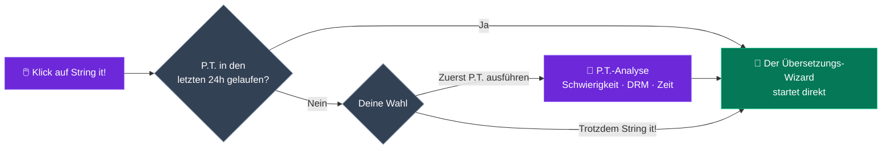
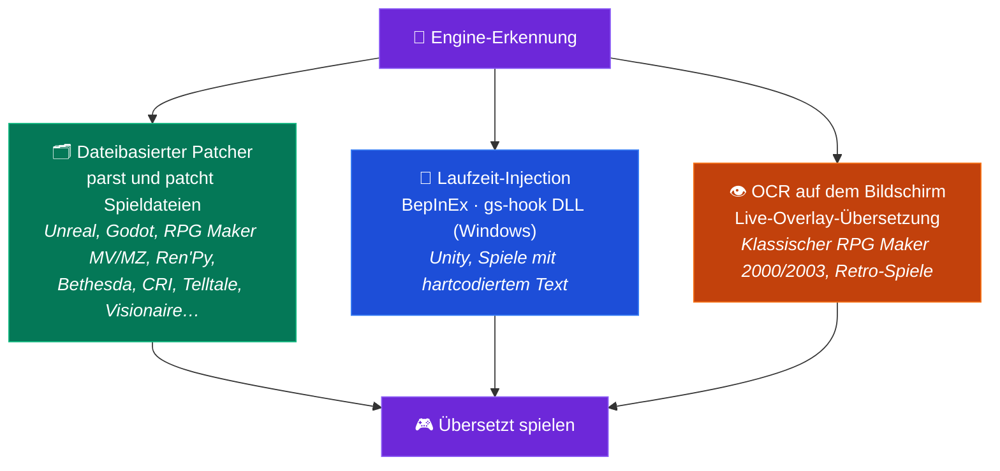

<p align="center">
  
</p>

<h1 align="center">GameStringer</h1>

<p align="center">
  <strong>Desktop-Anwendung, die Videospiele mithilfe von KI in jede Sprache übersetzt.</strong><br>
  Wähle ein Spiel aus deiner Bibliothek, wähle eine Sprache, klicke auf Übersetzen — fertig.
</p>

<p align="center">
  <a href="https://www.gamestringer.ai"></a>
  <a href="https://discord.gg/SjnD3Z7Uf8"></a>
  
  
  
  
  
  
</p>

<p align="center">
  <a href="https://www.gamestringer.ai">Website</a> ·
  <a href="https://discord.gg/SjnD3Z7Uf8"><strong>💬 Discord</strong></a> ·
  <a href="#hilfe-gesucht"><strong>🙏 Hilfe gesucht</strong></a> ·
  <a href="#-was-ist-gamestringer">Was ist es</a> ·
  <a href="#-download">Download</a> ·
  <a href="#-so-funktionierts">So funktioniert's</a> ·
  <a href="#-das-prediction-tool-pt">P.T.</a> ·
  <a href="#-unterstützte-game-engines">Engines</a> ·
  <a href="#-funktionen">Funktionen</a> ·
  <a href="#-aus-quellcode-bauen">Build</a>
</p>

> ⚠️ **Update von v1.8.x?** Die v1.9.0 ist von Tauri v1 auf **Tauri v2** umgestiegen — der Auto-Updater funktioniert für diesen Sprung nicht. Lade die **v1.9.1** manuell herunter: [GameStringer_1.9.1_x64-setup.exe](https://github.com/rouges78/GameStringer/releases/download/v1.9.1/GameStringer_1.9.1_x64-setup.exe). Zukünftige Updates (v1.9.1 → v1.9.x) funktionieren automatisch.

<p align="center">
  <strong>🌍 Verfügbar in 12 Sprachen</strong> — wechsle die Sprache in der App (IT, EN, ES, FR, DE, PT, PL, RU, JA, ZH, KO, EL) oder auf der <a href="https://www.gamestringer.ai">Website</a> (11 Sprachen).
</p>

<p align="center">
  <strong>🌍 Lies in deiner Sprache:</strong><br>
  <a href="README.md">🇬🇧 English</a> ·
  <a href="README_IT.md">🇮🇹 Italiano</a> ·
  <a href="README_ES.md">🇪🇸 Español</a> ·
  <a href="README_FR.md">🇫🇷 Français</a> ·
  🇩🇪 Deutsch ·
  <a href="README_PT.md">🇧🇷 Português</a> ·
  <a href="README_JA.md">🇯🇵 日本語</a> ·
  <a href="README_ZH.md">🇨🇳 中文</a> ·
  <a href="README_KO.md">🇰🇷 한국어</a> ·
  <a href="README_RU.md">🇷🇺 Русский</a> ·
  <a href="README_PL.md">🇵🇱 Polski</a>
</p>

---

> ### 💜 Eine Nachricht vom Entwickler
>
> GameStringer wird von **einer einzigen Person — mir — gebaut, und ich habe Parkinson**, deshalb kommen Updates manchmal langsamer, als mir lieb ist. **Danke für deine Geduld.** **Ich mache das nicht für Geld**: Ich will einfach die Art und Weise verändern, wie Spielübersetzung funktioniert, und den Spielern ein wirklich nützliches Werkzeug in die Hand geben. **Der Discord ist jetzt offen** 🎉 — [komm dazu](https://discord.gg/SjnD3Z7Uf8), damit wir reden, Ideen austauschen und GameStringer gemeinsam besser machen können. 🙏
>
> — *Davide ([@rouges78](https://github.com/rouges78))*

---

<a name="hilfe-gesucht"></a>

## 🙏 Hilfe gesucht — Teste es an echten Spielen und schick Feedback

> **GameStringer ist ein Solo-Projekt, source-available, und noch jung.** Es erkennt bereits 20+ Engines (12 mit dediziertem Parser), aber echte Spiele sind chaotisch — jeder Titel speichert seinen Text ein wenig anders. **Das Nützlichste, was du gerade jetzt tun kannst, ist GameStringer an einem echten Spiel laufen zu lassen und mir zu erzählen, was passiert ist.** Schon ein *„es scheiterte an Schritt X"* ist Gold wert.

**Warum das wichtig ist:** Ich kann unmöglich die Tausende von Spielen da draußen allein testen. Kontinuierliches **Testing und Feedback** aus der Praxis ist das, was aus *„läuft auf meinen Fixtures"* ein *„läuft auf deinem Spiel"* macht. Deine Berichte formen direkt die Roadmap — das ist der Teil, in dem die Community über das Projekt entscheidet.

### 🧪 Drei Wege zu helfen (nimm einen beliebigen)

- **🎮 Teste ein Spiel und berichte.** Lass es an etwas aus deiner Bibliothek laufen und reiche einen schnellen [Kompatibilitätsbericht](https://github.com/rouges78/GameStringer/discussions) ein — wurde die Engine korrekt erkannt? wurde der Text extrahiert? wurde der Patch angewendet und startet das Spiel noch?
- **📦 Teile ein Pack.** Wenn eine Übersetzung funktioniert, veröffentliche sie im integrierten **Patch Hub**, damit andere sie nutzen können — dein Name kommt drauf (Reputation + „verifizierter Übersetzer").
- **🛠️ Trage bei.** Neue Engine-Parser, Locale-Fixes, QA-Skripte — suche nach `good first issue` im Repo.

### 📋 Was wir besonders getestet und kommentiert brauchen

- [ ] **Engine-Abdeckung bei echten Titeln** — Unity (Mono **und** IL2CPP), Unreal (`.locres`, `_P.pak`, IoStore), Godot, RPG Maker **MV/MZ**, Ren'Py, Bethesda (BSA/BA2/ESP), CRI (CPK), Wolf RPG, TyranoScript, Visionaire, Danganronpa
- [ ] **Klassischer RPG Maker (2000/2003)** über das **OCR-Overlay** auf dem Bildschirm — wie lesbar ist das Ergebnis?
- [ ] **Encoding & Steuerzeichen** — korrekte Akzente/CJK im Spiel, und In-Game-Tags/Variablen intakt?
- [ ] **Schriften** — werden nicht-lateinische Schriften (CJK, Kyrillisch, Griechisch) im Spiel dargestellt, oder ist ein Font-Tausch nötig?
- [ ] **Übersetzungsqualität pro Sprache** — welcher KI-Anbieter liefert die besten Ergebnisse für deine Sprache/dein Genre?
- [ ] **Patch Hub** — Veröffentlichen und Herunterladen von `.gspack`-Packs von Anfang bis Ende
- [ ] **Onboarding & UX beim ersten Start** — war klar, wie man sein erstes Spiel übersetzt? was hat verwirrt?
- [ ] **Update-Tracker** — hat er nach einem Store-Update korrekt gemeldet, dass der Patch neu angewendet werden muss?

### 📝 Vorlage für Kompatibilitätsbericht (kopieren-einfügen)

```
- Spiel / Store / Version:
- Erkannte Engine (durch GameStringer):
- Erreichter Schritt: Scan / Detect / Extract / Translate / Patch / Gespielt
- Ergebnis: ✅ funktioniert / ⚠️ teilweise / ❌ scheitert
- Verwendeter KI-Anbieter:
- Sprache:
- Notizen (was kaputtging, Encoding, Screenshots):
- OS + GameStringer-Version:
```

**Wo posten:** [GitHub Discussions](https://github.com/rouges78/GameStringer/discussions) · der integrierte **Community Hub** (Support / Showcase / Anfragen) · Bugs → [Issues](https://github.com/rouges78/GameStringer/issues).

GameStringer ist kostenlos und source-available; die Website und die KI-Kosten zahle ich aus eigener Tasche, also wenn es dir Zeit spart, ist ein Kaffee willkommen, aber **niemals** erwartet: [Buy Me a Coffee](https://buymeacoffee.com/gamestringer) · [Ko-fi](https://ko-fi.com/gamestringer) · [GitHub Sponsors](https://github.com/sponsors/rouges78).

---

## 🎮 Was ist GameStringer?

> **Einfach gesagt:** Wähle ein Spiel → wähle deine Sprache → klicke einen Knopf. GameStringer findet den Text des Spiels, übersetzt ihn mit KI und setzt ihn zurück — mit vorherigem Backup. Kein Modding, keine Kommandozeile, kein technisches Wissen.

GameStringer ist eine **Desktop-Anwendung** (Windows, Linux und macOS), mit der du Videospiele übersetzen kannst, die deine Sprache nicht unterstützen.

Die meisten Spiele speichern ihren Text in Dateien — JSON, XML, CSV, `.locres`, `.rpy`, BSA/BA2, CPK, Unity Localization StringTables und viele andere Formate. GameStringer **scannt deinen Spielordner**, findet diese Dateien, sendet den Text durch einen **KI-Übersetzungsanbieter** deiner Wahl (OpenAI, Claude, Gemini, DeepSeek, Ollama und 20+ weitere) und **patcht den übersetzten Text zurück** ins Spiel. Ein Klick, keine technischen Kenntnisse erforderlich.

Für **Unity-Spiele**, die Text in kompilierten Assets einsperren, **installiert GameStringer automatisch BepInEx + XUnity.AutoTranslator** — ohne manuelle Einrichtung. Für **Bethesda-Spiele** (Skyrim, Fallout, Starfield) parst es BSA/BA2/ESP nativ. Für **CRI Middleware-Spiele** (Persona, Yakuza) verarbeitet es CPK/CRILAYLA/MSG/BMD. Für **Unreal Engine** bearbeitet es `.locres` direkt.

**Es ist keine Website für maschinelle Übersetzung.** Es ist eine vollständige Pipeline: **Analyse mit P.T. → Engine erkennen → Text extrahieren → mit KI übersetzen → Qualitätsprüfung → zurückpatchen → spielen.**

---

## 📥 Download

Hol dir die neueste Version von **[GitHub Releases](https://github.com/rouges78/GameStringer/releases)**:

| Plattform | Datei | Hinweise |
|----------|------|-------|
| **Windows** | `GameStringer_1.15.0_x64-setup.exe` | Installer (empfohlen) |
| **Windows** | `GameStringer_1.15.0_x64-portable.zip` | Keine Installation nötig |
| **Windows** | `GameStringer_1.15.0_x64_en-US.msi` | MSI-Alternative |
| **macOS** | `GameStringer_1.15.0_x64.dmg` | Intel Mac |
| **macOS** | `GameStringer_1.15.0_aarch64.dmg` | Apple Silicon |
| **Linux** | `GameStringer_1.15.0_amd64.AppImage` | Universal (empfohlen) |
| **Linux** | `GameStringer_1.15.0_amd64.deb` | Debian / Ubuntu |
| **Linux** | `GameStringer-1.15.0-1.x86_64.rpm` | Fedora / RHEL |

**Anforderungen:** Windows 10+, macOS 10.15+ oder Linux (Ubuntu 22.04+, Fedora 38+). 4 GB RAM (8 GB+ für lokale KI), 500 MB Speicherplatz. Updates sind **kryptografisch signiert** und werden über den Tauri Updater ausgeliefert (die App verifiziert jedes Update gegen einen mitgelieferten öffentlichen Schlüssel).

> 🛡️ **Warnung von Antivirus oder SmartScreen?** Das ist ein bekannter **Fehlalarm** — die Übersetzung zur Laufzeit nutzt DLL-Injection (BepInEx / gs-hook), eine Technik, gegenüber der heuristische Scanner misstrauisch sind, und jede neue Release startet mit null SmartScreen-Reputation. **[Lies docs/ANTIVIRUS.md](docs/ANTIVIRUS.md)**, um zu erfahren, was ihn auslöst, wie du deinen Download verifizierst und wie du den Fehlalarm meldest.

---

## 🚀 So funktioniert's

1. **Installiere** GameStringer und starte es
2. **Deine Spielebibliothek wird automatisch geladen** — Steam, Epic, GOG, Origin, Ubisoft, Amazon, itch.io, Humble App, Game Jolt, Big Fish (deine installierten Spiele werden in Sekunden erkannt, ohne Begrenzung der Anzahl)
3. **Wähle ein Spiel** → optional **P.T. (Prediction Tool)** ausführen, um Schwierigkeit, geschätzte Zeit und beste LLM-Kette zu sehen
4. Klicke auf **„String it!"** — GameStringer scannt, extrahiert, übersetzt und patcht automatisch
5. **Spiele in deiner Sprache** — Backups werden vor jedem Patch erstellt

Das war's. Keine Kommandozeile, kein manuelles Bearbeiten von Dateien, keine Modding-Erfahrung nötig.

### Die Pipeline auf einen Blick


---

## 🧠 Das Prediction Tool (P.T.)

> **Die mächtigste Funktion in GameStringer.** Beginne eine Übersetzung nicht blind — analysiere zuerst.

P.T. ist eine Tiefenanalyse-Engine, die *vor* jeder Übersetzung läuft. Sie scannt deinen Spielordner, erkennt die Engine, schätzt das Volumen übersetzbaren Textes und sagt dir:

- **Difficulty Score 0–100** — kombinierte Gewichtung von String-Volumen, Engine-Komplexität, DRM, Codierung, sprachlichen Herausforderungen
- **Geschätzte Zeit** über **18 LLM-Modelle** — Ollama (Gemma 4, Qwen 3, Llama), OpenAI GPT-4/4o, Claude 3.5, Gemini, DeepL, DeepSeek, Groq
- **5 empfohlene LLM-Ketten**: Local (Privatsphäre), Cloud (Qualität), Hybrid (ausgewogen), Budget, Premium — jeweils mit Kosten- und Qualitätsbewertung
- **DRM-Erkennung**: Denuvo, VMProtect, Steam DRM, EAC, BattlEye — warnt dich vor dem Versuch
- **Codierungsanalyse**: Shift-JIS, UTF-8, UTF-16, Big5, EUC-KR pro Datei erkannt
- **Übersetzungskomplexität**: Höflichkeitsformen, Geschlechterkongruenz, RTL, Ruby/Furigana, CJK-spezifische Behandlung
- **Konfidenzscore** und **Workflow-Plan** — die exakten Schritte, die beim Klick auf „String it!" ausgeführt werden
- **Report-Export** (JSON + Markdown) zum Teilen oder Archivieren

### P.T.Rank — Schnelle Rangliste

Nach dem Ausführen von P.T. auf mehreren Spielen öffne **P.T.Rank**, um alle analysierten Titel nach Schwierigkeit sortiert zu sehen. Perfekt zum Planen deiner Übersetzungsqueue: Beginne mit den leichten Siegen, spare die RPGs mit Hunderttausenden von Strings für den Schluss.

### Dry Run Scanner

Du willst nicht ein Spiel nach dem anderen analysieren? Führe **Dry Run** von der Bibliotheksseite aus, um **deine gesamte installierte Bibliothek im Batch** zu scannen, ohne Begrenzung der Spielanzahl,, mit **null Dateiänderungen**. Du erhältst einen JSON-Bericht, der jedes Spiel als **Ready** (Engine unterstützt + Strings extrahierbar), **Errors** (Manifest-Probleme / DRM-Blocker) oder **Unsupported** (unbekannte Engine / kein Text) kategorisiert. Fortschritt in Echtzeit, kein Backup nötig, weil nichts angefasst wird.

### String it! Smart Gate

Die **„String it!"**-Schaltfläche auf der Spieldetailseite ist schlau: Wenn das Spiel in den letzten 24h von P.T. analysiert wurde, startet sie direkt den Übersetzungs-Wizard. Sonst schlägt sie vor, zuerst P.T. auszuführen (mit Ein-Klick-Auswahl „Run P.T. first" / „String it! anyway"). Keine verschwendeten Durchläufe mehr auf Spielen, die sich als DRM-gesperrt oder 5-Minuten-Angelegenheiten entpuppen.



---

## 🎯 Unterstützte Game Engines

Eine Engine-Erkennung, **drei Übersetzungswege** — GameStringer wählt automatisch den besten:



GameStringer hat **12 Engines mit dediziertem Parser** und erkennt insgesamt **über 20**, mit unterschiedlichem Tiefgang:

| Engine | Support | Wie es funktioniert |
|--------|---------|--------------|
| **Unity** | ✅ Vollständig | Installiert automatisch BepInEx + XUnity.AutoTranslator + Unity Localization Package Pipeline (StringTable, SharedTableData, Addressables, Smart Strings) |
| **Unreal Engine** | ✅ Vollständig | `.locres`-Extraktion und -Patching mit UnrealLocres |
| **Unreal _P.pak** | ✅ Vollständig | Mod-Paketierung als `<GameStringer>_P.pak`, geladen über den Paks-Ordner |
| **Godot** | ✅ Vollständig | Native `.translation`-Datei-Unterstützung |
| **RPG Maker** | ✅ Vollständig | MV/MZ JSON, VX/Ace via Trans, XP via RMXP |
| **Ren'Py** | ✅ Vollständig | Natives `.rpy`-Script-Parsing mit Dialogerkennung |
| **GameMaker** | ⚡ Teilweise | Via UndertaleModTool-Integration |
| **Telltale** | ✅ Vollständig | `.langdb` / `.dlog`-Unterstützung |
| **Wolf RPG** | ✅ Vollständig | WolfTrans-Integration |
| **Kirikiri** | ✅ Vollständig | `.ks` / `.scn`-Parsing |
| **TyranoScript** | ✅ Vollständig | Fast-Path-Extractor mit JSON-Patching |
| **Electron** | ✅ Vollständig | ASAR-Unpacking + i18n-JSON-Erkennung |
| **Bethesda (Skyrim/Fallout/Oblivion/Starfield)** | ✅ **NEW v1.9.0** | BSA v103-105 + BA2 GNRL/DX10 + ESP/ESM (FULL/DESC/NAM1) Parser, STRINGS/DLSTRINGS/ILSTRINGS |
| **CRI Middleware (Persona/Yakuza/Tales of/Dragon Ball)** | ✅ **NEW v1.9.0** | CPK + CRILAYLA + MSG/BMD/FTD mit automatischer Erkennung von Shift-JIS/UTF-8/UTF-16 |
| **Visionaire Studio** | ✅ Vollständig | Daedalic-Adventures (Deponia, Edna usw.) |
| **Danganronpa WAD** | ✅ Vollständig | WAD-Archiv-Parser + STX-Dialog-Patching |

> **Unity-Spiele** erhalten eine Sonderbehandlung: Werden keine übersetzbaren Dateien gefunden, erkennt GameStringer, dass es sich um ein Unity-Spiel handelt, und bietet an, **BepInEx + XUnity.AutoTranslator automatisch mit einem Klick zu installieren**. Einfach das Spiel einmal nach der Installation starten, dann erneut scannen — der gesamte Text wird übersetzbar.
>
> ⚠️ **Anti-Cheat-Warnung**: BepInEx (DLL-Injection) kann Anti-Cheat-Systeme (EAC, BattlEye, Vanguard) auslösen. GameStringer enthält eine Anti-Cheat-Erkennung und warnt dich. **Nur bei Single-Player- / Offline-Spielen verwenden.** P.T. erkennt DRM vor jeder Modifikation.

---

## ✨ Funktionen

### 🆕 Neu in v1.15.0 — Ollama-Parameter und Projekte ↔ Patch Hub

- **🎚 Ollama-Inferenzparameter-Panel** — Feinabstimmung der Übersetzungen mit lokalem Ollama über die Presets **Treu / Ausgewogen / Kreativ** oder Wechsel in den **Expertenmodus** für die direkte Kontrolle über temperature, top-p und die übrigen Sampling-Regler; die Wahl wird nicht-invasiv in jeden Ollama-Übersetzungsaufruf eingebunden
- **🔗 Integration Projekte ↔ Patch Hub** — **importiere eine `.gspack` als abgeschlossenes Projekt**, veröffentliche im Hub **direkt aus einem Projekt vorbefüllt**, wechsle über den Umschalter **Entdecken / Meine Patches** und **Auf Spiel anwenden** mit einem Klick (mit automatischem Backup)
- **💬 Feedback-Widget in der App** — sende Feedback oder melde ein Problem, ohne die App zu verlassen
- **⚡ Schnellerer Patch Hub** — **Caching + Rate-Limiting** der Antworten für flüssigeres Blättern und Herunterladen unter Last
- **🐛 Fehlerbehebungen** — die RSS-News-Webview wird nicht mehr durch CORS blockiert, plus ein neuer **WCAG-2.1-AA-Barrierefreiheits-Audit**

### 🆕 Neu in v1.14.0 — Community-Kompatibilität und kugelsichere Packs

- **🧭 Kompatibilitäts-Telemetrie (opt-in)** — das „ProtonDB der Übersetzungen": melde, ob eine Übersetzung funktioniert hat, und sieh **Kompatibilitäts-Badges auf den Spielkarten**, gestützt auf Community-Berichte mit Missbrauchsschutz und einer [öffentlichen Statistikseite](https://gamestringer.ai/compatibilita.html)
- **🔤 Erkennung fehlender Glyphen + automatischer Font-Fix** — GameStringer analysiert die Zeichentabelle der Spielschrift, erkennt, wenn die Glyphen deiner Sprache fehlen, und **installiert automatisch eine passende Noto-Schrift** für dateibasierte Engines (Ren'Py, RPG Maker) — keine Tofu-Kästchen mehr statt Text
- **🛡 Verifizierbare Pack-Integrität** — Community-Packs werden mit einem **aggregierten SHA-256** verifiziert, Path-Traversal-Schutz und automatischer Kennzeichnung manipulierter Packs
- **💥 Opt-in-Crash-Reporting** — anonyme Berichte mit Signaturen wiederkehrender Crashes, damit sie schneller behoben werden
- **📚 Robuster Bibliotheks-Sprachscan** — zuverlässigere Erkennung der Sprachen, die ein Spiel bereits mitbringt, plus ein manueller „Sprachen erkennen"-Knopf
- **💬 Discord ist live** — tritt auf [discord.gg/SjnD3Z7Uf8](https://discord.gg/SjnD3Z7Uf8) bei
- **🧪 Parser-Regressions-Suite** — gemeinsame Binär-Fixtures (Godot, .locres, STX, RPG Maker, CRI CPK, Bethesda), die sowohl von den Rust- als auch den TS-Parsern ausgeführt werden; 2 echte Bugs gefunden und behoben
- **📰 Saubererer News-Feed** — MediaWiki-Diff-Rauschen entfernt, Deal-Posts herausgefiltert

### 🆕 Neu in v1.13.0

- **🖥 Echtzeit-UE-Übersetzer als experimentell markiert** — das Echtzeit-Tool für Unreal gibt seinen experimentellen Status jetzt vorab an und prüft, ob das Spiel tatsächlich läuft, bevor es startet
- **🎛 Qualitätskontrollen in den Einstellungen** — Schalter für die neuen Übersetzungsqualitäts-Funktionen (Reflection-Pass, semantische Suche) plus eine erweiterte Anbieter-Allowlist
- **🌐 Website + i18n** — v1.12.0-Abschnitt auf der Website mit Infografiken und einer Entwicklernotiz, in 12 Sprachen; `aiQuality` / `semantic` / `lore`-Schlüssel in allen Locales nachgetragen
- **🐛 Fehlerbehebungen** — die CI baut die Release jetzt aus dem aktuellen Branch statt aus einem noch nicht erstellten Tag; Supabase-Forum-INSERT-Policies unter RLS-Härtung neu erstellt, mit kontrolliertem Bridge-Ausstieg; Migration `20260626` dedupliziert

### 🆕 Neu in v1.12.0 — intelligentere, selbstprüfende Übersetzungen

- **👁️ Übersetzung mit visuellem Kontext (VLM)** — für die Live-/Bildschirm-Übersetzung *sieht* ein KI-Vision-Modell jetzt *das Bild* und übersetzt mit diesem Kontext, sodass es bei mehrdeutigen Wörtern nicht mehr rät (ist *„Chest"* eine Schatztruhe oder ein Körperteil?). Funktioniert mit einem **lokalen** Modell (Ollama) oder **OpenAI / Gemini**. Screenshots werden für die Geschwindigkeit nativ zugeschnitten und skaliert.
- **🪞 Selbstkorrigierende Übersetzungen (Reflection)** — nach dem Übersetzen kann GameStringer einen schnellen zweiten Durchlauf machen, der die eigene Arbeit gegen dein **Glossar, den Ton und die Formatierung** prüft und nur die Zeilen korrigiert, die es wirklich brauchen. Standardmäßig selektiv, damit es schnell und günstig bleibt.
- **🧠 Semantisches Gedächtnis (RAG)** — deine Translation Memory und dein Glossar werden jetzt nach **Bedeutung** abgeglichen, nicht nur nach exakten Wörtern, sodass eine bereits übersetzte Phrase auch dann wiederverwendet wird, wenn sie anders formuliert ist — für konsistente Terminologie im ganzen Spiel. Vollständig lokal (Ollama-Embeddings); fällt auf Schlüsselwort-Abgleich zurück, wenn nicht verfügbar.
- **⚡ Flüssigere Live-Übersetzung** — überarbeitete Live-Overlay-Pipeline und native Bildverarbeitung für ein schnelleres, saubereres Ergebnis auf dem Bildschirm.
- **🔌 Mehr Anbieter out of the box** — erweiterte Allowlist, damit mehr Backends einfach funktionieren: DeepL, Groq, Cerebras, Cohere, Together, Fireworks, Hugging Face, Azure Translator, DashScope, LibreTranslate, Lingva, MyMemory.

### 🆕 Neu in v1.11.2

- **Mehr Stores** — Erkennung lokaler Installationen für **Humble App, Game Jolt und Big Fish Games**, zusätzlich zu den bestehenden Launchern
- **Übersetzungssuche** — prüfe über **PCGamingWiki**, ob ein Spiel deine Sprache bereits mitbringt, plus schnelle **Suchlinks für italienische Fan-Patches** aus der Spielansicht
- **Im Patch Hub veröffentlichen** — sende ein abgeschlossenes Projekt in einem Schritt an den Community-**Patch Hub** (`app/projects` → publish, verwendet `publishPack`)
- **Community-Hub-Übersicht** — neues Landing-Panel mit letzter Aktivität, neuesten Packs und Kategorien
- **News zu italienischen Übersetzungen** — kuratierte Fan-Translation-RSS-Feeds hinzugefügt (Ctrl+Trad, OldGamesItalia, Romhacking.it, Language Pack Italia, Q-Gin, …)
- **String it! überall** — Ein-Klick-Routing für Unity/Unreal/Godot + eine Cloud-Pipeline für **TyranoScript**
- **Unity** — lokale **Ollama**-Bridge für XUnity (CustomTranslate); BepInEx/XUnity/TMP/UABEA-Downloads werden über die GitHub API aufgelöst
- **Godot** — neu geschriebener `.pck`-Parser liest echte **Godot 4.4+**-Archive (verifiziert an *Slay the Spire 2*)
- **Desktop-Zuverlässigkeit** — die letzten Web-`/api`-Aufrufe entfernt: der Editor nutzt die lokale TM, und translate/export/voice/store-Aufrufe laufen über das native Backend

### 🆕 Neu in v1.10.2

- **Auto-Updater-Fix** — ein hängender Zustand „Wird vorbereitet…" behoben, in dem das Update nie mit dem Herunterladen begann. Ein veraltetes React-Update-Objekt wurde an `downloadAndInstall` übergeben und das `updating`-Flag nie zurückgesetzt; jetzt startet, lädt und installiert das Auto-Update zuverlässig (`components/notifications/auto-updater.tsx`, `hooks/use-tauri-updater.ts`)
- **Zuverlässige Persistenz der Einstellungen** — App-Einstellungen und API-Keys der KI-Anbieter werden jetzt zuverlässig auf der Festplatte gespeichert (`data_dir/GameStringer/settings.json`) über die Tauri-Befehle `save_app_settings` / `load_app_settings`; zuvor wurden manche Einstellungen nicht persistiert
- **Spiele manuell von der Festplatte hinzufügen** — du kannst jetzt ein Spiel hinzufügen, indem du seinen Ordner von der Festplatte auswählst, ohne dich allein auf die Bibliotheks-Auto-Erkennung (Steam/Epic/usw.) zu verlassen (`lib/manual-games.ts`, `app/library/page.tsx`)

### 🆕 Neu in v1.9.1

- **Fix für CSP, die Supabase blockierte** — der Community Chat wurde durch die strikte Content Security Policy von Tauri v2 stillschweigend blockiert. `https://*.supabase.co` und `wss://*.supabase.co` zu `connect-src` hinzugefügt
- **Fix für Chat-Auto-Connect** — koordinierte Auth zwischen `main-layout` und `persistent-chat` über benutzerdefinierte Events, wodurch Race Conditions beseitigt werden
- **Fix für Timeout-Fehler** — eine stale Closure im Max-Timeout verursachte ein falsches „Ladezeit zu lang", selbst wenn der Chat korrekt geladen wurde
- **macOS-Builds** — DMG (Intel) und `.app.tar.gz` (Apple Silicon) jetzt verfügbar

### 🆕 Neu in v1.9.0

- **Vereinheitlichte Online-Präsenz** — Supabase Realtime + DB-Fallback, Auto-Away/Auto-Online, Heartbeat alle 30s
- **System-Tray-Benachrichtigungen** — native OS-Benachrichtigungen für Chat, Übersetzungen, Fehler, Updates, Spiele, Freunde, News mit konfigurierbaren Ruhezeiten
- **Error Boundaries + Crash-Recovery** — WidgetErrorBoundary (Auto-Retry 5s, max. 3), AppErrorBoundary mit Neuladen
- **Netzwerk-Resilienz / Offline-Modus** — Netzwerk-Monitor, Statusleiste (rot/gelb/grün), Retry mit exponentiellem Backoff, Offline-Queue
- **Character Voice Profiles (Voice Cloning)** — automatische Extraktion des Charakterstils aus Dialogen, 16 Töne, Prompt Injection für konsistente Übersetzungen
- **Fine-Tuning-Infrastruktur** — Datasets aus menschlichen Korrekturen (Adaptive MT), 4 Export-Formate, Modellverwaltung pro Spiel mit Ollama
- **Code Splitting / Lazy Loading** — 8 schwere Komponenten zu React.lazy + Suspense konvertiert für schnelleren Start
- **Bugfixes** — doppelte Init von NetworkResilience + Listener-Leak, Supabase 400 bei user_profiles, Tray-Versionsstrings, Ruhezeiten-Bypass für kritische Benachrichtigungen

### 🤖 KI-Übersetzung

- **20+ Anbieter**: OpenAI, Claude, Gemini, DeepSeek, Mistral, Groq, DeepL, Ollama (lokal), LM Studio, TranslateGemma, HY-MT, Qwen 3, NLLB-200, Cerebras, Together AI, Fireworks, OpenRouter, Cohere, Lingva, MyMemory
- **Context-aware**: versteht Spielgenre, Charakterstimme, Ton, Erzählung vs. UI vs. Dialog
- **Translation Memory & Glossar**: Konsistenz im gesamten Projekt mit automatischer Glossar-Extraktion
- **Auto-Select Engine** (NEW v1.7.0): `auto`-Preset, das Anbieter dynamisch nach Zielsprache + Spielgenre bewertet (DeepL für europäische, Claude für CJK, genre-basierter Boost)
- **Multi-LLM Compare**: führt mehrere Anbieter parallel aus, wähle das beste Ergebnis pro String
- **Quality Gates**: automatisches QA-Scoring für jeden übersetzten String (0-100) mit ContentTypeBadge
- **Vision LLM Translator**: nutzt In-Game-Screenshots für Kontext (Ollama, Gemini, GPT-4o)
- **Live Quality Preview**: sieh Qualitätsbewertungen in Echtzeit während der Batch-Übersetzung
- **RTL-Unterstützung**: automatische Richtungserkennung und `dir`-Attribut-Behandlung

### 🧠 P.T. — Prediction Tool (v1.9.0)

- **Difficulty Score 0-100** mit gewichteten Faktoren (Volumen, Engine, DRM, Codierung, Komplexität)
- **Zeitschätzungen für 18 LLM-Modelle** einschließlich Gemma 4 (27B MoE A4B / E4B / E2B)
- **5 LLM-Ketten** (Local / Cloud / Hybrid / Budget / Premium) mit Kosten- und Qualitätsschätzungen
- **DRM-/Anti-Cheat-Erkennung** (Denuvo, VMProtect, Steam DRM, EAC, BattlEye, Vanguard)
- **Codierungsanalyse** pro Datei (Shift-JIS, UTF-8/16, Big5, EUC-KR)
- **Übersetzungskomplexitätsanalyse** (Höflichkeitsformen, Geschlecht, CJK, Ruby, RTL)
- **P.T.Rank / Quick Ranking** — sortiere alle analysierten Spiele nach Schwierigkeit
- **Dry Run Scanner** — Batch-Scan deiner gesamten installierten Bibliothek, ohne Begrenzung der Spielanzahl, ohne Modifikation
- **Workflow Orchestrator** — echter Ausführungsmotor mit universellem Fast Path für 6+ Engines und Echtzeit-Fortschritt
- **Prediction-Cache** (24h) — sofortiges Wieder-Öffnen zuvor analysierter Spiele
- **Report-Export** (JSON + Markdown) zum Teilen und Archivieren

### 📚 Spielebibliothek

- **Auto-Detect**: Steam (mit Family Sharing), Epic, GOG Galaxy, Origin/EA, Ubisoft Connect, Amazon Games, itch.io, Humble App, Game Jolt, Big Fish Games
- **Deine gesamte installierte Bibliothek** in Sekunden erkannt, ohne Begrenzung der Spielanzahl
- **Spielkarten** mit Cover-Art, Metadaten, Engine-Badge, VR-Badge, Installationsstatus
- **Hover-Schnellaktionen**: String it!, Batch, Community, P.T. — alles mit einem Klick
- **Game Update Tracker**: erkennt, wenn Steam ein übersetztes Spiel aktualisiert (via `buildid`), prüft Patch-Integrität (BepInEx-Dateien, `_P.pak`-Präsenz), warnt, wenn ein Re-Patch nötig ist
- **„Stop monitoring"**-Schaltfläche, um ein bestimmtes Spiel nicht mehr zu verfolgen

### 🔧 Übersetzungs-Tools

- **One-Click Translate** („String it!"): scannen → übersetzen → patchen in einem einzigen Fluss
- **Batch Translation**: ganze Spiele oder Ordner auf einmal übersetzen
- **Untertitel-Übersetzer**: SRT, VTT, ASS/SSA mit Timing-Erhaltung
- **OCR Translator**: extrahiert Text aus Retro-Spielen (8-Bit-, 16-Bit-, DOS-Presets) mit echtem Tauri-Tesseract-Backend
- **Voice Pipeline**: speech-to-text → übersetzen → text-to-speech mit **Duration Matching** (NEW v1.7.0) — passt Geschwindigkeit automatisch an die Dauer des Originalaudio an
- **Lip Sync** (NEW v1.7.0): Rhubarb-Integration zur Viseme-Generierung (A-X), interaktive Timeline, Export für Unity (Blend Shapes) und Unreal (FaceFX)
- **Gridly CSV Export/Import** (NEW v1.7.0): mehrsprachiges Spaltenformat kompatibel mit Gridly, Lokalise und Crowdin
- **Echtzeit-Overlay**: siehe Übersetzungen beim Spielen via VR/Screen-Overlay
- **Auto-Translate Review**: „Translate all untranslated"-Schaltfläche mit Fortschrittsbalken
- **Lore Assistant**: RAG-Chat, der Lore und Dialoge des Spiels kennt
- **Character Voice Profiles**: definiere Persönlichkeit, Ton, Sprechmuster pro Charakter
- **Translation Confidence Heatmap**: visuelle Qualitätsübersicht aller Übersetzungen

### 🎮 Game-Engine-Patcher

- **Unity**: BepInEx + XUnity.AutoTranslator-Auto-Installer, Unity Localization Package (StringTable, SharedTableData, Addressables-Katalog, Smart Strings-Validator)
- **Unreal Engine**: `.locres`-Extraktion + `_P.pak`-Mod-Paketierung
- **Bethesda Engine Patcher** (NEW v1.9.0): Skyrim LE/SE/AE, Fallout 3/NV/4, Oblivion, Starfield — BSA v103-105 + BA2 GNRL/DX10 + ESP/ESM (FULL/DESC/NAM1)
- **CRI Middleware Patcher** (NEW v1.9.0): Persona 5 Royal, Yakuza, Tales of, Dragon Ball — CPK + CRILAYLA + MSG/BMD/FTD
- **Ren'Py**, **RPG Maker**, **Godot**, **GameMaker**, **Kirikiri**, **Wolf RPG**, **Telltale**, **Visionaire**, **Danganronpa WAD** — alle mit nativen Parsern
- **Wizard Stepper**: gemeinsames mehrstufiges UI für alle Patcher
- **Universal PO Export** (gettext `.po`) für jeden Patcher mit Projekt-/Sprach-/Quell-/Engine-Metadaten
- **Automatisches Backup**: vor jedem Patch, mit Ein-Klick-Wiederherstellung

### 🔌 Erweitert

- **Auto-Hook Scanner**: Prozessspeicher-Scanning (Windows WinAPI) für hartcodierte Strings
- **System Monitor**: Echtzeit-VRAM/RAM-Nutzung für lokale LLM-Planung
- **Ollama Setup Wizard**: schrittweise Installation der lokalen KI
- **Ollama Manager**: Auto-Discovery von Modellen aus dem ollama.com-Register + Auto-Refresh bei Fokus/Navigation
- **Debug Console**: integrierte Konsole mit Log-Intercept
- **Video Extractor** (v1.7.0): Extrahierung und Konvertierung von FMV-Videos aus Retro-/modernen Spielen (VMD, BIK, SMK, USM, ROQ) mit KI-Upscaling (Real-ESRGAN), direkter Link von der Spieldetailseite
- **Plugin System**: Design-Dokument für Drittanbieter-Plugins (siehe `docs/PLUGIN_SYSTEM.md`)
- **Community Hub**: Teile und lade Translation Memories herunter + GitHub Discussions-Integration
- **Public API v1**: REST-Endpunkte zur Integration (`/api/v1/translate`, `/api/v1/batch`)

### 💬 Community Chat

- **Echtzeit-Chat** mit anderen Übersetzern via Supabase Realtime
- **4 Standardräume**: General, Translations, Feedback & Bugs, Announcements
- **Benutzerdefinierte Räume**: erstelle Räume für bestimmte Spiele oder Projekte
- **Auto-Bridge Auth**: dein GameStringer-Profil synchronisiert automatisch mit Supabase — kein zusätzlicher Login
- **Online-Präsenz**: sieh, wer in jedem Raum online ist
- **Antworten / Bearbeiten / Löschen** von Nachrichten mit RLS-durchgesetztem Ownership
- **Ausklappbares Drawer-Widget** in der unteren rechten Ecke

### ♿ Barrierefreiheit (v1.9.0)

- **WCAG 2.1 AA sweep** — `aria-label` auf Icon-Buttons, semantische `CardTitle`-Überschriften, `focus-visible` auf allen Primitives, Skip-to-Content-Link, `main`-Landmark, italienische `sr-only`-Helper
- **`prefers-reduced-motion`** in allen Animationen respektiert
- **`forced-colors`** (Windows High Contrast Mode) respektiert
- **UI in 12 Sprachen**: IT, EN, ES, FR, DE, JA, ZH, KO, PT, RU, PL, EL (Griechisch in v1.10.0 hinzugefügt)
- **RTL-Layout-Unterstützung** mit automatischer Richtungserkennung

### 🎨 Design System (v1.9.0)

- **Card-Varianten** via `cva`: default, muted, highlight, success, error, warning
- **Button-Größen** einschließlich `xs` und `icon-sm`
- **Text-Utilities**: `text-micro` (9px), `text-2xs` (10px) — keine willkürlichen Tailwind-Werte mehr
- **Radix UI vereinheitlicht**: 37 Dateien von `@radix-ui/react-*` nach `radix-ui` migriert, 27 Pakete entfernt
- **Bundle optimiert**: `optimizePackageImports` für radix-ui, framer-motion, recharts, cmdk

### 🖥️ App

- **Signierte Auto-Updates**: Ein-Klick-Update aus der App via Tauri Updater
- **Profile**: mehrere Benutzerprofile mit Recovery-Schlüsseln
- **Global Hotkeys**: `Ctrl+Shift+T` OCR, `Ctrl+Shift+Q` Quick Translate, `Ctrl+Alt+O` Overlay, `Alt+T` XUnity-Toggle
- **System Tray**: Schnellaktionen, Live-Ollama-Status, Tools-Untermenü, native OS-Benachrichtigungen mit Einstellungen
- **Cross-Platform**: Windows, macOS und Linux mit nativen Builds
- **Windows-Tray-Fix**: verhindert Konsolen-Flash-Loop beim Spawn von Kindprozessen

---

## 🔧 KI-Anbieter

| Anbieter | API-Key | Free Tier | Ideal für |
|----------|---------|-----------|----------|
| **Ollama** | Nein (lokal) | ✅ Unbegrenzt | Privatsphäre, offline |
| **LM Studio** | Nein (lokal) | ✅ Unbegrenzt | Privatsphäre, GGUF-Modelle |
| **TranslateGemma** | Nein (Ollama) | ✅ Unbegrenzt — 55 Sprachen, Google | **Empfohlener Start** |
| **HY-MT1.5** | Nein (Ollama) | ✅ Unbegrenzt — ~1 GB RAM, Tencent | Maschinen mit wenig RAM |
| **Qwen 3** | Nein (Ollama) | ✅ Unbegrenzt — mehrsprachig | CJK-Sprachen |
| **Gemma 4** | Nein (Ollama) | ✅ Unbegrenzt — 27B MoE A4B/E4B/E2B | Lokale Qualität |
| **Gemini** | Ja | ✅ Free Tier (15 RPM) | **Empfohlene Cloud** |
| **DeepSeek** | Ja | ✅ $0.14/1M input | Günstige Cloud |
| **Groq** | Ja | ✅ 14.400 Anfragen/Tag | Geschwindigkeit |
| **Mistral** | Ja | ✅ Free Tier | EU-Cloud |
| **OpenAI** | Ja | Kostenpflichtig | GPT-4o-Qualität |
| **Claude** | Ja | Kostenpflichtig | Nuance, langer Kontext |
| **DeepL** | Ja | ✅ 500k Zeichen/Monat | Europäische Sprachen |
| **MyMemory** | Nein | ✅ Unbegrenzt | Fallback |
| **Lingva** | Nein | ✅ Unbegrenzt | Google MT-Spiegel |
| **Cerebras** | Ja | ✅ Free Tier | Geschwindigkeit |
| **Together AI** | Ja | ✅ $25 Gratis-Guthaben | Offene Modelle |
| **Fireworks** | Ja | ✅ Free Tier | Offene Modelle |
| **OpenRouter** | Ja | ✅ Kostenlose Modelle | Modellvielfalt |
| **NLLB-200** | Ja | ✅ 200 Sprachen | Seltene Sprachen |
| **Cohere** | Ja | ✅ Gratis-Testphase | RAG |

**Empfohlener Einstieg**: **TranslateGemma** via Ollama (kostenlos, lokal, 55 Sprachen) oder **Gemini** (Free Tier, Cloud). Wenig RAM: **HY-MT1.5** (~1 GB). Beste Qualität: **Claude 3.5** oder **GPT-4o**. Bestes CJK: **Qwen 3**.

---

## 📖 Dokumentation

### Benutzerhandbücher (12 Sprachen)

| | | |
|---|---|---|
| 🇮🇹 [Italiano](docs/GUIDA_UTENTE.md) | 🇬🇧 [English](docs/USER_GUIDE_EN.md) | 🇪🇸 [Español](docs/USER_GUIDE_ES.md) |
| 🇫🇷 [Français](docs/USER_GUIDE_FR.md) | 🇩🇪 [Deutsch](docs/USER_GUIDE_DE.md) | 🇯🇵 [日本語](docs/USER_GUIDE_JA.md) |
| 🇨🇳 [中文](docs/USER_GUIDE_ZH.md) | 🇰🇷 [한국어](docs/USER_GUIDE_KO.md) | 🇧🇷 [Português](docs/USER_GUIDE_PT.md) |
| 🇷🇺 [Русский](docs/USER_GUIDE_RU.md) | 🇵🇱 [Polski](docs/USER_GUIDE_PL.md) | 🇮🇷 [فارسی](docs/USER_GUIDE_FA.md) |

### Projekt-Dokumentation

- **[CHANGELOG.md](CHANGELOG.md)** — vollständige Versionshistorie
- **[ROADMAP.md](ROADMAP.md)** — priorisierte Roadmap (P0/P1/P2)
- **[docs/VERSIONING.md](docs/VERSIONING.md)** — Versionierungsrichtlinie
- **[docs/PROJECT_STATUS.md](docs/PROJECT_STATUS.md)** — aktueller Status auf einen Blick
- **[docs/ANTIVIRUS.md](docs/ANTIVIRUS.md)** — Antivirus- / SmartScreen-Fehlalarme
- **[PLUGIN_SYSTEM.md](docs/PLUGIN_SYSTEM.md)** — Plugin-Architektur-Design
- **[LICENSE](LICENSE)** — Source-Available License v1.1
- **[docs/LEGAL.md](docs/LEGAL.md)** — rechtliche Position & Acceptable-Use-Policy

---

## 🛠️ Aus Quellcode bauen

**Voraussetzungen**: Node.js 18+, Rust 1.70+, npm. Unter Linux zusätzlich: `libwebkit2gtk-4.1-dev`, `libayatana-appindicator3-dev`, `librsvg2-dev`.

```bash
git clone https://github.com/rouges78/GameStringer.git
cd GameStringer
npm install
npm run dev          # Entwicklung
npm run tauri:build  # Produktions-Build
```

Rust-Backend: `cd src-tauri && cargo check`, um zu prüfen, ob die Tauri-Befehle auf deiner Plattform kompilieren.

---

## 💖 Unterstützung

Wenn GameStringer dir geholfen hat, Spiele in deiner Sprache zu spielen:

<p align="center">
  <a href="https://buymeacoffee.com/gamestringer">
    
  </a>
  <a href="https://ko-fi.com/gamestringer">
    
  </a>
  <a href="https://github.com/sponsors/rouges78">
    
  </a>
</p>

---

## 📜 Lizenz

**Source-Available License v1.1** — der Quellcode ist öffentlich und du kannst ihn selbst bauen, aber er ist nicht OSI-genehmigtes „Open Source".

- ✅ Kostenlos für private Nutzung
- ✅ Frei zum Prüfen, Bauen und Modifizieren für dich selbst
- ❌ Kommerzielle Nutzung erfordert schriftliche Genehmigung
- ❌ Weiterverbreitung modifizierter Versionen erfordert schriftliche Genehmigung

Siehe [LICENSE](LICENSE) für Details und **[docs/LEGAL.md](docs/LEGAL.md)** für die rechtliche Position des Projekts & die Acceptable-Use-Policy. Fragen? Öffne eine [Discussion](https://github.com/rouges78/GameStringer/discussions).

---

## 🙏 Credits

- **[BepInEx](https://github.com/BepInEx/BepInEx)** — Unity-Modding-Framework (BepInEx Team)
- **[XUnity.AutoTranslator](https://github.com/bbepis/XUnity.AutoTranslator)** — Unity-Übersetzungs-Framework (bbepis)
- **[UnrealLocres](https://github.com/akintos/UnrealLocres)** — Unreal `.locres`-Parser (akintos)
- **[UndertaleModTool](https://github.com/krzys-h/UndertaleModTool)** — GameMaker-Modding (krzys-h)
- **[Tauri](https://tauri.app)** — Desktop-App-Framework
- **[Tesseract.js](https://github.com/naptha/tesseract.js)** — OCR-Engine
- **[Ollama](https://ollama.com)** — lokale LLM-Runtime
- **[Supabase](https://supabase.com)** — Realtime-Backend für den Community Chat

---

<p align="center">
  Mit ❤️ gemacht für Gamer, die in ihrer eigenen Sprache spielen wollen<br>
  <strong>GameStringer v1.15.0</strong> · <a href="https://www.gamestringer.ai">gamestringer.ai</a> · © 2025-2026 GameStringer Team
</p>
