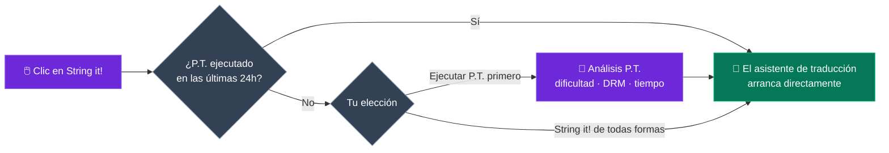
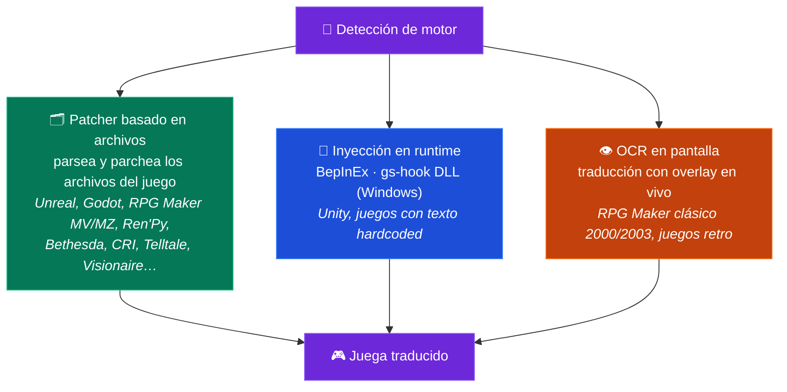

<p align="center">
  
</p>

<h1 align="center">GameStringer</h1>

<p align="center">
  <strong>Aplicación de escritorio que traduce videojuegos a cualquier idioma usando IA.</strong><br>
  Elige un juego de tu biblioteca, selecciona un idioma, pulsa traducir — listo.
</p>

<p align="center">
  <a href="https://www.gamestringer.ai"></a>
  <a href="https://discord.gg/SjnD3Z7Uf8"></a>
  
  
  
  
  
  
</p>

<p align="center">
  <a href="https://www.gamestringer.ai">Web</a> ·
  <a href="https://discord.gg/SjnD3Z7Uf8"><strong>💬 Discord</strong></a> ·
  <a href="#se-busca-ayuda"><strong>🙏 Se busca ayuda</strong></a> ·
  <a href="#-qué-es-gamestringer">Qué es</a> ·
  <a href="#-descarga">Descarga</a> ·
  <a href="#-cómo-funciona">Cómo funciona</a> ·
  <a href="#-el-prediction-tool-pt">P.T.</a> ·
  <a href="#-motores-de-juego-soportados">Motores</a> ·
  <a href="#-funciones">Funciones</a> ·
  <a href="#-compilar-desde-el-código-fuente">Build</a>
</p>

> ⚠️ **¿Actualizas desde la v1.8.x?** La v1.9.0 migró de Tauri v1 a **Tauri v2** — el auto-actualizador no funciona en este salto. Descarga la **v1.9.1** manualmente: [GameStringer_1.9.1_x64-setup.exe](https://github.com/rouges78/GameStringer/releases/download/v1.9.1/GameStringer_1.9.1_x64-setup.exe). Las futuras actualizaciones (v1.9.1 → v1.9.x) funcionarán automáticamente.

<p align="center">
  <strong>🌍 Disponible en 12 idiomas</strong> — cambia de idioma dentro de la app (IT, EN, ES, FR, DE, PT, PL, RU, JA, ZH, KO, EL) o en la <a href="https://www.gamestringer.ai">web</a> (11 idiomas).
</p>

<p align="center">
  <strong>🌍 Lee en tu idioma:</strong><br>
  <a href="README.md">🇬🇧 English</a> ·
  <a href="README_IT.md">🇮🇹 Italiano</a> ·
  🇪🇸 Español ·
  <a href="README_FR.md">🇫🇷 Français</a> ·
  <a href="README_DE.md">🇩🇪 Deutsch</a> ·
  <a href="README_PT.md">🇧🇷 Português</a> ·
  <a href="README_JA.md">🇯🇵 日本語</a> ·
  <a href="README_ZH.md">🇨🇳 中文</a> ·
  <a href="README_KO.md">🇰🇷 한국어</a> ·
  <a href="README_RU.md">🇷🇺 Русский</a> ·
  <a href="README_PL.md">🇵🇱 Polski</a>
</p>

---

> ### 💜 Una nota del desarrollador
>
> GameStringer lo construye **una sola persona — yo — y tengo Parkinson**, así que las actualizaciones a veces tardan más de lo que me gustaría. **Gracias por tu paciencia.** **No hago esto por dinero**: solo quiero cambiar la forma en que funciona la traducción de juegos y poner en manos de los jugadores una herramienta genuinamente útil. **El Discord ya está abierto** 🎉 — [ven a unirte](https://discord.gg/SjnD3Z7Uf8) para que podamos hablar, intercambiar ideas y mejorar GameStringer, juntos. 🙏
>
> — *Davide ([@rouges78](https://github.com/rouges78))*

---

<a name="se-busca-ayuda"></a>

## 🙏 Se busca ayuda — Pruébalo en juegos reales y envía feedback

> **GameStringer es un proyecto en solitario, source-available, y todavía es joven.** Ya reconoce 20+ motores (12 con parser dedicado), pero los juegos reales son un lío — cada título almacena su texto de forma un poco distinta. **Lo más útil que puedes hacer ahora mismo es ejecutar GameStringer en un juego real y contarme qué pasó.** Incluso un *"falló en el paso X"* vale oro.

**Por qué importa:** no puedo probar yo solo los miles de juegos que hay. Un **testing y feedback** continuos, del mundo real, son lo que convierte *"funciona en mis fixtures"* en *"funciona en tu juego."* Tus reportes moldean directamente la hoja de ruta — esta es la parte donde la comunidad hace o deshace el proyecto.

### 🧪 Tres formas de ayudar (elige cualquiera)

- **🎮 Prueba un juego y reporta.** Ejecútalo en algo de tu biblioteca y presenta un [reporte de compatibilidad](https://github.com/rouges78/GameStringer/discussions) rápido — ¿se detectó bien el motor? ¿se extrajo el texto? ¿se aplicó el parche y el juego sigue arrancando?
- **📦 Comparte un pack.** Si una traducción funciona, publícala en el **Patch Hub** de la app para que otros la usen — tu nombre queda en ella (reputación + "traductor verificado").
- **🛠️ Contribuye.** Nuevos parsers de motores, arreglos de locale, scripts de QA — busca `good first issue` en el repo.

### 📋 Qué necesitamos probar y sobre qué queremos feedback en especial

- [ ] **Cobertura de motores en títulos reales** — Unity (Mono **e** IL2CPP), Unreal (`.locres`, `_P.pak`, IoStore), Godot, RPG Maker **MV/MZ**, Ren'Py, Bethesda (BSA/BA2/ESP), CRI (CPK), Wolf RPG, TyranoScript, Visionaire, Danganronpa
- [ ] **RPG Maker clásico (2000/2003)** vía el **overlay OCR** en pantalla — ¿qué tan legible es el resultado?
- [ ] **Codificación y códigos de control** — ¿acentos/CJK correctos en el juego, y tags/variables del juego intactos?
- [ ] **Fuentes** — ¿los scripts no latinos (CJK, cirílico, griego) se renderizan en el juego, o hace falta un cambio de fuente?
- [ ] **Calidad de traducción por idioma** — ¿qué proveedor de IA da los mejores resultados para tu idioma/género?
- [ ] **Patch Hub** — publicación y descarga de packs `.gspack` de principio a fin
- [ ] **Onboarding y UX del primer arranque** — ¿fue claro cómo traducir tu primer juego? ¿qué te confundió?
- [ ] **Update tracker** — tras una actualización de la tienda, ¿marcó correctamente que hay que reaplicar el parche?

### 📝 Plantilla de reporte de compatibilidad (copiar-pegar)

```
- Juego / tienda / versión:
- Motor detectado (por GameStringer):
- Paso alcanzado: Scan / Detect / Extract / Translate / Patch / Jugado
- Resultado: ✅ funciona / ⚠️ parcial / ❌ falla
- Proveedor de IA usado:
- Idioma:
- Notas (qué se rompió, codificación, capturas):
- SO + versión de GameStringer:
```

**Dónde publicar:** [GitHub Discussions](https://github.com/rouges78/GameStringer/discussions) · el **Community Hub** de la app (Soporte / Showcase / Solicitudes) · bugs → [Issues](https://github.com/rouges78/GameStringer/issues).

GameStringer es gratuito y source-available; la web y los costes de la IA salen de mi propio bolsillo, así que si te ahorra tiempo un café se agradece pero **nunca** se espera: [Buy Me a Coffee](https://buymeacoffee.com/gamestringer) · [Ko-fi](https://ko-fi.com/gamestringer) · [GitHub Sponsors](https://github.com/sponsors/rouges78).

---

## 🎮 ¿Qué es GameStringer?

> **En pocas palabras:** elige un juego → elige tu idioma → pulsa un botón. GameStringer encuentra el texto del juego, lo traduce con IA y lo vuelve a poner — haciendo primero una copia de seguridad. Sin modding, sin línea de comandos, sin conocimientos técnicos.

GameStringer es una **aplicación de escritorio** (Windows, Linux y macOS) que te permite traducir videojuegos que no están en tu idioma.

La mayoría de los juegos almacenan su texto en archivos — JSON, XML, CSV, `.locres`, `.rpy`, BSA/BA2, CPK, StringTables de Unity Localization y muchos otros formatos. GameStringer **escanea la carpeta del juego**, encuentra esos archivos, envía el texto a través de un **proveedor de traducción IA** de tu elección (OpenAI, Claude, Gemini, DeepSeek, Ollama, 20+ más) y **aplica el texto traducido** al juego. Un clic, sin conocimientos técnicos necesarios.

Para **juegos Unity** que bloquean el texto dentro de assets compilados, GameStringer **instala automáticamente BepInEx + XUnity.AutoTranslator** — sin configuración manual. Para **juegos de Bethesda** (Skyrim, Fallout, Starfield) analiza BSA/BA2/ESP de forma nativa. Para **juegos con CRI Middleware** (Persona, Yakuza) gestiona CPK/CRILAYLA/MSG/BMD. Para **Unreal Engine** edita `.locres` directamente.

**No es un sitio web de traducción automática.** Es una pipeline completa: **analizar con P.T. → detectar motor → extraer texto → traducir con IA → control de calidad → aplicar parche → jugar.**

---

## 📥 Descarga

Obtén la última versión desde **[GitHub Releases](https://github.com/rouges78/GameStringer/releases)**:

| Plataforma | Archivo | Notas |
|----------|------|-------|
| **Windows** | `GameStringer_1.15.0_x64-setup.exe` | Instalador (recomendado) |
| **Windows** | `GameStringer_1.15.0_x64-portable.zip` | Sin instalación |
| **Windows** | `GameStringer_1.15.0_x64_en-US.msi` | Alternativa MSI |
| **macOS** | `GameStringer_1.15.0_x64.dmg` | Mac Intel |
| **macOS** | `GameStringer_1.15.0_aarch64.dmg` | Apple Silicon |
| **Linux** | `GameStringer_1.15.0_amd64.AppImage` | Universal (recomendado) |
| **Linux** | `GameStringer_1.15.0_amd64.deb` | Debian / Ubuntu |
| **Linux** | `GameStringer-1.15.0-1.x86_64.rpm` | Fedora / RHEL |

**Requisitos:** Windows 10+, macOS 10.15+ o Linux (Ubuntu 22.04+, Fedora 38+). 4 GB de RAM (8 GB+ para IA local), 500 MB de disco. Las actualizaciones están **firmadas criptográficamente** y se entregan vía Tauri Updater (la app verifica cada actualización contra una clave pública incluida).

> 🛡️ **¿Aviso del antivirus o de SmartScreen?** Es un conocido **falso positivo** — la traducción en tiempo de ejecución usa inyección de DLL (BepInEx / gs-hook), una técnica de la que los escáneres heurísticos desconfían, y cada nueva versión empieza con cero reputación en SmartScreen. **[Lee docs/ANTIVIRUS.md](docs/ANTIVIRUS.md)** para saber qué lo dispara, cómo verificar tu descarga y cómo reportar el falso positivo.

---

## 🚀 Cómo funciona

1. **Instala** GameStringer y ejecútalo
2. **Tu biblioteca de juegos se carga automáticamente** — Steam, Epic, GOG, Origin, Ubisoft, Amazon, itch.io, Humble App, Game Jolt, Big Fish (tus juegos instalados se detectan en segundos, sin límite de número)
3. **Elige un juego** → opcionalmente ejecuta **P.T. (Prediction Tool)** para ver dificultad, tiempo estimado, mejor cadena LLM
4. Haz clic en **"String it!"** — GameStringer escanea, extrae, traduce y aplica el parche automáticamente
5. **Juega en tu idioma** — siempre se crean copias de seguridad antes del parcheo

Eso es todo. Sin línea de comandos, sin edición manual de archivos, sin experiencia en modding.

### La pipeline de un vistazo


---

## 🧠 El Prediction Tool (P.T.)

> **La función más potente de GameStringer.** No empieces una traducción a ciegas — analiza primero.

P.T. es un motor de análisis profundo que se ejecuta *antes* de cualquier traducción. Escanea la carpeta del juego, detecta el motor, estima el volumen de texto traducible y te dice:

- **Difficulty Score 0–100** — peso combinado de volumen de cadenas, complejidad del motor, DRM, codificación, desafíos lingüísticos
- **Tiempo estimado** en **18 modelos LLM** — Ollama (Gemma 4, Qwen 3, Llama), OpenAI GPT-4/4o, Claude 3.5, Gemini, DeepL, DeepSeek, Groq
- **5 cadenas LLM recomendadas**: Local (privacidad), Cloud (calidad), Hybrid (equilibrada), Budget, Premium — cada una con puntuación de coste y calidad
- **Detección de DRM**: Denuvo, VMProtect, Steam DRM, EAC, BattlEye — te avisa antes de intentarlo
- **Análisis de codificación**: Shift-JIS, UTF-8, UTF-16, Big5, EUC-KR detectados por archivo
- **Complejidad de traducción**: honoríficos, concordancia de género, RTL, ruby/furigana, manejo específico de CJK
- **Puntuación de confianza** y **plan de workflow** — los pasos exactos que se ejecutarán al hacer clic en "String it!"
- **Exportar informe** (JSON + Markdown) para compartir o archivar

### P.T.Rank — Clasificación rápida

Tras ejecutar P.T. en varios juegos, abre **P.T.Rank** para ver todos los títulos analizados ordenados por dificultad. Perfecto para planificar tu cola de traducción: empieza por los fáciles, deja los RPG de cientos de miles de cadenas para el final.

### Dry Run Scanner

¿No quieres analizar un juego a la vez? Ejecuta **Dry Run** desde la página de Biblioteca para escanear **toda tu biblioteca instalada en lote**, sin límite de juegos,, con **cero modificaciones a los archivos**. Obtienes un informe JSON que categoriza cada juego como **Ready** (motor soportado + cadenas extraíbles), **Errors** (problemas del manifiesto / bloqueo DRM) o **Unsupported** (motor desconocido / sin texto). El progreso es en tiempo real y no se necesita copia de seguridad porque nada se toca.

### String it! Smart Gate

El botón **"String it!"** en la página de detalle del juego es inteligente: si el juego ya ha sido analizado por P.T. en las últimas 24h, lanza directamente el asistente de traducción. Si no, sugiere ejecutar primero P.T. (con elección de un clic "Run P.T. first" / "String it! anyway"). No más ejecuciones desperdiciadas en juegos que resultan estar bloqueados por DRM o ser asuntos de 5 minutos.



---

## 🎯 Motores de juego soportados

Una sola detección de motor, **tres caminos de traducción** — GameStringer elige automáticamente el mejor:



GameStringer tiene **12 motores con parser dedicado** y reconoce **más de 20** en total, con distintos niveles de profundidad:

| Motor | Soporte | Cómo funciona |
|--------|---------|--------------|
| **Unity** | ✅ Completo | Instala automáticamente BepInEx + XUnity.AutoTranslator + pipeline Unity Localization Package (StringTable, SharedTableData, Addressables, Smart Strings) |
| **Unreal Engine** | ✅ Completo | Extracción y parcheo `.locres` con UnrealLocres |
| **Unreal _P.pak** | ✅ Completo | Empaquetado de mod como `<GameStringer>_P.pak` cargado desde la carpeta Paks |
| **Godot** | ✅ Completo | Soporte nativo para archivos `.translation` |
| **RPG Maker** | ✅ Completo | MV/MZ JSON, VX/Ace vía Trans, XP vía RMXP |
| **Ren'Py** | ✅ Completo | Parseo nativo de scripts `.rpy` con detección de diálogos |
| **GameMaker** | ⚡ Parcial | Vía integración UndertaleModTool |
| **Telltale** | ✅ Completo | Soporte `.langdb` / `.dlog` |
| **Wolf RPG** | ✅ Completo | Integración WolfTrans |
| **Kirikiri** | ✅ Completo | Parseo `.ks` / `.scn` |
| **TyranoScript** | ✅ Completo | Extractor fast-path con parcheo JSON |
| **Electron** | ✅ Completo | Desempaquetado ASAR + detección de JSON i18n |
| **Bethesda (Skyrim/Fallout/Oblivion/Starfield)** | ✅ **NEW v1.9.0** | Parser BSA v103-105 + BA2 GNRL/DX10 + ESP/ESM (FULL/DESC/NAM1), STRINGS/DLSTRINGS/ILSTRINGS |
| **CRI Middleware (Persona/Yakuza/Tales of/Dragon Ball)** | ✅ **NEW v1.9.0** | CPK + CRILAYLA + MSG/BMD/FTD con auto-detección de Shift-JIS/UTF-8/UTF-16 |
| **Visionaire Studio** | ✅ Completo | Aventuras Daedalic (Deponia, Edna, etc.) |
| **Danganronpa WAD** | ✅ Completo | Parser de archivo WAD + parcheo de diálogos STX |

> **Los juegos Unity** reciben un trato especial: si no se encuentran archivos traducibles, GameStringer detecta que es un juego Unity y ofrece **instalar automáticamente BepInEx + XUnity.AutoTranslator** con un clic. Solo tienes que lanzar el juego una vez tras la instalación, luego volver a escanear — todo el texto pasa a ser traducible.
>
> ⚠️ **Advertencia Anti-Cheat**: BepInEx (inyección de DLL) puede disparar sistemas anti-cheat (EAC, BattlEye, Vanguard). GameStringer incluye detección anti-cheat y te avisará. **Úsalo solo en juegos single-player / offline.** P.T. detecta el DRM antes de cualquier modificación.

---

## ✨ Funciones

### 🆕 Novedades en v1.15.0 — parámetros de Ollama y Proyectos ↔ Patch Hub

- **🎚 Panel de parámetros de inferencia de Ollama** — ajusta las traducciones con Ollama local mediante los preajustes **Fiel / Equilibrado / Creativo**, o cambia al **modo experto** para controlar directamente temperature, top-p y el resto de ajustes de muestreo; la elección se integra de forma no invasiva en cada llamada de traducción de Ollama
- **🔗 Integración Proyectos ↔ Patch Hub** — **importa un `.gspack` como proyecto completado**, publica en el Hub **precargado desde el proyecto**, alterna el conmutador **Explorar / Mis parches** y **Aplicar al juego** con un clic (con copia de seguridad automática)
- **💬 Widget de feedback en la app** — envía comentarios o informa de un problema sin salir de la aplicación
- **⚡ Patch Hub más rápido** — **caché + limitación de tasa** de las respuestas para navegar y descargar con más fluidez bajo carga
- **🐛 Correcciones** — la webview de noticias RSS ya no se bloquea por CORS, además de una nueva pasada de **auditoría de accesibilidad WCAG 2.1 AA**

### 🆕 Novedades en v1.14.0 — compatibilidad comunitaria y packs a prueba de balas

- **🧭 Telemetría de compatibilidad (opt-in)** — el "ProtonDB de las traducciones": reporta si una traducción funcionó y ve **insignias de compatibilidad en las tarjetas de juego**, respaldadas por reportes de la comunidad con protecciones anti-abuso y una [página de estadísticas pública](https://gamestringer.ai/compatibilita.html)
- **🔤 Detección de glifos faltantes + arreglo automático de fuente** — GameStringer analiza el mapa de caracteres de la fuente del juego, detecta cuando faltan los glifos de tu idioma e **instala automáticamente una fuente Noto acorde** para los motores basados en archivos (Ren'Py, RPG Maker) — se acabaron los cuadraditos tofu en lugar de texto
- **🛡 Integridad de packs verificable** — los packs de la comunidad se verifican con un **SHA-256 agregado**, protección anti path-traversal y marcado automático de packs manipulados
- **💥 Reporte de fallos opt-in** — reportes anónimos con firmas de fallos recurrentes para que se arreglen más rápido
- **📚 Escaneo robusto de idiomas de la biblioteca** — detección más fiable de los idiomas que un juego ya incluye, más un botón manual "Detectar idiomas"
- **💬 Discord en marcha** — únete en [discord.gg/SjnD3Z7Uf8](https://discord.gg/SjnD3Z7Uf8)
- **🧪 Suite de regresión de parsers** — fixtures binarias compartidas (Godot, .locres, STX, RPG Maker, CRI CPK, Bethesda) ejercitadas tanto por los parsers de Rust como de TS; 2 bugs reales encontrados y corregidos
- **📰 Feed de noticias más limpio** — eliminado el ruido de diffs de MediaWiki, filtrados los posts de ofertas

### 🆕 Novedades en v1.13.0

- **🖥 Traductor UE en tiempo real marcado como experimental** — la herramienta en tiempo real de Unreal ahora declara por adelantado su estado experimental y comprueba que el juego esté realmente en ejecución antes de empezar
- **🎛 Controles de calidad en Ajustes** — interruptores para las nuevas funciones de calidad de traducción (reflection pass, recuperación semántica) más una allowlist de proveedores ampliada
- **🌐 Sitio + i18n** — sección v1.12.0 en el sitio con infografías y una nota del desarrollador, en 12 idiomas; claves `aiQuality` / `semantic` / `lore` reincorporadas en todos los locales
- **🐛 Correcciones** — CI ahora compila la release desde el branch actual en vez de un tag aún no creado; políticas INSERT del foro de Supabase recreadas bajo endurecimiento de RLS, con salida controlada del bridge; deduplicada la migración `20260626`

### 🆕 Novedades en v1.12.0 — traducciones más inteligentes y autocomprobadas

- **👁️ Traducción con contexto visual (VLM)** — para la traducción en vivo / en pantalla, un modelo de visión IA ahora *ve el fotograma* y traduce con ese contexto, así deja de adivinar en palabras ambiguas (¿*"Chest"* es un cofre o una parte del cuerpo?). Funciona con un modelo **local** (Ollama) o **OpenAI / Gemini**. Las capturas se recortan y redimensionan de forma nativa por velocidad.
- **🪞 Traducciones autocorrectivas (Reflection)** — tras traducir, GameStringer puede ejecutar una rápida segunda pasada que revisa su propio trabajo contra tu **glosario, tono y formato** y corrige solo las líneas que realmente lo necesitan. Selectivo por defecto, así se mantiene rápido y barato.
- **🧠 Memoria semántica (RAG)** — tu Translation Memory y glosario ahora se emparejan por **significado**, no solo por palabras exactas, así una frase que ya tradujiste se reutiliza aunque esté redactada de otra manera — manteniendo la terminología coherente en todo el juego. Totalmente local (embeddings de Ollama); recurre al emparejamiento por palabras clave si no está disponible.
- **⚡ Traducción en vivo más fluida** — pipeline del overlay en vivo reelaborada y manejo nativo de imágenes para un resultado en pantalla más rápido y limpio.
- **🔌 Más proveedores listos para usar** — allowlist ampliada para que más backends funcionen sin más: DeepL, Groq, Cerebras, Cohere, Together, Fireworks, Hugging Face, Azure Translator, DashScope, LibreTranslate, Lingva, MyMemory.

### 🆕 Novedades en v1.11.2

- **Más tiendas** — detección de instalaciones locales para **Humble App, Game Jolt y Big Fish Games**, además de los launchers existentes
- **Búsqueda de traducciones** — comprueba si un juego ya incluye tu idioma vía **PCGamingWiki**, más rápidos **enlaces de búsqueda de fan-patches italianos** desde la vista del juego
- **Publicar en el Patch Hub** — envía un proyecto completado al **Patch Hub** de la comunidad en un paso (`app/projects` → publish, reutiliza `publishPack`)
- **Vista general del Community Hub** — nuevo panel de aterrizaje con actividad reciente, últimos packs y categorías
- **Noticias de traducción italiana** — añadidos feeds RSS curados de fan-translation (Ctrl+Trad, OldGamesItalia, Romhacking.it, Language Pack Italia, Q-Gin, …)
- **String it! en todas partes** — enrutado de un clic para Unity/Unreal/Godot + una pipeline cloud para **TyranoScript**
- **Unity** — bridge **Ollama** local para XUnity (CustomTranslate); las descargas de BepInEx/XUnity/TMP/UABEA se resuelven desde la GitHub API
- **Godot** — parser `.pck` reescrito que lee archivos reales de **Godot 4.4+** (verificado en *Slay the Spire 2*)
- **Fiabilidad del escritorio** — eliminadas las últimas llamadas web `/api`: el editor usa la TM local, y las llamadas translate/export/voice/store pasan por el backend nativo

### 🆕 Novedades en v1.10.2

- **Arreglo del auto-actualizador** — resuelto un estado atascado en "Preparando…" en el que la actualización nunca empezaba a descargar. Se pasaba un objeto de update de React obsoleto a `downloadAndInstall` y el flag `updating` nunca se reseteaba; ahora el auto-update arranca, descarga e instala de forma fiable (`components/notifications/auto-updater.tsx`, `hooks/use-tauri-updater.ts`)
- **Persistencia fiable de ajustes** — los ajustes de la app y las API keys de los proveedores de IA ahora se guardan de forma fiable en disco (`data_dir/GameStringer/settings.json`) vía los comandos Tauri `save_app_settings` / `load_app_settings`; antes algunos ajustes no se persistían
- **Añadir juegos manualmente desde disco** — ahora puedes añadir un juego eligiendo su carpeta en disco, sin depender solo de la autodetección de la biblioteca (Steam/Epic/etc.) (`lib/manual-games.ts`, `app/library/page.tsx`)

### 🆕 Novedades en v1.9.1

- **Arreglo de CSP que bloqueaba Supabase** — el Community Chat se bloqueaba silenciosamente por la estricta Content Security Policy de Tauri v2. Añadidos `https://*.supabase.co` y `wss://*.supabase.co` a `connect-src`
- **Arreglo de auto-conexión del chat** — auth coordinada entre `main-layout` y `persistent-chat` vía eventos personalizados, eliminando condiciones de carrera
- **Arreglo de error de timeout** — una stale closure en el max-timeout provocaba un falso "Tiempo de carga demasiado largo" incluso cuando el chat cargaba correctamente
- **Builds de macOS** — DMG (Intel) y `.app.tar.gz` (Apple Silicon) ya disponibles

### 🆕 Novedades en v1.9.0

- **Presencia online unificada** — Supabase Realtime + fallback de DB, auto-away/auto-online, heartbeat cada 30s
- **Notificaciones del System Tray** — notificaciones nativas del SO para chat, traducciones, errores, actualizaciones, juegos, amigos, noticias con horas de silencio configurables
- **Error Boundaries + recuperación de fallos** — WidgetErrorBoundary (auto-retry 5s, máx 3), AppErrorBoundary con recarga
- **Resiliencia de red / modo offline** — monitor de red, barra de estado (rojo/ámbar/verde), retry con backoff exponencial, cola offline
- **Character Voice Profiles (Voice Cloning)** — extracción automática del estilo del personaje a partir de los diálogos, 16 tonos, prompt injection para traducciones coherentes
- **Infraestructura de Fine-Tuning** — datasets a partir de correcciones humanas (Adaptive MT), 4 formatos de exportación, gestión de modelos por juego con Ollama
- **Code Splitting / Lazy Loading** — 8 componentes pesados convertidos a React.lazy + Suspense para un arranque más rápido
- **Correcciones de bugs** — doble init de NetworkResilience + fuga de listener, Supabase 400 en user_profiles, cadenas de versión del tray, bypass de horas de silencio para notificaciones críticas

### 🤖 Traducción IA

- **20+ proveedores**: OpenAI, Claude, Gemini, DeepSeek, Mistral, Groq, DeepL, Ollama (local), LM Studio, TranslateGemma, HY-MT, Qwen 3, NLLB-200, Cerebras, Together AI, Fireworks, OpenRouter, Cohere, Lingva, MyMemory
- **Context-aware**: entiende el género del juego, la voz del personaje, el tono, narrativa vs UI vs diálogo
- **Translation Memory y Glosario**: consistencia en todo el proyecto con extracción automática de glosario
- **Auto-Select Engine** (NEW v1.7.0): preset `auto` que clasifica dinámicamente los proveedores por idioma de destino + género del juego (DeepL para europeos, Claude para CJK, boost basado en género)
- **Multi-LLM Compare**: ejecuta múltiples proveedores en paralelo, elige el mejor resultado por cadena
- **Quality gates**: puntuación QA automática en cada cadena traducida (0-100) con ContentTypeBadge
- **Vision LLM Translator**: usa capturas in-game para contexto (Ollama, Gemini, GPT-4o)
- **Live Quality Preview**: ve las puntuaciones de calidad en tiempo real durante la traducción por lotes
- **Soporte RTL**: detección automática de dirección y manejo del atributo `dir`

### 🧠 P.T. — Prediction Tool (v1.9.0)

- **Difficulty Score 0-100** con factores ponderados (volumen, motor, DRM, codificación, complejidad)
- **Estimaciones de tiempo para 18 modelos LLM** incluyendo Gemma 4 (27B MoE A4B / E4B / E2B)
- **5 cadenas LLM** (Local / Cloud / Hybrid / Budget / Premium) con estimaciones de coste y calidad
- **Detección de DRM / Anti-Cheat** (Denuvo, VMProtect, Steam DRM, EAC, BattlEye, Vanguard)
- **Análisis de codificación** por archivo (Shift-JIS, UTF-8/16, Big5, EUC-KR)
- **Análisis de complejidad de traducción** (honoríficos, género, CJK, ruby, RTL)
- **P.T.Rank / Quick Ranking** — ordena todos los juegos analizados por dificultad
- **Dry Run Scanner** — escaneo por lotes de toda tu biblioteca instalada, sin límite de juegos, sin modificación
- **Workflow Orchestrator** — motor de ejecución real con fast path universal para 6+ motores y progreso en tiempo real
- **Caché de predicción** (24h) — reapertura instantánea de juegos ya analizados
- **Exportar informe** (JSON + Markdown) para compartir y archivar

### 📚 Biblioteca de Juegos

- **Auto-detect**: Steam (con Family Sharing), Epic, GOG Galaxy, Origin/EA, Ubisoft Connect, Amazon Games, itch.io, Humble App, Game Jolt, Big Fish Games
- **Toda tu biblioteca instalada** reconocida en segundos, sin límite de juegos
- **Tarjetas de juego** con carátulas, metadatos, badge de motor, badge VR, estado de instalación
- **Acciones rápidas al pasar el cursor**: String it!, Batch, Community, P.T. — todas a un clic
- **Game Update Tracker**: detecta cuándo Steam actualiza un juego traducido (vía `buildid`), verifica la integridad del parche (archivos BepInEx, presencia de `_P.pak`), avisa si se necesita reparchar
- Botón **"Stop monitoring"** para dejar de rastrear un juego específico

### 🔧 Herramientas de Traducción

- **One-Click Translate** ("String it!"): escanear → traducir → parchear en un solo flujo
- **Batch Translation**: traduce juegos o carpetas enteras a la vez
- **Traductor de Subtítulos**: SRT, VTT, ASS/SSA con preservación de tiempos
- **OCR Translator**: extrae texto de juegos retro (presets 8-bit, 16-bit, DOS) con backend Tauri Tesseract real
- **Voice Pipeline**: speech-to-text → traducir → text-to-speech con **Duration Matching** (NEW v1.7.0) — ajusta automáticamente la velocidad para coincidir con la duración del audio original
- **Lip Sync** (NEW v1.7.0): integración Rhubarb para generación de visemas (A-X), timeline interactiva, exportación para Unity (blend shapes) y Unreal (FaceFX)
- **Gridly CSV Export/Import** (NEW v1.7.0): formato de columnas multi-idioma compatible con Gridly, Lokalise y Crowdin
- **Overlay en tiempo real**: ve traducciones mientras juegas vía VR/screen overlay
- **Auto-Translate Review**: botón "Translate all untranslated" con barra de progreso
- **Lore Assistant**: chat RAG que conoce el lore y los diálogos del juego
- **Character Voice Profiles**: define personalidad, tono, patrones de habla por personaje
- **Translation Confidence Heatmap**: visión general visual de la calidad de todas las traducciones

### 🎮 Patchers de motores de juego

- **Unity**: auto-instalador BepInEx + XUnity.AutoTranslator, Unity Localization Package (StringTable, SharedTableData, catálogo Addressables, validador Smart Strings)
- **Unreal Engine**: extracción `.locres` + empaquetado mod `_P.pak`
- **Bethesda Engine Patcher** (NEW v1.9.0): Skyrim LE/SE/AE, Fallout 3/NV/4, Oblivion, Starfield — BSA v103-105 + BA2 GNRL/DX10 + ESP/ESM (FULL/DESC/NAM1)
- **CRI Middleware Patcher** (NEW v1.9.0): Persona 5 Royal, Yakuza, Tales of, Dragon Ball — CPK + CRILAYLA + MSG/BMD/FTD
- **Ren'Py**, **RPG Maker**, **Godot**, **GameMaker**, **Kirikiri**, **Wolf RPG**, **Telltale**, **Visionaire**, **Danganronpa WAD** — todos con parsers nativos
- **Wizard Stepper**: UI multipaso compartida para todos los patchers
- **Universal PO Export** (gettext `.po`) para cada patcher con metadatos de proyecto/idioma/fuente/motor
- **Copia de seguridad automática**: antes de cada parche, con restauración de un clic

### 🔌 Avanzado

- **Auto-Hook Scanner**: escaneo de memoria de proceso (Windows WinAPI) para cadenas hardcoded
- **System Monitor**: uso de VRAM/RAM en tiempo real para planificar LLM local
- **Ollama Setup Wizard**: instalación paso a paso de IA local
- **Ollama Manager**: auto-discovery de modelos desde el registro de ollama.com + auto-refresh al enfocar/navegar
- **Debug Console**: consola integrada con log intercept
- **Video Extractor** (v1.7.0): extrae y convierte video FMV de juegos retro/modernos (VMD, BIK, SMK, USM, ROQ) con upscaling IA (Real-ESRGAN), enlace directo desde la página de detalle del juego
- **Plugin System**: documento de diseño para plugins de terceros (ver `docs/PLUGIN_SYSTEM.md`)
- **Community Hub**: comparte y descarga translation memories + integración con GitHub Discussions
- **Public API v1**: endpoints REST para integración (`/api/v1/translate`, `/api/v1/batch`)

### 💬 Community Chat

- **Chat en tiempo real** con otros traductores vía Supabase Realtime
- **4 salas por defecto**: General, Translations, Feedback & Bugs, Announcements
- **Salas personalizadas**: crea salas para juegos o proyectos específicos
- **Auto-Bridge Auth**: tu perfil de GameStringer se sincroniza automáticamente con Supabase — sin login extra
- **Presencia en línea**: ve quién está en cada sala
- **Responder / editar / borrar** mensajes con ownership aplicado por RLS
- **Widget drawer expandible** en la esquina inferior derecha

### ♿ Accesibilidad (v1.9.0)

- **WCAG 2.1 AA sweep** — `aria-label` en botones de icono, encabezados semánticos `CardTitle`, `focus-visible` en todas las primitivas, enlace skip-to-content, landmark `main`, helpers `sr-only` en italiano
- **`prefers-reduced-motion`** respetado en todas las animaciones
- **`forced-colors`** (Windows High Contrast Mode) respetado
- **UI en 12 idiomas**: IT, EN, ES, FR, DE, JA, ZH, KO, PT, RU, PL, EL (griego añadido en v1.10.0)
- **Soporte de layout RTL** con detección automática de dirección

### 🎨 Design System (v1.9.0)

- **Variantes de Card** vía `cva`: default, muted, highlight, success, error, warning
- **Tamaños de Button** incluyendo `xs` y `icon-sm`
- **Utilidades de texto**: `text-micro` (9px), `text-2xs` (10px) — se acabaron los valores arbitrarios de Tailwind
- **Radix UI unificado**: migrados 37 archivos de `@radix-ui/react-*` a `radix-ui`, 27 paquetes eliminados
- **Bundle optimizado**: `optimizePackageImports` para radix-ui, framer-motion, recharts, cmdk

### 🖥️ App

- **Auto-updates firmados**: actualización de un clic desde la app vía Tauri Updater
- **Perfiles**: múltiples perfiles de usuario con claves de recuperación
- **Global Hotkeys**: `Ctrl+Shift+T` OCR, `Ctrl+Shift+Q` Quick Translate, `Ctrl+Alt+O` Overlay, `Alt+T` toggle XUnity
- **System Tray**: acciones rápidas, estado Ollama en vivo, submenú de herramientas, notificaciones nativas del SO con preferencias
- **Cross-platform**: Windows, macOS y Linux con builds nativos
- **Fix tray Windows**: previene el bucle de flash de consola al spawn de procesos hijos

---

## 🔧 Proveedores de IA

| Proveedor | API Key | Free Tier | Mejor para |
|----------|---------|-----------|----------|
| **Ollama** | No (local) | ✅ Ilimitado | Privacidad, offline |
| **LM Studio** | No (local) | ✅ Ilimitado | Privacidad, modelos GGUF |
| **TranslateGemma** | No (Ollama) | ✅ Ilimitado — 55 idiomas, Google | **Inicio recomendado** |
| **HY-MT1.5** | No (Ollama) | ✅ Ilimitado — ~1GB RAM, Tencent | Máquinas con poca RAM |
| **Qwen 3** | No (Ollama) | ✅ Ilimitado — multilingüe | Idiomas CJK |
| **Gemma 4** | No (Ollama) | ✅ Ilimitado — 27B MoE A4B/E4B/E2B | Calidad local |
| **Gemini** | Sí | ✅ Free tier (15 RPM) | **Cloud recomendado** |
| **DeepSeek** | Sí | ✅ $0.14/1M input | Cloud económico |
| **Groq** | Sí | ✅ 14.400 req/día | Velocidad |
| **Mistral** | Sí | ✅ Free tier | Cloud UE |
| **OpenAI** | Sí | De pago | Calidad GPT-4o |
| **Claude** | Sí | De pago | Matices, contexto largo |
| **DeepL** | Sí | ✅ 500k caracteres/mes | Idiomas europeos |
| **MyMemory** | No | ✅ Ilimitado | Fallback |
| **Lingva** | No | ✅ Ilimitado | Mirror de Google MT |
| **Cerebras** | Sí | ✅ Free tier | Velocidad |
| **Together AI** | Sí | ✅ $25 de crédito gratis | Modelos abiertos |
| **Fireworks** | Sí | ✅ Free tier | Modelos abiertos |
| **OpenRouter** | Sí | ✅ Modelos gratis | Variedad de modelos |
| **NLLB-200** | Sí | ✅ 200 idiomas | Idiomas raros |
| **Cohere** | Sí | ✅ Prueba gratis | RAG |

**Recomendados para empezar**: **TranslateGemma** vía Ollama (gratis, local, 55 idiomas) o **Gemini** (free tier, cloud). Poca RAM: **HY-MT1.5** (~1GB). Mejor calidad: **Claude 3.5** o **GPT-4o**. Mejor CJK: **Qwen 3**.

---

## 📖 Documentación

### Guías de usuario (12 idiomas)

| | | |
|---|---|---|
| 🇮🇹 [Italiano](docs/GUIDA_UTENTE.md) | 🇬🇧 [English](docs/USER_GUIDE_EN.md) | 🇪🇸 [Español](docs/USER_GUIDE_ES.md) |
| 🇫🇷 [Français](docs/USER_GUIDE_FR.md) | 🇩🇪 [Deutsch](docs/USER_GUIDE_DE.md) | 🇯🇵 [日本語](docs/USER_GUIDE_JA.md) |
| 🇨🇳 [中文](docs/USER_GUIDE_ZH.md) | 🇰🇷 [한국어](docs/USER_GUIDE_KO.md) | 🇧🇷 [Português](docs/USER_GUIDE_PT.md) |
| 🇷🇺 [Русский](docs/USER_GUIDE_RU.md) | 🇵🇱 [Polski](docs/USER_GUIDE_PL.md) | 🇮🇷 [فارسی](docs/USER_GUIDE_FA.md) |

### Documentación del proyecto

- **[CHANGELOG.md](CHANGELOG.md)** — historial completo de versiones
- **[ROADMAP.md](ROADMAP.md)** — hoja de ruta priorizada (P0/P1/P2)
- **[docs/VERSIONING.md](docs/VERSIONING.md)** — política de versionado
- **[docs/PROJECT_STATUS.md](docs/PROJECT_STATUS.md)** — estado actual de un vistazo
- **[docs/ANTIVIRUS.md](docs/ANTIVIRUS.md)** — falsos positivos de antivirus / SmartScreen
- **[PLUGIN_SYSTEM.md](docs/PLUGIN_SYSTEM.md)** — diseño de arquitectura de plugins
- **[LICENSE](LICENSE)** — Source-Available License v1.1
- **[docs/LEGAL.md](docs/LEGAL.md)** — posición legal y política de uso aceptable

---

## 🛠️ Compilar desde el código fuente

**Prerrequisitos**: Node.js 18+, Rust 1.70+, npm. En Linux también: `libwebkit2gtk-4.1-dev`, `libayatana-appindicator3-dev`, `librsvg2-dev`.

```bash
git clone https://github.com/rouges78/GameStringer.git
cd GameStringer
npm install
npm run dev          # desarrollo
npm run tauri:build  # build de producción
```

Backend Rust: `cd src-tauri && cargo check` para verificar que los comandos Tauri compilan en tu plataforma.

---

## 💖 Apoyo

Si GameStringer te ayudó a jugar a juegos en tu idioma:

<p align="center">
  <a href="https://buymeacoffee.com/gamestringer">
    
  </a>
  <a href="https://ko-fi.com/gamestringer">
    
  </a>
  <a href="https://github.com/sponsors/rouges78">
    
  </a>
</p>

---

## 📜 Licencia

**Source-Available License v1.1** — el código fuente es público y puedes compilarlo tú mismo, pero no es "Open Source" aprobado por la OSI.

- ✅ Gratuito para uso personal
- ✅ Libre para inspeccionar, compilar y modificar para ti mismo
- ❌ El uso comercial requiere permiso por escrito
- ❌ La redistribución de versiones modificadas requiere permiso por escrito

Consulta [LICENSE](LICENSE) para más detalles, y **[docs/LEGAL.md](docs/LEGAL.md)** para la posición legal del proyecto y la política de uso aceptable. ¿Preguntas? Abre una [Discussion](https://github.com/rouges78/GameStringer/discussions).

---

## 🙏 Credits

- **[BepInEx](https://github.com/BepInEx/BepInEx)** — framework de modding para Unity (BepInEx Team)
- **[XUnity.AutoTranslator](https://github.com/bbepis/XUnity.AutoTranslator)** — framework de traducción para Unity (bbepis)
- **[UnrealLocres](https://github.com/akintos/UnrealLocres)** — parser `.locres` de Unreal (akintos)
- **[UndertaleModTool](https://github.com/krzys-h/UndertaleModTool)** — modding GameMaker (krzys-h)
- **[Tauri](https://tauri.app)** — framework para apps de escritorio
- **[Tesseract.js](https://github.com/naptha/tesseract.js)** — motor OCR
- **[Ollama](https://ollama.com)** — runtime LLM local
- **[Supabase](https://supabase.com)** — backend realtime para la Community Chat

---

<p align="center">
  Hecho con ❤️ para los gamers que quieren jugar en su propio idioma<br>
  <strong>GameStringer v1.15.0</strong> · <a href="https://www.gamestringer.ai">gamestringer.ai</a> · © 2025-2026 GameStringer Team
</p>
