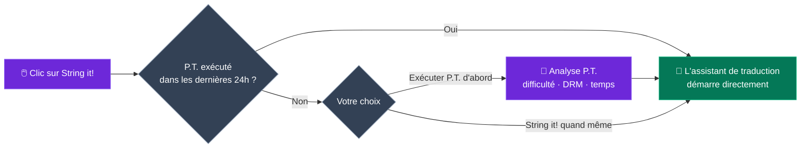
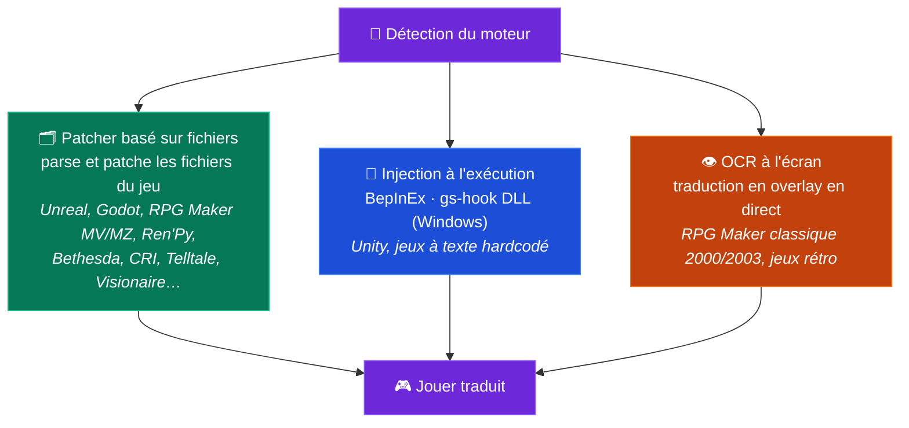

<p align="center">
  
</p>

<h1 align="center">GameStringer</h1>

<p align="center">
  <strong>Application de bureau qui traduit les jeux vidéo dans n'importe quelle langue grâce à l'IA.</strong><br>
  Choisissez un jeu dans votre bibliothèque, sélectionnez une langue, cliquez sur traduire — terminé.
</p>

<p align="center">
  <a href="https://www.gamestringer.ai"></a>
  <a href="https://discord.gg/SjnD3Z7Uf8"></a>
  
  
  
  
  
  
</p>

<p align="center">
  <a href="https://www.gamestringer.ai">Site web</a> ·
  <a href="https://discord.gg/SjnD3Z7Uf8"><strong>💬 Discord</strong></a> ·
  <a href="#aide-recherchée"><strong>🙏 Aide recherchée</strong></a> ·
  <a href="#-quest-ce-que-gamestringer">Présentation</a> ·
  <a href="#-téléchargement">Téléchargement</a> ·
  <a href="#-comment-ça-marche">Comment ça marche</a> ·
  <a href="#-le-prediction-tool-pt">P.T.</a> ·
  <a href="#-moteurs-de-jeu-pris-en-charge">Moteurs</a> ·
  <a href="#-fonctionnalités">Fonctionnalités</a> ·
  <a href="#-compilation-depuis-les-sources">Build</a>
</p>

> ⚠️ **Mise à jour depuis la v1.8.x ?** La v1.9.0 est passée de Tauri v1 à **Tauri v2** — l'auto-updater ne fonctionne pas pour ce saut. Téléchargez la **v1.9.1** manuellement : [GameStringer_1.9.1_x64-setup.exe](https://github.com/rouges78/GameStringer/releases/download/v1.9.1/GameStringer_1.9.1_x64-setup.exe). Les futures mises à jour (v1.9.1 → v1.9.x) fonctionneront automatiquement.

<p align="center">
  <strong>🌍 Disponible en 12 langues</strong> — changez de langue dans l'app (IT, EN, ES, FR, DE, PT, PL, RU, JA, ZH, KO, EL) ou sur le <a href="https://www.gamestringer.ai">site</a> (11 langues).
</p>

<p align="center">
  <strong>🌍 Lisez dans votre langue :</strong><br>
  <a href="README.md">🇬🇧 English</a> ·
  <a href="README_IT.md">🇮🇹 Italiano</a> ·
  <a href="README_ES.md">🇪🇸 Español</a> ·
  🇫🇷 Français ·
  <a href="README_DE.md">🇩🇪 Deutsch</a> ·
  <a href="README_PT.md">🇧🇷 Português</a> ·
  <a href="README_JA.md">🇯🇵 日本語</a> ·
  <a href="README_ZH.md">🇨🇳 中文</a> ·
  <a href="README_KO.md">🇰🇷 한국어</a> ·
  <a href="README_RU.md">🇷🇺 Русский</a> ·
  <a href="README_PL.md">🇵🇱 Polski</a>
</p>

---

> ### 💜 Un mot du développeur
>
> GameStringer est construit par **une seule personne — moi — et j'ai la maladie de Parkinson**, donc les mises à jour arrivent parfois plus lentement que je le voudrais. **Merci pour votre patience.** **Je ne fais pas ça pour l'argent** : je veux juste changer la façon dont fonctionne la traduction de jeux et mettre entre les mains des joueurs un outil vraiment utile. **Le Discord est désormais ouvert** 🎉 — [venez nous rejoindre](https://discord.gg/SjnD3Z7Uf8) pour qu'on puisse discuter, échanger des idées et améliorer GameStringer, ensemble. 🙏
>
> — *Davide ([@rouges78](https://github.com/rouges78))*

---

<a name="aide-recherchée"></a>

## 🙏 Aide recherchée — Testez-le sur de vrais jeux et envoyez du feedback

> **GameStringer est un projet solo, source-available, et encore jeune.** Il reconnaît déjà 20+ moteurs (12 avec parser dédié), mais les vrais jeux sont un désordre — chaque titre stocke son texte un peu différemment. **La chose la plus utile que vous puissiez faire maintenant est de lancer GameStringer sur un vrai jeu et de me raconter ce qui s'est passé.** Même un *« ça a échoué à l'étape X »* vaut de l'or.

**Pourquoi c'est important :** je ne peux pas tester seul les milliers de jeux qui existent. Un **test et un feedback** continus, sur le terrain, sont ce qui transforme *« ça marche sur mes fixtures »* en *« ça marche sur votre jeu. »* Vos rapports façonnent directement la feuille de route — c'est là que la communauté fait ou défait le projet.

### 🧪 Trois façons d'aider (choisissez-en une)

- **🎮 Testez un jeu et signalez.** Lancez-le sur quelque chose de votre bibliothèque et déposez un rapide [rapport de compatibilité](https://github.com/rouges78/GameStringer/discussions) — le moteur a-t-il été correctement détecté ? le texte a-t-il été extrait ? le patch s'est-il appliqué et le jeu démarre-t-il encore ?
- **📦 Partagez un pack.** Si une traduction fonctionne, publiez-la dans le **Patch Hub** intégré pour que d'autres l'utilisent — votre nom y figure (réputation + « traducteur vérifié »).
- **🛠️ Contribuez.** Nouveaux parsers de moteurs, corrections de locale, scripts de QA — cherchez `good first issue` dans le repo.

### 📋 Ce que nous voulons surtout voir testé et commenté

- [ ] **Couverture des moteurs sur de vrais titres** — Unity (Mono **et** IL2CPP), Unreal (`.locres`, `_P.pak`, IoStore), Godot, RPG Maker **MV/MZ**, Ren'Py, Bethesda (BSA/BA2/ESP), CRI (CPK), Wolf RPG, TyranoScript, Visionaire, Danganronpa
- [ ] **RPG Maker classique (2000/2003)** via l'**overlay OCR** à l'écran — le résultat est-il lisible ?
- [ ] **Encodage et codes de contrôle** — accents/CJK corrects en jeu, et tags/variables du jeu laissés intacts ?
- [ ] **Polices** — les scripts non latins (CJK, cyrillique, grec) s'affichent-ils en jeu, ou faut-il un changement de police ?
- [ ] **Qualité de traduction par langue** — quel fournisseur d'IA donne les meilleurs résultats pour votre langue/genre ?
- [ ] **Patch Hub** — publication et téléchargement de packs `.gspack` de bout en bout
- [ ] **Onboarding et UX au premier lancement** — était-ce clair comment traduire votre premier jeu ? qu'est-ce qui vous a perturbé ?
- [ ] **Update tracker** — après une mise à jour du store, a-t-il correctement signalé qu'il faut réappliquer le patch ?

### 📝 Modèle de rapport de compatibilité (copier-coller)

```
- Jeu / store / version :
- Moteur détecté (par GameStringer) :
- Étape atteinte : Scan / Detect / Extract / Translate / Patch / Joué
- Résultat : ✅ fonctionne / ⚠️ partiel / ❌ échoue
- Fournisseur d'IA utilisé :
- Langue :
- Notes (ce qui a cassé, encodage, captures) :
- OS + version de GameStringer :
```

**Où poster :** [GitHub Discussions](https://github.com/rouges78/GameStringer/discussions) · le **Community Hub** intégré (Support / Showcase / Demandes) · bugs → [Issues](https://github.com/rouges78/GameStringer/issues).

GameStringer est gratuit et source-available ; le site et les coûts de l'IA sortent de ma poche, donc s'il vous fait gagner du temps un café est apprécié mais **jamais** attendu : [Buy Me a Coffee](https://buymeacoffee.com/gamestringer) · [Ko-fi](https://ko-fi.com/gamestringer) · [GitHub Sponsors](https://github.com/sponsors/rouges78).

---

## 🎮 Qu'est-ce que GameStringer ?

> **En termes simples :** choisissez un jeu → choisissez votre langue → cliquez sur un bouton. GameStringer trouve le texte du jeu, le traduit avec l'IA et le remet en place — en faisant d'abord une sauvegarde. Pas de modding, pas de ligne de commande, aucune connaissance technique.

GameStringer est une **application de bureau** (Windows, Linux et macOS) qui vous permet de traduire les jeux vidéo qui n'existent pas dans votre langue.

La plupart des jeux stockent leur texte dans des fichiers — JSON, XML, CSV, `.locres`, `.rpy`, BSA/BA2, CPK, StringTables d'Unity Localization et beaucoup d'autres formats. GameStringer **scanne le dossier du jeu**, trouve ces fichiers, envoie le texte via un **fournisseur de traduction IA** de votre choix (OpenAI, Claude, Gemini, DeepSeek, Ollama, et 20+ autres) et **applique le texte traduit** dans le jeu. Un clic, aucune connaissance technique requise.

Pour les **jeux Unity** qui verrouillent le texte dans des assets compilés, GameStringer **installe automatiquement BepInEx + XUnity.AutoTranslator** — sans configuration manuelle. Pour les **jeux Bethesda** (Skyrim, Fallout, Starfield), il parse nativement BSA/BA2/ESP. Pour les **jeux CRI Middleware** (Persona, Yakuza), il gère CPK/CRILAYLA/MSG/BMD. Pour **Unreal Engine**, il édite les `.locres` directement.

**Ce n'est pas un site de traduction automatique.** C'est un pipeline complet : **analyse avec P.T. → détection du moteur → extraction du texte → traduction IA → contrôle qualité → application du patch → jouer.**

---

## 📥 Téléchargement

Obtenez la dernière version depuis **[GitHub Releases](https://github.com/rouges78/GameStringer/releases)** :

| Plateforme | Fichier | Notes |
|----------|------|-------|
| **Windows** | `GameStringer_1.15.0_x64-setup.exe` | Installeur (recommandé) |
| **Windows** | `GameStringer_1.15.0_x64-portable.zip` | Sans installation |
| **Windows** | `GameStringer_1.15.0_x64_en-US.msi` | Alternative MSI |
| **macOS** | `GameStringer_1.15.0_x64.dmg` | Mac Intel |
| **macOS** | `GameStringer_1.15.0_aarch64.dmg` | Apple Silicon |
| **Linux** | `GameStringer_1.15.0_amd64.AppImage` | Universel (recommandé) |
| **Linux** | `GameStringer_1.15.0_amd64.deb` | Debian / Ubuntu |
| **Linux** | `GameStringer-1.15.0-1.x86_64.rpm` | Fedora / RHEL |

**Prérequis :** Windows 10+, macOS 10.15+ ou Linux (Ubuntu 22.04+, Fedora 38+). 4 Go de RAM (8 Go+ pour l'IA locale), 500 Mo de disque. Les mises à jour sont **signées cryptographiquement** et distribuées via Tauri Updater (l'app vérifie chaque mise à jour avec une clé publique intégrée).

> 🛡️ **Avertissement de l'antivirus ou de SmartScreen ?** C'est un **faux positif** connu — la traduction à l'exécution utilise l'injection de DLL (BepInEx / gs-hook), une technique dont les scanners heuristiques se méfient, et chaque nouvelle version démarre avec zéro réputation SmartScreen. **[Lisez docs/ANTIVIRUS.md](docs/ANTIVIRUS.md)** pour savoir ce qui le déclenche, comment vérifier votre téléchargement et comment signaler le faux positif.

---

## 🚀 Comment ça marche

1. **Installez** GameStringer et lancez-le
2. **Votre bibliothèque de jeux se charge automatiquement** — Steam, Epic, GOG, Origin, Ubisoft, Amazon, itch.io, Humble App, Game Jolt, Big Fish (vos jeux installés sont détectés en quelques secondes, sans limite de nombre)
3. **Choisissez un jeu** → lancez éventuellement **P.T. (Prediction Tool)** pour voir la difficulté, le temps estimé, la meilleure chaîne LLM
4. Cliquez sur **« String it! »** — GameStringer scanne, extrait, traduit et applique le patch automatiquement
5. **Jouez dans votre langue** — des sauvegardes sont toujours créées avant le patch

C'est tout. Pas de ligne de commande, pas d'édition manuelle de fichiers, pas d'expérience de modding requise.

### Le pipeline en un coup d'œil


---

## 🧠 Le Prediction Tool (P.T.)

> **La fonctionnalité la plus puissante de GameStringer.** Ne commencez pas une traduction à l'aveugle — analysez d'abord.

P.T. est un moteur d'analyse approfondie qui s'exécute *avant* toute traduction. Il scanne le dossier du jeu, détecte le moteur, estime le volume de texte traduisible et vous indique :

- **Difficulty Score 0–100** — poids combiné du volume de chaînes, de la complexité du moteur, du DRM, de l'encodage, des défis linguistiques
- **Temps estimé** sur **18 modèles LLM** — Ollama (Gemma 4, Qwen 3, Llama), OpenAI GPT-4/4o, Claude 3.5, Gemini, DeepL, DeepSeek, Groq
- **5 chaînes LLM recommandées** : Local (confidentialité), Cloud (qualité), Hybrid (équilibrée), Budget, Premium — chacune avec score de coût et qualité
- **Détection DRM** : Denuvo, VMProtect, Steam DRM, EAC, BattlEye — vous avertit avant d'essayer
- **Analyse d'encodage** : Shift-JIS, UTF-8, UTF-16, Big5, EUC-KR détectés fichier par fichier
- **Complexité de traduction** : formes honorifiques, accord de genre, RTL, ruby/furigana, traitement spécifique CJK
- **Score de confiance** et **plan de workflow** — les étapes exactes qui seront exécutées en cliquant sur « String it! »
- **Export du rapport** (JSON + Markdown) pour partage ou archivage

### P.T.Rank — Classement rapide

Après avoir exécuté P.T. sur plusieurs jeux, ouvrez **P.T.Rank** pour voir tous les titres analysés triés par difficulté. Idéal pour planifier votre file de traduction : commencez par les plus faciles, gardez les RPG de centaines de milliers de chaînes pour la fin.

### Dry Run Scanner

Vous ne voulez pas analyser un jeu à la fois ? Lancez **Dry Run** depuis la page Bibliothèque pour scanner **toute votre bibliothèque installée en lot**, sans limite de nombre de jeux,, avec **zéro modification de fichier**. Vous obtenez un rapport JSON qui catégorise chaque jeu en **Ready** (moteur supporté + chaînes extractibles), **Errors** (problèmes de manifest / blocage DRM) ou **Unsupported** (moteur inconnu / pas de texte). La progression est en temps réel et aucune sauvegarde n'est nécessaire puisque rien n'est touché.

### String it! Smart Gate

Le bouton **« String it! »** sur la page de détail du jeu est intelligent : si le jeu a déjà été analysé par P.T. dans les dernières 24h, il lance directement l'assistant de traduction. Sinon, il suggère d'exécuter P.T. d'abord (avec le choix en un clic « Run P.T. first » / « String it! anyway »). Plus d'exécutions gaspillées sur des jeux qui s'avèrent verrouillés par DRM ou des affaires de 5 minutes.



---

## 🎯 Moteurs de jeu pris en charge

Une seule détection du moteur, **trois voies de traduction** — GameStringer choisit automatiquement la meilleure :



GameStringer dispose de **12 moteurs avec parser dédié** et en reconnaît **plus de 20** au total, avec différents niveaux de profondeur :

| Moteur | Support | Comment ça marche |
|--------|---------|--------------|
| **Unity** | ✅ Complet | Installe automatiquement BepInEx + XUnity.AutoTranslator + pipeline Unity Localization Package (StringTable, SharedTableData, Addressables, Smart Strings) |
| **Unreal Engine** | ✅ Complet | Extraction et patching `.locres` avec UnrealLocres |
| **Unreal _P.pak** | ✅ Complet | Empaquetage du mod en `<GameStringer>_P.pak` chargé via le dossier Paks |
| **Godot** | ✅ Complet | Support natif des fichiers `.translation` |
| **RPG Maker** | ✅ Complet | MV/MZ JSON, VX/Ace via Trans, XP via RMXP |
| **Ren'Py** | ✅ Complet | Parsing natif des scripts `.rpy` avec détection de dialogues |
| **GameMaker** | ⚡ Partiel | Via intégration UndertaleModTool |
| **Telltale** | ✅ Complet | Support `.langdb` / `.dlog` |
| **Wolf RPG** | ✅ Complet | Intégration WolfTrans |
| **Kirikiri** | ✅ Complet | Parsing `.ks` / `.scn` |
| **TyranoScript** | ✅ Complet | Extracteur fast-path avec patching JSON |
| **Electron** | ✅ Complet | Dépaquetage ASAR + détection JSON i18n |
| **Bethesda (Skyrim/Fallout/Oblivion/Starfield)** | ✅ **NEW v1.9.0** | Parser BSA v103-105 + BA2 GNRL/DX10 + ESP/ESM (FULL/DESC/NAM1), STRINGS/DLSTRINGS/ILSTRINGS |
| **CRI Middleware (Persona/Yakuza/Tales of/Dragon Ball)** | ✅ **NEW v1.9.0** | CPK + CRILAYLA + MSG/BMD/FTD avec auto-détection Shift-JIS/UTF-8/UTF-16 |
| **Visionaire Studio** | ✅ Complet | Aventures Daedalic (Deponia, Edna, etc.) |
| **Danganronpa WAD** | ✅ Complet | Parser d'archive WAD + patching des dialogues STX |

> **Les jeux Unity** bénéficient d'un traitement spécial : si aucun fichier traduisible n'est trouvé, GameStringer détecte qu'il s'agit d'un jeu Unity et propose d'**installer automatiquement BepInEx + XUnity.AutoTranslator** en un clic. Il suffit de lancer le jeu une fois après l'installation, puis de re-scanner — tout le texte devient traduisible.
>
> ⚠️ **Avertissement Anti-Cheat** : BepInEx (injection DLL) peut déclencher les systèmes anti-cheat (EAC, BattlEye, Vanguard). GameStringer inclut une détection anti-cheat et vous avertira. **À utiliser uniquement sur des jeux solo / hors ligne.** P.T. détecte le DRM avant toute modification.

---

## ✨ Fonctionnalités

### 🆕 Nouveautés de la v1.15.0 — paramètres Ollama et Projets ↔ Patch Hub

- **🎚 Panneau de paramètres d'inférence Ollama** — affinez les traductions avec Ollama local grâce aux préréglages **Fidèle / Équilibré / Créatif**, ou passez en **mode expert** pour contrôler directement temperature, top-p et les autres réglages d'échantillonnage ; le choix est câblé de façon non invasive sur chaque appel de traduction Ollama
- **🔗 Intégration Projets ↔ Patch Hub** — **importez un `.gspack` comme projet terminé**, publiez sur le Hub **pré-rempli depuis un projet**, basculez le sélecteur **Explorer / Mes patchs** et **Appliquer au jeu** en un clic (avec sauvegarde automatique)
- **💬 Widget de retour dans l'app** — envoyez un retour ou signalez un problème sans quitter l'application
- **⚡ Patch Hub plus rapide** — **mise en cache + limitation de débit** des réponses pour une navigation et des téléchargements plus fluides en charge
- **🐛 Corrections** — la webview des actualités RSS n'est plus bloquée par le CORS, plus une nouvelle passe d'**audit d'accessibilité WCAG 2.1 AA**

### 🆕 Nouveautés de la v1.14.0 — compatibilité communautaire et packs à toute épreuve

- **🧭 Télémétrie de compatibilité (opt-in)** — le « ProtonDB des traductions » : signalez si une traduction a fonctionné et voyez des **badges de compatibilité sur les cartes de jeu**, appuyés par des rapports de la communauté avec garde-fous anti-abus et une [page de statistiques publique](https://gamestringer.ai/compatibilita.html)
- **🔤 Détection de glyphes manquants + correction automatique de police** — GameStringer analyse la table de caractères de la police du jeu, détecte quand les glyphes de votre langue manquent et **installe automatiquement une police Noto adaptée** pour les moteurs basés sur fichiers (Ren'Py, RPG Maker) — fini les carrés tofu à la place du texte
- **🛡 Intégrité de packs vérifiable** — les packs de la communauté sont vérifiés avec un **SHA-256 agrégé**, une protection contre le path-traversal et un marquage automatique des packs falsifiés
- **💥 Rapport de plantage opt-in** — rapports anonymes avec signatures de plantages récurrents pour des corrections plus rapides
- **📚 Scan robuste des langues de la bibliothèque** — détection plus fiable des langues déjà incluses dans un jeu, plus un bouton manuel « Détecter les langues »
- **💬 Discord est en ligne** — rejoignez [discord.gg/SjnD3Z7Uf8](https://discord.gg/SjnD3Z7Uf8)
- **🧪 Suite de régression des parsers** — fixtures binaires partagées (Godot, .locres, STX, RPG Maker, CRI CPK, Bethesda) exercées à la fois par les parsers Rust et TS ; 2 vrais bugs trouvés et corrigés
- **📰 Fil d'actualités plus propre** — bruit des diffs MediaWiki supprimé, posts de promotions filtrés

### 🆕 Nouveautés de la v1.13.0

- **🖥 Traducteur UE en temps réel marqué expérimental** — l'outil temps réel pour Unreal annonce désormais son statut expérimental d'entrée et vérifie que le jeu est bien en cours d'exécution avant de démarrer
- **🎛 Contrôles de qualité dans les Paramètres** — interrupteurs pour les nouvelles fonctions de qualité de traduction (reflection pass, récupération sémantique) plus une allowlist de fournisseurs élargie
- **🌐 Site + i18n** — section v1.12.0 sur le site avec infographies et une note du développeur, en 12 langues ; clés `aiQuality` / `semantic` / `lore` réintégrées dans toutes les locales
- **🐛 Corrections** — la CI compile désormais la release depuis le branch courant au lieu d'un tag pas encore créé ; politiques INSERT du forum Supabase recréées sous renforcement RLS, avec sortie contrôlée du bridge ; migration `20260626` dédupliquée

### 🆕 Nouveautés de la v1.12.0 — traductions plus intelligentes et auto-vérifiées

- **👁️ Traduction avec contexte visuel (VLM)** — pour la traduction en direct / à l'écran, un modèle de vision IA *voit désormais l'image* et traduit avec ce contexte, pour ne plus deviner sur les mots ambigus (*« Chest »* est-il un coffre ou une partie du corps ?). Fonctionne avec un modèle **local** (Ollama) ou **OpenAI / Gemini**. Les captures sont recadrées et redimensionnées nativement pour la vitesse.
- **🪞 Traductions auto-correctives (Reflection)** — après avoir traduit, GameStringer peut lancer une rapide seconde passe qui revoit son propre travail par rapport à votre **glossaire, ton et formatage** et ne corrige que les lignes qui en ont vraiment besoin. Sélectif par défaut, donc rapide et économique.
- **🧠 Mémoire sémantique (RAG)** — votre Translation Memory et votre glossaire sont désormais rapprochés par **sens**, pas seulement par mots exacts, donc une phrase déjà traduite est réutilisée même formulée différemment — pour une terminologie cohérente dans tout le jeu. Entièrement local (embeddings Ollama) ; repli sur la correspondance par mots-clés si indisponible.
- **⚡ Traduction en direct plus fluide** — pipeline de l'overlay en direct retravaillée et gestion native des images pour un résultat à l'écran plus rapide et plus net.
- **🔌 Plus de fournisseurs prêts à l'emploi** — allowlist élargie pour que plus de backends fonctionnent directement : DeepL, Groq, Cerebras, Cohere, Together, Fireworks, Hugging Face, Azure Translator, DashScope, LibreTranslate, Lingva, MyMemory.

### 🆕 Nouveautés de la v1.11.2

- **Plus de stores** — détection des installations locales pour **Humble App, Game Jolt et Big Fish Games**, en plus des launchers existants
- **Recherche de traductions** — vérifiez si un jeu inclut déjà votre langue via **PCGamingWiki**, plus des **liens de recherche de fan-patches italiens** rapides depuis la vue du jeu
- **Publier sur le Patch Hub** — envoyez un projet terminé au **Patch Hub** de la communauté en une étape (`app/projects` → publish, réutilise `publishPack`)
- **Aperçu du Community Hub** — nouveau panneau d'accueil avec activité récente, derniers packs et catégories
- **Actualités de traduction italienne** — ajout de flux RSS curatés de fan-translation (Ctrl+Trad, OldGamesItalia, Romhacking.it, Language Pack Italia, Q-Gin, …)
- **String it! partout** — routage en un clic pour Unity/Unreal/Godot + un pipeline cloud pour **TyranoScript**
- **Unity** — bridge **Ollama** local pour XUnity (CustomTranslate) ; les téléchargements de BepInEx/XUnity/TMP/UABEA se résolvent depuis la GitHub API
- **Godot** — parser `.pck` réécrit qui lit de vraies archives **Godot 4.4+** (vérifié sur *Slay the Spire 2*)
- **Fiabilité du bureau** — suppression des derniers appels web `/api` : l'éditeur utilise la TM locale, et les appels translate/export/voice/store passent par le backend natif

### 🆕 Nouveautés de la v1.10.2

- **Correction de l'auto-updater** — résolution d'un état bloqué « Préparation… » où la mise à jour ne démarrait jamais le téléchargement. Un objet d'update React périmé était passé à `downloadAndInstall` et le flag `updating` n'était jamais réinitialisé ; désormais l'auto-update démarre, télécharge et installe de façon fiable (`components/notifications/auto-updater.tsx`, `hooks/use-tauri-updater.ts`)
- **Persistance fiable des paramètres** — les paramètres de l'app et les clés API des fournisseurs d'IA sont désormais enregistrés de façon fiable sur le disque (`data_dir/GameStringer/settings.json`) via les commandes Tauri `save_app_settings` / `load_app_settings` ; auparavant certains paramètres n'étaient pas persistés
- **Ajouter des jeux manuellement depuis le disque** — vous pouvez désormais ajouter un jeu en choisissant son dossier sur le disque, sans dépendre uniquement de l'auto-détection de la bibliothèque (Steam/Epic/etc.) (`lib/manual-games.ts`, `app/library/page.tsx`)

### 🆕 Nouveautés de la v1.9.1

- **Correction de la CSP qui bloquait Supabase** — le Community Chat était silencieusement bloqué par la stricte Content Security Policy de Tauri v2. Ajout de `https://*.supabase.co` et `wss://*.supabase.co` à `connect-src`
- **Correction de l'auto-connexion du chat** — auth coordonnée entre `main-layout` et `persistent-chat` via des événements personnalisés, éliminant les conditions de course
- **Correction de l'erreur de timeout** — une stale closure dans le max-timeout provoquait un faux « Temps de chargement trop long » même quand le chat se chargeait correctement
- **Builds macOS** — DMG (Intel) et `.app.tar.gz` (Apple Silicon) désormais disponibles

### 🆕 Nouveautés de la v1.9.0

- **Présence en ligne unifiée** — Supabase Realtime + fallback DB, auto-away/auto-online, heartbeat toutes les 30s
- **Notifications System Tray** — notifications OS natives pour chat, traductions, erreurs, mises à jour, jeux, amis, actualités avec heures silencieuses configurables
- **Error Boundaries + récupération de plantage** — WidgetErrorBoundary (auto-retry 5s, max 3), AppErrorBoundary avec rechargement
- **Résilience réseau / mode hors ligne** — moniteur réseau, barre d'état (rouge/ambre/vert), retry avec backoff exponentiel, file d'attente hors ligne
- **Character Voice Profiles (Voice Cloning)** — extraction automatique du style du personnage à partir des dialogues, 16 tons, prompt injection pour des traductions cohérentes
- **Infrastructure de Fine-Tuning** — datasets à partir des corrections humaines (Adaptive MT), 4 formats d'export, gestion de modèles par jeu avec Ollama
- **Code Splitting / Lazy Loading** — 8 composants lourds convertis en React.lazy + Suspense pour un démarrage plus rapide
- **Corrections de bugs** — double init de NetworkResilience + fuite de listener, Supabase 400 sur user_profiles, chaînes de version du tray, contournement des heures silencieuses pour les notifications critiques

### 🤖 Traduction IA

- **20+ fournisseurs** : OpenAI, Claude, Gemini, DeepSeek, Mistral, Groq, DeepL, Ollama (local), LM Studio, TranslateGemma, HY-MT, Qwen 3, NLLB-200, Cerebras, Together AI, Fireworks, OpenRouter, Cohere, Lingva, MyMemory
- **Context-aware** : comprend le genre du jeu, la voix du personnage, le ton, narration vs UI vs dialogue
- **Translation Memory et Glossaire** : cohérence sur tout le projet avec extraction automatique de glossaire
- **Auto-Select Engine** (NEW v1.7.0) : preset `auto` qui classe dynamiquement les fournisseurs par langue cible + genre du jeu (DeepL pour les européennes, Claude pour CJK, boost basé sur le genre)
- **Multi-LLM Compare** : exécute plusieurs fournisseurs en parallèle, choisissez le meilleur résultat par chaîne
- **Quality gates** : score QA automatique sur chaque chaîne traduite (0-100) avec ContentTypeBadge
- **Vision LLM Translator** : utilise des captures en jeu pour le contexte (Ollama, Gemini, GPT-4o)
- **Live Quality Preview** : voyez les scores de qualité en temps réel pendant la traduction par lot
- **Support RTL** : détection automatique de direction et gestion de l'attribut `dir`

### 🧠 P.T. — Prediction Tool (v1.9.0)

- **Difficulty Score 0-100** avec facteurs pondérés (volume, moteur, DRM, encodage, complexité)
- **Estimations de temps pour 18 modèles LLM** incluant Gemma 4 (27B MoE A4B / E4B / E2B)
- **5 chaînes LLM** (Local / Cloud / Hybrid / Budget / Premium) avec estimations de coût et qualité
- **Détection DRM / Anti-Cheat** (Denuvo, VMProtect, Steam DRM, EAC, BattlEye, Vanguard)
- **Analyse d'encodage** fichier par fichier (Shift-JIS, UTF-8/16, Big5, EUC-KR)
- **Analyse de complexité de traduction** (honorifiques, genre, CJK, ruby, RTL)
- **P.T.Rank / Quick Ranking** — trie tous les jeux analysés par difficulté
- **Dry Run Scanner** — scan par lot de toute votre bibliothèque installée, sans limite de nombre de jeux, sans modification
- **Workflow Orchestrator** — moteur d'exécution réel avec fast path universel pour 6+ moteurs et progression en temps réel
- **Cache de prédiction** (24h) — réouverture instantanée des jeux déjà analysés
- **Export du rapport** (JSON + Markdown) pour partage et archivage

### 📚 Bibliothèque de jeux

- **Auto-detect** : Steam (avec Family Sharing), Epic, GOG Galaxy, Origin/EA, Ubisoft Connect, Amazon Games, itch.io, Humble App, Game Jolt, Big Fish Games
- **Toute votre bibliothèque installée** reconnue en quelques secondes, sans limite de nombre de jeux
- **Cartes de jeux** avec jaquettes, métadonnées, badge moteur, badge VR, statut d'installation
- **Actions rapides au survol** : String it!, Batch, Community, P.T. — toutes en un clic
- **Game Update Tracker** : détecte quand Steam met à jour un jeu traduit (via `buildid`), vérifie l'intégrité du patch (fichiers BepInEx, présence de `_P.pak`), avertit si un re-patch est nécessaire
- Bouton **« Stop monitoring »** pour arrêter le suivi d'un jeu spécifique

### 🔧 Outils de traduction

- **One-Click Translate** (« String it! ») : scan → traduction → patch en un seul flux
- **Batch Translation** : traduisez des jeux ou dossiers entiers d'un coup
- **Traducteur de sous-titres** : SRT, VTT, ASS/SSA avec préservation du timing
- **OCR Translator** : extrait le texte de jeux rétro (presets 8-bit, 16-bit, DOS) avec vrai backend Tauri Tesseract
- **Voice Pipeline** : speech-to-text → traduction → text-to-speech avec **Duration Matching** (NEW v1.7.0) — ajuste automatiquement la vitesse pour correspondre à la durée de l'audio original
- **Lip Sync** (NEW v1.7.0) : intégration Rhubarb pour la génération de visèmes (A-X), timeline interactive, export pour Unity (blend shapes) et Unreal (FaceFX)
- **Gridly CSV Export/Import** (NEW v1.7.0) : format à colonnes multi-langue compatible avec Gridly, Lokalise et Crowdin
- **Overlay temps réel** : voyez les traductions pendant que vous jouez via VR/screen overlay
- **Auto-Translate Review** : bouton « Translate all untranslated » avec barre de progression
- **Lore Assistant** : chat RAG qui connaît le lore et les dialogues du jeu
- **Character Voice Profiles** : définissez personnalité, ton, manière de parler par personnage
- **Translation Confidence Heatmap** : vue d'ensemble visuelle de la qualité de toutes les traductions

### 🎮 Patchers de moteurs de jeu

- **Unity** : auto-installeur BepInEx + XUnity.AutoTranslator, Unity Localization Package (StringTable, SharedTableData, catalogue Addressables, validateur Smart Strings)
- **Unreal Engine** : extraction `.locres` + empaquetage mod `_P.pak`
- **Bethesda Engine Patcher** (NEW v1.9.0) : Skyrim LE/SE/AE, Fallout 3/NV/4, Oblivion, Starfield — BSA v103-105 + BA2 GNRL/DX10 + ESP/ESM (FULL/DESC/NAM1)
- **CRI Middleware Patcher** (NEW v1.9.0) : Persona 5 Royal, Yakuza, Tales of, Dragon Ball — CPK + CRILAYLA + MSG/BMD/FTD
- **Ren'Py**, **RPG Maker**, **Godot**, **GameMaker**, **Kirikiri**, **Wolf RPG**, **Telltale**, **Visionaire**, **Danganronpa WAD** — tous avec parsers natifs
- **Wizard Stepper** : UI multi-étapes partagée pour tous les patchers
- **Universal PO Export** (gettext `.po`) pour chaque patcher avec métadonnées projet/langue/source/moteur
- **Sauvegarde automatique** : avant chaque patch, avec restauration en un clic

### 🔌 Avancé

- **Auto-Hook Scanner** : scan de la mémoire de processus (Windows WinAPI) pour chaînes hardcoded
- **System Monitor** : usage VRAM/RAM en temps réel pour la planification LLM local
- **Ollama Setup Wizard** : installation pas à pas de l'IA locale
- **Ollama Manager** : auto-discovery des modèles depuis le registre ollama.com + auto-refresh au focus/navigation
- **Debug Console** : console intégrée avec interception de logs
- **Video Extractor** (v1.7.0) : extraction et conversion de vidéo FMV depuis des jeux rétro/modernes (VMD, BIK, SMK, USM, ROQ) avec upscaling IA (Real-ESRGAN), lien direct depuis la page de détail du jeu
- **Plugin System** : document de conception pour plugins tiers (voir `docs/PLUGIN_SYSTEM.md`)
- **Community Hub** : partagez et téléchargez des translation memories + intégration GitHub Discussions
- **Public API v1** : endpoints REST pour l'intégration (`/api/v1/translate`, `/api/v1/batch`)

### 💬 Community Chat

- **Chat en temps réel** avec d'autres traducteurs via Supabase Realtime
- **4 salons par défaut** : General, Translations, Feedback & Bugs, Announcements
- **Salons personnalisés** : créez des salons pour des jeux ou projets spécifiques
- **Auto-Bridge Auth** : votre profil GameStringer se synchronise automatiquement avec Supabase — aucune connexion supplémentaire
- **Présence en ligne** : voyez qui est en ligne dans chaque salon
- **Répondre / modifier / supprimer** les messages avec ownership imposé par RLS
- **Widget drawer extensible** dans le coin inférieur droit

### ♿ Accessibilité (v1.9.0)

- **WCAG 2.1 AA sweep** — `aria-label` sur les boutons icône, en-têtes sémantiques `CardTitle`, `focus-visible` sur toutes les primitives, lien skip-to-content, landmark `main`, helpers `sr-only` en italien
- **`prefers-reduced-motion`** respecté dans toutes les animations
- **`forced-colors`** (mode Contraste élevé Windows) respecté
- **UI en 12 langues** : IT, EN, ES, FR, DE, JA, ZH, KO, PT, RU, PL, EL (grec ajouté en v1.10.0)
- **Support du layout RTL** avec détection automatique de direction

### 🎨 Design System (v1.9.0)

- **Variantes Card** via `cva` : default, muted, highlight, success, error, warning
- **Tailles de Button** incluant `xs` et `icon-sm`
- **Utilitaires de texte** : `text-micro` (9px), `text-2xs` (10px) — plus de valeurs Tailwind arbitraires
- **Radix UI unifié** : 37 fichiers migrés de `@radix-ui/react-*` vers `radix-ui`, 27 paquets supprimés
- **Bundle optimisé** : `optimizePackageImports` pour radix-ui, framer-motion, recharts, cmdk

### 🖥️ App

- **Mises à jour automatiques signées** : mise à jour en un clic depuis l'application via Tauri Updater
- **Profils** : plusieurs profils utilisateur avec clés de récupération
- **Global Hotkeys** : `Ctrl+Shift+T` OCR, `Ctrl+Shift+Q` Quick Translate, `Ctrl+Alt+O` Overlay, `Alt+T` bascule XUnity
- **System Tray** : actions rapides, statut Ollama en direct, sous-menu d'outils, notifications OS natives avec préférences
- **Cross-platform** : Windows, macOS et Linux avec builds natifs
- **Correctif tray Windows** : empêche la boucle de flash console au spawn des processus enfants

---

## 🔧 Fournisseurs IA

| Fournisseur | Clé API | Free Tier | Idéal pour |
|----------|---------|-----------|----------|
| **Ollama** | Non (local) | ✅ Illimité | Confidentialité, hors ligne |
| **LM Studio** | Non (local) | ✅ Illimité | Confidentialité, modèles GGUF |
| **TranslateGemma** | Non (Ollama) | ✅ Illimité — 55 langues, Google | **Démarrage recommandé** |
| **HY-MT1.5** | Non (Ollama) | ✅ Illimité — ~1 Go RAM, Tencent | Machines à faible RAM |
| **Qwen 3** | Non (Ollama) | ✅ Illimité — multilingue | Langues CJK |
| **Gemma 4** | Non (Ollama) | ✅ Illimité — 27B MoE A4B/E4B/E2B | Qualité locale |
| **Gemini** | Oui | ✅ Free tier (15 RPM) | **Cloud recommandé** |
| **DeepSeek** | Oui | ✅ $0.14/1M input | Cloud économique |
| **Groq** | Oui | ✅ 14 400 req/jour | Rapidité |
| **Mistral** | Oui | ✅ Free tier | Cloud UE |
| **OpenAI** | Oui | Payant | Qualité GPT-4o |
| **Claude** | Oui | Payant | Nuance, contexte long |
| **DeepL** | Oui | ✅ 500k caractères/mois | Langues européennes |
| **MyMemory** | Non | ✅ Illimité | Fallback |
| **Lingva** | Non | ✅ Illimité | Miroir Google MT |
| **Cerebras** | Oui | ✅ Free tier | Rapidité |
| **Together AI** | Oui | ✅ $25 de crédit gratuit | Modèles ouverts |
| **Fireworks** | Oui | ✅ Free tier | Modèles ouverts |
| **OpenRouter** | Oui | ✅ Modèles gratuits | Variété de modèles |
| **NLLB-200** | Oui | ✅ 200 langues | Langues rares |
| **Cohere** | Oui | ✅ Essai gratuit | RAG |

**Recommandés pour démarrer** : **TranslateGemma** via Ollama (gratuit, local, 55 langues) ou **Gemini** (free tier, cloud). Faible RAM : **HY-MT1.5** (~1 Go). Meilleure qualité : **Claude 3.5** ou **GPT-4o**. Meilleur CJK : **Qwen 3**.

---

## 📖 Documentation

### Guides utilisateur (12 langues)

| | | |
|---|---|---|
| 🇮🇹 [Italiano](docs/GUIDA_UTENTE.md) | 🇬🇧 [English](docs/USER_GUIDE_EN.md) | 🇪🇸 [Español](docs/USER_GUIDE_ES.md) |
| 🇫🇷 [Français](docs/USER_GUIDE_FR.md) | 🇩🇪 [Deutsch](docs/USER_GUIDE_DE.md) | 🇯🇵 [日本語](docs/USER_GUIDE_JA.md) |
| 🇨🇳 [中文](docs/USER_GUIDE_ZH.md) | 🇰🇷 [한국어](docs/USER_GUIDE_KO.md) | 🇧🇷 [Português](docs/USER_GUIDE_PT.md) |
| 🇷🇺 [Русский](docs/USER_GUIDE_RU.md) | 🇵🇱 [Polski](docs/USER_GUIDE_PL.md) | 🇮🇷 [فارسی](docs/USER_GUIDE_FA.md) |

### Documentation du projet

- **[CHANGELOG.md](CHANGELOG.md)** — historique complet des versions
- **[ROADMAP.md](ROADMAP.md)** — feuille de route priorisée (P0/P1/P2)
- **[docs/VERSIONING.md](docs/VERSIONING.md)** — politique de versioning
- **[docs/PROJECT_STATUS.md](docs/PROJECT_STATUS.md)** — statut actuel en un coup d'œil
- **[docs/ANTIVIRUS.md](docs/ANTIVIRUS.md)** — faux positifs antivirus / SmartScreen
- **[PLUGIN_SYSTEM.md](docs/PLUGIN_SYSTEM.md)** — conception de l'architecture des plugins
- **[LICENSE](LICENSE)** — Source-Available License v1.1
- **[docs/LEGAL.md](docs/LEGAL.md)** — position légale et politique d'usage acceptable

---

## 🛠️ Compilation depuis les sources

**Prérequis** : Node.js 18+, Rust 1.70+, npm. Sous Linux aussi : `libwebkit2gtk-4.1-dev`, `libayatana-appindicator3-dev`, `librsvg2-dev`.

```bash
git clone https://github.com/rouges78/GameStringer.git
cd GameStringer
npm install
npm run dev          # développement
npm run tauri:build  # build de production
```

Backend Rust : `cd src-tauri && cargo check` pour vérifier que les commandes Tauri compilent sur votre plateforme.

---

## 💖 Support

Si GameStringer vous a aidé à jouer dans votre langue :

<p align="center">
  <a href="https://buymeacoffee.com/gamestringer">
    
  </a>
  <a href="https://ko-fi.com/gamestringer">
    
  </a>
  <a href="https://github.com/sponsors/rouges78">
    
  </a>
</p>

---

## 📜 Licence

**Source-Available License v1.1** — le code source est public et vous pouvez le compiler vous-même, mais ce n'est pas « Open Source » approuvé OSI.

- ✅ Gratuit pour un usage personnel
- ✅ Libre d'inspecter, compiler et modifier pour vous-même
- ❌ L'usage commercial nécessite une permission écrite
- ❌ La redistribution de versions modifiées nécessite une permission écrite

Voir [LICENSE](LICENSE) pour les détails, et **[docs/LEGAL.md](docs/LEGAL.md)** pour la position légale du projet et la politique d'usage acceptable. Des questions ? Ouvrez une [Discussion](https://github.com/rouges78/GameStringer/discussions).

---

## 🙏 Credits

- **[BepInEx](https://github.com/BepInEx/BepInEx)** — framework de modding Unity (BepInEx Team)
- **[XUnity.AutoTranslator](https://github.com/bbepis/XUnity.AutoTranslator)** — framework de traduction Unity (bbepis)
- **[UnrealLocres](https://github.com/akintos/UnrealLocres)** — parser Unreal `.locres` (akintos)
- **[UndertaleModTool](https://github.com/krzys-h/UndertaleModTool)** — modding GameMaker (krzys-h)
- **[Tauri](https://tauri.app)** — framework pour applications desktop
- **[Tesseract.js](https://github.com/naptha/tesseract.js)** — moteur OCR
- **[Ollama](https://ollama.com)** — runtime LLM local
- **[Supabase](https://supabase.com)** — backend temps réel pour la Community Chat

---

<p align="center">
  Fait avec ❤️ pour les joueurs qui veulent jouer dans leur propre langue<br>
  <strong>GameStringer v1.15.0</strong> · <a href="https://www.gamestringer.ai">gamestringer.ai</a> · © 2025-2026 GameStringer Team
</p>
