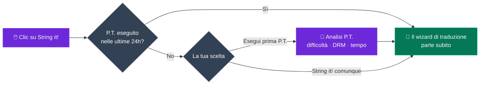
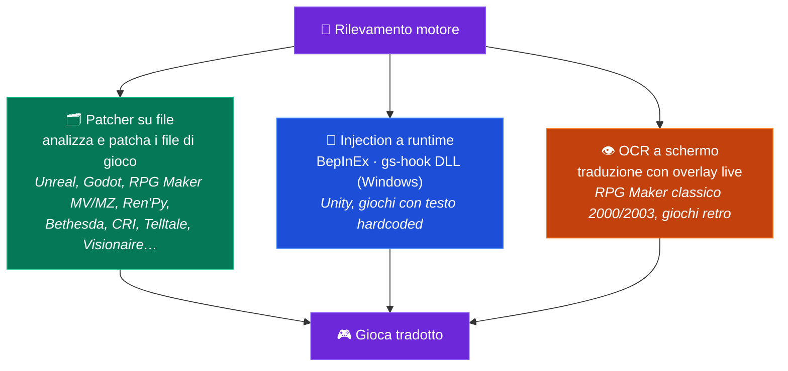

<p align="center">
  
</p>

<h1 align="center">GameStringer</h1>

<p align="center">
  <strong>App desktop che traduce i videogiochi in qualsiasi lingua usando l'IA.</strong><br>
  Scegli un gioco dalla tua libreria, seleziona una lingua, clicca traduci — fatto.
</p>

<p align="center">
  <a href="https://www.gamestringer.ai"></a>
  <a href="https://discord.gg/SjnD3Z7Uf8"></a>
  
  
  
  
  
  
</p>

<p align="center">
  <a href="https://www.gamestringer.ai">Sito web</a> ·
  <a href="https://discord.gg/SjnD3Z7Uf8"><strong>💬 Discord</strong></a> ·
  <a href="#aiuto-richiesto"><strong>🙏 Aiuto richiesto</strong></a> ·
  <a href="#-cosè-gamestringer">Cos'è</a> ·
  <a href="#-download">Download</a> ·
  <a href="#-come-funziona">Come funziona</a> ·
  <a href="#-il-prediction-tool-pt">P.T.</a> ·
  <a href="#-motori-di-gioco-supportati">Motori</a> ·
  <a href="#-funzionalità">Funzionalità</a> ·
  <a href="#-compilazione-dai-sorgenti">Build</a>
</p>

> ⚠️ **Aggiornamento dalla v1.8.x?** La v1.9.0 è migrata da Tauri v1 a **Tauri v2** — l'auto-updater non funziona per questo salto. Scarica la **v1.9.1** manualmente: [GameStringer_1.9.1_x64-setup.exe](https://github.com/rouges78/GameStringer/releases/download/v1.9.1/GameStringer_1.9.1_x64-setup.exe). Gli aggiornamenti futuri (v1.9.1 → v1.9.x) funzioneranno automaticamente.

<p align="center">
  <strong>🌍 Disponibile in 12 lingue</strong> — cambia lingua dentro l'app (IT, EN, ES, FR, DE, PT, PL, RU, JA, ZH, KO, EL) o sul <a href="https://www.gamestringer.ai">sito</a> (11 lingue).
</p>

<p align="center">
  <strong>🌍 Leggi nella tua lingua:</strong><br>
  <a href="README.md">🇬🇧 English</a> ·
  🇮🇹 Italiano ·
  <a href="README_ES.md">🇪🇸 Español</a> ·
  <a href="README_FR.md">🇫🇷 Français</a> ·
  <a href="README_DE.md">🇩🇪 Deutsch</a> ·
  <a href="README_PT.md">🇧🇷 Português</a> ·
  <a href="README_JA.md">🇯🇵 日本語</a> ·
  <a href="README_ZH.md">🇨🇳 中文</a> ·
  <a href="README_KO.md">🇰🇷 한국어</a> ·
  <a href="README_RU.md">🇷🇺 Русский</a> ·
  <a href="README_PL.md">🇵🇱 Polski</a>
</p>

---

> ### 💜 Una nota dallo sviluppatore
>
> GameStringer è costruito da **una sola persona — io — e ho il Parkinson**, quindi a volte gli aggiornamenti arrivano più lenti di quanto vorrei. **Grazie per la pazienza.** **Non lo faccio per soldi**: voglio solo cambiare il modo in cui funziona la traduzione dei giochi e mettere in mano ai giocatori uno strumento davvero utile. **Il Discord è ora aperto** 🎉 — [vieni a trovarci](https://discord.gg/SjnD3Z7Uf8) così possiamo parlare, scambiare idee e migliorare GameStringer, insieme. 🙏
>
> — *Davide ([@rouges78](https://github.com/rouges78))*

---

<a name="aiuto-richiesto"></a>

## 🙏 Aiuto richiesto — Testalo su giochi reali e manda feedback

> **GameStringer è un progetto solitario, source-available, ed è ancora giovane.** Gestisce già 20+ motori, ma i giochi reali sono caotici — ogni titolo memorizza il testo in modo un po' diverso. **La cosa più utile che puoi fare adesso è eseguire GameStringer su un gioco vero e raccontarmi com'è andata.** Anche solo *"si è bloccato al passo X"* vale oro.

**Perché è importante:** non posso testare da solo le migliaia di giochi esistenti. Un **testing e feedback** continui, sul campo, sono ciò che trasforma *"funziona sulle mie fixture"* in *"funziona sul tuo gioco."* Le tue segnalazioni plasmano direttamente la roadmap — è la parte in cui la community fa o disfa il progetto.

### 🧪 Tre modi per aiutare (scegline uno qualsiasi)

- **🎮 Testa un gioco e segnala.** Eseguilo su qualcosa nella tua libreria e compila un rapido [report di compatibilità](https://github.com/rouges78/GameStringer/discussions) — il motore è stato rilevato correttamente? il testo è stato estratto? la patch è stata applicata e il gioco parte ancora?
- **📦 Condividi un pack.** Se una traduzione funziona, pubblicala nel **Patch Hub** in-app così altri possono usarla — il tuo nome ci finisce sopra (reputazione + "traduttore verificato").
- **🛠️ Contribuisci.** Nuovi parser per motori, fix di locale, script di QA — cerca `good first issue` nel repo.

### 📋 Cosa ci serve testare e su cui vogliamo feedback in particolare

- [ ] **Copertura motori su titoli reali** — Unity (Mono **e** IL2CPP), Unreal (`.locres`, `_P.pak`, IoStore), Godot, RPG Maker **MV/MZ**, Ren'Py, Bethesda (BSA/BA2/ESP), CRI (CPK), Wolf RPG, TyranoScript, Visionaire, Danganronpa
- [ ] **RPG Maker classico (2000/2003)** tramite l'**overlay OCR** a schermo — quanto è leggibile il risultato?
- [ ] **Encoding e codici di controllo** — accenti/CJK corretti in-game, e tag/variabili in-game lasciati intatti?
- [ ] **Font** — gli script non latini (CJK, cirillico, greco) vengono renderizzati in-game, o serve una sostituzione del font?
- [ ] **Qualità di traduzione per lingua** — quale provider IA dà i risultati migliori per la tua lingua/genere?
- [ ] **Patch Hub** — pubblicazione e download dei pack `.gspack` end-to-end
- [ ] **Onboarding e UX al primo avvio** — era chiaro come tradurre il primo gioco? cosa ti ha confuso?
- [ ] **Update tracker** — dopo un aggiornamento dello store, ha segnalato correttamente che la patch va riapplicata?

### 📝 Template report di compatibilità (copia-incolla)

```
- Gioco / store / versione:
- Motore rilevato (da GameStringer):
- Passo raggiunto: Scan / Detect / Extract / Translate / Patch / Giocato
- Risultato: ✅ funziona / ⚠️ parziale / ❌ fallisce
- Provider IA usato:
- Lingua:
- Note (cosa si è rotto, encoding, screenshot):
- OS + versione GameStringer:
```

**Dove postare:** [GitHub Discussions](https://github.com/rouges78/GameStringer/discussions) · il **Community Hub** in-app (Supporto / Showcase / Richieste) · bug → [Issues](https://github.com/rouges78/GameStringer/issues).

GameStringer è gratuito e source-available; il sito e i costi dell'IA escono di tasca mia, quindi se ti fa risparmiare tempo un caffè è gradito ma **mai** dovuto: [Buy Me a Coffee](https://buymeacoffee.com/gamestringer) · [Ko-fi](https://ko-fi.com/gamestringer) · [GitHub Sponsors](https://github.com/sponsors/rouges78).

---

## 🎮 Cos'è GameStringer?

> **In parole semplici:** scegli un gioco → scegli la tua lingua → clicca un pulsante. GameStringer trova il testo del gioco, lo traduce con l'IA e lo rimette a posto — facendo prima un backup. Niente modding, niente riga di comando, niente conoscenze tecniche.

GameStringer è un'**applicazione desktop** (Windows, Linux e macOS) che ti permette di tradurre videogiochi che non hanno la tua lingua.

La maggior parte dei giochi memorizza il testo in file — JSON, XML, CSV, `.locres`, `.rpy`, BSA/BA2, CPK, StringTable di Unity Localization e molti altri formati. GameStringer **scansiona la cartella del gioco**, trova quei file, invia il testo tramite un **provider di traduzione IA** a tua scelta (OpenAI, Claude, Gemini, DeepSeek, Ollama, 20+ altri) e **applica la patch del testo tradotto** al gioco. Un clic, senza conoscenze tecniche.

Per i **giochi Unity** che bloccano il testo in asset compilati, GameStringer **installa automaticamente BepInEx + XUnity.AutoTranslator** — senza setup manuale. Per i **giochi Bethesda** (Skyrim, Fallout, Starfield) analizza nativamente BSA/BA2/ESP. Per i **giochi CRI Middleware** (Persona, Yakuza) gestisce CPK/CRILAYLA/MSG/BMD. Per **Unreal Engine** modifica direttamente i `.locres`.

**Non è un sito di traduzione automatica.** È una pipeline completa: **analisi con P.T. → rilevamento motore → estrazione testo → traduzione IA → controllo qualità → patch di ritorno → gioca.**

---

## 📥 Download

Ottieni l'ultima versione da **[GitHub Releases](https://github.com/rouges78/GameStringer/releases)**:

| Piattaforma | File | Note |
|----------|------|-------|
| **Windows** | `GameStringer_1.15.0_x64-setup.exe` | Installer (consigliato) |
| **Windows** | `GameStringer_1.15.0_x64-portable.zip` | Nessuna installazione |
| **Windows** | `GameStringer_1.15.0_x64_en-US.msi` | Alternativa MSI |
| **macOS** | `GameStringer_1.15.0_x64.dmg` | Mac Intel |
| **macOS** | `GameStringer_1.15.0_aarch64.dmg` | Apple Silicon |
| **Linux** | `GameStringer_1.15.0_amd64.AppImage` | Universale (consigliato) |
| **Linux** | `GameStringer_1.15.0_amd64.deb` | Debian / Ubuntu |
| **Linux** | `GameStringer-1.15.0-1.x86_64.rpm` | Fedora / RHEL |

**Requisiti:** Windows 10+, macOS 10.15+ o Linux (Ubuntu 22.04+, Fedora 38+). 4 GB RAM (8 GB+ per IA locale), 500 MB di disco. Gli aggiornamenti sono **firmati crittograficamente** e distribuiti tramite Tauri Updater (l'app verifica ogni aggiornamento con una chiave pubblica inclusa).

> 🛡️ **Avviso dell'antivirus o di SmartScreen?** È un noto **falso positivo** — la traduzione a runtime usa la DLL injection (BepInEx / gs-hook), una tecnica di cui gli scanner euristici diffidano, e ogni nuova release parte con zero reputazione su SmartScreen. **[Leggi docs/ANTIVIRUS.md](docs/ANTIVIRUS.md)** per capire cosa lo attiva, come verificare il download e come segnalare il falso positivo.

---

## 🚀 Come funziona

1. **Installa** GameStringer e avvialo
2. **La tua libreria di giochi si carica automaticamente** — Steam, Epic, GOG, Origin, Ubisoft, Amazon, itch.io, Humble App, Game Jolt, Big Fish (800+ giochi rilevati in pochi secondi)
3. **Scegli un gioco** → opzionalmente esegui **P.T. (Prediction Tool)** per vedere difficoltà, tempo stimato, miglior catena LLM
4. Clicca **"String it!"** — GameStringer scansiona, estrae, traduce e applica la patch automaticamente
5. **Gioca nella tua lingua** — i backup vengono sempre creati prima del patching

Tutto qui. Nessuna riga di comando, nessuna modifica manuale dei file, nessuna esperienza di modding richiesta.

### La pipeline a colpo d'occhio

```mermaid
flowchart LR
    A["📚 Scansiona<br/>libreria e file"] --> B["🧠 P.T.<br/>analizza prima"]
    B --> C["🎯 Rileva<br/>motore"]
    C --> D["📤 Estrai<br/>stringhe"]
    D --> E["🤖 Traduci<br/>IA + TM + glossario"]
    E --> F["✅ QA<br/>punteggio 0–100"]
    F --> G["🩹 Patch<br/>backup automatico"]
    G --> H["🎮 Gioca<br/>nella tua lingua"]

    classDef core fill:#6d28d9,stroke:#8b5cf6,color:#fff
    classDef trans fill:#1d4ed8,stroke:#3b82f6,color:#fff
    classDef patch fill:#047857,stroke:#10b981,color:#fff
    classDef res fill:#c2410c,stroke:#f97316,color:#fff
    class A,H res
    class B,C core
    class D,E,F trans
    class G patch
```



---

## 🧠 Il Prediction Tool (P.T.)

> **La funzionalità più potente di GameStringer.** Non iniziare una traduzione alla cieca — analizza prima.

P.T. è un motore di analisi approfondita che viene eseguito *prima* di qualsiasi traduzione. Scansiona la cartella del gioco, rileva il motore, stima il volume di testo traducibile e ti dice:

- **Difficulty Score 0–100** — peso combinato di volume di stringhe, complessità del motore, DRM, encoding, sfide linguistiche
- **Tempo stimato** su **18 modelli LLM** — Ollama (Gemma 4, Qwen 3, Llama), OpenAI GPT-4/4o, Claude 3.5, Gemini, DeepL, DeepSeek, Groq
- **5 catene LLM consigliate**: Local (privacy), Cloud (qualità), Hybrid (bilanciato), Budget, Premium — ciascuna con punteggio di costo e qualità
- **Rilevamento DRM**: Denuvo, VMProtect, Steam DRM, EAC, BattlEye — ti avvisa prima di provare
- **Analisi encoding**: Shift-JIS, UTF-8, UTF-16, Big5, EUC-KR rilevati per file
- **Complessità della traduzione**: onorifici, concordanza di genere, RTL, ruby/furigana, gestione specifica CJK
- **Punteggio di confidenza** e **piano di workflow** — i passi esatti che verranno eseguiti quando clicchi "String it!"
- **Export report** (JSON + Markdown) per condivisione o archiviazione

### P.T.Rank — Classifica Rapida

Dopo aver eseguito P.T. su più giochi, apri **P.T.Rank** per vedere tutti i titoli analizzati ordinati per difficoltà. Perfetto per pianificare la tua coda di traduzione: inizia dai giochi facili, lascia per ultimi gli RPG da 800k stringhe.

### Dry Run Scanner

Non vuoi analizzare un gioco alla volta? Esegui **Dry Run** dalla pagina Libreria per scansionare **l'intera libreria Steam (800+ giochi) in batch**, con **zero modifiche ai file**. Ottieni un report JSON che categorizza ogni gioco come **Ready** (motore supportato + stringhe estraibili), **Errors** (problemi del manifest / blocco DRM) o **Unsupported** (motore sconosciuto / nessun testo). Il progresso è in tempo reale e non serve backup perché nulla viene toccato.

### String it! Smart Gate

Il pulsante **"String it!"** nella pagina di dettaglio del gioco è intelligente: se il gioco è già stato analizzato da P.T. nelle ultime 24h, avvia direttamente il wizard di traduzione. Altrimenti suggerisce di eseguire prima P.T. (con scelta one-click "Run P.T. first" / "String it! anyway"). Niente più esecuzioni sprecate su giochi che si rivelano bloccati da DRM o affari di 5 minuti.



---

## 🎯 Motori di gioco supportati

Un solo rilevamento del motore, **tre strade di traduzione** — GameStringer sceglie automaticamente la migliore:



GameStringer supporta **20+ motori** con diversi livelli di profondità:

| Motore | Supporto | Come funziona |
|--------|---------|--------------|
| **Unity** | ✅ Completo | Installa automaticamente BepInEx + XUnity.AutoTranslator + pipeline Unity Localization Package (StringTable, SharedTableData, Addressables, Smart Strings) |
| **Unreal Engine** | ✅ Completo | Estrazione e patching `.locres` con UnrealLocres |
| **Unreal _P.pak** | ✅ Completo | Packaging mod come `<GameStringer>_P.pak` caricato tramite cartella Paks |
| **Godot** | ✅ Completo | Supporto nativo file `.translation` |
| **RPG Maker** | ✅ Completo | MV/MZ JSON, VX/Ace via Trans, XP via RMXP |
| **Ren'Py** | ✅ Completo | Parsing nativo script `.rpy` con rilevamento dialoghi |
| **GameMaker** | ⚡ Parziale | Via integrazione UndertaleModTool |
| **Telltale** | ✅ Completo | Supporto `.langdb` / `.dlog` |
| **Wolf RPG** | ✅ Completo | Integrazione WolfTrans |
| **Kirikiri** | ✅ Completo | Parsing `.ks` / `.scn` |
| **TyranoScript** | ✅ Completo | Estrattore fast-path con patching JSON |
| **Electron** | ✅ Completo | Unpacking ASAR + rilevamento i18n JSON |
| **Bethesda (Skyrim/Fallout/Oblivion/Starfield)** | ✅ **NEW v1.9.0** | Parser BSA v103-105 + BA2 GNRL/DX10 + ESP/ESM (FULL/DESC/NAM1), STRINGS/DLSTRINGS/ILSTRINGS |
| **CRI Middleware (Persona/Yakuza/Tales of/Dragon Ball)** | ✅ **NEW v1.9.0** | CPK + CRILAYLA + MSG/BMD/FTD con auto-detect Shift-JIS/UTF-8/UTF-16 |
| **Visionaire Studio** | ✅ Completo | Avventure Daedalic (Deponia, Edna, ecc.) |
| **Danganronpa WAD** | ✅ Completo | Parser archivio WAD + patching dialoghi STX |

> **I giochi Unity** ricevono un trattamento speciale: se non vengono trovati file traducibili, GameStringer rileva che è un gioco Unity e offre di **installare automaticamente BepInEx + XUnity.AutoTranslator** con un clic. Basta avviare il gioco una volta dopo l'installazione, poi ri-scansionare — tutto il testo diventa traducibile.
>
> ⚠️ **Avviso Anti-Cheat**: BepInEx (DLL injection) può attivare sistemi anti-cheat (EAC, BattlEye, Vanguard). GameStringer include rilevamento anti-cheat e ti avviserà. **Usare solo su giochi single-player / offline.** P.T. rileva il DRM prima di qualsiasi modifica.

---

## ✨ Funzionalità

### 🆕 Novità nella v1.15.0 — parametri Ollama e Progetti ↔ Patch Hub

- **🎚 Pannello parametri di inferenza Ollama** — metti a punto le traduzioni con Ollama locale tramite i preset **Fedele / Bilanciato / Creativo**, oppure passa alla **modalità esperto** per il controllo diretto di temperature, top-p e le altre manopole di sampling; la scelta è cablata in modo non invasivo su ogni chiamata di traduzione Ollama
- **🔗 Integrazione Progetti ↔ Patch Hub** — **importa un `.gspack` come progetto completato**, pubblica sull'Hub **precompilando dal progetto**, alterna il toggle **Esplora / Le mie patch** e **Applica al gioco** con un clic (con backup automatico)
- **💬 Widget feedback in-app** — invia feedback o segnala un problema senza mai uscire dall'app
- **⚡ Patch Hub più veloce** — **caching + rate-limiting** delle risposte per navigazione e download più scattanti sotto carico
- **🐛 Fix** — la webview delle news RSS non è più bloccata dal CORS, più un nuovo passaggio di **audit di accessibilità WCAG 2.1 AA**

### 🆕 Novità nella v1.14.0 — compatibilità community e pack a prova di bomba

- **🧭 Telemetria di compatibilità (opt-in)** — il "ProtonDB delle traduzioni": segnala se una traduzione ha funzionato e vedi **badge di compatibilità sulle card dei giochi**, sostenuti da report della community con difese anti-abuso e una [pagina di statistiche pubblica](https://gamestringer.ai/compatibilita.html)
- **🔤 Rilevamento glifi mancanti + fix font automatico** — GameStringer analizza la mappa dei caratteri del font del gioco, rileva quando mancano i glifi della tua lingua e **installa automaticamente un font Noto adatto** per i motori file-based (Ren'Py, RPG Maker) — niente più quadratini tofu al posto del testo
- **🛡 Integrità dei pack verificabile** — i pack della community sono verificati con un **SHA-256 aggregato**, protezione anti path-traversal e flag automatico dei pack manomessi
- **💥 Crash reporting opt-in** — report anonimi con firme dei crash ricorrenti così vengono corretti più in fretta
- **📚 Scan lingue della libreria robusto** — rilevamento più affidabile delle lingue già incluse in un gioco, più un pulsante manuale "Rileva lingue"
- **💬 Discord è online** — unisciti su [discord.gg/SjnD3Z7Uf8](https://discord.gg/SjnD3Z7Uf8)
- **🧪 Suite di regressione parser** — fixture binarie condivise (Godot, .locres, STX, RPG Maker, CRI CPK, Bethesda) esercitate sia dai parser Rust che TS; 2 bug reali trovati e corretti
- **📰 Feed news più pulito** — rimosso il rumore dei diff MediaWiki, filtrati i post di offerte

### 🆕 Novità nella v1.13.0

- **🖥 Traduttore UE in tempo reale marcato sperimentale** — lo strumento real-time per Unreal ora dichiara in anticipo il suo stato sperimentale e verifica che il gioco sia effettivamente in esecuzione prima di partire
- **🎛 Controlli qualità nelle Impostazioni** — interruttori per le nuove funzioni di qualità di traduzione (reflection pass, recupero semantico) più una allowlist di provider ampliata
- **🌐 Sito + i18n** — sezione v1.12.0 sul sito con infografiche e una nota dello sviluppatore, in 12 lingue; chiavi `aiQuality` / `semantic` / `lore` reintegrate in tutti i locale
- **🐛 Fix** — la CI ora compila la release dal branch corrente invece che da un tag non ancora creato; policy INSERT del forum Supabase ricreate con hardening RLS, con bailout di bridge controllato; deduplicata la migration `20260626`

### 🆕 Novità nella v1.12.0 — traduzioni più intelligenti e auto-verificate

- **👁️ Traduzione con contesto visivo (VLM)** — per la traduzione live / a schermo, un modello di visione IA ora *vede il frame* e traduce con quel contesto, così smette di tirare a indovinare sulle parole ambigue (*"Chest"* è uno scrigno o una parte del corpo?). Funziona con un modello **locale** (Ollama) o **OpenAI / Gemini**. Gli screenshot vengono ritagliati e ridimensionati nativamente per velocità.
- **🪞 Traduzioni auto-correttive (Reflection)** — dopo aver tradotto, GameStringer può eseguire un rapido secondo passaggio che rivede il proprio lavoro rispetto a **glossario, tono e formattazione** e corregge solo le righe che ne hanno davvero bisogno. Selettivo di default, così resta veloce ed economico.
- **🧠 Memoria semantica (RAG)** — la tua Translation Memory e il glossario ora sono abbinati per **significato**, non solo per parole esatte, così una frase già tradotta viene riusata anche quando è formulata diversamente — mantenendo la terminologia coerente in tutto il gioco. Completamente locale (embedding Ollama); ripiega sul matching per parole chiave se non disponibile.
- **⚡ Traduzione live più fluida** — pipeline dell'overlay live rielaborata e gestione nativa delle immagini per un risultato a schermo più rapido e pulito.
- **🔌 Più provider pronti all'uso** — allowlist ampliata così più backend funzionano subito: DeepL, Groq, Cerebras, Cohere, Together, Fireworks, Hugging Face, Azure Translator, DashScope, LibreTranslate, Lingva, MyMemory.

### 🆕 Novità nella v1.11.2

- **Più store** — rilevamento delle installazioni locali per **Humble App, Game Jolt e Big Fish Games**, oltre ai launcher esistenti
- **Ricerca traduzioni** — controlla se un gioco include già la tua lingua tramite **PCGamingWiki**, più rapidi **link di ricerca per fan-patch italiane** dalla vista del gioco
- **Pubblica sul Patch Hub** — invia un progetto completato al **Patch Hub** della community in un passo (`app/projects` → publish, riusa `publishPack`)
- **Panoramica Community Hub** — nuovo pannello di atterraggio con attività recente, ultimi pack e categorie
- **News traduzioni italiane** — aggiunti feed RSS curati di fan-translation (Ctrl+Trad, OldGamesItalia, Romhacking.it, Language Pack Italia, Q-Gin, …)
- **String it! ovunque** — routing one-click per Unity/Unreal/Godot + una pipeline cloud per **TyranoScript**
- **Unity** — bridge **Ollama** locale per XUnity (CustomTranslate); i download di BepInEx/XUnity/TMP/UABEA si risolvono dalla GitHub API
- **Godot** — parser `.pck` riscritto che legge veri archivi **Godot 4.4+** (verificato su *Slay the Spire 2*)
- **Affidabilità desktop** — rimosse le ultime chiamate web `/api`: l'editor usa la TM locale, e le chiamate translate/export/voice/store passano dal backend nativo

### 🆕 Novità nella v1.10.2

- **Fix auto-updater** — risolto uno stato bloccato "Preparazione…" in cui l'aggiornamento non iniziava mai il download. Un oggetto React di update obsoleto veniva passato a `downloadAndInstall` e il flag `updating` non veniva mai resettato; ora l'auto-update parte, scarica e installa in modo affidabile (`components/notifications/auto-updater.tsx`, `hooks/use-tauri-updater.ts`)
- **Persistenza impostazioni affidabile** — le impostazioni dell'app e le API key dei provider IA ora vengono salvate in modo affidabile su disco (`data_dir/GameStringer/settings.json`) tramite i comandi Tauri `save_app_settings` / `load_app_settings`; prima alcune impostazioni non venivano persistite
- **Aggiungi giochi manualmente da disco** — ora puoi aggiungere un gioco scegliendone la cartella da disco, senza affidarti solo all'auto-rilevamento della libreria (Steam/Epic/ecc.) (`lib/manual-games.ts`, `app/library/page.tsx`)

### 🆕 Novità nella v1.9.1

- **Fix CSP che bloccava Supabase** — la Community Chat veniva bloccata silenziosamente dalla rigida Content Security Policy di Tauri v2. Aggiunti `https://*.supabase.co` e `wss://*.supabase.co` a `connect-src`
- **Fix auto-connect chat** — auth coordinata tra `main-layout` e `persistent-chat` tramite eventi custom, eliminando le race condition
- **Fix errore di timeout** — una stale closure nel max-timeout causava un falso "Tempo di caricamento troppo lungo" anche quando la chat si caricava correttamente
- **Build macOS** — DMG (Intel) e `.app.tar.gz` (Apple Silicon) ora disponibili

### 🆕 Novità nella v1.9.0

- **Presenza online unificata** — Supabase Realtime + fallback DB, auto-away/auto-online, heartbeat ogni 30s
- **Notifiche System Tray** — notifiche OS native per chat, traduzioni, errori, aggiornamenti, giochi, amici, news con orari silenziosi configurabili
- **Error Boundary + recupero crash** — WidgetErrorBoundary (auto-retry 5s, max 3), AppErrorBoundary con reload
- **Resilienza di rete / modalità offline** — monitor di rete, status bar (rosso/ambra/verde), retry con backoff esponenziale, coda offline
- **Character Voice Profiles (Voice Cloning)** — estrazione automatica dello stile del personaggio dai dialoghi, 16 toni, prompt injection per traduzioni coerenti
- **Infrastruttura di Fine-Tuning** — dataset dalle correzioni umane (Adaptive MT), 4 formati di export, gestione modelli per gioco con Ollama
- **Code Splitting / Lazy Loading** — 8 componenti pesanti convertiti a React.lazy + Suspense per un avvio più rapido
- **Bug Fix** — doppia init di NetworkResilience + listener leak, Supabase 400 su user_profiles, stringhe versione del tray, bypass orari silenziosi per notifiche critiche

### 🤖 Traduzione IA

- **20+ provider**: OpenAI, Claude, Gemini, DeepSeek, Mistral, Groq, DeepL, Ollama (locale), LM Studio, TranslateGemma, HY-MT, Qwen 3, NLLB-200, Cerebras, Together AI, Fireworks, OpenRouter, Cohere, Lingva, MyMemory
- **Context-aware**: comprende genere del gioco, voce del personaggio, tono, narrazione vs UI vs dialogo
- **Translation Memory e Glossario**: coerenza nel progetto con estrazione automatica del glossario
- **Auto-Select Engine** (NEW v1.7.0): preset `auto` che classifica dinamicamente i provider per lingua di destinazione + genere del gioco (DeepL per le europee, Claude per CJK, boost basato sul genere)
- **Multi-LLM Compare**: esegue più provider in parallelo, scegli il miglior risultato per stringa
- **Quality gates**: punteggio QA automatico su ogni stringa tradotta (0-100) con ContentTypeBadge
- **Vision LLM Translator**: usa screenshot in-game per il contesto (Ollama, Gemini, GPT-4o)
- **Live Quality Preview**: vedi i punteggi di qualità in tempo reale durante la traduzione batch
- **Supporto RTL**: rilevamento automatico della direzione e gestione attributo `dir`

### 🧠 P.T. — Prediction Tool (v1.9.0)

- **Difficulty Score 0-100** con fattori ponderati (volume, motore, DRM, encoding, complessità)
- **Stime di tempo per 18 modelli LLM** inclusi Gemma 4 (27B MoE A4B / E4B / E2B)
- **5 catene LLM** (Local / Cloud / Hybrid / Budget / Premium) con stime di costo e qualità
- **Rilevamento DRM / Anti-Cheat** (Denuvo, VMProtect, Steam DRM, EAC, BattlEye, Vanguard)
- **Analisi encoding** per file (Shift-JIS, UTF-8/16, Big5, EUC-KR)
- **Analisi complessità traduzione** (onorifici, genere, CJK, ruby, RTL)
- **P.T.Rank / Quick Ranking** — ordina tutti i giochi analizzati per difficoltà
- **Dry Run Scanner** — scansione batch dell'intera libreria Steam (800+ giochi) senza modifiche
- **Workflow Orchestrator** — motore di esecuzione reale con fast path universale per 6+ motori e progresso in tempo reale
- **Prediction cache** (24h) — riapertura istantanea di giochi già analizzati
- **Export report** (JSON + Markdown) per condivisione e archiviazione

### 📚 Libreria Giochi

- **Auto-detect**: Steam (con Family Sharing), Epic, GOG Galaxy, Origin/EA, Ubisoft Connect, Amazon Games, itch.io, Humble App, Game Jolt, Big Fish Games
- **800+ giochi** riconosciuti dalle librerie installate in pochi secondi
- **Card dei giochi** con copertine, metadati, badge motore, badge VR, stato di installazione
- **Azioni rapide hover**: String it!, Batch, Community, P.T. — tutte a un clic
- **Game Update Tracker**: rileva quando Steam aggiorna un gioco tradotto (tramite `buildid`), verifica l'integrità della patch (file BepInEx, presenza `_P.pak`), avvisa se è necessario ri-patchare
- Pulsante **"Stop monitoring"** per non tracciare più un gioco specifico

### 🔧 Strumenti di Traduzione

- **One-Click Translate** ("String it!"): scansione → traduzione → patch in un unico flusso
- **Batch Translation**: traduci interi giochi o cartelle in una volta
- **Traduttore Sottotitoli**: SRT, VTT, ASS/SSA con preservazione del timing
- **OCR Translator**: estrae testo da giochi retro (preset 8-bit, 16-bit, DOS) con backend Tauri Tesseract reale
- **Voice Pipeline**: speech-to-text → traduci → text-to-speech con **Duration Matching** (NEW v1.7.0) — regola automaticamente la velocità per corrispondere alla durata dell'audio originale
- **Lip Sync** (NEW v1.7.0): integrazione Rhubarb per generazione visemi (A-X), timeline interattiva, export per Unity (blend shape) e Unreal (FaceFX)
- **Gridly CSV Export/Import** (NEW v1.7.0): formato a colonne multi-lingua compatibile con Gridly, Lokalise e Crowdin
- **Real-time Overlay**: vedi le traduzioni mentre giochi tramite VR/screen overlay
- **Auto-Translate Review**: pulsante "Translate all untranslated" con barra di progresso
- **Lore Assistant**: chat RAG che conosce lore e dialoghi del gioco
- **Character Voice Profiles**: definisci personalità, tono, pattern di linguaggio per personaggio
- **Translation Confidence Heatmap**: panoramica visiva della qualità di tutte le traduzioni

### 🎮 Patcher per Motori di Gioco

- **Unity**: auto-installer BepInEx + XUnity.AutoTranslator, Unity Localization Package (StringTable, SharedTableData, catalogo Addressables, validatore Smart Strings)
- **Unreal Engine**: estrazione `.locres` + mod packaging `_P.pak`
- **Bethesda Engine Patcher** (NEW v1.9.0): Skyrim LE/SE/AE, Fallout 3/NV/4, Oblivion, Starfield — BSA v103-105 + BA2 GNRL/DX10 + ESP/ESM (FULL/DESC/NAM1)
- **CRI Middleware Patcher** (NEW v1.9.0): Persona 5 Royal, Yakuza, Tales of, Dragon Ball — CPK + CRILAYLA + MSG/BMD/FTD
- **Ren'Py**, **RPG Maker**, **Godot**, **GameMaker**, **Kirikiri**, **Wolf RPG**, **Telltale**, **Visionaire**, **Danganronpa WAD** — tutti con parser nativi
- **Wizard Stepper**: UI multi-step condivisa per tutti i patcher
- **Universal PO Export** (gettext `.po`) per ogni patcher con metadati progetto/lingua/sorgente/motore
- **Backup automatico**: prima di ogni patch, con ripristino one-click

### 🔌 Avanzate

- **Auto-Hook Scanner**: scansione memoria processo (Windows WinAPI) per stringhe hardcoded
- **System Monitor**: uso VRAM/RAM in tempo reale per pianificazione LLM locale
- **Ollama Setup Wizard**: installazione IA locale passo-passo
- **Ollama Manager**: auto-discovery di modelli dal registro ollama.com + auto-refresh su focus/navigazione
- **Debug Console**: console integrata con log intercept
- **Video Extractor** (v1.7.0): estrai e converti video FMV da giochi retro/moderni (VMD, BIK, SMK, USM, ROQ) con upscaling IA (Real-ESRGAN), link diretto dalla pagina di dettaglio del gioco
- **Plugin System**: design doc per plugin di terze parti (vedi `docs/PLUGIN_SYSTEM.md`)
- **Community Hub**: condividi e scarica translation memories + integrazione GitHub Discussions
- **Public API v1**: endpoint REST per integrazione (`/api/v1/translate`, `/api/v1/batch`)

### 💬 Community Chat

- **Chat in tempo reale** con altri traduttori via Supabase Realtime
- **4 stanze predefinite**: General, Translations, Feedback & Bugs, Announcements
- **Stanze personalizzate**: crea stanze per giochi o progetti specifici
- **Auto-Bridge Auth**: il tuo profilo GameStringer si sincronizza automaticamente con Supabase — nessun login extra
- **Presenza online**: vedi chi è online in ogni stanza
- **Rispondi / modifica / elimina** messaggi con ownership enforced da RLS
- **Widget drawer espandibile** nell'angolo in basso a destra

### ♿ Accessibilità (v1.9.0)

- **WCAG 2.1 AA sweep** — `aria-label` sui pulsanti icona, heading semantici `CardTitle`, `focus-visible` su tutte le primitive, link skip-to-content, landmark `main`, helper `sr-only` italiani
- **`prefers-reduced-motion`** rispettato in tutte le animazioni
- **`forced-colors`** (Windows High Contrast Mode) rispettato
- **UI in 12 lingue**: IT, EN, ES, FR, DE, JA, ZH, KO, PT, RU, PL, EL (greco aggiunto in v1.10.0)
- **Supporto layout RTL** con rilevamento automatico della direzione

### 🎨 Design System (v1.9.0)

- **Varianti Card** tramite `cva`: default, muted, highlight, success, error, warning
- **Dimensioni Button** incluse `xs` e `icon-sm`
- **Text utilities**: `text-micro` (9px), `text-2xs` (10px) — niente più valori Tailwind arbitrari
- **Radix UI unificato**: migrati 37 file da `@radix-ui/react-*` a `radix-ui`, 27 pacchetti rimossi
- **Bundle ottimizzato**: `optimizePackageImports` per radix-ui, framer-motion, recharts, cmdk

### 🖥️ App

- **Auto-updates firmati**: aggiornamento one-click dall'app via Tauri Updater
- **Profili**: profili utente multipli con recovery key
- **Global Hotkeys**: `Ctrl+Shift+T` OCR, `Ctrl+Shift+Q` Quick Translate, `Ctrl+Alt+O` Overlay, `Alt+T` toggle XUnity
- **System Tray**: azioni rapide, stato Ollama live, sottomenu strumenti, notifiche OS native con preferenze
- **Cross-platform**: Windows, macOS e Linux con build native
- **Fix tray Windows**: previene il loop di flash console allo spawn di processi figli

---

## 🔧 AI Provider

| Provider | API Key | Free Tier | Ideale per |
|----------|---------|-----------|----------|
| **Ollama** | No (locale) | ✅ Illimitato | Privacy, offline |
| **LM Studio** | No (locale) | ✅ Illimitato | Privacy, modelli GGUF |
| **TranslateGemma** | No (Ollama) | ✅ Illimitato — 55 lingue, Google | **Inizio consigliato** |
| **HY-MT1.5** | No (Ollama) | ✅ Illimitato — ~1GB RAM, Tencent | Macchine con poca RAM |
| **Qwen 3** | No (Ollama) | ✅ Illimitato — multilingua | Lingue CJK |
| **Gemma 4** | No (Ollama) | ✅ Illimitato — 27B MoE A4B/E4B/E2B | Qualità locale |
| **Gemini** | Sì | ✅ Free tier (15 RPM) | **Cloud consigliato** |
| **DeepSeek** | Sì | ✅ $0.14/1M input | Cloud economico |
| **Groq** | Sì | ✅ 14.400 req/giorno | Velocità |
| **Mistral** | Sì | ✅ Free tier | Cloud UE |
| **OpenAI** | Sì | A pagamento | Qualità GPT-4o |
| **Claude** | Sì | A pagamento | Sfumature, contesto lungo |
| **DeepL** | Sì | ✅ 500k caratteri/mese | Lingue europee |
| **MyMemory** | No | ✅ Illimitato | Fallback |
| **Lingva** | No | ✅ Illimitato | Mirror Google MT |
| **Cerebras** | Sì | ✅ Free tier | Velocità |
| **Together AI** | Sì | ✅ $25 di credito gratis | Modelli aperti |
| **Fireworks** | Sì | ✅ Free tier | Modelli aperti |
| **OpenRouter** | Sì | ✅ Modelli gratuiti | Varietà modelli |
| **NLLB-200** | Sì | ✅ 200 lingue | Lingue rare |
| **Cohere** | Sì | ✅ Prova gratuita | RAG |

**Consigliati per iniziare**: **TranslateGemma** via Ollama (gratis, locale, 55 lingue) o **Gemini** (free tier, cloud). Poca RAM: **HY-MT1.5** (~1GB). Migliore qualità: **Claude 3.5** o **GPT-4o**. Miglior CJK: **Qwen 3**.

---

## 📖 Documentazione

### Guide Utente (12 lingue)

| | | |
|---|---|---|
| 🇮🇹 [Italiano](docs/GUIDA_UTENTE.md) | 🇬🇧 [English](docs/USER_GUIDE_EN.md) | 🇪🇸 [Español](docs/USER_GUIDE_ES.md) |
| 🇫🇷 [Français](docs/USER_GUIDE_FR.md) | 🇩🇪 [Deutsch](docs/USER_GUIDE_DE.md) | 🇯🇵 [日本語](docs/USER_GUIDE_JA.md) |
| 🇨🇳 [中文](docs/USER_GUIDE_ZH.md) | 🇰🇷 [한국어](docs/USER_GUIDE_KO.md) | 🇧🇷 [Português](docs/USER_GUIDE_PT.md) |
| 🇷🇺 [Русский](docs/USER_GUIDE_RU.md) | 🇵🇱 [Polski](docs/USER_GUIDE_PL.md) | 🇮🇷 [فارسی](docs/USER_GUIDE_FA.md) |

### Documentazione di Progetto

- **[CHANGELOG.md](CHANGELOG.md)** — storico completo delle versioni
- **[ROADMAP.md](ROADMAP.md)** — roadmap prioritizzata (P0/P1/P2)
- **[docs/VERSIONING.md](docs/VERSIONING.md)** — policy di versioning
- **[docs/PROJECT_STATUS.md](docs/PROJECT_STATUS.md)** — stato attuale a colpo d'occhio
- **[docs/ANTIVIRUS.md](docs/ANTIVIRUS.md)** — falsi positivi antivirus / SmartScreen
- **[PLUGIN_SYSTEM.md](docs/PLUGIN_SYSTEM.md)** — design dell'architettura plugin
- **[LICENSE](LICENSE)** — Source-Available License v1.1
- **[docs/LEGAL.md](docs/LEGAL.md)** — posizione legale e policy di uso accettabile

---

## 🛠️ Compilazione dai sorgenti

**Prerequisiti**: Node.js 18+, Rust 1.70+, npm. Su Linux anche: `libwebkit2gtk-4.1-dev`, `libayatana-appindicator3-dev`, `librsvg2-dev`.

```bash
git clone https://github.com/rouges78/GameStringer.git
cd GameStringer
npm install
npm run dev          # sviluppo
npm run tauri:build  # build di produzione
```

Backend Rust: `cd src-tauri && cargo check` per verificare che i comandi Tauri compilino sulla tua piattaforma.

---

## 💖 Supporto

Se GameStringer ti ha aiutato a giocare nella tua lingua:

<p align="center">
  <a href="https://buymeacoffee.com/gamestringer">
    
  </a>
  <a href="https://ko-fi.com/gamestringer">
    
  </a>
  <a href="https://github.com/sponsors/rouges78">
    
  </a>
</p>

---

## 📜 Licenza

**Source-Available License v1.1** — il codice sorgente è pubblico e puoi compilarlo tu stesso, ma non è "Open Source" approvato OSI.

- ✅ Gratuito per uso personale
- ✅ Libero di ispezionare, compilare e modificare per te stesso
- ❌ L'uso commerciale richiede permesso scritto
- ❌ La ridistribuzione di versioni modificate richiede permesso scritto

Vedi [LICENSE](LICENSE) per i dettagli, e **[docs/LEGAL.md](docs/LEGAL.md)** per la posizione legale del progetto e la policy di uso accettabile. Domande? Apri una [Discussion](https://github.com/rouges78/GameStringer/discussions).

---

## 🙏 Credits

- **[BepInEx](https://github.com/BepInEx/BepInEx)** — framework di modding Unity (BepInEx Team)
- **[XUnity.AutoTranslator](https://github.com/bbepis/XUnity.AutoTranslator)** — framework di traduzione Unity (bbepis)
- **[UnrealLocres](https://github.com/akintos/UnrealLocres)** — parser Unreal `.locres` (akintos)
- **[UndertaleModTool](https://github.com/krzys-h/UndertaleModTool)** — modding GameMaker (krzys-h)
- **[Tauri](https://tauri.app)** — framework per app desktop
- **[Tesseract.js](https://github.com/naptha/tesseract.js)** — motore OCR
- **[Ollama](https://ollama.com)** — runtime LLM locale
- **[Supabase](https://supabase.com)** — backend realtime per la Community Chat

---

<p align="center">
  Fatto con ❤️ per i giocatori che vogliono giocare nella loro lingua<br>
  <strong>GameStringer v1.15.0</strong> · <a href="https://www.gamestringer.ai">gamestringer.ai</a> · © 2025-2026 GameStringer Team
</p>
