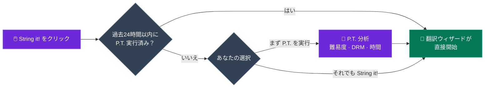
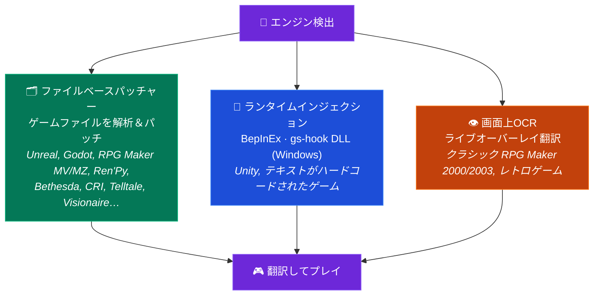

<p align="center">
  
</p>

<h1 align="center">GameStringer</h1>

<p align="center">
  <strong>AIを使ってビデオゲームをあらゆる言語に翻訳するデスクトップアプリ。</strong><br>
  ライブラリからゲームを選択し、言語を選び、翻訳をクリックするだけ — 完了。
</p>

<p align="center">
  <a href="https://www.gamestringer.ai"></a>
  <a href="https://discord.gg/SjnD3Z7Uf8"></a>
  
  
  
  
  
  
</p>

<p align="center">
  <a href="https://www.gamestringer.ai">ウェブサイト</a> ·
  <a href="https://discord.gg/SjnD3Z7Uf8"><strong>💬 Discord</strong></a> ·
  <a href="#help-wanted"><strong>🙏 協力募集</strong></a> ·
  <a href="#-gamestringerとは">GameStringerとは</a> ·
  <a href="#-ダウンロード">ダウンロード</a> ·
  <a href="#-動作の仕組み">動作の仕組み</a> ·
  <a href="#-prediction-tool-pt">P.T.</a> ·
  <a href="#-対応ゲームエンジン">エンジン</a> ·
  <a href="#-機能">機能</a> ·
  <a href="#-ソースからのビルド">ビルド</a>
</p>

<p align="center">
  <strong>🌍 あなたの言語で読む:</strong><br>
  <a href="README.md">🇬🇧 English</a> ·
  <a href="README_IT.md">🇮🇹 Italiano</a> ·
  <a href="README_ES.md">🇪🇸 Español</a> ·
  <a href="README_FR.md">🇫🇷 Français</a> ·
  <a href="README_DE.md">🇩🇪 Deutsch</a> ·
  <a href="README_PT.md">🇧🇷 Português</a> ·
  🇯🇵 日本語 ·
  <a href="README_ZH.md">🇨🇳 中文</a> ·
  <a href="README_KO.md">🇰🇷 한국어</a> ·
  <a href="README_RU.md">🇷🇺 Русский</a> ·
  <a href="README_PL.md">🇵🇱 Polski</a>
</p>

> ⚠️ **v1.8.x からアップグレードしますか？** v1.9.0 で Tauri v1 から **Tauri v2** へ移行したため、このジャンプでは自動アップデーターが機能しません。**v1.9.1** を手動でダウンロードしてください：[GameStringer_1.9.1_x64-setup.exe](https://github.com/rouges78/GameStringer/releases/download/v1.9.1/GameStringer_1.9.1_x64-setup.exe)。以降のアップデート（v1.9.1 → v1.9.x）は自動的に機能します。

<p align="center">
  <strong>🌍 12言語で利用可能</strong> — アプリ内で言語を切り替え（IT、EN、ES、FR、DE、PT、PL、RU、JA、ZH、KO、EL）、または<a href="https://www.gamestringer.ai">ウェブサイト</a>（11言語）で切り替えできます。
</p>

---

> ### 💜 開発者からのひとこと
>
> GameStringer は**たった一人 — 私 — によって作られており、私はパーキンソン病を患っています**。そのため、アップデートは思うより遅れることがあります。**ご辛抱いただきありがとうございます。** 私は**お金のためにこれをやっているのではありません**：ただゲーム翻訳のあり方を変え、本当に役立つツールをプレイヤーの手に届けたいだけです。**Discord がついに開設されました** 🎉 — [ぜひ参加してください](https://discord.gg/SjnD3Z7Uf8)。一緒に語り合い、アイデアを交換し、GameStringer をより良いものにしていきましょう。🙏
>
> — *Davide ([@rouges78](https://github.com/rouges78))*

---

<a name="help-wanted"></a>

## 🙏 協力募集 — 実際のゲームで試してフィードバックを送ってください

> **GameStringer は個人の、ソース公開型プロジェクトであり、まだ若いプロジェクトです。** すでに20以上のエンジンに対応していますが、実際のゲームは厄介です — どのタイトルもテキストの保存方法が少しずつ異なります。**今あなたにできる最も役立つことは、実際のゲームで GameStringer を動かし、何が起きたかを教えてくれることです。** たとえ *「ステップ X で失敗した」* だけでも貴重です。

**なぜこれが重要なのか：** 世の中の何千ものゲームを一人ですべてテストするのは不可能です。継続的で現実的な**テストとフィードバック**こそが、*「私のフィクスチャでは動く」* を *「あなたのゲームで動く」* へと変えるものです。あなたのレポートはロードマップに直接影響します — ここがコミュニティの力でプロジェクトの成否が決まる部分です。

### 🧪 協力する3つの方法（どれでもOK）

- **🎮 ゲームをテストして報告する。** ライブラリにあるゲームで動かし、簡単な[互換性レポート](https://github.com/rouges78/GameStringer/discussions)を投稿してください — エンジンは正しく検出されましたか？ テキストは抽出されましたか？ パッチは適用され、ゲームは起動しましたか？
- **📦 パックを共有する。** 翻訳が動作したら、アプリ内の **Patch Hub** に公開して他の人が使えるようにしてください — あなたの名前が付きます（評判 + 「認証済み翻訳者」）。
- **🛠️ 貢献する。** 新しいエンジンパーサー、ロケール修正、QAスクリプト — リポジトリで `good first issue` を探してください。

### 📋 特にテストとフィードバックが必要なもの

- [ ] **実タイトルでのエンジン対応** — Unity（Mono **および** IL2CPP）、Unreal（`.locres`、`_P.pak`、IoStore）、Godot、RPG Maker **MV/MZ**、Ren'Py、Bethesda（BSA/BA2/ESP）、CRI（CPK）、Wolf RPG、TyranoScript、Visionaire、Danganronpa
- [ ] **クラシック RPG Maker（2000/2003）** の画面上 **OCRオーバーレイ** による翻訳 — 結果はどの程度読みやすいですか？
- [ ] **エンコーディングと制御コード** — ゲーム内でアクセント/CJKが正しく表示され、ゲーム内タグ/変数がそのまま保持されていますか？
- [ ] **フォント** — 非ラテン文字（CJK、キリル、ギリシャ）はゲーム内で表示されますか、それともフォント差し替えが必要ですか？
- [ ] **言語ごとの翻訳品質** — あなたの言語/ジャンルにはどのAIプロバイダーが最良の結果を出しますか？
- [ ] **Patch Hub** — `.gspack` パックの公開とダウンロードのエンドツーエンド
- [ ] **初回オンボーディングとUX** — 最初のゲームを翻訳する方法は明確でしたか？ 何が分かりにくかったですか？
- [ ] **Update Tracker** — ストアの更新後、パッチの再適用が必要であることを正しくフラグ付けしましたか？

### 📝 互換性レポートテンプレート（コピー＆ペースト）

```
- ゲーム / ストア / バージョン：
- 検出されたエンジン（GameStringer による）：
- 到達したステップ： Scan / Detect / Extract / Translate / Patch / Played
- 結果： ✅ 動作 / ⚠️ 部分的 / ❌ 失敗
- 使用したAIプロバイダー：
- 言語：
- 備考（何が壊れたか、エンコーディング、スクリーンショット）：
- OS + GameStringer バージョン：
```

**投稿先：** [GitHub Discussions](https://github.com/rouges78/GameStringer/discussions) · アプリ内の **Community Hub**（Supporto / Showcase / Richieste） · バグ → [Issues](https://github.com/rouges78/GameStringer/issues)。

GameStringer は無料でソース公開型です。ウェブサイトとAIの費用は私の自腹で賄っています。時間の節約になったなら、コーヒー一杯のご支援はありがたいですが**決して**強制ではありません：[Buy Me a Coffee](https://buymeacoffee.com/gamestringer) · [Ko-fi](https://ko-fi.com/gamestringer) · [GitHub Sponsors](https://github.com/sponsors/rouges78)。

---

## 🎮 GameStringerとは？

> **簡単に言うと：** ゲームを選ぶ → 言語を選ぶ → ボタンを1つクリック。GameStringer はゲームのテキストを見つけ、AIで翻訳し、元に戻します — まず最初にバックアップを作成します。Modも、コマンドラインも、技術知識も不要です。

GameStringer は、あなたの言語に対応していないビデオゲームを翻訳できる**デスクトップアプリケーション**（Windows、Linux、macOS）です。

ほとんどのゲームはテキストをファイルに保存しています — JSON、XML、CSV、`.locres`、`.rpy`、BSA/BA2、CPK、Unity Localization の StringTable、その他多くのフォーマット。GameStringer は**ゲームフォルダをスキャン**し、それらのファイルを見つけ、お好みの**AI翻訳プロバイダー**（OpenAI、Claude、Gemini、DeepSeek、Ollama、他20以上）を通してテキストを送信し、翻訳されたテキストをゲームに**パッチして戻します**。ワンクリック、技術知識不要です。

コンパイル済みアセットにテキストがロックされている**Unityゲーム**では、GameStringer が**BepInEx + XUnity.AutoTranslator を自動的にインストール**します — 手動セットアップは不要です。**Bethesdaのゲーム**（Skyrim、Fallout、Starfield）では、BSA/BA2/ESP をネイティブにパースします。**CRI Middlewareのゲーム**（ペルソナ、龍が如く）では、CPK/CRILAYLA/MSG/BMD を処理します。**Unreal Engine**では、`.locres` を直接編集します。

**機械翻訳ウェブサイトではありません。** 完全なパイプラインです：**P.T.で分析 → エンジン検出 → テキスト抽出 → AIで翻訳 → 品質チェック → パッチを戻す → プレイ。**

---

## 📥 ダウンロード

最新リリースは**[GitHub Releases](https://github.com/rouges78/GameStringer/releases)**から入手してください：

| プラットフォーム | ファイル | 備考 |
|----------|------|-------|
| **Windows** | `GameStringer_1.15.0_x64-setup.exe` | インストーラー（推奨） |
| **Windows** | `GameStringer_1.15.0_x64-portable.zip` | インストール不要 |
| **Windows** | `GameStringer_1.15.0_x64_en-US.msi` | MSI 版 |
| **macOS** | `GameStringer_1.15.0_x64.dmg` | Intel Mac |
| **macOS** | `GameStringer_1.15.0_aarch64.dmg` | Apple Silicon |
| **Linux** | `GameStringer_1.15.0_amd64.AppImage` | ユニバーサル（推奨） |
| **Linux** | `GameStringer_1.15.0_amd64.deb` | Debian / Ubuntu |
| **Linux** | `GameStringer-1.15.0-1.x86_64.rpm` | Fedora / RHEL |

**要件：** Windows 10+、macOS 10.15+、または Linux（Ubuntu 22.04+、Fedora 38+）。4 GB RAM（ローカルAIには8 GB+）、500 MB のディスク容量。アップデートは**暗号署名**され、Tauri Updater 経由で配信されます（アプリは各アップデートを同梱の公開鍵で検証します）。

> 🛡️ **アンチウイルスや SmartScreen の警告が出ましたか？** それは既知の**誤検知**です — ランタイム翻訳は DLLインジェクション（BepInEx / gs-hook）を使用しており、これはヒューリスティックスキャナーが疑う手法です。また、新しいリリースはすべて SmartScreen の評価がゼロから始まります。**[docs/ANTIVIRUS.md を読む](docs/ANTIVIRUS.md)** で、何が原因となるか、ダウンロードの検証方法、誤検知の報告方法を確認してください。

---

## 🚀 動作の仕組み

1. GameStringer を**インストール**して起動
2. **ゲームライブラリが自動的に読み込まれます** — Steam、Epic、GOG、Origin、Ubisoft、Amazon、itch.io、Humble App、Game Jolt、Big Fish（インストール済みのゲームを本数の制限なく数秒で検出）
3. **ゲームを選択** → オプションで **P.T.（Prediction Tool）** を実行して、難易度、推定時間、最適なLLMチェーンを確認
4. **「String it!」**をクリック — GameStringer が自動的にスキャン、抽出、翻訳、パッチ適用
5. **あなたの言語でプレイ** — パッチ適用前に必ずバックアップが作成されます

それだけです。コマンドラインも、手動でのファイル編集も、Modding経験も不要です。

### パイプラインの全体像


---

## 🧠 The Prediction Tool (P.T.)

> **GameStringer で最も強力な機能。** 翻訳を闇雲に始めないでください — まず分析を。

P.T. は、あらゆる翻訳の*前に*実行される深層分析エンジンです。ゲームフォルダをスキャンし、エンジンを検出し、翻訳可能なテキストの量を見積もり、次の情報を提供します：

- **Difficulty Score 0–100** — 文字列の量、エンジンの複雑さ、DRM、エンコーディング、言語的課題の総合重み
- **推定時間** を**18のLLMモデル**で算出 — Ollama（Gemma 4、Qwen 3、Llama）、OpenAI GPT-4/4o、Claude 3.5、Gemini、DeepL、DeepSeek、Groq
- **5つの推奨LLMチェーン**：Local（プライバシー）、Cloud（品質）、Hybrid（バランス）、Budget、Premium — それぞれコストと品質のスコア付き
- **DRM検出**：Denuvo、VMProtect、Steam DRM、EAC、BattlEye — 試す前に警告
- **エンコーディング分析**：Shift-JIS、UTF-8、UTF-16、Big5、EUC-KR をファイルごとに検出
- **翻訳の複雑さ**：敬語、性別の一致、RTL、ルビ/振り仮名、CJK固有の処理
- **信頼度スコア**と**ワークフロー計画** — 「String it!」クリック時に実行される正確なステップ
- **レポートエクスポート**（JSON + Markdown）共有やアーカイブ用

### P.T.Rank — クイックランキング

複数のゲームで P.T. を実行した後、**P.T.Rank** を開くと、分析されたすべてのタイトルを難易度順に表示できます。翻訳キューの計画に最適：簡単な勝利から始めて、数十万文字列規模のRPGは最後まで取っておきましょう。

### Dry Run Scanner

一度に1つのゲームを分析したくない？ ライブラリページから **Dry Run** を実行すると、**インストール済みのライブラリ全体を本数の制限なく一括スキャン**でき、**ファイルの変更は一切ありません**。各ゲームを **Ready**（対応エンジン + 抽出可能な文字列）、**Errors**（マニフェストの問題 / DRMブロッカー）、**Unsupported**（不明なエンジン / テキストなし）に分類する JSON レポートを取得できます。進捗はリアルタイムで、何も触れないためバックアップは不要です。

### String it! Smart Gate

ゲーム詳細ページの**「String it!」**ボタンはスマートです：過去24時間以内に P.T. で分析されていれば、翻訳ウィザードを直接起動します。そうでない場合は、まず P.T. を実行することを提案します（ワンクリックで「Run P.T. first」/「String it! anyway」を選択）。DRMでロックされていたり5分で終わるゲームに対する無駄な実行はもうありません。



---

## 🎯 対応ゲームエンジン

1回のエンジン検出、**3つの翻訳ルート** — GameStringer が最適なものを自動的に選びます：



GameStringer は**専用パーサを持つエンジンが12**、認識できるエンジンは**20以上**あり、それぞれ深度レベルが異なります：

| エンジン | サポート | 動作の仕組み |
|--------|---------|--------------|
| **Unity** | ✅ 完全 | BepInEx + XUnity.AutoTranslator + Unity Localization Package パイプライン（StringTable、SharedTableData、Addressables、Smart Strings）を自動インストール |
| **Unreal Engine** | ✅ 完全 | UnrealLocres による `.locres` の抽出とパッチ |
| **Unreal _P.pak** | ✅ 完全 | `<GameStringer>_P.pak` として Mod パッケージ化、Paks フォルダ経由でロード |
| **Godot** | ✅ 完全 | ネイティブ `.translation` ファイルサポート |
| **RPG Maker** | ✅ 完全 | MV/MZ JSON、VX/Ace（Trans経由）、XP（RMXP経由） |
| **Ren'Py** | ✅ 完全 | ダイアログ検出機能付きのネイティブ `.rpy` スクリプトパース |
| **GameMaker** | ⚡ 部分的 | UndertaleModTool 統合経由 |
| **Telltale** | ✅ 完全 | `.langdb` / `.dlog` サポート |
| **Wolf RPG** | ✅ 完全 | WolfTrans 統合 |
| **Kirikiri** | ✅ 完全 | `.ks` / `.scn` パース |
| **TyranoScript** | ✅ 完全 | JSON パッチ付き fast-path 抽出器 |
| **Electron** | ✅ 完全 | ASAR アンパック + i18n JSON 検出 |
| **Bethesda（Skyrim/Fallout/Oblivion/Starfield）** | ✅ **NEW v1.9.0** | BSA v103-105 + BA2 GNRL/DX10 + ESP/ESM（FULL/DESC/NAM1）パーサー、STRINGS/DLSTRINGS/ILSTRINGS |
| **CRI Middleware（ペルソナ/龍が如く/テイルズ/ドラゴンボール）** | ✅ **NEW v1.9.0** | CPK + CRILAYLA + MSG/BMD/FTD と Shift-JIS/UTF-8/UTF-16 の自動検出 |
| **Visionaire Studio** | ✅ 完全 | Daedalic アドベンチャー（Deponia、Edna など） |
| **Danganronpa WAD** | ✅ 完全 | WAD アーカイブパーサー + STX ダイアログパッチ |

> **Unityゲーム**は特別な扱いを受けます：翻訳可能なファイルが見つからない場合、GameStringer はそれが Unity ゲームであることを検出し、ワンクリックで **BepInEx + XUnity.AutoTranslator を自動インストール**することを提案します。インストール後に一度ゲームを起動し、再スキャンするだけで、すべてのテキストが翻訳可能になります。
>
> ⚠️ **アンチチート警告**：BepInEx（DLLインジェクション）はアンチチートシステム（EAC、BattlEye、Vanguard）をトリガーする可能性があります。GameStringer にはアンチチート検出が含まれており、警告します。**シングルプレイヤー / オフラインゲームでのみ使用してください。** P.T. は変更前に DRM を検出します。

---

## ✨ 機能

### 🆕 v1.15.0 の新機能 — Ollama チューニングとプロジェクト ↔ Patch Hub

- **🎚 Ollama 推論パラメータパネル** — **忠実 / バランス / クリエイティブ**のプリセットでローカル Ollama の翻訳を微調整、または**エキスパートモード**で temperature や top-p などのサンプリング設定を直接制御。設定はすべての Ollama 翻訳呼び出しに非破壊的に反映されます
- **🔗 プロジェクト ↔ Patch Hub 連携** — **`.gspack` を完了済みプロジェクトとしてインポート**し、**プロジェクトから内容を自動入力**して Hub に公開、**探索 / マイパッチ**トグルの切り替え、ワンクリックの**ゲームに適用**（自動バックアップ付き）
- **💬 アプリ内フィードバックウィジェット** — アプリを離れることなくフィードバックの送信や不具合の報告ができます
- **⚡ Patch Hub の高速化** — レスポンスの**キャッシュ + レート制限**により、高負荷時でも軽快な閲覧とダウンロード
- **🐛 修正** — RSS ニュースの WebView が CORS でブロックされる問題を解消、さらに新たな **WCAG 2.1 AA アクセシビリティ監査**を実施

### 🆕 v1.14.0 の新機能 — コミュニティ互換性と堅牢なパック

- **🧭 互換性テレメトリ（オプトイン）** — 「翻訳版の ProtonDB」：翻訳が動作したかどうかを報告し、**ゲームカードに互換性バッジ**を表示。悪用対策付きのコミュニティレポートに支えられ、[公開統計ページ](https://gamestringer.ai/compatibilita.html)もあります
- **🔤 欠落グリフの検出 + 自動フォント修正** — GameStringer はゲームフォントの文字マップを解析し、あなたの言語のグリフが欠けているのを検出して、ファイルベースのエンジン（Ren'Py、RPG Maker）向けに**一致する Noto フォントを自動インストール**します — テキストの代わりに豆腐（□）が並ぶことはもうありません
- **🛡 検証可能なパック整合性** — コミュニティパックは**集約された SHA-256**、パストラバーサル保護、改ざんされたパックの自動フラグ付けで検証されます
- **💥 オプトインのクラッシュ報告** — 再発クラッシュのシグネチャ付きの匿名レポートにより、クラッシュがより早く修正されます
- **📚 堅牢なライブラリ言語スキャン** — ゲームがすでに同梱している言語をより確実に検出、加えて手動の「言語を検出」ボタン
- **💬 Discord 開設** — [discord.gg/SjnD3Z7Uf8](https://discord.gg/SjnD3Z7Uf8) に参加してください
- **🧪 パーサー回帰テストスイート** — 共有バイナリフィクスチャ（Godot、.locres、STX、RPG Maker、CRI CPK、Bethesda）を Rust と TS の両パーサーで実行。実際のバグ2件を発見・修正
- **📰 よりクリーンなニュースフィード** — MediaWiki の diff ノイズを除去、セール投稿をフィルタリング

### 🆕 v1.13.0 の新機能

- **🖥 リアルタイム UE 翻訳ツールを実験的と明示** — Unreal のリアルタイムツールは実験的ステータスを前面に表示し、開始前にゲームが実際に実行中かをチェックするようになりました
- **🎛 設定内の品質コントロール** — 新しい翻訳品質機能（リフレクションパス、セマンティック検索）のスイッチと、拡張されたプロバイダー許可リスト
- **🌐 サイト + i18n** — サイトに v1.12.0 セクションをインフォグラフィックと開発者ノート付きで12言語で追加。`aiQuality` / `semantic` / `lore` キーを全ロケールに補完
- **🐛 修正** — CI が未作成のタグではなく現在のブランチからリリースをビルドするように。RLS 強化のもとで Supabase フォーラムの INSERT ポリシーを再作成し、優雅なブリッジ退避を実装。マイグレーションバージョン `20260626` の重複を排除

### 🆕 v1.12.0 の新機能 — より賢く、自己チェックする翻訳

- **👁️ ビジュアルコンテキスト翻訳（VLM）** — ライブ / 画面上翻訳では、AIビジョンモデルが*フレームを見て*そのコンテキストで翻訳するため、曖昧な単語で推測しなくなります（*"Chest"* は宝箱か体の一部か？）。**ローカル**モデル（Ollama）または **OpenAI / Gemini** で動作します。スクリーンショットは速度のためにネイティブでクロップ＆リサイズされます
- **🪞 自己修正翻訳（Reflection）** — 翻訳後、GameStringer は自身の作業をあなたの**用語集、トーン、フォーマット**に照らして見直す素早い第2パスを実行し、実際に必要な行だけを修正します。デフォルトで選択的なので、高速かつ低コストを維持します
- **🧠 セマンティックメモリ（RAG）** — Translation Memory と用語集が単なる完全一致ではなく**意味**で照合されるようになり、以前訳したフレーズが言い回しが違っても再利用され、ゲーム全体で用語の一貫性を保ちます。完全にローカル（Ollama エンベディング）で、利用できない場合はキーワード照合にフォールバックします
- **⚡ よりスムーズなライブ翻訳** — ライブオーバーレイパイプラインとネイティブ画像処理を刷新し、より高速でクリーンな画面上結果を実現
- **🔌 標準でより多くのプロバイダー** — 許可リストを拡張し、より多くのバックエンドがそのまま動作：DeepL、Groq、Cerebras、Cohere、Together、Fireworks、Hugging Face、Azure Translator、DashScope、LibreTranslate、Lingva、MyMemory

### 🆕 v1.11.2 の新機能

- **より多くのストア** — 既存のランチャーに加え、**Humble App、Game Jolt、Big Fish Games** のローカルインストール検出
- **翻訳ルックアップ** — ゲームがすでにあなたの言語を同梱しているかを **PCGamingWiki** 経由で確認、加えてゲームビューからの素早い**イタリア語ファンパッチ検索リンク**
- **Patch Hub への公開** — 完了したプロジェクトをコミュニティの **Patch Hub** へワンステップで送信（`app/projects` → 公開、`publishPack` を再利用）
- **Community Hub 概要** — 最近のアクティビティ、最新パック、カテゴリを表示する新しいランディングパネル
- **イタリア語翻訳ニュース** — 厳選されたファン翻訳 RSS フィードを追加（Ctrl+Trad、OldGamesItalia、Romhacking.it、Language Pack Italia、Q-Gin、…）
- **どこでも String it!** — Unity/Unreal/Godot 向けのワンクリックルーティング + **TyranoScript** クラウドパイプライン
- **Unity** — XUnity 向けのローカル **Ollama** ブリッジ（CustomTranslate）。BepInEx/XUnity/TMP/UABEA のダウンロードは GitHub API から解決
- **Godot** — 書き直された `.pck` パーサーが本物の **Godot 4.4+** アーカイブを読み取り（*Slay the Spire 2* で検証済み）
- **デスクトップの信頼性** — 最後の web `/api` 呼び出しを削除：エディタはローカル TM を使用し、翻訳/エクスポート/音声/ストア呼び出しはネイティブバックエンドを経由

### 🆕 v1.10.2 の新機能

- **自動アップデーターの修正** — アップデートがダウンロードを開始しない「Preparing…」状態の停滞を解消。古い React アップデートオブジェクトが `downloadAndInstall` に渡され、`updating` フラグがリセットされていませんでした。現在は自動アップデートが確実に開始、ダウンロード、インストールされます（`components/notifications/auto-updater.tsx`、`hooks/use-tauri-updater.ts`）
- **信頼できる設定の永続化** — アプリ設定と AIプロバイダーの APIキーが、`save_app_settings` / `load_app_settings` Tauri コマンド経由で確実にディスク（`data_dir/GameStringer/settings.json`）に保存されるようになりました。以前は一部の設定が永続化されていませんでした
- **ディスクから手動でゲームを追加** — ライブラリの自動検出（Steam/Epic/など）だけに頼らず、ディスクからフォルダを選んでゲームを追加できるようになりました（`lib/manual-games.ts`、`app/library/page.tsx`）

### 🆕 v1.9.1 の新機能

- **Supabase をブロックする CSP の修正** — Community Chat が Tauri v2 の厳格な Content Security Policy によって静かにブロックされていました。`https://*.supabase.co` と `wss://*.supabase.co` を `connect-src` に追加
- **チャット自動接続の修正** — `main-layout` と `persistent-chat` 間の認証をカスタムイベントで調整し、競合状態を排除
- **タイムアウトエラーの修正** — max-timeout 内の古いクロージャが、チャットが正常に読み込まれても誤って "Tempo di caricamento troppo lungo" を発生させていました
- **macOS ビルド** — DMG（Intel）と `.app.tar.gz`（Apple Silicon）が利用可能になりました

### 🆕 v1.9.0 の新機能

- **統合オンラインプレゼンス** — Supabase Realtime + DB フォールバック、自動離席/自動オンライン、30秒ごとのハートビート
- **システムトレイ通知** — チャット、翻訳、エラー、アップデート、ゲーム、フレンド、ニュースのネイティブOS通知、設定可能なサイレント時間付き
- **エラーバウンダリ + クラッシュ回復** — WidgetErrorBoundary（5秒で自動リトライ、最大3回）、リロード付き AppErrorBoundary
- **ネットワーク耐性 / オフラインモード** — ネットワークモニター、ステータスバー（赤/黄/緑）、指数バックオフリトライ、オフラインキュー
- **キャラクターボイスプロファイル（音声クローン）** — ダイアログからキャラクターのスタイルを自動抽出、16のトーン、一貫した翻訳のためのプロンプトインジェクション
- **ファインチューニング基盤** — 人間の修正からのデータセット（Adaptive MT）、4つのエクスポート形式、Ollama によるゲームごとのモデル管理
- **コード分割 / 遅延読み込み** — 8つの重いコンポーネントを React.lazy + Suspense に変換し、起動を高速化
- **バグ修正** — NetworkResilience の二重初期化 + リスナーリーク、Supabase 400 user_profiles、トレイのバージョン文字列、重要な通知のサイレント時間バイパス

### 🤖 AI翻訳

- **20以上のプロバイダー**：OpenAI、Claude、Gemini、DeepSeek、Mistral、Groq、DeepL、Ollama（ローカル）、LM Studio、TranslateGemma、HY-MT、Qwen 3、NLLB-200、Cerebras、Together AI、Fireworks、OpenRouter、Cohere、Lingva、MyMemory
- **Context-aware**：ゲームのジャンル、キャラクターの声、トーン、ナラティブ vs UI vs ダイアログを理解
- **Translation Memory と用語集**：プロジェクト全体での一貫性、用語集の自動抽出
- **Auto-Select Engine**（NEW v1.7.0）：対象言語 + ゲームジャンルに基づいてプロバイダーを動的にランク付けする `auto` プリセット（ヨーロッパ言語には DeepL、CJK には Claude、ジャンルに応じたブースト）
- **Multi-LLM Compare**：複数のプロバイダーを並列実行し、文字列ごとに最高の結果を選択
- **Quality gates**：翻訳された各文字列に対する自動QAスコアリング（0-100）と ContentTypeBadge
- **Vision LLM Translator**：コンテキストにゲーム内スクリーンショットを使用（Ollama、Gemini、GPT-4o）
- **Live Quality Preview**：バッチ翻訳中にリアルタイムで品質スコアを表示
- **RTLサポート**：方向の自動検出と `dir` 属性の処理

### 🧠 P.T. — Prediction Tool (v1.9.0)

- **Difficulty Score 0-100**、重み付けされた要因（量、エンジン、DRM、エンコーディング、複雑さ）
- **18のLLMモデルに対する時間推定**（Gemma 4 27B MoE A4B / E4B / E2B を含む）
- **5つのLLMチェーン**（Local / Cloud / Hybrid / Budget / Premium）、コストと品質の推定付き
- **DRM / アンチチート検出**（Denuvo、VMProtect、Steam DRM、EAC、BattlEye、Vanguard）
- **エンコーディング分析**ファイルごと（Shift-JIS、UTF-8/16、Big5、EUC-KR）
- **翻訳の複雑さ分析**（敬語、性別、CJK、ルビ、RTL）
- **P.T.Rank / Quick Ranking** — 分析されたすべてのゲームを難易度順にソート
- **Dry Run Scanner** — インストール済みのライブラリ全体を、本数の制限なく、変更なしで一括スキャン
- **Workflow Orchestrator** — 6以上のエンジンに対するユニバーサル fast path を備えた実際の実行エンジンとリアルタイム進捗
- **予測キャッシュ**（24時間）— 以前に分析したゲームの即座な再オープン
- **レポートエクスポート**（JSON + Markdown）共有とアーカイブ用

### 📚 ゲームライブラリ

- **自動検出**：Steam（Family Sharing 付き）、Epic、GOG Galaxy、Origin/EA、Ubisoft Connect、Amazon Games、itch.io、Humble App、Game Jolt、Big Fish Games
- **インストール済みのライブラリ全体**を、本数の制限なく数秒で認識
- カバーアート、メタデータ、エンジンバッジ、VRバッジ、インストール状況付きの**ゲームカード**
- **ホバークイックアクション**：String it!、Batch、Community、P.T. — すべてワンクリック
- **Game Update Tracker**：Steam が翻訳済みゲームを更新したことを検出（`buildid` 経由）、パッチの整合性を確認（BepInEx ファイル、`_P.pak` の存在）、再パッチが必要な場合は警告
- 特定のゲームの追跡を解除する**「Stop monitoring」**ボタン

### 🔧 翻訳ツール

- **One-Click Translate**（「String it!」）：スキャン → 翻訳 → パッチを単一のフローで
- **Batch Translation**：ゲーム全体やフォルダを一度に翻訳
- **字幕翻訳**：SRT、VTT、ASS/SSA とタイミングの保持
- **OCR Translator**：レトロゲーム（8-bit、16-bit、DOS のプリセット）から実際の Tauri Tesseract バックエンドでテキストを抽出
- **Voice Pipeline**：speech-to-text → 翻訳 → text-to-speech、**Duration Matching**（NEW v1.7.0）付き — 元の音声の長さに合わせて速度を自動調整
- **Lip Sync**（NEW v1.7.0）：ビゼーム生成（A-X）のための Rhubarb 統合、インタラクティブなタイムライン、Unity（ブレンドシェイプ）と Unreal（FaceFX）向けエクスポート
- **Gridly CSV Export/Import**（NEW v1.7.0）：Gridly、Lokalise、Crowdin 対応の多言語カラムフォーマット
- **リアルタイムオーバーレイ**：VR/スクリーンオーバーレイ経由でプレイ中に翻訳を確認
- **Auto-Translate Review**：プログレスバー付きの「Translate all untranslated」ボタン
- **Lore Assistant**：ゲームの lore とダイアログを知る RAG チャット
- **Character Voice Profiles**：キャラクターごとに性格、トーン、話し方を定義
- **Translation Confidence Heatmap**：すべての翻訳の品質の視覚的な概要

### 🎮 ゲームエンジンパッチャー

- **Unity**：BepInEx + XUnity.AutoTranslator 自動インストーラー、Unity Localization Package（StringTable、SharedTableData、Addressables カタログ、Smart Strings バリデーター）
- **Unreal Engine**：`.locres` 抽出 + `_P.pak` Mod パッケージ化
- **Bethesda Engine Patcher**（NEW v1.9.0）：Skyrim LE/SE/AE、Fallout 3/NV/4、Oblivion、Starfield — BSA v103-105 + BA2 GNRL/DX10 + ESP/ESM（FULL/DESC/NAM1）
- **CRI Middleware Patcher**（NEW v1.9.0）：ペルソナ5 Royal、龍が如く、テイルズ、ドラゴンボール — CPK + CRILAYLA + MSG/BMD/FTD
- **Ren'Py**、**RPG Maker**、**Godot**、**GameMaker**、**Kirikiri**、**Wolf RPG**、**Telltale**、**Visionaire**、**Danganronpa WAD** — すべてネイティブパーサー付き
- **Wizard Stepper**：すべてのパッチャー用の共有マルチステップUI
- すべてのパッチャー用の**Universal PO Export**（gettext `.po`）、プロジェクト/言語/ソース/エンジンメタデータ付き
- **自動バックアップ**：各パッチの前、ワンクリック復元付き

### 🔌 高度な機能

- **Auto-Hook Scanner**：ハードコードされた文字列のプロセスメモリスキャン（Windows WinAPI）
- **System Monitor**：ローカルLLMの計画用のリアルタイム VRAM/RAM 使用状況
- **Ollama Setup Wizard**：ローカルAIのステップバイステップインストール
- **Ollama Manager**：ollama.com レジストリからのモデルの自動発見 + フォーカス/ナビゲーション時の自動更新
- **Debug Console**：ログインターセプト付きの統合コンソール
- **Video Extractor**（v1.7.0）：AIアップスケーリング（Real-ESRGAN）付きでレトロ/モダンゲームから FMV ビデオを抽出・変換（VMD、BIK、SMK、USM、ROQ）、ゲーム詳細ページからの直接リンク
- **Plugin System**：サードパーティプラグインの設計ドキュメント（`docs/PLUGIN_SYSTEM.md` を参照）
- **Community Hub**：Translation Memories の共有とダウンロード + GitHub Discussions 統合
- **Public API v1**：統合用の REST エンドポイント（`/api/v1/translate`、`/api/v1/batch`）

### 💬 Community Chat

- Supabase Realtime 経由で他の翻訳者との**リアルタイムチャット**
- **4つのデフォルトルーム**：General、Translations、Feedback & Bugs、Announcements
- **カスタムルーム**：特定のゲームやプロジェクト用のルームを作成
- **Auto-Bridge Auth**：GameStringer プロファイルが Supabase に自動同期 — 追加ログイン不要
- **オンラインプレゼンス**：各ルームで誰がオンラインかを確認
- RLS によって所有権が強制されたメッセージの**返信 / 編集 / 削除**
- 右下隅の**拡張可能なドロワーウィジェット**

### ♿ アクセシビリティ (v1.9.0)

- **WCAG 2.1 AA sweep** — アイコンボタンの `aria-label`、セマンティックな `CardTitle` 見出し、すべてのプリミティブの `focus-visible`、skip-to-content リンク、`main` ランドマーク、イタリア語の `sr-only` ヘルパー
- アニメーション全体で**`prefers-reduced-motion`**を尊重
- **`forced-colors`**（Windows High Contrast モード）を尊重
- **12言語UI**：IT、EN、ES、FR、DE、JA、ZH、KO、PT、RU、PL、EL（ギリシャ語は v1.10.0 で追加）
- 方向の自動検出を伴う**RTLレイアウトサポート**

### 🎨 Design System (v1.9.0)

- `cva` 経由の**Card バリアント**：default、muted、highlight、success、error、warning
- `xs` と `icon-sm` を含む**Button サイズ**
- **Text utilities**：`text-micro`（9px）、`text-2xs`（10px） — 任意の Tailwind 値はもう不要
- **Radix UI 統合**：37ファイルを `@radix-ui/react-*` から `radix-ui` に移行、27パッケージを削除
- **最適化されたバンドル**：radix-ui、framer-motion、recharts、cmdk の `optimizePackageImports`

### 🖥️ アプリ

- **署名付き自動更新**：Tauri Updater 経由でアプリからワンクリックで更新
- **プロファイル**：リカバリーキー付きの複数のユーザープロファイル
- **Global Hotkeys**：`Ctrl+Shift+T` OCR、`Ctrl+Shift+Q` Quick Translate、`Ctrl+Alt+O` Overlay、`Alt+T` XUnity トグル
- **System Tray**：クイックアクション、Ollama ステータスのライブ表示、ツールサブメニュー、設定付きのネイティブOS通知
- **クロスプラットフォーム**：ネイティブビルドでの Windows、macOS、Linux
- **Windows トレイ修正**：子プロセスのスポーン時のコンソールフラッシュループを防止

---

## 🔧 AIプロバイダー

| プロバイダー | APIキー | Free Tier | 最適な用途 |
|----------|---------|-----------|----------|
| **Ollama** | 不要（ローカル） | ✅ 無制限 | プライバシー、オフライン |
| **LM Studio** | 不要（ローカル） | ✅ 無制限 | プライバシー、GGUFモデル |
| **TranslateGemma** | 不要（Ollama） | ✅ 無制限 — 55言語、Google | **推奨スタート** |
| **HY-MT1.5** | 不要（Ollama） | ✅ 無制限 — 約1GB RAM、Tencent | 低RAMマシン |
| **Qwen 3** | 不要（Ollama） | ✅ 無制限 — 多言語 | CJK言語 |
| **Gemma 4** | 不要（Ollama） | ✅ 無制限 — 27B MoE A4B/E4B/E2B | ローカル品質 |
| **Gemini** | 必要 | ✅ 無料枠（15 RPM） | **推奨クラウド** |
| **DeepSeek** | 必要 | ✅ $0.14/1M input | 低コストクラウド |
| **Groq** | 必要 | ✅ 14,400リクエスト/日 | 速度 |
| **Mistral** | 必要 | ✅ 無料枠 | EUクラウド |
| **OpenAI** | 必要 | 有料 | GPT-4o品質 |
| **Claude** | 必要 | 有料 | ニュアンス、長いコンテキスト |
| **DeepL** | 必要 | ✅ 500k文字/月 | ヨーロッパ言語 |
| **MyMemory** | 不要 | ✅ 無制限 | フォールバック |
| **Lingva** | 不要 | ✅ 無制限 | Google MTミラー |
| **Cerebras** | 必要 | ✅ 無料枠 | 速度 |
| **Together AI** | 必要 | ✅ $25無料クレジット | オープンモデル |
| **Fireworks** | 必要 | ✅ 無料枠 | オープンモデル |
| **OpenRouter** | 必要 | ✅ 無料モデル | モデルの多様性 |
| **NLLB-200** | 必要 | ✅ 200言語 | 希少言語 |
| **Cohere** | 必要 | ✅ 無料トライアル | RAG |

**スタートに推奨**：Ollama 経由の **TranslateGemma**（無料、ローカル、55言語）または **Gemini**（無料枠、クラウド）。低RAM：**HY-MT1.5**（約1GB）。最高品質：**Claude 3.5** または **GPT-4o**。最高のCJK：**Qwen 3**。

---

## 📖 ドキュメント

### ユーザーガイド（12言語）

| | | |
|---|---|---|
| 🇮🇹 [Italiano](docs/GUIDA_UTENTE.md) | 🇬🇧 [English](docs/USER_GUIDE_EN.md) | 🇪🇸 [Español](docs/USER_GUIDE_ES.md) |
| 🇫🇷 [Français](docs/USER_GUIDE_FR.md) | 🇩🇪 [Deutsch](docs/USER_GUIDE_DE.md) | 🇯🇵 [日本語](docs/USER_GUIDE_JA.md) |
| 🇨🇳 [中文](docs/USER_GUIDE_ZH.md) | 🇰🇷 [한국어](docs/USER_GUIDE_KO.md) | 🇧🇷 [Português](docs/USER_GUIDE_PT.md) |
| 🇷🇺 [Русский](docs/USER_GUIDE_RU.md) | 🇵🇱 [Polski](docs/USER_GUIDE_PL.md) | 🇮🇷 [فارسی](docs/USER_GUIDE_FA.md) |

### プロジェクトドキュメント

- **[CHANGELOG.md](CHANGELOG.md)** — 完全なバージョン履歴
- **[ROADMAP.md](ROADMAP.md)** — 優先順位付きロードマップ（P0/P1/P2）
- **[docs/VERSIONING.md](docs/VERSIONING.md)** — バージョニングポリシー
- **[docs/PROJECT_STATUS.md](docs/PROJECT_STATUS.md)** — 現在の状況の概要
- **[docs/ANTIVIRUS.md](docs/ANTIVIRUS.md)** — アンチウイルス / SmartScreen の誤検知
- **[PLUGIN_SYSTEM.md](docs/PLUGIN_SYSTEM.md)** — プラグインアーキテクチャ設計
- **[LICENSE](LICENSE)** — Source-Available License v1.1
- **[docs/LEGAL.md](docs/LEGAL.md)** — 法的立場と利用規約

---

## 🛠️ ソースからのビルド

**前提条件**：Node.js 18+、Rust 1.70+、npm。Linux の場合は追加で：`libwebkit2gtk-4.1-dev`、`libayatana-appindicator3-dev`、`librsvg2-dev`。

```bash
git clone https://github.com/rouges78/GameStringer.git
cd GameStringer
npm install
npm run dev          # 開発
npm run tauri:build  # プロダクションビルド
```

Rust バックエンド：`cd src-tauri && cargo check` でプラットフォーム上で Tauri コマンドがコンパイルされることを確認してください。

---

## 💖 サポート

GameStringer があなたの言語でゲームをプレイするのに役立った場合：

<p align="center">
  <a href="https://buymeacoffee.com/gamestringer">
    
  </a>
  <a href="https://ko-fi.com/gamestringer">
    
  </a>
  <a href="https://github.com/sponsors/rouges78">
    
  </a>
</p>

---

## 📜 ライセンス

**Source-Available License v1.1** — ソースコードは公開されており、自分でビルドできますが、OSI承認の「Open Source」ではありません。

- ✅ 個人利用無料
- ✅ 自分自身のために検査、ビルド、変更可能
- ❌ 商用利用には書面による許可が必要
- ❌ 変更版の再配布には書面による許可が必要

詳細は [LICENSE](LICENSE) を、プロジェクトの法的立場と利用規約については **[docs/LEGAL.md](docs/LEGAL.md)** を参照してください。ご質問は [Discussion](https://github.com/rouges78/GameStringer/discussions) を開いてください。

---

## 🙏 Credits

- **[BepInEx](https://github.com/BepInEx/BepInEx)** — Unity modding フレームワーク（BepInEx Team）
- **[XUnity.AutoTranslator](https://github.com/bbepis/XUnity.AutoTranslator)** — Unity 翻訳フレームワーク（bbepis）
- **[UnrealLocres](https://github.com/akintos/UnrealLocres)** — Unreal `.locres` パーサー（akintos）
- **[UndertaleModTool](https://github.com/krzys-h/UndertaleModTool)** — GameMaker modding（krzys-h）
- **[Tauri](https://tauri.app)** — デスクトップアプリフレームワーク
- **[Tesseract.js](https://github.com/naptha/tesseract.js)** — OCR エンジン
- **[Ollama](https://ollama.com)** — ローカル LLM ランタイム
- **[Supabase](https://supabase.com)** — Community Chat 用のリアルタイムバックエンド

---

<p align="center">
  自分の言語でプレイしたいゲーマーのために❤️で作られました<br>
  <strong>GameStringer v1.15.0</strong> · <a href="https://www.gamestringer.ai">gamestringer.ai</a> · © 2025-2026 GameStringer Team
</p>
