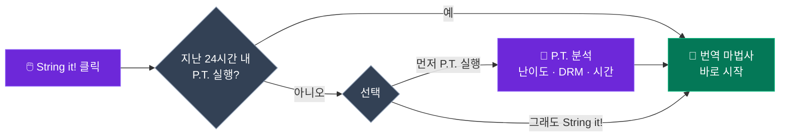
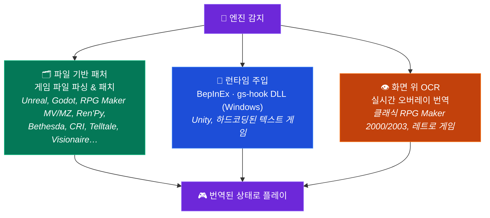

<p align="center">
  
</p>

<h1 align="center">GameStringer</h1>

<p align="center">
  <strong>AI를 사용해 비디오 게임을 어떤 언어로든 번역하는 데스크톱 앱.</strong><br>
  라이브러리에서 게임을 선택하고, 언어를 고르고, 번역을 클릭하세요 — 완료.
</p>

<p align="center">
  <a href="https://www.gamestringer.ai"></a>
  <a href="https://discord.gg/SjnD3Z7Uf8"></a>
  
  
  
  
  
  
</p>

<p align="center">
  <a href="https://www.gamestringer.ai">웹사이트</a> ·
  <a href="https://discord.gg/SjnD3Z7Uf8"><strong>💬 Discord</strong></a> ·
  <a href="#help-wanted"><strong>🙏 도움 요청</strong></a> ·
  <a href="#-what-is-gamestringer">GameStringer란</a> ·
  <a href="#-download">다운로드</a> ·
  <a href="#-how-it-works">작동 방식</a> ·
  <a href="#-the-prediction-tool-pt">P.T.</a> ·
  <a href="#-supported-game-engines">엔진</a> ·
  <a href="#-features">기능</a> ·
  <a href="#-build-from-source">빌드</a>
</p>

<p align="center">
  <strong>🌍 원하는 언어로 읽기:</strong><br>
  <a href="README.md">🇬🇧 English</a> ·
  <a href="README_IT.md">🇮🇹 Italiano</a> ·
  <a href="README_ES.md">🇪🇸 Español</a> ·
  <a href="README_FR.md">🇫🇷 Français</a> ·
  <a href="README_DE.md">🇩🇪 Deutsch</a> ·
  <a href="README_PT.md">🇧🇷 Português</a> ·
  <a href="README_JA.md">🇯🇵 日本語</a> ·
  <a href="README_ZH.md">🇨🇳 中文</a> ·
  🇰🇷 한국어 ·
  <a href="README_RU.md">🇷🇺 Русский</a> ·
  <a href="README_PL.md">🇵🇱 Polski</a>
</p>

> ⚠️ **v1.8.x에서 업그레이드하시나요?** v1.9.0은 Tauri v1에서 **Tauri v2**로 마이그레이션되었으며 — 이 전환에는 자동 업데이터가 작동하지 않습니다. **v1.9.1**을 수동으로 다운로드하세요: [GameStringer_1.9.1_x64-setup.exe](https://github.com/rouges78/GameStringer/releases/download/v1.9.1/GameStringer_1.9.1_x64-setup.exe). 이후 업데이트(v1.9.1 → v1.9.x)는 자동으로 작동합니다.

<p align="center">
  <strong>🌍 12개 언어로 제공</strong> — 앱 안에서 언어를 전환하거나(IT, EN, ES, FR, DE, PT, PL, RU, JA, ZH, KO, EL) <a href="https://www.gamestringer.ai">웹사이트</a>에서(11개 언어) 전환할 수 있습니다.
</p>

---

> ### 💜 개발자의 한마디
>
> GameStringer는 **한 사람 — 저 — 이 만들고 있으며, 저는 파킨슨병을 앓고 있습니다.** 그래서 업데이트가 원하는 것보다 느리게 나올 때가 있습니다. **기다려 주셔서 감사합니다.** 저는 **돈을 벌기 위해 이 일을 하는 것이 아닙니다.** 단지 게임 번역이 이루어지는 방식을 바꾸고, 플레이어의 손에 진정으로 유용한 도구를 쥐어주고 싶을 뿐입니다. **이제 Discord가 열렸습니다** 🎉 — [함께해 주세요](https://discord.gg/SjnD3Z7Uf8). 함께 이야기하고, 아이디어를 나누고, GameStringer를 더 좋게 만들어 갑시다. 🙏
>
> — *Davide ([@rouges78](https://github.com/rouges78))*

---

<a name="help-wanted"></a>

## 🙏 도움 요청 — 실제 게임에서 테스트하고 피드백을 보내주세요

> **GameStringer는 1인 소스 공개 프로젝트이며 아직 어립니다.** 이미 20개 이상의 엔진을 처리하지만, 실제 게임은 제각각입니다 — 모든 타이틀이 텍스트를 조금씩 다르게 저장합니다. **지금 여러분이 할 수 있는 가장 유용한 일은 실제 게임에서 GameStringer를 실행하고 무슨 일이 있었는지 알려주는 것입니다.** 단지 *"X 단계에서 실패했어요"*라는 말조차 금과 같습니다.

**이것이 중요한 이유:** 세상에 존재하는 수천 개의 게임을 저 혼자서는 도저히 테스트할 수 없습니다. 지속적인 실제 환경의 **테스트와 피드백**이야말로 *"내 픽스처에서는 작동함"*을 *"당신의 게임에서 작동함"*으로 바꿔주는 힘입니다. 여러분의 보고는 로드맵을 직접 형성합니다 — 커뮤니티가 프로젝트의 성패를 좌우하는 부분이 바로 여기입니다.

### 🧪 도움을 줄 수 있는 세 가지 방법 (아무거나 선택)

- **🎮 게임을 테스트하고 보고하기.** 라이브러리에 있는 게임에서 실행하고 간단한 [호환성 보고서](https://github.com/rouges78/GameStringer/discussions)를 제출하세요 — 엔진이 올바르게 감지되었나요? 텍스트가 추출되었나요? 패치가 적용되었고 게임이 여전히 실행되나요?
- **📦 팩 공유하기.** 번역이 작동하면 앱 내 **Patch Hub**에 게시해 다른 사람들이 사용할 수 있게 하세요 — 여러분의 이름이 함께 표시됩니다(평판 + "인증된 번역자").
- **🛠️ 기여하기.** 새로운 엔진 파서, 로케일 수정, QA 스크립트 — 저장소에서 `good first issue`를 찾아보세요.

### 📋 특히 테스트와 피드백이 필요한 부분

- [ ] **실제 타이틀에서의 엔진 커버리지** — Unity(Mono **및** IL2CPP), Unreal(`.locres`, `_P.pak`, IoStore), Godot, RPG Maker **MV/MZ**, Ren'Py, Bethesda(BSA/BA2/ESP), CRI(CPK), Wolf RPG, TyranoScript, Visionaire, Danganronpa
- [ ] **클래식 RPG Maker (2000/2003)** — 화면 위 **OCR 오버레이**를 통해, 결과가 얼마나 읽기 쉬운가요?
- [ ] **인코딩 및 제어 코드** — 게임 내에서 악센트/CJK가 올바른가요? 게임 내 태그/변수가 그대로 유지되나요?
- [ ] **폰트** — 비라틴 문자(CJK, 키릴, 그리스어)가 게임 내에서 렌더링되나요, 아니면 폰트 교체가 필요한가요?
- [ ] **언어별 번역 품질** — 여러분의 언어/장르에 어떤 AI 제공자가 가장 좋은 결과를 주나요?
- [ ] **Patch Hub** — `.gspack` 팩의 게시 및 다운로드 전 과정
- [ ] **첫 실행 온보딩 및 UX** — 첫 게임을 번역하는 방법이 명확했나요? 무엇이 헷갈렸나요?
- [ ] **업데이트 추적기** — 스토어 업데이트 후, 패치를 다시 적용해야 한다고 올바르게 표시했나요?

### 📝 호환성 보고서 템플릿 (복사-붙여넣기)

```
- 게임 / 스토어 / 버전:
- 감지된 엔진 (GameStringer 기준):
- 도달한 단계: Scan / Detect / Extract / Translate / Patch / Played
- 결과: ✅ 작동 / ⚠️ 부분 / ❌ 실패
- 사용한 AI 제공자:
- 언어:
- 비고 (무엇이 깨졌는지, 인코딩, 스크린샷):
- OS + GameStringer 버전:
```

**게시할 곳:** [GitHub Discussions](https://github.com/rouges78/GameStringer/discussions) · 앱 내 **Community Hub**(Supporto / Showcase / Richieste) · 버그 → [Issues](https://github.com/rouges78/GameStringer/issues).

GameStringer는 무료이며 소스가 공개되어 있습니다. 웹사이트와 AI 비용은 제 주머니에서 나가므로, 시간을 아껴드렸다면 커피 한 잔은 감사히 받겠지만 **결코** 요구하지 않습니다: [Buy Me a Coffee](https://buymeacoffee.com/gamestringer) · [Ko-fi](https://ko-fi.com/gamestringer) · [GitHub Sponsors](https://github.com/sponsors/rouges78).

---

## 🎮 GameStringer란?

> **간단히 말하면:** 게임을 선택하고 → 언어를 선택하고 → 버튼 하나를 클릭하세요. GameStringer는 게임의 텍스트를 찾아 AI로 번역하고 다시 넣어줍니다 — 먼저 백업을 만들면서요. 모딩도, 명령줄도, 기술 지식도 필요 없습니다.

GameStringer는 원하는 언어가 없는 비디오 게임을 번역할 수 있는 **데스크톱 애플리케이션**(Windows, Linux 및 macOS)입니다.

대부분의 게임은 텍스트를 파일에 저장합니다 — JSON, XML, CSV, `.locres`, `.rpy`, BSA/BA2, CPK, Unity Localization StringTable 및 기타 많은 형식. GameStringer는 **게임 폴더를 스캔**하고, 해당 파일을 찾아, 선택한 **AI 번역 제공자**(OpenAI, Claude, Gemini, DeepSeek, Ollama 및 20개 이상)를 통해 텍스트를 보내고, **번역된 텍스트를 게임에 다시 패치**합니다. 원클릭, 기술 지식 불필요.

컴파일된 에셋 안에 텍스트가 잠긴 **Unity 게임**의 경우, GameStringer는 **BepInEx + XUnity.AutoTranslator를 자동으로 설치**합니다 — 수동 설정 없음. **Bethesda 게임**(Skyrim, Fallout, Starfield)의 경우 BSA/BA2/ESP를 네이티브로 파싱합니다. **CRI Middleware 게임**(Persona, Yakuza)의 경우 CPK/CRILAYLA/MSG/BMD를 처리합니다. **Unreal Engine**의 경우 `.locres`를 직접 편집합니다.

**기계 번역 웹사이트가 아닙니다.** 완전한 파이프라인입니다: **P.T.로 분석 → 엔진 감지 → 텍스트 추출 → AI로 번역 → 품질 검사 → 다시 패치 → 플레이.**

---

## 📥 다운로드

**[GitHub Releases](https://github.com/rouges78/GameStringer/releases)**에서 최신 릴리스를 받으세요:

| 플랫폼 | 파일 | 비고 |
|----------|------|-------|
| **Windows** | `GameStringer_1.15.0_x64-setup.exe` | 설치 프로그램 (권장) |
| **Windows** | `GameStringer_1.15.0_x64-portable.zip` | 설치 불필요 |
| **Windows** | `GameStringer_1.15.0_x64_en-US.msi` | MSI 대안 |
| **macOS** | `GameStringer_1.15.0_x64.dmg` | Intel Mac |
| **macOS** | `GameStringer_1.15.0_aarch64.dmg` | Apple Silicon |
| **Linux** | `GameStringer_1.15.0_amd64.AppImage` | 범용 (권장) |
| **Linux** | `GameStringer_1.15.0_amd64.deb` | Debian / Ubuntu |
| **Linux** | `GameStringer-1.15.0-1.x86_64.rpm` | Fedora / RHEL |

**요구 사항:** Windows 10+, macOS 10.15+ 또는 Linux(Ubuntu 22.04+, Fedora 38+). 4GB RAM(로컬 AI의 경우 8GB+), 500MB 디스크. 업데이트는 **암호학적으로 서명**되어 있으며 Tauri Updater를 통해 전달됩니다(앱이 번들된 공개 키로 각 업데이트를 검증합니다).

> 🛡️ **안티바이러스 또는 SmartScreen 경고가 뜨나요?** 이는 알려진 **오탐지**입니다 — 런타임 번역은 DLL 주입(BepInEx / gs-hook)을 사용하는데, 이는 휴리스틱 스캐너가 의심스럽게 여기는 기법이며, 모든 새 릴리스는 SmartScreen 평판이 0에서 시작합니다. 무엇이 이를 유발하는지, 다운로드를 어떻게 검증하는지, 오탐지를 어떻게 신고하는지는 **[docs/ANTIVIRUS.md를 읽어보세요](docs/ANTIVIRUS.md)**.

---

## 🚀 작동 방식

1. GameStringer를 **설치**하고 실행합니다
2. **게임 라이브러리가 자동으로 로드됩니다** — Steam, Epic, GOG, Origin, Ubisoft, Amazon, itch.io, Humble App, Game Jolt, Big Fish(몇 초 만에 800개 이상의 게임 감지)
3. **게임 선택** → 선택적으로 **P.T.(Prediction Tool)**를 실행하여 난이도, 예상 시간, 최적의 LLM 체인 확인
4. **"String it!"** 클릭 — GameStringer가 자동으로 스캔, 추출, 번역, 패치합니다
5. **원하는 언어로 플레이** — 패치 전에 항상 백업이 생성됩니다

그게 전부입니다. 명령줄, 수동 파일 편집, 모딩 경험이 필요하지 않습니다.

### 파이프라인 한눈에 보기


---

## 🧠 Prediction Tool (P.T.)

> **GameStringer의 가장 강력한 기능.** 번역을 맹목적으로 시작하지 마세요 — 먼저 분석하세요.

P.T.는 모든 번역 *전에* 실행되는 심층 분석 엔진입니다. 게임 폴더를 스캔하고, 엔진을 감지하고, 번역 가능한 텍스트의 양을 추정하며 다음을 알려줍니다:

- **Difficulty Score 0–100** — 문자열 양, 엔진 복잡도, DRM, 인코딩, 언어적 난제의 결합 가중치
- **18개의 LLM 모델**에 걸친 **예상 시간** — Ollama(Gemma 4, Qwen 3, Llama), OpenAI GPT-4/4o, Claude 3.5, Gemini, DeepL, DeepSeek, Groq
- **5가지 권장 LLM 체인**: Local(개인정보 보호), Cloud(품질), Hybrid(균형), Budget, Premium — 각각 비용 및 품질 점수 포함
- **DRM 감지**: Denuvo, VMProtect, Steam DRM, EAC, BattlEye — 시도하기 전에 경고
- **인코딩 분석**: 파일별로 Shift-JIS, UTF-8, UTF-16, Big5, EUC-KR 감지
- **번역 복잡도**: 경어법, 성별 일치, RTL, 루비/후리가나, CJK 특화 처리
- **신뢰도 점수** 및 **워크플로 계획** — "String it!"을 클릭할 때 실행될 정확한 단계
- **보고서 내보내기**(JSON + Markdown) — 공유 또는 보관용

### P.T.Rank — 빠른 순위

여러 게임에서 P.T.를 실행한 후 **P.T.Rank**를 열면 분석된 모든 타이틀이 난이도별로 정렬되어 표시됩니다. 번역 큐를 계획하는 데 완벽합니다: 쉬운 것부터 시작하고, 80만 문자열 RPG는 마지막을 위해 남겨두세요.

### Dry Run Scanner

한 번에 하나의 게임을 분석하고 싶지 않으신가요? 라이브러리 페이지에서 **Dry Run**을 실행하여 **전체 Steam 라이브러리(800개 이상의 게임)를 일괄 스캔**하세요. **파일 수정은 전혀 없습니다.** 각 게임을 **Ready**(엔진 지원 + 문자열 추출 가능), **Errors**(manifest 문제 / DRM 차단) 또는 **Unsupported**(알 수 없는 엔진 / 텍스트 없음)로 분류하는 JSON 보고서를 받게 됩니다. 진행 상황은 실시간이며, 아무것도 건드리지 않기 때문에 백업이 필요 없습니다.

### String it! Smart Gate

게임 세부 페이지의 **"String it!"** 버튼은 스마트합니다: 게임이 지난 24시간 이내에 P.T.로 이미 분석된 경우 번역 마법사를 직접 실행합니다. 그렇지 않으면 P.T.를 먼저 실행하도록 제안합니다(원클릭 "Run P.T. first" / "String it! anyway" 선택). DRM으로 잠겨 있거나 5분이면 끝나는 게임에 실행을 낭비하는 일은 이제 없습니다.



---

## 🎯 지원되는 게임 엔진

하나의 엔진 감지, **세 가지 번역 경로** — GameStringer가 자동으로 최적의 경로를 선택합니다:



GameStringer는 다양한 깊이 수준으로 **20개 이상의 엔진**을 지원합니다:

| 엔진 | 지원 | 작동 방식 |
|--------|---------|--------------|
| **Unity** | ✅ 완전 | BepInEx + XUnity.AutoTranslator + Unity Localization Package 파이프라인 자동 설치(StringTable, SharedTableData, Addressables, Smart Strings) |
| **Unreal Engine** | ✅ 완전 | UnrealLocres로 `.locres` 추출 및 패치 |
| **Unreal _P.pak** | ✅ 완전 | Paks 폴더를 통해 로드되는 `<GameStringer>_P.pak`로 모드 패키징 |
| **Godot** | ✅ 완전 | 네이티브 `.translation` 파일 지원 |
| **RPG Maker** | ✅ 완전 | MV/MZ JSON, Trans를 통한 VX/Ace, RMXP를 통한 XP |
| **Ren'Py** | ✅ 완전 | 대화 감지가 있는 네이티브 `.rpy` 스크립트 파싱 |
| **GameMaker** | ⚡ 부분 | UndertaleModTool 통합을 통해 |
| **Telltale** | ✅ 완전 | `.langdb` / `.dlog` 지원 |
| **Wolf RPG** | ✅ 완전 | WolfTrans 통합 |
| **Kirikiri** | ✅ 완전 | `.ks` / `.scn` 파싱 |
| **TyranoScript** | ✅ 완전 | JSON 패치가 있는 fast-path 추출기 |
| **Electron** | ✅ 완전 | ASAR 언패킹 + i18n JSON 감지 |
| **Bethesda (Skyrim/Fallout/Oblivion/Starfield)** | ✅ **NEW v1.9.0** | BSA v103-105 + BA2 GNRL/DX10 + ESP/ESM(FULL/DESC/NAM1) 파서, STRINGS/DLSTRINGS/ILSTRINGS |
| **CRI Middleware (Persona/Yakuza/Tales of/Dragon Ball)** | ✅ **NEW v1.9.0** | Shift-JIS/UTF-8/UTF-16 자동 감지가 있는 CPK + CRILAYLA + MSG/BMD/FTD |
| **Visionaire Studio** | ✅ 완전 | Daedalic 어드벤처(Deponia, Edna 등) |
| **Danganronpa WAD** | ✅ 완전 | WAD 아카이브 파서 + STX 대화 패치 |

> **Unity 게임**은 특별한 취급을 받습니다: 번역 가능한 파일을 찾을 수 없는 경우 GameStringer는 Unity 게임임을 감지하고 원클릭으로 **BepInEx + XUnity.AutoTranslator를 자동으로 설치**할 것을 제안합니다. 설치 후 게임을 한 번 실행한 다음 다시 스캔하기만 하면 모든 텍스트가 번역 가능해집니다.
>
> ⚠️ **안티 치트 경고**: BepInEx(DLL 주입)는 안티 치트 시스템(EAC, BattlEye, Vanguard)을 트리거할 수 있습니다. GameStringer에는 안티 치트 감지가 포함되어 있으며 경고합니다. **싱글 플레이어 / 오프라인 게임에서만 사용하세요.** P.T.는 어떤 수정보다도 먼저 DRM을 감지합니다.

---

## ✨ 기능

### 🆕 v1.15.0 신규 기능 — Ollama 튜닝과 프로젝트 ↔ Patch Hub

- **🎚 Ollama 추론 파라미터 패널** — **충실 / 균형 / 창의** 프리셋으로 로컬 Ollama 번역을 미세 조정하거나, **전문가 모드**로 전환해 temperature, top-p 등 나머지 샘플링 옵션을 직접 제어하세요. 선택한 설정은 모든 Ollama 번역 호출에 비파괴적으로 연결됩니다
- **🔗 프로젝트 ↔ Patch Hub 통합** — **`.gspack`을 완료된 프로젝트로 가져오고**, **프로젝트에서 바로 채워진** 상태로 Hub에 게시하며, **탐색 / 내 패치** 토글을 전환하고, 한 번의 클릭으로 **게임에 적용**(자동 백업 포함)
- **💬 인앱 피드백 위젯** — 앱을 벗어나지 않고 피드백을 보내거나 문제를 신고하세요
- **⚡ 더 빨라진 Patch Hub** — 응답 **캐싱 + 속도 제한**으로 부하 상황에서도 쾌적한 탐색과 다운로드
- **🐛 수정 사항** — RSS 뉴스 WebView가 더 이상 CORS로 차단되지 않으며, 새로운 **WCAG 2.1 AA 접근성 감사**를 수행했습니다

### 🆕 v1.14.0 신규 기능 — 커뮤니티 호환성 & 견고한 팩

- **🧭 호환성 텔레메트리(옵트인)** — "번역판의 ProtonDB": 번역이 작동했는지 보고하고 **게임 카드에 호환성 배지**를 확인하세요. 남용 방지 장치와 [공개 통계 페이지](https://gamestringer.ai/compatibilita.html)를 갖춘 커뮤니티 보고 기반
- **🔤 누락 글리프 감지 + 자동 폰트 수정** — GameStringer가 게임 폰트의 문자 맵을 파싱하고, 여러분의 언어 글리프가 누락된 경우를 감지하여, 파일 기반 엔진(Ren'Py, RPG Maker)에 **일치하는 Noto 폰트를 자동 설치**합니다 — 텍스트 대신 두부 네모(tofu)가 나오는 일은 이제 없습니다
- **🛡 검증 가능한 팩 무결성** — 커뮤니티 팩은 **집계된 SHA-256**, 경로 탐색(path-traversal) 보호, 변조된 팩의 자동 플래그로 검증됩니다
- **💥 옵트인 크래시 리포팅** — 반복되는 크래시 시그니처가 포함된 익명 보고로 크래시를 더 빨리 수정합니다
- **📚 견고한 라이브러리 언어 스캔** — 게임이 이미 제공하는 언어를 더 안정적으로 감지하고, 수동 "언어 감지" 버튼을 추가했습니다
- **💬 Discord 오픈** — [discord.gg/SjnD3Z7Uf8](https://discord.gg/SjnD3Z7Uf8)에서 참여하세요
- **🧪 파서 회귀 테스트 스위트** — 공유 바이너리 픽스처(Godot, .locres, STX, RPG Maker, CRI CPK, Bethesda)를 Rust와 TS 파서가 함께 검증합니다. 실제 버그 2개를 찾아 수정했습니다
- **📰 더 깔끔한 뉴스 피드** — MediaWiki diff 노이즈를 제거하고, 할인 게시물을 필터링했습니다

### 🆕 v1.13.0 신규 기능

- **🖥 실시간 UE 번역기를 실험적 기능으로 표시** — Unreal 실시간 도구가 이제 실험적 상태임을 앞서서 명시하고, 시작 전에 게임이 실제로 실행 중인지 확인합니다
- **🎛 설정의 품질 제어** — 새로운 번역 품질 기능(리플렉션 패스, 시맨틱 검색)을 위한 스위치와 확장된 제공자 허용 목록
- **🌐 사이트 + i18n** — 인포그래픽과 개발자 노트가 있는 v1.12.0 섹션을 12개 언어로 사이트에 추가. `aiQuality` / `semantic` / `lore` 키를 모든 로케일에 백필
- **🐛 수정 사항** — CI가 이제 아직 생성되지 않은 태그 대신 현재 브랜치에서 릴리스를 빌드합니다. RLS 강화에 따라 Supabase 포럼 INSERT 정책을 재생성하고 우아한 브리지 폴백을 추가. 중복된 마이그레이션 버전 `20260626` 정리

### 🆕 v1.12.0 신규 기능 — 더 똑똑하고 스스로 점검하는 번역

- **👁️ 시각적 맥락 번역(VLM)** — 실시간 / 화면 위 번역의 경우, AI 비전 모델이 이제 *프레임을 직접 보고* 그 맥락으로 번역하므로, 모호한 단어에서 추측하지 않습니다(*"Chest"*가 보물 상자인가 몸의 가슴인가?). **로컬** 모델(Ollama) 또는 **OpenAI / Gemini**와 함께 작동합니다. 스크린샷은 속도를 위해 네이티브로 잘리고 크기가 조정됩니다.
- **🪞 자기 교정 번역(Reflection)** — 번역 후, GameStringer는 자신의 결과를 여러분의 **용어집, 톤, 형식**과 대조해 검토하는 빠른 두 번째 패스를 실행하고, 실제로 필요한 줄만 수정할 수 있습니다. 기본적으로 선택적으로 작동하므로 빠르고 저렴하게 유지됩니다.
- **🧠 시맨틱 메모리(RAG)** — 이제 Translation Memory와 용어집이 단순 정확한 단어가 아니라 **의미**로 매칭되므로, 이전에 번역한 문구가 다르게 표현되어도 재사용됩니다 — 게임 전체에서 용어 일관성을 유지합니다. 완전히 로컬(Ollama 임베딩)이며, 사용할 수 없으면 키워드 매칭으로 폴백합니다.
- **⚡ 더 매끄러운 실시간 번역** — 실시간 오버레이 파이프라인과 네이티브 이미지 처리를 재작업해 화면 위 결과가 더 빠르고 깔끔해졌습니다.
- **🔌 기본 제공 제공자 확대** — 허용 목록을 넓혀 더 많은 백엔드가 바로 작동합니다: DeepL, Groq, Cerebras, Cohere, Together, Fireworks, Hugging Face, Azure Translator, DashScope, LibreTranslate, Lingva, MyMemory.

### 🆕 v1.11.2 신규 기능

- **더 많은 스토어** — 기존 런처에 더해 **Humble App, Game Jolt, Big Fish Games**에 대한 로컬 설치 감지
- **번역 조회** — **PCGamingWiki**를 통해 게임이 이미 여러분의 언어를 제공하는지 확인하고, 게임 화면에서 빠른 **이탈리아어 팬 패치 검색 링크** 제공
- **Patch Hub에 게시** — 완료된 프로젝트를 한 단계로 커뮤니티 **Patch Hub**에 전송(`app/projects` → 게시, `publishPack` 재사용)
- **Community Hub 개요** — 최근 활동, 최신 팩, 카테고리가 있는 새 랜딩 패널
- **이탈리아어 번역 뉴스** — 엄선된 팬 번역 RSS 피드 추가(Ctrl+Trad, OldGamesItalia, Romhacking.it, Language Pack Italia, Q-Gin 등)
- **어디서나 String it!** — Unity/Unreal/Godot용 원클릭 라우팅 + **TyranoScript** 클라우드 파이프라인
- **Unity** — XUnity(CustomTranslate)용 로컬 **Ollama** 브리지. BepInEx/XUnity/TMP/UABEA 다운로드가 GitHub API에서 해석됩니다
- **Godot** — 실제 **Godot 4.4+** 아카이브를 읽는 재작성된 `.pck` 파서(*Slay the Spire 2*에서 검증)
- **데스크톱 안정성** — 마지막 웹 `/api` 호출 제거: 에디터는 로컬 TM을 사용하고, translate/export/voice/store 호출은 네이티브 백엔드를 거칩니다

### 🆕 v1.10.2 신규 기능

- **자동 업데이터 수정** — 업데이트가 다운로드를 시작하지 않고 "Preparing…" 상태에 멈추던 문제를 해결했습니다. 오래된 React 업데이트 객체가 `downloadAndInstall`에 전달되고 `updating` 플래그가 초기화되지 않았습니다. 이제 자동 업데이트가 안정적으로 시작, 다운로드, 설치됩니다(`components/notifications/auto-updater.tsx`, `hooks/use-tauri-updater.ts`)
- **안정적인 설정 유지** — 앱 설정과 AI 제공자 API 키가 이제 `save_app_settings` / `load_app_settings` Tauri 명령을 통해 디스크(`data_dir/GameStringer/settings.json`)에 안정적으로 저장됩니다. 이전에는 일부 설정이 유지되지 않았습니다
- **디스크에서 수동으로 게임 추가** — 이제 라이브러리 자동 감지(Steam/Epic 등)에만 의존하지 않고, 디스크에서 폴더를 선택해 게임을 추가할 수 있습니다(`lib/manual-games.ts`, `app/library/page.tsx`)

### 🆕 v1.9.1 신규 기능

- **Supabase를 차단하는 CSP 수정** — Community Chat이 Tauri v2의 엄격한 Content Security Policy에 의해 조용히 차단되고 있었습니다. `connect-src`에 `https://*.supabase.co`와 `wss://*.supabase.co`를 추가했습니다
- **채팅 자동 연결 수정** — 사용자 지정 이벤트를 통해 `main-layout`과 `persistent-chat` 사이의 인증을 조율하여 경쟁 조건을 제거했습니다
- **타임아웃 오류 수정** — max-timeout의 오래된 클로저로 인해 채팅이 성공적으로 로드되어도 잘못된 "Tempo di caricamento troppo lungo"가 발생했습니다
- **macOS 빌드** — DMG(Intel)와 `.app.tar.gz`(Apple Silicon)가 이제 제공됩니다

### 🆕 v1.9.0 신규 기능

- **통합 온라인 프레젠스** — Supabase Realtime + DB 폴백, 자동 자리비움/자동 온라인, 30초마다 하트비트
- **시스템 트레이 알림** — 채팅, 번역, 오류, 업데이트, 게임, 친구, 뉴스에 대한 네이티브 OS 알림과 구성 가능한 방해 금지 시간
- **오류 경계 + 크래시 복구** — WidgetErrorBoundary(5초 자동 재시도, 최대 3회), 다시 로드가 있는 AppErrorBoundary
- **네트워크 복원력 / 오프라인 모드** — 네트워크 모니터, 상태 표시줄(빨강/주황/초록), 지수 백오프 재시도, 오프라인 큐
- **캐릭터 음성 프로필(Voice Cloning)** — 대화에서 캐릭터 스타일 자동 추출, 16가지 톤, 일관된 번역을 위한 프롬프트 주입
- **파인튜닝 인프라** — 사람의 교정에서 만든 데이터셋(Adaptive MT), 4가지 내보내기 형식, Ollama를 통한 게임별 모델 관리
- **코드 분할 / 지연 로딩** — 무거운 컴포넌트 8개를 더 빠른 시작을 위해 React.lazy + Suspense로 전환
- **버그 수정** — NetworkResilience 이중 초기화 + 리스너 누수, Supabase 400 user_profiles, 트레이 버전 문자열, 중요 알림의 방해 금지 시간 우회

### 🤖 AI 번역

- **20개 이상의 제공자**: OpenAI, Claude, Gemini, DeepSeek, Mistral, Groq, DeepL, Ollama(로컬), LM Studio, TranslateGemma, HY-MT, Qwen 3, NLLB-200, Cerebras, Together AI, Fireworks, OpenRouter, Cohere, Lingva, MyMemory
- **Context-aware**: 게임 장르, 캐릭터 음성, 톤, 내러티브 vs UI vs 대화 이해
- **Translation Memory 및 용어집**: 자동 용어집 추출을 통한 프로젝트 전체의 일관성
- **Auto-Select Engine** (NEW v1.7.0): 대상 언어 + 게임 장르에 따라 제공자를 동적으로 순위 매기는 `auto` 프리셋(유럽어는 DeepL, CJK는 Claude, 장르 인식 가중치)
- **Multi-LLM Compare**: 여러 제공자를 병렬로 실행하고, 문자열당 최상의 결과 선택
- **Quality gates**: 각 번역된 문자열에 대한 자동 QA 점수(0-100)와 ContentTypeBadge
- **Vision LLM Translator**: 컨텍스트에 게임 내 스크린샷 사용(Ollama, Gemini, GPT-4o)
- **Live Quality Preview**: 일괄 번역 중 실시간으로 품질 점수 확인
- **RTL 지원**: 자동 방향 감지 및 `dir` 속성 처리

### 🧠 P.T. — Prediction Tool (v1.9.0)

- 가중 요소(양, 엔진, DRM, 인코딩, 복잡도)가 있는 **Difficulty Score 0-100**
- Gemma 4(27B MoE A4B / E4B / E2B)를 포함한 **18개 LLM 모델에 대한 시간 추정**
- 비용 및 품질 추정이 있는 **5개 LLM 체인**(Local / Cloud / Hybrid / Budget / Premium)
- **DRM / 안티 치트 감지**(Denuvo, VMProtect, Steam DRM, EAC, BattlEye, Vanguard)
- 파일별 **인코딩 분석**(Shift-JIS, UTF-8/16, Big5, EUC-KR)
- **번역 복잡도 분석**(경어법, 성별, CJK, 루비, RTL)
- **P.T.Rank / Quick Ranking** — 분석된 모든 게임을 난이도별로 정렬
- **Dry Run Scanner** — 수정 없이 전체 Steam 라이브러리(800개 이상의 게임) 일괄 스캔
- **Workflow Orchestrator** — 6개 이상의 엔진에 대한 범용 fast path와 실시간 진행률이 있는 실제 실행 엔진
- **예측 캐시**(24시간) — 이전에 분석된 게임의 즉각적인 재오픈
- 공유 및 보관을 위한 **보고서 내보내기**(JSON + Markdown)

### 📚 게임 라이브러리

- **자동 감지**: Steam(Family Sharing 포함), Epic, GOG Galaxy, Origin/EA, Ubisoft Connect, Amazon Games, itch.io, Humble App, Game Jolt, Big Fish Games
- 몇 초 만에 설치된 라이브러리에서 **800개 이상의 게임** 인식
- 커버 아트, 메타데이터, 엔진 배지, VR 배지, 설치 상태가 있는 **게임 카드**
- **호버 빠른 작업**: String it!, Batch, Community, P.T. — 모두 원클릭
- **Game Update Tracker**: Steam이 번역된 게임을 업데이트할 때 감지(`buildid` 통해), 패치 무결성 확인(BepInEx 파일, `_P.pak` 존재), 재패치가 필요한 경우 경고
- 특정 게임 추적을 중지하는 **"Stop monitoring"** 버튼

### 🔧 번역 도구

- **One-Click Translate** ("String it!"): 단일 흐름으로 스캔 → 번역 → 패치
- **Batch Translation**: 전체 게임 또는 폴더를 한 번에 번역
- **자막 번역기**: 타이밍 보존이 있는 SRT, VTT, ASS/SSA
- **OCR Translator**: 실제 Tauri Tesseract 백엔드로 레트로 게임(8-bit, 16-bit, DOS 프리셋)에서 텍스트 추출
- **Voice Pipeline**: speech-to-text → 번역 → text-to-speech, **Duration Matching** (NEW v1.7.0) 포함 — 원본 오디오 길이에 맞게 속도 자동 조정
- **Lip Sync** (NEW v1.7.0): 비짐 생성(A-X)을 위한 Rhubarb 통합, 인터랙티브 타임라인, Unity(블렌드 셰이프) 및 Unreal(FaceFX) 내보내기
- **Gridly CSV Export/Import** (NEW v1.7.0): Gridly, Lokalise, Crowdin 호환 다국어 열 형식
- **실시간 오버레이**: VR/스크린 오버레이를 통해 플레이하면서 번역 확인
- **Auto-Translate Review**: 진행률 표시줄이 있는 "Translate all untranslated" 버튼
- **Lore Assistant**: 게임의 배경과 대화를 아는 RAG 채팅
- **Character Voice Profiles**: 캐릭터별 성격, 톤, 말투 정의
- **Translation Confidence Heatmap**: 모든 번역의 품질에 대한 시각적 개요

### 🎮 게임 엔진 패처

- **Unity**: BepInEx + XUnity.AutoTranslator 자동 설치 프로그램, Unity Localization Package(StringTable, SharedTableData, Addressables 카탈로그, Smart Strings 검증기)
- **Unreal Engine**: `.locres` 추출 + `_P.pak` 모드 패키징
- **Bethesda Engine Patcher** (NEW v1.9.0): Skyrim LE/SE/AE, Fallout 3/NV/4, Oblivion, Starfield — BSA v103-105 + BA2 GNRL/DX10 + ESP/ESM(FULL/DESC/NAM1)
- **CRI Middleware Patcher** (NEW v1.9.0): Persona 5 Royal, Yakuza, Tales of, Dragon Ball — CPK + CRILAYLA + MSG/BMD/FTD
- **Ren'Py**, **RPG Maker**, **Godot**, **GameMaker**, **Kirikiri**, **Wolf RPG**, **Telltale**, **Visionaire**, **Danganronpa WAD** — 모두 네이티브 파서 포함
- **Wizard Stepper**: 모든 패처용 공유 다단계 UI
- 프로젝트/언어/소스/엔진 메타데이터가 있는 모든 패처용 **Universal PO Export**(gettext `.po`)
- **자동 백업**: 각 패치 전에, 원클릭 복원 포함

### 🔌 고급

- **Auto-Hook Scanner**: 하드코딩된 문자열을 위한 프로세스 메모리 스캐닝(Windows WinAPI)
- **System Monitor**: 로컬 LLM 계획을 위한 실시간 VRAM/RAM 사용량
- **Ollama Setup Wizard**: 로컬 AI 단계별 설치
- **Ollama Manager**: ollama.com 레지스트리에서 모델 자동 검색 + 포커스/탐색 시 자동 새로 고침
- **Debug Console**: 로그 인터셉트가 있는 통합 콘솔
- **Video Extractor** (v1.7.0): AI 업스케일링(Real-ESRGAN)으로 레트로/현대 게임에서 FMV 비디오 추출 및 변환(VMD, BIK, SMK, USM, ROQ), 게임 세부 페이지에서 직접 링크
- **Plugin System**: 타사 플러그인을 위한 설계 문서(`docs/PLUGIN_SYSTEM.md` 참조)
- **Community Hub**: Translation Memory 공유 및 다운로드 + GitHub Discussions 통합
- **Public API v1**: 통합을 위한 REST 엔드포인트(`/api/v1/translate`, `/api/v1/batch`)

### 💬 Community Chat

- Supabase Realtime을 통해 다른 번역자들과 **실시간 채팅**
- **4개의 기본 룸**: General, Translations, Feedback & Bugs, Announcements
- **사용자 지정 룸**: 특정 게임이나 프로젝트를 위한 룸 생성
- **Auto-Bridge Auth**: GameStringer 프로필이 Supabase와 자동 동기화 — 추가 로그인 필요 없음
- **온라인 프레젠스**: 각 룸에서 누가 온라인인지 확인
- RLS로 강제된 소유권과 함께 메시지 **답장 / 편집 / 삭제**
- 오른쪽 하단 모서리의 **확장 가능한 드로어 위젯**

### ♿ 접근성 (v1.9.0)

- **WCAG 2.1 AA sweep** — 아이콘 버튼의 `aria-label`, 의미론적 `CardTitle` 제목, 모든 프리미티브의 `focus-visible`, skip-to-content 링크, `main` 랜드마크, 이탈리아어 `sr-only` 헬퍼
- 모든 애니메이션에서 **`prefers-reduced-motion`** 존중
- **`forced-colors`**(Windows 고대비 모드) 존중
- **12개 언어 UI**: IT, EN, ES, FR, DE, JA, ZH, KO, PT, RU, PL, EL(그리스어는 v1.10.0에서 추가)
- 자동 방향 감지가 있는 **RTL 레이아웃 지원**

### 🎨 Design System (v1.9.0)

- `cva`를 통한 **Card 변형**: default, muted, highlight, success, error, warning
- `xs` 및 `icon-sm`을 포함한 **Button 크기**
- **텍스트 유틸리티**: `text-micro`(9px), `text-2xs`(10px) — 더 이상 임의의 Tailwind 없음
- **Radix UI 통합**: `@radix-ui/react-*`에서 `radix-ui`로 37개 파일 마이그레이션, 27개 패키지 제거
- **최적화된 번들**: radix-ui, framer-motion, recharts, cmdk를 위한 `optimizePackageImports`

### 🖥️ 앱

- **서명된 자동 업데이트**: Tauri Updater를 통해 앱에서 원클릭 업데이트
- **프로필**: 복구 키가 있는 여러 사용자 프로필
- **Global Hotkeys**: `Ctrl+Shift+T` OCR, `Ctrl+Shift+Q` Quick Translate, `Ctrl+Alt+O` Overlay, `Alt+T` XUnity 토글
- **System Tray**: 빠른 작업, 실시간 Ollama 상태, 도구 하위 메뉴, 환경설정이 있는 네이티브 OS 알림
- **크로스 플랫폼**: 네이티브 빌드가 있는 Windows, macOS 및 Linux
- **Windows 트레이 수정**: 자식 프로세스 생성 시 콘솔 플래시 루프 방지

---

## 🔧 AI 제공자

| 제공자 | API 키 | Free Tier | 최적 용도 |
|----------|---------|-----------|----------|
| **Ollama** | 아니오 (로컬) | ✅ 무제한 | 개인정보 보호, 오프라인 |
| **LM Studio** | 아니오 (로컬) | ✅ 무제한 | 개인정보 보호, GGUF 모델 |
| **TranslateGemma** | 아니오 (Ollama) | ✅ 무제한 — 55개 언어, Google | **권장 시작** |
| **HY-MT1.5** | 아니오 (Ollama) | ✅ 무제한 — 약 1GB RAM, Tencent | 낮은 RAM 머신 |
| **Qwen 3** | 아니오 (Ollama) | ✅ 무제한 — 다국어 | CJK 언어 |
| **Gemma 4** | 아니오 (Ollama) | ✅ 무제한 — 27B MoE A4B/E4B/E2B | 로컬 품질 |
| **Gemini** | 예 | ✅ 무료 티어 (15 RPM) | **권장 클라우드** |
| **DeepSeek** | 예 | ✅ $0.14/1M input | 저렴한 클라우드 |
| **Groq** | 예 | ✅ 일일 14,400 요청 | 속도 |
| **Mistral** | 예 | ✅ 무료 티어 | EU 클라우드 |
| **OpenAI** | 예 | 유료 | GPT-4o 품질 |
| **Claude** | 예 | 유료 | 뉘앙스, 긴 컨텍스트 |
| **DeepL** | 예 | ✅ 월 500k 문자 | 유럽 언어 |
| **MyMemory** | 아니오 | ✅ 무제한 | 폴백 |
| **Lingva** | 아니오 | ✅ 무제한 | Google MT 미러 |
| **Cerebras** | 예 | ✅ 무료 티어 | 속도 |
| **Together AI** | 예 | ✅ $25 무료 크레딧 | 오픈 모델 |
| **Fireworks** | 예 | ✅ 무료 티어 | 오픈 모델 |
| **OpenRouter** | 예 | ✅ 무료 모델 | 모델 다양성 |
| **NLLB-200** | 예 | ✅ 200개 언어 | 희귀 언어 |
| **Cohere** | 예 | ✅ 무료 체험 | RAG |

**시작 권장**: Ollama를 통한 **TranslateGemma**(무료, 로컬, 55개 언어) 또는 **Gemini**(무료 티어, 클라우드). 낮은 RAM: **HY-MT1.5**(약 1GB). 최고 품질: **Claude 3.5** 또는 **GPT-4o**. 최고의 CJK: **Qwen 3**.

---

## 📖 문서

### 사용자 가이드 (12개 언어)

| | | |
|---|---|---|
| 🇮🇹 [Italiano](docs/GUIDA_UTENTE.md) | 🇬🇧 [English](docs/USER_GUIDE_EN.md) | 🇪🇸 [Español](docs/USER_GUIDE_ES.md) |
| 🇫🇷 [Français](docs/USER_GUIDE_FR.md) | 🇩🇪 [Deutsch](docs/USER_GUIDE_DE.md) | 🇯🇵 [日本語](docs/USER_GUIDE_JA.md) |
| 🇨🇳 [中文](docs/USER_GUIDE_ZH.md) | 🇰🇷 [한국어](docs/USER_GUIDE_KO.md) | 🇧🇷 [Português](docs/USER_GUIDE_PT.md) |
| 🇷🇺 [Русский](docs/USER_GUIDE_RU.md) | 🇵🇱 [Polski](docs/USER_GUIDE_PL.md) | 🇮🇷 [فارسی](docs/USER_GUIDE_FA.md) |

### 프로젝트 문서

- **[CHANGELOG.md](CHANGELOG.md)** — 전체 버전 기록
- **[ROADMAP.md](ROADMAP.md)** — 우선순위가 매겨진 로드맵(P0/P1/P2)
- **[docs/VERSIONING.md](docs/VERSIONING.md)** — 버전 관리 정책
- **[docs/PROJECT_STATUS.md](docs/PROJECT_STATUS.md)** — 현재 상태 한눈에 보기
- **[docs/ANTIVIRUS.md](docs/ANTIVIRUS.md)** — 안티바이러스 / SmartScreen 오탐지
- **[PLUGIN_SYSTEM.md](docs/PLUGIN_SYSTEM.md)** — 플러그인 아키텍처 설계
- **[LICENSE](LICENSE)** — Source-Available License v1.1
- **[docs/LEGAL.md](docs/LEGAL.md)** — 법적 입장 및 허용 사용 정책

---

## 🛠️ 소스에서 빌드

**전제 조건**: Node.js 18+, Rust 1.70+, npm. Linux에서는 추가로: `libwebkit2gtk-4.1-dev`, `libayatana-appindicator3-dev`, `librsvg2-dev`.

```bash
git clone https://github.com/rouges78/GameStringer.git
cd GameStringer
npm install
npm run dev          # 개발
npm run tauri:build  # 프로덕션 빌드
```

Rust 백엔드: `cd src-tauri && cargo check`로 Tauri 명령이 플랫폼에서 컴파일되는지 확인합니다.

---

## 💖 지원

GameStringer가 원하는 언어로 게임을 플레이하는 데 도움이 되었다면:

<p align="center">
  <a href="https://buymeacoffee.com/gamestringer">
    
  </a>
  <a href="https://ko-fi.com/gamestringer">
    
  </a>
  <a href="https://github.com/sponsors/rouges78">
    
  </a>
</p>

---

## 📜 라이선스

**Source-Available License v1.1** — 소스 코드는 공개되어 있으며 직접 빌드할 수 있지만, OSI 승인 "오픈 소스"는 아닙니다.

- ✅ 개인 사용 무료
- ✅ 자신을 위해 자유롭게 검사, 빌드, 수정
- ❌ 상업적 사용에는 서면 허가 필요
- ❌ 수정된 버전의 재배포에는 서면 허가 필요

자세한 내용은 [LICENSE](LICENSE)를, 프로젝트의 법적 입장 및 허용 사용 정책은 **[docs/LEGAL.md](docs/LEGAL.md)**를 참조하세요. 질문이 있으신가요? [Discussion](https://github.com/rouges78/GameStringer/discussions)을 여세요.

---

## 🙏 Credits

- **[BepInEx](https://github.com/BepInEx/BepInEx)** — Unity modding 프레임워크 (BepInEx Team)
- **[XUnity.AutoTranslator](https://github.com/bbepis/XUnity.AutoTranslator)** — Unity 번역 프레임워크 (bbepis)
- **[UnrealLocres](https://github.com/akintos/UnrealLocres)** — Unreal `.locres` 파서 (akintos)
- **[UndertaleModTool](https://github.com/krzys-h/UndertaleModTool)** — GameMaker modding (krzys-h)
- **[Tauri](https://tauri.app)** — 데스크톱 앱 프레임워크
- **[Tesseract.js](https://github.com/naptha/tesseract.js)** — OCR 엔진
- **[Ollama](https://ollama.com)** — 로컬 LLM 런타임
- **[Supabase](https://supabase.com)** — Community Chat용 실시간 백엔드

---

<p align="center">
  자신의 언어로 게임을 플레이하고 싶은 게이머를 위해 ❤️로 제작됨<br>
  <strong>GameStringer v1.15.0</strong> · <a href="https://www.gamestringer.ai">gamestringer.ai</a> · © 2025-2026 GameStringer Team
</p>
