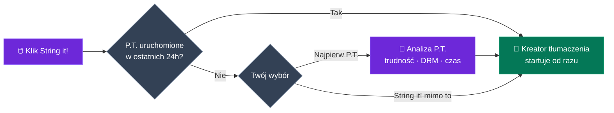
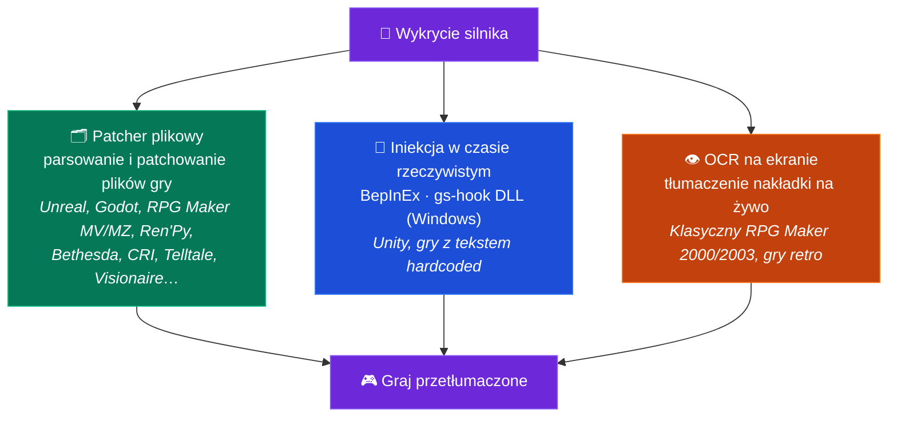

<p align="center">
  
</p>

<h1 align="center">GameStringer</h1>

<p align="center">
  <strong>Aplikacja desktopowa, która tłumaczy gry wideo na dowolny język za pomocą SI.</strong><br>
  Wybierz grę ze swojej biblioteki, wybierz język, kliknij przetłumacz — gotowe.
</p>

<p align="center">
  <a href="https://www.gamestringer.ai"></a>
  <a href="https://discord.gg/SjnD3Z7Uf8"></a>
  
  
  
  
  
  
</p>

<p align="center">
  <a href="https://www.gamestringer.ai">Strona</a> ·
  <a href="https://discord.gg/SjnD3Z7Uf8"><strong>💬 Discord</strong></a> ·
  <a href="#help-wanted"><strong>🙏 Potrzebna pomoc</strong></a> ·
  <a href="#-what-is-gamestringer">Czym jest</a> ·
  <a href="#-download">Pobieranie</a> ·
  <a href="#-how-it-works">Jak to działa</a> ·
  <a href="#-the-prediction-tool-pt">P.T.</a> ·
  <a href="#-supported-game-engines">Silniki</a> ·
  <a href="#-features">Funkcje</a> ·
  <a href="#-build-from-source">Build</a>
</p>

<p align="center">
  <strong>🌍 Czytaj w swoim języku:</strong><br>
  <a href="README.md">🇬🇧 English</a> ·
  <a href="README_IT.md">🇮🇹 Italiano</a> ·
  <a href="README_ES.md">🇪🇸 Español</a> ·
  <a href="README_FR.md">🇫🇷 Français</a> ·
  <a href="README_DE.md">🇩🇪 Deutsch</a> ·
  <a href="README_PT.md">🇧🇷 Português</a> ·
  <a href="README_JA.md">🇯🇵 日本語</a> ·
  <a href="README_ZH.md">🇨🇳 中文</a> ·
  <a href="README_KO.md">🇰🇷 한국어</a> ·
  <a href="README_RU.md">🇷🇺 Русский</a> ·
  🇵🇱 Polski
</p>

> ⚠️ **Aktualizujesz z v1.8.x?** Wersja v1.9.0 przeszła z Tauri v1 na **Tauri v2** — automatyczny aktualizator nie zadziała przy tym przeskoku. Pobierz **v1.9.1** ręcznie: [GameStringer_1.9.1_x64-setup.exe](https://github.com/rouges78/GameStringer/releases/download/v1.9.1/GameStringer_1.9.1_x64-setup.exe). Przyszłe aktualizacje (v1.9.1 → v1.9.x) zadziałają automatycznie.

<p align="center">
  <strong>🌍 Dostępne w 12 językach</strong> — zmień język w aplikacji (IT, EN, ES, FR, DE, PT, PL, RU, JA, ZH, KO, EL) lub na <a href="https://www.gamestringer.ai">stronie</a> (11 języków).
</p>

---

> ### 💜 Słowo od twórcy
>
> GameStringer tworzy **jedna osoba — ja — a mam chorobę Parkinsona**, więc aktualizacje czasem pojawiają się wolniej, niżbym chciał. **Dziękuję za cierpliwość.** **Nie robię tego dla pieniędzy**: chcę po prostu zmienić sposób, w jaki działa tłumaczenie gier, i oddać w ręce graczy naprawdę przydatne narzędzie. **Discord jest już otwarty** 🎉 — [dołącz do nas](https://discord.gg/SjnD3Z7Uf8), żebyśmy mogli pogadać, wymieniać się pomysłami i wspólnie ulepszać GameStringer. 🙏
>
> — *Davide ([@rouges78](https://github.com/rouges78))*

---

<a name="help-wanted"></a>

## 🙏 Potrzebna pomoc — przetestuj na prawdziwych grach i prześlij opinię

> **GameStringer to solowy projekt z otwartym dostępem do kodu i wciąż jest młody.** Obsługuje już ponad 20 silników, ale prawdziwe gry bywają nieprzewidywalne — każdy tytuł przechowuje tekst nieco inaczej. **Najbardziej przydatną rzeczą, jaką możesz teraz zrobić, jest uruchomienie GameStringer na prawdziwej grze i opowiedzenie mi, co się stało.** Nawet *„zawiodło na kroku X"* jest na wagę złota.

**Dlaczego to ważne:** Nie jestem w stanie sam przetestować tysięcy istniejących gier. Ciągłe **testy i opinie** z prawdziwego świata są tym, co zamienia *„działa na moich fixtures"* w *„działa na Twojej grze"*. Twoje zgłoszenia bezpośrednio kształtują roadmapę — to część, w której społeczność przesądza o losie projektu.

### 🧪 Trzy sposoby, by pomóc (wybierz dowolny)

- **🎮 Przetestuj grę i zgłoś wynik.** Uruchom GameStringer na czymś ze swojej biblioteki i wypełnij krótki [raport kompatybilności](https://github.com/rouges78/GameStringer/discussions) — czy silnik został wykryty poprawnie? czy tekst został wyodrębniony? czy patch się nałożył i gra dalej się uruchamia?
- **📦 Udostępnij paczkę.** Jeśli tłumaczenie działa, opublikuj je w aplikacyjnym **Patch Hubie**, żeby inni mogli z niego skorzystać — Twoje nazwisko na nim widnieje (reputacja + „zweryfikowany tłumacz").
- **🛠️ Współtwórz.** Nowe parsery silników, poprawki lokalizacji, skrypty QA — szukaj etykiety `good first issue` w repozytorium.

### 📋 Co szczególnie wymaga testów i opinii

- [ ] **Pokrycie silników na prawdziwych tytułach** — Unity (Mono **oraz** IL2CPP), Unreal (`.locres`, `_P.pak`, IoStore), Godot, RPG Maker **MV/MZ**, Ren'Py, Bethesda (BSA/BA2/ESP), CRI (CPK), Wolf RPG, TyranoScript, Visionaire, Danganronpa
- [ ] **Klasyczny RPG Maker (2000/2003)** przez ekranową **nakładkę OCR** — jak czytelny jest efekt?
- [ ] **Kodowanie i kody sterujące** — poprawne akcenty/CJK w grze oraz nienaruszone tagi/zmienne w grze?
- [ ] **Czcionki** — czy pisma niełacińskie (CJK, cyrylica, greka) renderują się w grze, czy konieczna jest podmiana czcionki?
- [ ] **Jakość tłumaczenia dla danego języka** — który dostawca SI daje najlepsze wyniki dla Twojego języka/gatunku?
- [ ] **Patch Hub** — publikowanie i pobieranie paczek `.gspack` od początku do końca
- [ ] **Wprowadzenie przy pierwszym uruchomieniu i UX** — czy było jasne, jak przetłumaczyć pierwszą grę? co Cię zdezorientowało?
- [ ] **Śledzenie aktualizacji** — po aktualizacji ze sklepu czy poprawnie oznaczono, że patch trzeba nałożyć ponownie?

### 📝 Szablon raportu kompatybilności (skopiuj-wklej)

```
- Gra / sklep / wersja:
- Wykryty silnik (przez GameStringer):
- Osiągnięty krok: Skan / Wykrycie / Ekstrakcja / Tłumaczenie / Patch / Zagrano
- Wynik: ✅ działa / ⚠️ częściowo / ❌ nie działa
- Użyty dostawca SI:
- Język:
- Uwagi (co się zepsuło, kodowanie, zrzuty ekranu):
- System operacyjny + wersja GameStringer:
```

**Gdzie pisać:** [GitHub Discussions](https://github.com/rouges78/GameStringer/discussions) · aplikacyjny **Community Hub** (Wsparcie / Showcase / Prośby) · błędy → [Issues](https://github.com/rouges78/GameStringer/issues).

GameStringer jest darmowy i z otwartym dostępem do kodu; koszty strony i SI pokrywam z własnej kieszeni, więc jeśli oszczędza Ci czas, kawa mile widziana, ale **nigdy** oczekiwana: [Buy Me a Coffee](https://buymeacoffee.com/gamestringer) · [Ko-fi](https://ko-fi.com/gamestringer) · [GitHub Sponsors](https://github.com/sponsors/rouges78).

---

## 🎮 Czym jest GameStringer?

> **W prostych słowach:** wybierz grę → wybierz język → kliknij jeden przycisk. GameStringer znajduje tekst gry, tłumaczy go za pomocą SI i wprowadza z powrotem — najpierw robiąc kopię zapasową. Bez moddingu, bez wiersza poleceń, bez wiedzy technicznej.

GameStringer to **aplikacja desktopowa** (Windows, Linux i macOS), która pozwala tłumaczyć gry wideo niedostępne w Twoim języku.

Większość gier przechowuje swój tekst w plikach — JSON, XML, CSV, `.locres`, `.rpy`, BSA/BA2, CPK, StringTable z Unity Localization i wielu innych formatach. GameStringer **skanuje folder gry**, znajduje te pliki, wysyła tekst przez wybranego przez Ciebie **dostawcę tłumaczenia SI** (OpenAI, Claude, Gemini, DeepSeek, Ollama, 20+ innych) i **wprowadza przetłumaczony tekst** z powrotem do gry. Jedno kliknięcie, bez wiedzy technicznej.

Dla **gier Unity**, które blokują tekst wewnątrz skompilowanych zasobów, GameStringer **automatycznie instaluje BepInEx + XUnity.AutoTranslator** — bez ręcznej konfiguracji. Dla **gier Bethesdy** (Skyrim, Fallout, Starfield) natywnie parsuje BSA/BA2/ESP. Dla **gier z CRI Middleware** (Persona, Yakuza) obsługuje CPK/CRILAYLA/MSG/BMD. Dla **Unreal Engine** edytuje `.locres` bezpośrednio.

**To nie jest strona tłumaczenia maszynowego.** To kompletny potok: **analiza z P.T. → wykrycie silnika → wyodrębnienie tekstu → tłumaczenie SI → kontrola jakości → patch z powrotem → graj.**

---

## 📥 Pobieranie

Pobierz najnowszą wersję z **[GitHub Releases](https://github.com/rouges78/GameStringer/releases)**:

| Platforma | Plik | Uwagi |
|----------|------|-------|
| **Windows** | `GameStringer_1.15.0_x64-setup.exe` | Instalator (zalecany) |
| **Windows** | `GameStringer_1.15.0_x64-portable.zip` | Bez instalacji |
| **Windows** | `GameStringer_1.15.0_x64_en-US.msi` | Wariant MSI |
| **macOS** | `GameStringer_1.15.0_x64.dmg` | Mac z Intelem |
| **macOS** | `GameStringer_1.15.0_aarch64.dmg` | Apple Silicon |
| **Linux** | `GameStringer_1.15.0_amd64.AppImage` | Uniwersalny (zalecany) |
| **Linux** | `GameStringer_1.15.0_amd64.deb` | Debian / Ubuntu |
| **Linux** | `GameStringer-1.15.0-1.x86_64.rpm` | Fedora / RHEL |

**Wymagania:** Windows 10+, macOS 10.15+ lub Linux (Ubuntu 22.04+, Fedora 38+). 4 GB RAM (8 GB+ dla lokalnego SI), 500 MB dysku. Aktualizacje są **podpisane kryptograficznie** i dostarczane przez Tauri Updater (aplikacja weryfikuje każdą aktualizację względem wbudowanego klucza publicznego).

> 🛡️ **Ostrzeżenie antywirusa lub SmartScreen?** To znany **fałszywy alarm** — tłumaczenie w czasie rzeczywistym używa iniekcji DLL (BepInEx / gs-hook), techniki, wobec której skanery heurystyczne są nieufne, a każda nowa wersja startuje z zerową reputacją w SmartScreen. **[Przeczytaj docs/ANTIVIRUS.md](docs/ANTIVIRUS.md)**, żeby dowiedzieć się, co go wyzwala, jak zweryfikować pobrany plik i jak zgłosić fałszywy alarm.

---

## 🚀 Jak to działa

1. **Zainstaluj** GameStringer i uruchom go
2. **Twoja biblioteka gier ładuje się automatycznie** — Steam, Epic, GOG, Origin, Ubisoft, Amazon, itch.io, Humble App, Game Jolt, Big Fish (zainstalowane gry są wykrywane w sekundy, bez limitu liczby)
3. **Wybierz grę** → opcjonalnie uruchom **P.T. (Prediction Tool)**, aby zobaczyć trudność, szacowany czas, najlepszy łańcuch LLM
4. Kliknij **„String it!"** — GameStringer automatycznie skanuje, wyodrębnia, tłumaczy i patchuje
5. **Graj w swoim języku** — kopie zapasowe są zawsze tworzone przed patchowaniem

To wszystko. Bez wiersza poleceń, bez ręcznej edycji plików, bez doświadczenia z moddingiem.

### Potok w pigułce

```mermaid
flowchart LR
    A["📚 Skan<br/>biblioteka i pliki"] --> B["🧠 P.T.<br/>najpierw analiza"]
    B --> C["🎯 Wykrycie<br/>silnika"]
    C --> D["📤 Ekstrakcja<br/>ciągów"]
    D --> E["🤖 Tłumaczenie<br/>SI + TM + glosariusz"]
    E --> F["✅ QA<br/>ocena 0–100"]
    F --> G["🩹 Patch<br/>auto-kopia zapasowa"]
    G --> H["🎮 Graj<br/>w swoim języku"]

    classDef core fill:#6d28d9,stroke:#8b5cf6,color:#fff
    classDef trans fill:#1d4ed8,stroke:#3b82f6,color:#fff
    classDef patch fill:#047857,stroke:#10b981,color:#fff
    classDef res fill:#c2410c,stroke:#f97316,color:#fff
    class A,H res
    class B,C core
    class D,E,F trans
    class G patch
```



---

## 🧠 Prediction Tool (P.T.)

> **Najpotężniejsza funkcja w GameStringer.** Nie rozpoczynaj tłumaczenia na ślepo — najpierw przeanalizuj.

P.T. to silnik głębokiej analizy, który działa *przed* jakimkolwiek tłumaczeniem. Skanuje folder gry, wykrywa silnik, szacuje objętość tekstu do przetłumaczenia i mówi Ci:

- **Difficulty Score 0–100** — łączna waga objętości ciągów, złożoności silnika, DRM, kodowania, wyzwań językowych
- **Szacowany czas** na **18 modelach LLM** — Ollama (Gemma 4, Qwen 3, Llama), OpenAI GPT-4/4o, Claude 3.5, Gemini, DeepL, DeepSeek, Groq
- **5 zalecanych łańcuchów LLM**: Local (prywatność), Cloud (jakość), Hybrid (zrównoważony), Budget, Premium — każdy z oceną kosztów i jakości
- **Wykrywanie DRM**: Denuvo, VMProtect, Steam DRM, EAC, BattlEye — ostrzega, zanim spróbujesz
- **Analiza kodowania**: Shift-JIS, UTF-8, UTF-16, Big5, EUC-KR wykrywane dla każdego pliku
- **Złożoność tłumaczenia**: formy grzecznościowe, zgodność rodzaju, RTL, ruby/furigana, specyficzna obsługa CJK
- **Ocena pewności** i **plan workflow** — dokładne kroki, które zostaną wykonane po kliknięciu „String it!"
- **Eksport raportu** (JSON + Markdown) do udostępniania lub archiwizacji

### P.T.Rank — Szybki ranking

Po uruchomieniu P.T. na wielu grach otwórz **P.T.Rank**, aby zobaczyć wszystkie przeanalizowane tytuły posortowane według trudności. Idealne do planowania kolejki tłumaczeń: zacznij od łatwych zwycięstw, RPG-i z setkami tysięcy ciągów zostaw na koniec.

### Dry Run Scanner

Nie chcesz analizować jednej gry na raz? Uruchom **Dry Run** ze strony Biblioteki, aby skanować **całą zainstalowaną bibliotekę wsadowo**, bez limitu liczby gier,, z **zerową modyfikacją plików**. Otrzymasz raport JSON kategoryzujący każdą grę jako **Ready** (silnik wspierany + ciągi do wyodrębnienia), **Errors** (problemy z manifestem / blokada DRM) lub **Unsupported** (nieznany silnik / brak tekstu). Postęp jest w czasie rzeczywistym, a kopia zapasowa nie jest potrzebna, ponieważ niczego się nie dotyka.

### String it! Smart Gate

Przycisk **„String it!"** na stronie szczegółów gry jest inteligentny: jeśli gra została już przeanalizowana przez P.T. w ciągu ostatnich 24h, uruchamia bezpośrednio kreator tłumaczenia. W przeciwnym razie sugeruje najpierw uruchomienie P.T. (z wyborem jednego kliknięcia „Run P.T. first" / „String it! anyway"). Koniec z marnowanymi uruchomieniami na grach, które okazują się zablokowane przez DRM lub są 5-minutowymi błahostkami.



---

## 🎯 Wspierane silniki gier

Jedno wykrycie silnika, **trzy drogi tłumaczenia** — GameStringer automatycznie wybiera najlepszą:



GameStringer ma **12 silników z dedykowanym parserem** i rozpoznaje łącznie **ponad 20**, z różnym poziomem głębokości:

| Silnik | Wsparcie | Jak to działa |
|--------|---------|--------------|
| **Unity** | ✅ Pełne | Automatycznie instaluje BepInEx + XUnity.AutoTranslator + potok Unity Localization Package (StringTable, SharedTableData, Addressables, Smart Strings) |
| **Unreal Engine** | ✅ Pełne | Wyodrębnianie i patchowanie `.locres` z UnrealLocres |
| **Unreal _P.pak** | ✅ Pełne | Pakowanie moda jako `<GameStringer>_P.pak` ładowanego przez folder Paks |
| **Godot** | ✅ Pełne | Natywne wsparcie plików `.translation` |
| **RPG Maker** | ✅ Pełne | MV/MZ JSON, VX/Ace przez Trans, XP przez RMXP |
| **Ren'Py** | ✅ Pełne | Natywne parsowanie skryptów `.rpy` z wykrywaniem dialogów |
| **GameMaker** | ⚡ Częściowe | Przez integrację UndertaleModTool |
| **Telltale** | ✅ Pełne | Wsparcie `.langdb` / `.dlog` |
| **Wolf RPG** | ✅ Pełne | Integracja WolfTrans |
| **Kirikiri** | ✅ Pełne | Parsowanie `.ks` / `.scn` |
| **TyranoScript** | ✅ Pełne | Ekstraktor fast-path z patchowaniem JSON |
| **Electron** | ✅ Pełne | Rozpakowywanie ASAR + wykrywanie JSON i18n |
| **Bethesda (Skyrim/Fallout/Oblivion/Starfield)** | ✅ **NEW v1.9.0** | Parser BSA v103-105 + BA2 GNRL/DX10 + ESP/ESM (FULL/DESC/NAM1), STRINGS/DLSTRINGS/ILSTRINGS |
| **CRI Middleware (Persona/Yakuza/Tales of/Dragon Ball)** | ✅ **NEW v1.9.0** | CPK + CRILAYLA + MSG/BMD/FTD z auto-wykrywaniem Shift-JIS/UTF-8/UTF-16 |
| **Visionaire Studio** | ✅ Pełne | Przygodówki Daedalic (Deponia, Edna itp.) |
| **Danganronpa WAD** | ✅ Pełne | Parser archiwum WAD + patchowanie dialogów STX |

> **Gry Unity** otrzymują specjalne traktowanie: jeśli nie znaleziono żadnych plików do tłumaczenia, GameStringer wykrywa, że to gra Unity i oferuje **automatyczne zainstalowanie BepInEx + XUnity.AutoTranslator** jednym kliknięciem. Wystarczy uruchomić grę raz po instalacji, następnie ponownie skanować — cały tekst staje się możliwy do przetłumaczenia.
>
> ⚠️ **Ostrzeżenie Anti-Cheat**: BepInEx (iniekcja DLL) może wyzwalać systemy anti-cheat (EAC, BattlEye, Vanguard). GameStringer zawiera wykrywanie anti-cheat i ostrzeże Cię. **Używaj tylko w grach single-player / offline.** P.T. wykrywa DRM przed jakąkolwiek modyfikacją.

---

## ✨ Funkcje

### 🆕 Nowości w v1.15.0 — dostrajanie Ollamy i Projekty ↔ Patch Hub

- **🎚 Panel parametrów inferencji Ollama** — dostrój tłumaczenia z lokalną Ollamą za pomocą presetów **Wierny / Zrównoważony / Kreatywny** albo przełącz się w **tryb eksperta**, aby bezpośrednio sterować parametrami temperature, top-p i pozostałymi ustawieniami próbkowania; wybór jest nieinwazyjnie podpięty do każdego wywołania tłumaczenia Ollama
- **🔗 Integracja Projekty ↔ Patch Hub** — **zaimportuj `.gspack` jako ukończony projekt**, opublikuj w Hubie **z danymi wypełnionymi wprost z projektu**, przełączaj się między trybami **Odkrywaj / Moje łatki** i **Zastosuj do gry** jednym kliknięciem (z automatyczną kopią zapasową)
- **💬 Widget opinii w aplikacji** — wyślij opinię lub zgłoś problem bez opuszczania aplikacji
- **⚡ Szybszy Patch Hub** — **buforowanie + ograniczanie liczby żądań** odpowiedzi dla płynniejszego przeglądania i pobierania pod obciążeniem
- **🐛 Poprawki** — webview z wiadomościami RSS nie jest już blokowany przez CORS, plus nowy przebieg **audytu dostępności WCAG 2.1 AA**

### 🆕 Nowości w v1.14.0 — kompatybilność społecznościowa i niezawodne paczki

- **🧭 Telemetria kompatybilności (opt-in)** — „ProtonDB tłumaczeń": zgłoś, czy tłumaczenie zadziałało, i zobacz **odznaki kompatybilności na kartach gier**, oparte na zgłoszeniach społeczności z zabezpieczeniami przed nadużyciami oraz [publiczną stroną statystyk](https://gamestringer.ai/compatibilita.html)
- **🔤 Wykrywanie brakujących glifów + automatyczna naprawa czcionki** — GameStringer parsuje mapę znaków czcionki gry, wykrywa, kiedy brakuje glifów Twojego języka, i **automatycznie instaluje pasującą czcionkę Noto** dla silników plikowych (Ren'Py, RPG Maker) — koniec z kwadracikami tofu zamiast tekstu
- **🛡 Weryfikowalna integralność paczek** — paczki społeczności są weryfikowane za pomocą **zagregowanego SHA-256**, ochrony przed path-traversal i automatycznego oznaczania zmanipulowanych paczek
- **💥 Zgłaszanie awarii (opt-in)** — anonimowe zgłoszenia z sygnaturami powtarzających się awarii, dzięki czemu awarie naprawiane są szybciej
- **📚 Solidne skanowanie języków biblioteki** — bardziej niezawodne wykrywanie języków, które gra już zawiera, plus ręczny przycisk „Wykryj języki"
- **💬 Discord działa** — dołącz na [discord.gg/SjnD3Z7Uf8](https://discord.gg/SjnD3Z7Uf8)
- **🧪 Zestaw testów regresji parserów** — współdzielone binarne fixtures (Godot, .locres, STX, RPG Maker, CRI CPK, Bethesda) sprawdzane zarówno przez parsery Rust, jak i TS; znaleziono i naprawiono 2 prawdziwe błędy
- **📰 Czystszy feed wiadomości** — usunięto szum diffów MediaWiki, odfiltrowano posty z promocjami

### 🆕 Nowości w v1.13.0

- **🖥 Tłumacz UE w czasie rzeczywistym oznaczony jako eksperymentalny** — narzędzie Unreal w czasie rzeczywistym od razu informuje o swoim eksperymentalnym statusie i sprawdza, czy gra rzeczywiście działa, zanim wystartuje
- **🎛 Kontrole jakości w Ustawieniach** — przełączniki dla nowych funkcji jakości tłumaczenia (przebieg refleksji, pobieranie semantyczne) plus poszerzona lista dozwolonych dostawców
- **🌐 Strona + i18n** — sekcja v1.12.0 na stronie z infografikami i notką od twórcy, w 12 językach; klucze `aiQuality` / `semantic` / `lore` uzupełnione we wszystkich lokalizacjach
- **🐛 Poprawki** — CI buduje teraz wydanie z bieżącej gałęzi zamiast z jeszcze nieutworzonego tagu; polityki INSERT forum w Supabase odtworzone przy wzmocnieniu RLS, z łagodnym wyjściem mostka; zdeduplikowana wersja migracji `20260626`

### 🆕 Nowości w v1.12.0 — mądrzejsze, samosprawdzające się tłumaczenia

- **👁️ Tłumaczenie z kontekstem wizualnym (VLM)** — dla tłumaczenia na żywo / na ekranie model wizyjny SI *widzi teraz kadr* i tłumaczy z tym kontekstem, więc przestaje zgadywać przy niejednoznacznych słowach (czy *„Chest"* to skrzynia ze skarbem, czy klatka piersiowa?). Działa z modelem **lokalnym** (Ollama) lub **OpenAI / Gemini**. Zrzuty ekranu są natywnie przycinane i skalowane dla szybkości.
- **🪞 Samopoprawiające się tłumaczenia (Reflection)** — po przetłumaczeniu GameStringer może uruchomić szybki drugi przebieg, który sprawdza własną pracę względem Twojego **glosariusza, tonu i formatowania** i poprawia tylko te wiersze, które faktycznie tego wymagają. Domyślnie selektywne, więc pozostaje szybkie i tanie.
- **🧠 Pamięć semantyczna (RAG)** — Twoja Translation Memory i glosariusz są teraz dopasowywane po **znaczeniu**, a nie tylko po dokładnych słowach, więc raz przetłumaczona fraza jest ponownie wykorzystywana, nawet gdy jest sformułowana inaczej — utrzymując spójną terminologię w całej grze. W pełni lokalne (embeddingi Ollama); wraca do dopasowania po słowach kluczowych, jeśli jest niedostępne.
- **⚡ Płynniejsze tłumaczenie na żywo** — przebudowany potok nakładki na żywo i natywna obsługa obrazów dla szybszego, czystszego wyniku na ekranie.
- **🔌 Więcej dostawców od ręki** — poszerzono listę dozwolonych, dzięki czemu więcej backendów po prostu działa: DeepL, Groq, Cerebras, Cohere, Together, Fireworks, Hugging Face, Azure Translator, DashScope, LibreTranslate, Lingva, MyMemory.

### 🆕 Nowości w v1.11.2

- **Więcej sklepów** — wykrywanie lokalnej instalacji dla **Humble App, Game Jolt i Big Fish Games**, obok istniejących launcherów
- **Sprawdzanie tłumaczeń** — sprawdź, czy gra już zawiera Twój język, przez **PCGamingWiki**, plus szybkie **linki do wyszukiwania włoskich fan-patchy** z widoku gry
- **Publikuj w Patch Hubie** — wyślij ukończony projekt do społecznościowego **Patch Huba** w jednym kroku (`app/projects` → publikuj, ponownie wykorzystuje `publishPack`)
- **Przegląd Community Hub** — nowy panel startowy z ostatnią aktywnością, najnowszymi paczkami i kategoriami
- **Wiadomości o włoskich tłumaczeniach** — dodano wyselekcjonowane feedy RSS fan-tłumaczeń (Ctrl+Trad, OldGamesItalia, Romhacking.it, Language Pack Italia, Q-Gin, …)
- **String it! wszędzie** — routing jednego kliknięcia dla Unity/Unreal/Godot + chmurowy potok **TyranoScript**
- **Unity** — lokalny mostek **Ollama** dla XUnity (CustomTranslate); pobierania BepInEx/XUnity/TMP/UABEA rozwiązywane z GitHub API
- **Godot** — przepisany parser `.pck` czyta prawdziwe archiwa **Godot 4.4+** (zweryfikowane na *Slay the Spire 2*)
- **Niezawodność desktopu** — usunięto ostatnie wywołania web `/api`: edytor używa lokalnej TM, a wywołania translate/export/voice/store przechodzą przez natywny backend

### 🆕 Nowości w v1.10.2

- **Poprawka auto-aktualizatora** — rozwiązano zablokowany stan „Preparing…", w którym aktualizacja nigdy nie zaczynała się pobierać. Do `downloadAndInstall` przekazywano nieaktualny obiekt aktualizacji Reacta, a flaga `updating` nigdy nie była resetowana; teraz auto-aktualizacja niezawodnie startuje, pobiera i instaluje (`components/notifications/auto-updater.tsx`, `hooks/use-tauri-updater.ts`)
- **Niezawodne zapisywanie ustawień** — ustawienia aplikacji i klucze API dostawców SI są teraz niezawodnie zapisywane na dysku (`data_dir/GameStringer/settings.json`) przez polecenia Tauri `save_app_settings` / `load_app_settings`; wcześniej niektóre ustawienia nie były zachowywane
- **Ręczne dodawanie gier z dysku** — możesz teraz dodać grę, wybierając jej folder z dysku, bez polegania wyłącznie na auto-wykrywaniu biblioteki (Steam/Epic/itd.) (`lib/manual-games.ts`, `app/library/page.tsx`)

### 🆕 Nowości w v1.9.1

- **Poprawka CSP blokującej Supabase** — Community Chat był po cichu blokowany przez rygorystyczną politykę Content Security Policy Tauri v2. Dodano `https://*.supabase.co` i `wss://*.supabase.co` do `connect-src`
- **Poprawka auto-łączenia czatu** — skoordynowano uwierzytelnianie między `main-layout` a `persistent-chat` przez zdarzenia niestandardowe, eliminując wyścigi
- **Poprawka błędu timeoutu** — nieaktualne domknięcie w max-timeout powodowało fałszywe „Tempo di caricamento troppo lungo", nawet gdy czat załadował się poprawnie
- **Buildy macOS** — DMG (Intel) i `.app.tar.gz` (Apple Silicon) są teraz dostępne

### 🆕 Nowości w v1.9.0

- **Ujednolicona obecność online** — Supabase Realtime + fallback DB, auto-away/auto-online, heartbeat co 30s
- **Powiadomienia w zasobniku systemowym** — natywne powiadomienia OS dla czatu, tłumaczeń, błędów, aktualizacji, gier, znajomych, wiadomości z konfigurowalnymi godzinami ciszy
- **Error Boundaries + Crash Recovery** — WidgetErrorBoundary (auto-retry 5s, maks. 3), AppErrorBoundary z przeładowaniem
- **Odporność sieci / Tryb offline** — monitor sieci, pasek statusu (czerwony/bursztynowy/zielony), ponawianie z wykładniczym backoffem, kolejka offline
- **Profile głosowe postaci (klonowanie głosu)** — automatyczne wyodrębnianie stylu postaci z dialogów, 16 tonów, iniekcja promptu dla spójnego tłumaczenia
- **Infrastruktura fine-tuningu** — zbiory danych z poprawek ludzkich (Adaptive MT), 4 formaty eksportu, zarządzanie modelami per-gra z Ollamą
- **Code Splitting / Lazy Loading** — 8 ciężkich komponentów przeniesiono na React.lazy + Suspense dla szybszego startu
- **Poprawki błędów** — podwójna inicjalizacja NetworkResilience + wyciek listenera, Supabase 400 user_profiles, ciągi wersji w zasobniku, ominięcie godzin ciszy dla krytycznych powiadomień

### 🤖 Tłumaczenie SI

- **20+ dostawców**: OpenAI, Claude, Gemini, DeepSeek, Mistral, Groq, DeepL, Ollama (lokalny), LM Studio, TranslateGemma, HY-MT, Qwen 3, NLLB-200, Cerebras, Together AI, Fireworks, OpenRouter, Cohere, Lingva, MyMemory
- **Context-aware**: rozumie gatunek gry, głos postaci, ton, narrację vs UI vs dialog
- **Translation Memory i glosariusz**: spójność w całym projekcie z automatycznym wyodrębnianiem glosariusza
- **Auto-Select Engine** (NEW v1.7.0): preset `auto` dynamicznie rankujący dostawców według języka docelowego + gatunku gry (DeepL dla europejskich, Claude dla CJK, wzmocnienie zależne od gatunku)
- **Multi-LLM Compare**: uruchamia wielu dostawców równolegle, wybierz najlepszy wynik dla każdego ciągu
- **Quality gates**: automatyczne ocenianie QA każdego przetłumaczonego ciągu (0-100) z ContentTypeBadge
- **Vision LLM Translator**: używa zrzutów ekranu z gry jako kontekstu (Ollama, Gemini, GPT-4o)
- **Live Quality Preview**: zobacz oceny jakości w czasie rzeczywistym podczas tłumaczenia wsadowego
- **Wsparcie RTL**: automatyczne wykrywanie kierunku i obsługa atrybutu `dir`

### 🧠 P.T. — Prediction Tool (v1.9.0)

- **Difficulty Score 0-100** z ważonymi czynnikami (objętość, silnik, DRM, kodowanie, złożoność)
- **Szacunki czasu dla 18 modeli LLM**, w tym Gemma 4 (27B MoE A4B / E4B / E2B)
- **5 łańcuchów LLM** (Local / Cloud / Hybrid / Budget / Premium) z szacunkami kosztów i jakości
- **Wykrywanie DRM / Anti-Cheat** (Denuvo, VMProtect, Steam DRM, EAC, BattlEye, Vanguard)
- **Analiza kodowania** dla każdego pliku (Shift-JIS, UTF-8/16, Big5, EUC-KR)
- **Analiza złożoności tłumaczenia** (formy grzecznościowe, rodzaj, CJK, ruby, RTL)
- **P.T.Rank / Quick Ranking** — sortuje wszystkie przeanalizowane gry według trudności
- **Dry Run Scanner** — wsadowe skanowanie całej zainstalowanej biblioteki, bez limitu liczby gier, bez modyfikacji
- **Workflow Orchestrator** — rzeczywisty silnik wykonania z uniwersalnym fast path dla 6+ silników i postępem w czasie rzeczywistym
- **Cache predykcji** (24h) — natychmiastowe ponowne otwieranie wcześniej przeanalizowanych gier
- **Eksport raportu** (JSON + Markdown) do udostępniania i archiwizacji

### 📚 Biblioteka gier

- **Auto-detect**: Steam (z Family Sharing), Epic, GOG Galaxy, Origin/EA, Ubisoft Connect, Amazon Games, itch.io, Humble App, Game Jolt, Big Fish Games
- **Cała zainstalowana biblioteka** rozpoznawana w sekundy, bez limitu liczby gier
- **Karty gier** z okładkami, metadanymi, odznaką silnika, odznaką VR, statusem instalacji
- **Szybkie akcje przy najechaniu**: String it!, Batch, Community, P.T. — wszystkie jednym kliknięciem
- **Game Update Tracker**: wykrywa, gdy Steam aktualizuje przetłumaczoną grę (przez `buildid`), weryfikuje integralność patcha (pliki BepInEx, obecność `_P.pak`), ostrzega, jeśli wymagane jest ponowne patchowanie
- Przycisk **„Stop monitoring"**, aby zaprzestać śledzenia konkretnej gry

### 🔧 Narzędzia tłumaczeniowe

- **One-Click Translate** („String it!"): skanowanie → tłumaczenie → patch w jednym przepływie
- **Batch Translation**: tłumacz całe gry lub foldery naraz
- **Tłumacz napisów**: SRT, VTT, ASS/SSA z zachowaniem taktowania
- **OCR Translator**: wyodrębnia tekst z gier retro (presety 8-bit, 16-bit, DOS) z prawdziwym backendem Tauri Tesseract
- **Voice Pipeline**: speech-to-text → tłumacz → text-to-speech z **Duration Matching** (NEW v1.7.0) — automatycznie dostosowuje prędkość do długości oryginalnego audio
- **Lip Sync** (NEW v1.7.0): integracja Rhubarb do generowania wizem (A-X), interaktywna oś czasu, eksport dla Unity (blend shapes) i Unreal (FaceFX)
- **Gridly CSV Export/Import** (NEW v1.7.0): wielojęzyczny format kolumnowy kompatybilny z Gridly, Lokalise i Crowdin
- **Overlay w czasie rzeczywistym**: zobacz tłumaczenia podczas gry przez VR/screen overlay
- **Auto-Translate Review**: przycisk „Translate all untranslated" z paskiem postępu
- **Lore Assistant**: czat RAG, który zna lore i dialogi gry
- **Character Voice Profiles**: zdefiniuj osobowość, ton, wzorce mowy dla każdej postaci
- **Translation Confidence Heatmap**: wizualny przegląd jakości wszystkich tłumaczeń

### 🎮 Patchery silników gier

- **Unity**: auto-instalator BepInEx + XUnity.AutoTranslator, Unity Localization Package (StringTable, SharedTableData, katalog Addressables, walidator Smart Strings)
- **Unreal Engine**: wyodrębnianie `.locres` + pakowanie moda `_P.pak`
- **Bethesda Engine Patcher** (NEW v1.9.0): Skyrim LE/SE/AE, Fallout 3/NV/4, Oblivion, Starfield — BSA v103-105 + BA2 GNRL/DX10 + ESP/ESM (FULL/DESC/NAM1)
- **CRI Middleware Patcher** (NEW v1.9.0): Persona 5 Royal, Yakuza, Tales of, Dragon Ball — CPK + CRILAYLA + MSG/BMD/FTD
- **Ren'Py**, **RPG Maker**, **Godot**, **GameMaker**, **Kirikiri**, **Wolf RPG**, **Telltale**, **Visionaire**, **Danganronpa WAD** — wszystkie z natywnymi parserami
- **Wizard Stepper**: wspólny wieloetapowy UI dla wszystkich patcherów
- **Universal PO Export** (gettext `.po`) dla każdego patchera z metadanymi projektu/języka/źródła/silnika
- **Automatyczna kopia zapasowa**: przed każdym patchem, z przywracaniem jednym kliknięciem

### 🔌 Zaawansowane

- **Auto-Hook Scanner**: skanowanie pamięci procesu (Windows WinAPI) dla ciągów hardcoded
- **System Monitor**: użycie VRAM/RAM w czasie rzeczywistym do planowania lokalnego LLM
- **Ollama Setup Wizard**: krok po kroku instalacja lokalnego SI
- **Ollama Manager**: auto-discovery modeli z rejestru ollama.com + auto-odświeżanie przy fokusie/nawigacji
- **Debug Console**: zintegrowana konsola z przechwytywaniem logów
- **Video Extractor** (v1.7.0): wyodrębnianie i konwertowanie wideo FMV z gier retro/nowoczesnych (VMD, BIK, SMK, USM, ROQ) z upscalingiem SI (Real-ESRGAN), bezpośredni link ze strony szczegółów gry
- **Plugin System**: dokument projektowy dla wtyczek innych firm (zobacz `docs/PLUGIN_SYSTEM.md`)
- **Community Hub**: udostępniaj i pobieraj Translation Memories + integracja z GitHub Discussions
- **Public API v1**: punkty końcowe REST do integracji (`/api/v1/translate`, `/api/v1/batch`)

### 💬 Community Chat

- **Czat w czasie rzeczywistym** z innymi tłumaczami przez Supabase Realtime
- **4 domyślne pokoje**: General, Translations, Feedback & Bugs, Announcements
- **Niestandardowe pokoje**: twórz pokoje dla konkretnych gier lub projektów
- **Auto-Bridge Auth**: Twój profil GameStringer automatycznie synchronizuje się z Supabase — bez dodatkowego logowania
- **Obecność online**: zobacz, kto jest online w każdym pokoju
- **Odpowiedz / edytuj / usuń** wiadomości z własnością wymuszoną przez RLS
- **Rozszerzalny widget drawer** w prawym dolnym rogu

### ♿ Dostępność (v1.9.0)

- **WCAG 2.1 AA sweep** — `aria-label` na przyciskach ikon, semantyczne nagłówki `CardTitle`, `focus-visible` na wszystkich prymitywach, link skip-to-content, landmark `main`, włoskie helpery `sr-only`
- **`prefers-reduced-motion`** respektowane we wszystkich animacjach
- **`forced-colors`** (tryb wysokiego kontrastu Windows) respektowany
- **UI w 12 językach**: IT, EN, ES, FR, DE, JA, ZH, KO, PT, RU, PL, EL (grecki dodany w v1.10.0)
- **Wsparcie układu RTL** z automatycznym wykrywaniem kierunku

### 🎨 Design System (v1.9.0)

- **Warianty Card** przez `cva`: default, muted, highlight, success, error, warning
- **Rozmiary Button**, w tym `xs` i `icon-sm`
- **Narzędzia tekstowe**: `text-micro` (9px), `text-2xs` (10px) — koniec z dowolnymi wartościami Tailwind
- **Ujednolicone Radix UI**: zmigrowano 37 plików z `@radix-ui/react-*` do `radix-ui`, usunięto 27 pakietów
- **Zoptymalizowany bundle**: `optimizePackageImports` dla radix-ui, framer-motion, recharts, cmdk

### 🖥️ Aplikacja

- **Podpisane auto-aktualizacje**: aktualizacja jednym kliknięciem z aplikacji przez Tauri Updater
- **Profile**: wiele profili użytkownika z kluczami odzyskiwania
- **Global Hotkeys**: `Ctrl+Shift+T` OCR, `Ctrl+Shift+Q` Quick Translate, `Ctrl+Alt+O` Overlay, `Alt+T` przełącznik XUnity
- **System Tray**: szybkie akcje, status Ollama na żywo, podmenu narzędzi, natywne powiadomienia OS z preferencjami
- **Cross-platform**: Windows, macOS i Linux z natywnymi buildami
- **Poprawka tray Windows**: zapobiega pętli błysków konsoli przy spawnie procesów potomnych

---

## 🔧 Dostawcy SI

| Dostawca | Klucz API | Free Tier | Najlepszy do |
|----------|---------|-----------|----------|
| **Ollama** | Nie (lokalny) | ✅ Bez limitu | Prywatność, offline |
| **LM Studio** | Nie (lokalny) | ✅ Bez limitu | Prywatność, modele GGUF |
| **TranslateGemma** | Nie (Ollama) | ✅ Bez limitu — 55 języków, Google | **Zalecany start** |
| **HY-MT1.5** | Nie (Ollama) | ✅ Bez limitu — ~1GB RAM, Tencent | Maszyny z małym RAM |
| **Qwen 3** | Nie (Ollama) | ✅ Bez limitu — wielojęzyczny | Języki CJK |
| **Gemma 4** | Nie (Ollama) | ✅ Bez limitu — 27B MoE A4B/E4B/E2B | Lokalna jakość |
| **Gemini** | Tak | ✅ Free tier (15 RPM) | **Zalecana chmura** |
| **DeepSeek** | Tak | ✅ $0.14/1M input | Tania chmura |
| **Groq** | Tak | ✅ 14 400 zapytań/dzień | Szybkość |
| **Mistral** | Tak | ✅ Free tier | Chmura UE |
| **OpenAI** | Tak | Płatne | Jakość GPT-4o |
| **Claude** | Tak | Płatne | Niuanse, długi kontekst |
| **DeepL** | Tak | ✅ 500k znaków/miesiąc | Języki europejskie |
| **MyMemory** | Nie | ✅ Bez limitu | Fallback |
| **Lingva** | Nie | ✅ Bez limitu | Lustro Google MT |
| **Cerebras** | Tak | ✅ Free tier | Szybkość |
| **Together AI** | Tak | ✅ $25 darmowego kredytu | Modele otwarte |
| **Fireworks** | Tak | ✅ Free tier | Modele otwarte |
| **OpenRouter** | Tak | ✅ Darmowe modele | Różnorodność modeli |
| **NLLB-200** | Tak | ✅ 200 języków | Rzadkie języki |
| **Cohere** | Tak | ✅ Darmowy trial | RAG |

**Zalecane na start**: **TranslateGemma** przez Ollama (darmowe, lokalne, 55 języków) lub **Gemini** (free tier, chmura). Mały RAM: **HY-MT1.5** (~1GB). Najlepsza jakość: **Claude 3.5** lub **GPT-4o**. Najlepsze CJK: **Qwen 3**.

---

## 📖 Dokumentacja

### Przewodniki użytkownika (12 języków)

| | | |
|---|---|---|
| 🇮🇹 [Italiano](docs/GUIDA_UTENTE.md) | 🇬🇧 [English](docs/USER_GUIDE_EN.md) | 🇪🇸 [Español](docs/USER_GUIDE_ES.md) |
| 🇫🇷 [Français](docs/USER_GUIDE_FR.md) | 🇩🇪 [Deutsch](docs/USER_GUIDE_DE.md) | 🇯🇵 [日本語](docs/USER_GUIDE_JA.md) |
| 🇨🇳 [中文](docs/USER_GUIDE_ZH.md) | 🇰🇷 [한국어](docs/USER_GUIDE_KO.md) | 🇧🇷 [Português](docs/USER_GUIDE_PT.md) |
| 🇷🇺 [Русский](docs/USER_GUIDE_RU.md) | 🇵🇱 [Polski](docs/USER_GUIDE_PL.md) | 🇮🇷 [فارسی](docs/USER_GUIDE_FA.md) |

### Dokumentacja projektu

- **[CHANGELOG.md](CHANGELOG.md)** — pełna historia wersji
- **[ROADMAP.md](ROADMAP.md)** — priorytetyzowana roadmapa (P0/P1/P2)
- **[docs/VERSIONING.md](docs/VERSIONING.md)** — polityka wersjonowania
- **[docs/PROJECT_STATUS.md](docs/PROJECT_STATUS.md)** — aktualny status w skrócie
- **[docs/ANTIVIRUS.md](docs/ANTIVIRUS.md)** — fałszywe alarmy antywirusa / SmartScreen
- **[PLUGIN_SYSTEM.md](docs/PLUGIN_SYSTEM.md)** — projekt architektury wtyczek
- **[LICENSE](LICENSE)** — Source-Available License v1.1
- **[docs/LEGAL.md](docs/LEGAL.md)** — stanowisko prawne i zasady dopuszczalnego użytku

---

## 🛠️ Budowanie ze źródeł

**Wymagania wstępne**: Node.js 18+, Rust 1.70+, npm. W Linuksie także: `libwebkit2gtk-4.1-dev`, `libayatana-appindicator3-dev`, `librsvg2-dev`.

```bash
git clone https://github.com/rouges78/GameStringer.git
cd GameStringer
npm install
npm run dev          # rozwój
npm run tauri:build  # build produkcyjny
```

Backend Rust: `cd src-tauri && cargo check`, aby zweryfikować, że polecenia Tauri kompilują się na Twojej platformie.

---

## 💖 Wsparcie

Jeśli GameStringer pomógł Ci grać w gry w Twoim języku:

<p align="center">
  <a href="https://buymeacoffee.com/gamestringer">
    
  </a>
  <a href="https://ko-fi.com/gamestringer">
    
  </a>
  <a href="https://github.com/sponsors/rouges78">
    
  </a>
</p>

---

## 📜 Licencja

**Source-Available License v1.1** — kod źródłowy jest publiczny i możesz go zbudować samodzielnie, ale nie jest to „Open Source" zatwierdzony przez OSI.

- ✅ Darmowy do użytku osobistego
- ✅ Swobodnie do inspekcji, budowania i modyfikowania dla siebie
- ❌ Użytek komercyjny wymaga pisemnej zgody
- ❌ Redystrybucja zmodyfikowanych wersji wymaga pisemnej zgody

Zobacz [LICENSE](LICENSE) po szczegóły oraz **[docs/LEGAL.md](docs/LEGAL.md)** po stanowisko prawne projektu i zasady dopuszczalnego użytku. Pytania? Otwórz [Discussion](https://github.com/rouges78/GameStringer/discussions).

---

## 🙏 Credits

- **[BepInEx](https://github.com/BepInEx/BepInEx)** — framework moddingowy Unity (BepInEx Team)
- **[XUnity.AutoTranslator](https://github.com/bbepis/XUnity.AutoTranslator)** — framework tłumaczeniowy Unity (bbepis)
- **[UnrealLocres](https://github.com/akintos/UnrealLocres)** — parser Unreal `.locres` (akintos)
- **[UndertaleModTool](https://github.com/krzys-h/UndertaleModTool)** — modding GameMaker (krzys-h)
- **[Tauri](https://tauri.app)** — framework aplikacji desktopowych
- **[Tesseract.js](https://github.com/naptha/tesseract.js)** — silnik OCR
- **[Ollama](https://ollama.com)** — lokalny runtime LLM
- **[Supabase](https://supabase.com)** — backend realtime dla Community Chat

---

<p align="center">
  Stworzone z ❤️ dla graczy, którzy chcą grać w swoim własnym języku<br>
  <strong>GameStringer v1.15.0</strong> · <a href="https://www.gamestringer.ai">gamestringer.ai</a> · © 2025-2026 GameStringer Team
</p>
