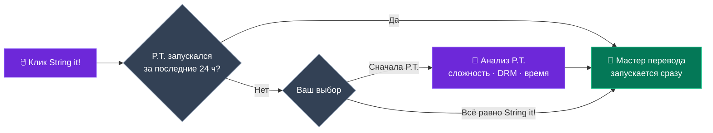
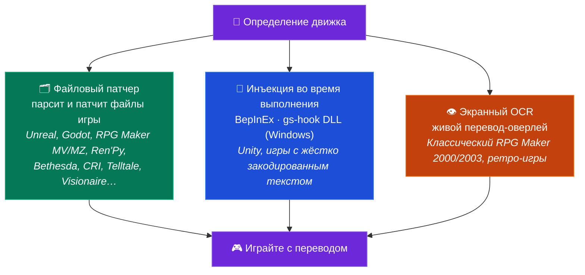

<p align="center">
  
</p>

<h1 align="center">GameStringer</h1>

<p align="center">
  <strong>Настольное приложение, которое переводит видеоигры на любой язык с помощью ИИ.</strong><br>
  Выберите игру из вашей библиотеки, выберите язык, нажмите «перевести» — готово.
</p>

<p align="center">
  <a href="https://www.gamestringer.ai"></a>
  <a href="https://discord.gg/SjnD3Z7Uf8"></a>
  
  
  
  
  
  
</p>

<p align="center">
  <a href="https://www.gamestringer.ai">Сайт</a> ·
  <a href="https://discord.gg/SjnD3Z7Uf8"><strong>💬 Discord</strong></a> ·
  <a href="#help-wanted"><strong>🙏 Нужна помощь</strong></a> ·
  <a href="#-что-такое-gamestringer">Что это</a> ·
  <a href="#-загрузка">Загрузка</a> ·
  <a href="#-как-это-работает">Как это работает</a> ·
  <a href="#-prediction-tool-pt">P.T.</a> ·
  <a href="#-поддерживаемые-игровые-движки">Движки</a> ·
  <a href="#-возможности">Возможности</a> ·
  <a href="#-сборка-из-исходников">Сборка</a>
</p>

<p align="center">
  <strong>🌍 Читать на вашем языке:</strong><br>
  <a href="README.md">🇬🇧 English</a> ·
  <a href="README_IT.md">🇮🇹 Italiano</a> ·
  <a href="README_ES.md">🇪🇸 Español</a> ·
  <a href="README_FR.md">🇫🇷 Français</a> ·
  <a href="README_DE.md">🇩🇪 Deutsch</a> ·
  <a href="README_PT.md">🇧🇷 Português</a> ·
  <a href="README_JA.md">🇯🇵 日本語</a> ·
  <a href="README_ZH.md">🇨🇳 中文</a> ·
  <a href="README_KO.md">🇰🇷 한국어</a> ·
  🇷🇺 Русский ·
  <a href="README_PL.md">🇵🇱 Polski</a>
</p>

> ⚠️ **Обновляетесь с v1.8.x?** В v1.9.0 произошёл переход с Tauri v1 на **Tauri v2** — автообновление для этого скачка не сработает. Скачайте **v1.9.1** вручную: [GameStringer_1.9.1_x64-setup.exe](https://github.com/rouges78/GameStringer/releases/download/v1.9.1/GameStringer_1.9.1_x64-setup.exe). Последующие обновления (v1.9.1 → v1.9.x) будут работать автоматически.

<p align="center">
  <strong>🌍 Доступно на 12 языках</strong> — переключайте язык прямо в приложении (IT, EN, ES, FR, DE, PT, PL, RU, JA, ZH, KO, EL) или на <a href="https://www.gamestringer.ai">сайте</a> (11 языков).
</p>

---

> ### 💜 Слово от разработчика
>
> GameStringer создаёт **один человек — я — и у меня болезнь Паркинсона**, поэтому обновления иногда выходят медленнее, чем мне хотелось бы. **Спасибо за ваше терпение.** Я делаю это **не ради денег**: я просто хочу изменить то, как работает перевод игр, и дать игрокам по-настоящему полезный инструмент. **Discord теперь открыт** 🎉 — [заходите к нам](https://discord.gg/SjnD3Z7Uf8), чтобы пообщаться, обменяться идеями и вместе сделать GameStringer лучше. 🙏
>
> — *Давиде ([@rouges78](https://github.com/rouges78))*

---

<a name="help-wanted"></a>

## 🙏 Нужна помощь — протестируйте на реальных играх и пришлите отзыв

> **GameStringer — это соло-проект с открытым исходным кодом, и он ещё молод.** Он уже поддерживает более 20 движков, но реальные игры сложны — каждый тайтл хранит свой текст немного по-своему. **Самое полезное, что вы можете сделать прямо сейчас, — запустить GameStringer на реальной игре и рассказать мне, что произошло.** Даже *«упало на шаге X»* — это золото.

**Почему это важно:** я физически не могу в одиночку протестировать тысячи существующих игр. Именно постоянное **тестирование и обратная связь** из реального мира превращают *«работает на моих фикстурах»* в *«работает на вашей игре»*. Ваши отчёты напрямую формируют дорожную карту — это та часть, где сообщество решает судьбу проекта.

### 🧪 Три способа помочь (выберите любой)

- **🎮 Протестируйте игру и отчитайтесь.** Запустите на чём-нибудь из вашей библиотеки и заполните быстрый [отчёт о совместимости](https://github.com/rouges78/GameStringer/discussions) — правильно ли определился движок? извлёкся ли текст? применился ли патч и запустилась ли игра?
- **📦 Поделитесь пакетом.** Если перевод сработал, опубликуйте его во встроенный **Patch Hub**, чтобы им могли пользоваться другие — ваше имя будет на нём (репутация + «проверенный переводчик»).
- **🛠️ Внесите вклад.** Новые парсеры движков, исправления локалей, QA-скрипты — ищите метку `good first issue` в репозитории.

### 📋 В чём нам особенно нужны тесты и обратная связь

- [ ] **Покрытие движков на реальных тайтлах** — Unity (Mono **и** IL2CPP), Unreal (`.locres`, `_P.pak`, IoStore), Godot, RPG Maker **MV/MZ**, Ren'Py, Bethesda (BSA/BA2/ESP), CRI (CPK), Wolf RPG, TyranoScript, Visionaire, Danganronpa
- [ ] **Классический RPG Maker (2000/2003)** через экранный **OCR-оверлей** — насколько читаем результат?
- [ ] **Кодировки и управляющие коды** — корректные акценты/CJK в игре, а также сохранились ли внутриигровые теги/переменные?
- [ ] **Шрифты** — отображаются ли в игре нелатинские письменности (CJK, кириллица, греческий), или нужна замена шрифта?
- [ ] **Качество перевода по языкам** — какой ИИ-провайдер даёт лучший результат для вашего языка/жанра?
- [ ] **Patch Hub** — публикация и загрузка пакетов `.gspack` от начала до конца
- [ ] **Первый запуск и онбординг** — было ли понятно, как перевести вашу первую игру? что вас запутало?
- [ ] **Трекер обновлений** — после обновления в магазине корректно ли он пометил, что патч нужно применить заново?

### 📝 Шаблон отчёта о совместимости (скопируйте и вставьте)

```
- Игра / магазин / версия:
- Определённый движок (по данным GameStringer):
- Достигнутый шаг: Scan / Detect / Extract / Translate / Patch / Played
- Результат: ✅ работает / ⚠️ частично / ❌ не работает
- Использованный ИИ-провайдер:
- Язык:
- Заметки (что сломалось, кодировка, скриншоты):
- ОС + версия GameStringer:
```

**Куда писать:** [GitHub Discussions](https://github.com/rouges78/GameStringer/discussions) · встроенный **Community Hub** (Supporto / Showcase / Richieste) · баги → [Issues](https://github.com/rouges78/GameStringer/issues).

GameStringer бесплатен и с открытым исходным кодом; сайт и расходы на ИИ я оплачиваю из своего кармана, так что если он экономит вам время, чашка кофе будет приятна, но **никогда** не обязательна: [Buy Me a Coffee](https://buymeacoffee.com/gamestringer) · [Ko-fi](https://ko-fi.com/gamestringer) · [GitHub Sponsors](https://github.com/sponsors/rouges78).

---

## 🎮 Что такое GameStringer?

> **Простыми словами:** выберите игру → выберите ваш язык → нажмите одну кнопку. GameStringer находит текст игры, переводит его с помощью ИИ и возвращает обратно, предварительно сделав резервную копию. Никакого моддинга, никакой командной строки, никаких технических знаний.

GameStringer — это **настольное приложение** (Windows, Linux и macOS), которое позволяет переводить видеоигры, не имеющие вашего языка.

Большинство игр хранят свой текст в файлах — JSON, XML, CSV, `.locres`, `.rpy`, BSA/BA2, CPK, StringTable из Unity Localization и многих других форматах. GameStringer **сканирует папку игры**, находит эти файлы, отправляет текст через **провайдера ИИ-перевода** на ваш выбор (OpenAI, Claude, Gemini, DeepSeek, Ollama и 20+ других) и **применяет патч с переведённым текстом** обратно в игру. Один клик, никаких технических знаний не требуется.

Для **игр на Unity**, которые прячут текст внутри скомпилированных ассетов, GameStringer **автоматически устанавливает BepInEx + XUnity.AutoTranslator** — без ручной настройки. Для **игр Bethesda** (Skyrim, Fallout, Starfield) он нативно парсит BSA/BA2/ESP. Для **игр на CRI Middleware** (Persona, Yakuza) он обрабатывает CPK/CRILAYLA/MSG/BMD. Для **Unreal Engine** он редактирует `.locres` напрямую.

**Это не сайт машинного перевода.** Это полноценный конвейер: **анализ с P.T. → определение движка → извлечение текста → перевод с ИИ → проверка качества → патч обратно → играйте.**

---

## 📥 Загрузка

Получите последнюю версию из **[GitHub Releases](https://github.com/rouges78/GameStringer/releases)**:

| Платформа | Файл | Примечания |
|----------|------|-------|
| **Windows** | `GameStringer_1.15.0_x64-setup.exe` | Установщик (рекомендуется) |
| **Windows** | `GameStringer_1.15.0_x64-portable.zip` | Установка не требуется |
| **Windows** | `GameStringer_1.15.0_x64_en-US.msi` | Альтернатива в формате MSI |
| **macOS** | `GameStringer_1.15.0_x64.dmg` | Intel Mac |
| **macOS** | `GameStringer_1.15.0_aarch64.dmg` | Apple Silicon |
| **Linux** | `GameStringer_1.15.0_amd64.AppImage` | Универсальный (рекомендуется) |
| **Linux** | `GameStringer_1.15.0_amd64.deb` | Debian / Ubuntu |
| **Linux** | `GameStringer-1.15.0-1.x86_64.rpm` | Fedora / RHEL |

**Требования:** Windows 10+, macOS 10.15+ или Linux (Ubuntu 22.04+, Fedora 38+). 4 ГБ ОЗУ (8 ГБ+ для локального ИИ), 500 МБ дискового пространства. Обновления **криптографически подписаны** и доставляются через Tauri Updater (приложение проверяет каждое обновление по встроенному публичному ключу).

> 🛡️ **Предупреждение антивируса или SmartScreen?** Это известное **ложное срабатывание** — перевод во время выполнения использует инъекцию DLL (BepInEx / gs-hook), приём, к которому эвристические сканеры относятся с подозрением, и каждый новый релиз стартует с нулевой репутацией в SmartScreen. **[Прочитайте docs/ANTIVIRUS.md](docs/ANTIVIRUS.md)**, чтобы узнать, что это вызывает, как проверить загрузку и как сообщить о ложном срабатывании.

---

## 🚀 Как это работает

1. **Установите** GameStringer и запустите его
2. **Ваша игровая библиотека загружается автоматически** — Steam, Epic, GOG, Origin, Ubisoft, Amazon, itch.io, Humble App, Game Jolt, Big Fish (800+ игр обнаруживаются за секунды)
3. **Выберите игру** → при желании запустите **P.T. (Prediction Tool)**, чтобы увидеть сложность, расчётное время, лучшую LLM-цепочку
4. Нажмите **«String it!»** — GameStringer автоматически сканирует, извлекает, переводит и применяет патч
5. **Играйте на вашем языке** — резервные копии всегда создаются перед применением патча

Вот и всё. Никакой командной строки, никакого ручного редактирования файлов, никакого опыта моддинга.

### Конвейер в двух словах

```mermaid
flowchart LR
    A["📚 Скан<br/>библиотеки и файлов"] --> B["🧠 P.T.<br/>сначала анализ"]
    B --> C["🎯 Определение<br/>движка"]
    C --> D["📤 Извлечение<br/>строк"]
    D --> E["🤖 Перевод<br/>ИИ + TM + глоссарий"]
    E --> F["✅ QA<br/>оценка 0–100"]
    F --> G["🩹 Патч<br/>авто-бэкап"]
    G --> H["🎮 Играйте<br/>на вашем языке"]

    classDef core fill:#6d28d9,stroke:#8b5cf6,color:#fff
    classDef trans fill:#1d4ed8,stroke:#3b82f6,color:#fff
    classDef patch fill:#047857,stroke:#10b981,color:#fff
    classDef res fill:#c2410c,stroke:#f97316,color:#fff
    class A,H res
    class B,C core
    class D,E,F trans
    class G patch
```



---

## 🧠 Prediction Tool (P.T.)

> **Самая мощная функция в GameStringer.** Не начинайте перевод вслепую — сначала проанализируйте.

P.T. — это движок глубокого анализа, который запускается *перед* любым переводом. Он сканирует папку игры, определяет движок, оценивает объём переводимого текста и сообщает вам:

- **Difficulty Score 0–100** — комбинированный вес объёма строк, сложности движка, DRM, кодировки, языковых сложностей
- **Расчётное время** на **18 моделях LLM** — Ollama (Gemma 4, Qwen 3, Llama), OpenAI GPT-4/4o, Claude 3.5, Gemini, DeepL, DeepSeek, Groq
- **5 рекомендуемых LLM-цепочек**: Local (конфиденциальность), Cloud (качество), Hybrid (сбалансированная), Budget, Premium — каждая с оценкой стоимости и качества
- **Обнаружение DRM**: Denuvo, VMProtect, Steam DRM, EAC, BattlEye — предупреждает до попытки
- **Анализ кодировки**: Shift-JIS, UTF-8, UTF-16, Big5, EUC-KR определяются для каждого файла
- **Сложность перевода**: формы вежливости, согласование по роду, RTL, ruby/furigana, обработка специфики CJK
- **Оценка уверенности** и **план workflow** — точные шаги, которые будут выполнены при нажатии «String it!»
- **Экспорт отчёта** (JSON + Markdown) для обмена или архивирования

### P.T.Rank — Быстрый рейтинг

После запуска P.T. на нескольких играх откройте **P.T.Rank**, чтобы увидеть все проанализированные тайтлы, отсортированные по сложности. Идеально для планирования очереди перевода: начните с лёгких побед, а RPG на 800 000 строк оставьте напоследок.

### Dry Run Scanner

Не хотите анализировать игры по одной? Запустите **Dry Run** со страницы Библиотеки, чтобы сканировать **всю библиотеку Steam (800+ игр) пакетно**, с **нулевыми изменениями файлов**. Вы получите JSON-отчёт, категоризирующий каждую игру как **Ready** (движок поддерживается + строки извлекаемы), **Errors** (проблемы манифеста / блокировщик DRM) или **Unsupported** (неизвестный движок / нет текста). Прогресс в реальном времени, а резервная копия не нужна, потому что ничто не трогается.

### String it! Smart Gate

Кнопка **«String it!»** на странице деталей игры умная: если игра уже была проанализирована P.T. за последние 24 часа, она сразу запускает мастер перевода. Иначе она предлагает сначала запустить P.T. (с выбором в один клик «Run P.T. first» / «String it! anyway»). Больше никаких потраченных впустую запусков на играх, которые оказываются заблокированы DRM или проходятся за 5 минут.



---

## 🎯 Поддерживаемые игровые движки

Одно определение движка, **три пути перевода** — GameStringer выбирает лучший автоматически:



GameStringer поддерживает **20+ движков** с различными уровнями глубины:

| Движок | Поддержка | Как это работает |
|--------|---------|--------------|
| **Unity** | ✅ Полная | Автоматически устанавливает BepInEx + XUnity.AutoTranslator + конвейер Unity Localization Package (StringTable, SharedTableData, Addressables, Smart Strings) |
| **Unreal Engine** | ✅ Полная | Извлечение и патчинг `.locres` с UnrealLocres |
| **Unreal _P.pak** | ✅ Полная | Упаковка мода как `<GameStringer>_P.pak`, загружаемого через папку Paks |
| **Godot** | ✅ Полная | Нативная поддержка файлов `.translation` |
| **RPG Maker** | ✅ Полная | MV/MZ JSON, VX/Ace через Trans, XP через RMXP |
| **Ren'Py** | ✅ Полная | Нативный парсинг скриптов `.rpy` с обнаружением диалогов |
| **GameMaker** | ⚡ Частичная | Через интеграцию UndertaleModTool |
| **Telltale** | ✅ Полная | Поддержка `.langdb` / `.dlog` |
| **Wolf RPG** | ✅ Полная | Интеграция WolfTrans |
| **Kirikiri** | ✅ Полная | Парсинг `.ks` / `.scn` |
| **TyranoScript** | ✅ Полная | Fast-path экстрактор с JSON-патчингом |
| **Electron** | ✅ Полная | Распаковка ASAR + обнаружение JSON i18n |
| **Bethesda (Skyrim/Fallout/Oblivion/Starfield)** | ✅ **NEW v1.9.0** | Парсер BSA v103-105 + BA2 GNRL/DX10 + ESP/ESM (FULL/DESC/NAM1), STRINGS/DLSTRINGS/ILSTRINGS |
| **CRI Middleware (Persona/Yakuza/Tales of/Dragon Ball)** | ✅ **NEW v1.9.0** | CPK + CRILAYLA + MSG/BMD/FTD с автоопределением Shift-JIS/UTF-8/UTF-16 |
| **Visionaire Studio** | ✅ Полная | Приключения Daedalic (Deponia, Edna и др.) |
| **Danganronpa WAD** | ✅ Полная | Парсер архива WAD + патчинг диалогов STX |

> **Игры Unity** получают особое обращение: если переводимых файлов не найдено, GameStringer определяет, что это игра Unity, и предлагает **автоматически установить BepInEx + XUnity.AutoTranslator** в один клик. Просто запустите игру один раз после установки, затем пересканируйте — весь текст становится переводимым.
>
> ⚠️ **Предупреждение об анти-чите**: BepInEx (инъекция DLL) может срабатывать на анти-чит системах (EAC, BattlEye, Vanguard). GameStringer включает обнаружение анти-чита и предупредит вас. **Используйте только на однопользовательских / оффлайн играх.** P.T. обнаруживает DRM перед любой модификацией.

---

## ✨ Возможности

### 🆕 Новое в v1.15.0 — тюнинг Ollama и Проекты ↔ Patch Hub

- **🎚 Панель параметров вывода Ollama** — тонкая настройка локальных переводов Ollama через пресеты **Точный / Сбалансированный / Творческий** или переход в **режим эксперта** для прямого контроля temperature, top-p и остальных параметров сэмплирования; выбор ненавязчиво подключён к каждому вызову перевода Ollama
- **🔗 Интеграция Проекты ↔ Patch Hub** — **импортируйте `.gspack` как завершённый проект**, публикуйте в Hub **с автозаполнением прямо из проекта**, переключайтесь между **Обзор / Мои патчи** и **Применяйте к игре** в один клик (с автоматической резервной копией)
- **💬 Виджет обратной связи в приложении** — отправляйте отзыв или сообщайте о проблеме, не выходя из приложения
- **⚡ Более быстрый Patch Hub** — **кэширование + ограничение частоты запросов** для более отзывчивого просмотра и загрузки под нагрузкой
- **🐛 Исправления** — веб-представление новостей RSS больше не блокируется CORS, плюс свежий проход **аудита доступности WCAG 2.1 AA**

### 🆕 Новое в v1.14.0 — совместимость от сообщества и защищённые пакеты

- **🧭 Телеметрия совместимости (по согласию)** — «ProtonDB для переводов»: сообщайте, сработал ли перевод, и смотрите **бейджи совместимости на карточках игр**, опираясь на отчёты сообщества с защитой от злоупотреблений и [публичной страницей статистики](https://gamestringer.ai/compatibilita.html)
- **🔤 Обнаружение отсутствующих глифов + автоисправление шрифта** — GameStringer парсит карту символов шрифта игры, определяет, когда глифы вашего языка отсутствуют, и **автоматически устанавливает подходящий шрифт Noto** для файловых движков (Ren'Py, RPG Maker) — больше никаких квадратиков-тофу вместо текста
- **🛡 Проверяемая целостность пакетов** — пакеты сообщества проверяются через **агрегированный SHA-256**, защиту от path-traversal и автоматическую пометку изменённых пакетов
- **💥 Отчёты о сбоях (по согласию)** — анонимные отчёты с сигнатурами повторяющихся сбоев, чтобы сбои исправлялись быстрее
- **📚 Надёжное сканирование языков библиотеки** — более надёжное определение языков, которые игра уже содержит, плюс ручная кнопка «Определить языки»
- **💬 Discord запущен** — присоединяйтесь на [discord.gg/SjnD3Z7Uf8](https://discord.gg/SjnD3Z7Uf8)
- **🧪 Набор регрессионных тестов парсеров** — общие бинарные фикстуры (Godot, .locres, STX, RPG Maker, CRI CPK, Bethesda), прогоняемые как Rust-, так и TS-парсерами; найдено и исправлено 2 реальных бага
- **📰 Чище лента новостей** — убран шум diff'ов MediaWiki, отфильтрованы посты об акциях

### 🆕 Новое в v1.13.0

- **🖥 UE-переводчик в реальном времени помечен экспериментальным** — инструмент Unreal реального времени теперь прямо указывает свой экспериментальный статус и проверяет, что игра действительно запущена, прежде чем начать
- **🎛 Контроль качества в Настройках** — переключатели для новых функций качества перевода (проход рефлексии, семантический поиск) плюс расширенный список разрешённых провайдеров
- **🌐 Сайт + i18n** — раздел v1.12.0 на сайте с инфографикой и заметкой разработчика на 12 языках; ключи `aiQuality` / `semantic` / `lore` дозаполнены во всех локалях
- **🐛 Исправления** — CI теперь собирает релиз из текущей ветки, а не из ещё не созданного тега; политики INSERT для форума Supabase пересозданы в рамках ужесточения RLS с корректным откатом моста; устранён дубль версии миграции `20260626`

### 🆕 Новое в v1.12.0 — умнее и самопроверяющиеся переводы

- **👁️ Перевод с визуальным контекстом (VLM)** — для живого / экранного перевода ИИ-модель зрения теперь *видит кадр* и переводит с учётом этого контекста, так что она перестаёт гадать на неоднозначных словах (*«Chest»* — это сундук с сокровищами или часть тела?). Работает с **локальной** моделью (Ollama) или **OpenAI / Gemini**. Скриншоты нативно обрезаются и масштабируются для скорости.
- **🪞 Самокорректирующиеся переводы (Reflection)** — после перевода GameStringer может выполнить быстрый второй проход, который проверяет собственную работу на соответствие вашему **глоссарию, тону и форматированию** и исправляет только те строки, которым это действительно нужно. По умолчанию выборочно, поэтому остаётся быстрым и дешёвым.
- **🧠 Семантическая память (RAG)** — ваша Translation Memory и глоссарий теперь сопоставляются по **смыслу**, а не только по точным словам, так что переведённая ранее фраза повторно используется, даже если сформулирована иначе — сохраняя терминологию согласованной по всей игре. Полностью локально (эмбеддинги Ollama); откатывается к сопоставлению по ключевым словам, если недоступна.
- **⚡ Более плавный живой перевод** — переработанный конвейер живого оверлея и нативная обработка изображений для более быстрого и чистого экранного результата.
- **🔌 Больше провайдеров из коробки** — расширен список разрешённых, так что больше бэкендов просто работают: DeepL, Groq, Cerebras, Cohere, Together, Fireworks, Hugging Face, Azure Translator, DashScope, LibreTranslate, Lingva, MyMemory.

### 🆕 Новое в v1.11.2

- **Больше магазинов** — определение локальной установки для **Humble App, Game Jolt и Big Fish Games**, в дополнение к существующим лаунчерам
- **Поиск переводов** — проверка, содержит ли игра уже ваш язык, через **PCGamingWiki**, плюс быстрые **ссылки на поиск итальянских фан-патчей** прямо из окна игры
- **Публикация в Patch Hub** — отправка завершённого проекта в **Patch Hub** сообщества в один шаг (`app/projects` → publish, переиспользует `publishPack`)
- **Обзор Community Hub** — новая стартовая панель с недавней активностью, последними пакетами и категориями
- **Новости о переводах на итальянский** — добавлены кураторские RSS-ленты фан-переводов (Ctrl+Trad, OldGamesItalia, Romhacking.it, Language Pack Italia, Q-Gin, …)
- **String it! везде** — маршрутизация в один клик для Unity/Unreal/Godot + облачный конвейер **TyranoScript**
- **Unity** — локальный мост **Ollama** для XUnity (CustomTranslate); загрузки BepInEx/XUnity/TMP/UABEA разрешаются через GitHub API
- **Godot** — переписанный парсер `.pck` читает настоящие архивы **Godot 4.4+** (проверено на *Slay the Spire 2*)
- **Надёжность десктопа** — убраны последние веб-вызовы `/api`: редактор использует локальную TM, а вызовы translate/export/voice/store идут через нативный бэкенд

### 🆕 Новое в v1.10.2

- **Исправление автообновления** — устранено зависшее состояние «Preparing…», когда обновление так и не начинало загружаться. В `downloadAndInstall` передавался устаревший объект обновления React, а флаг `updating` никогда не сбрасывался; теперь автообновление надёжно запускается, скачивается и устанавливается (`components/notifications/auto-updater.tsx`, `hooks/use-tauri-updater.ts`)
- **Надёжное сохранение настроек** — настройки приложения и API-ключи ИИ-провайдеров теперь надёжно сохраняются на диск (`data_dir/GameStringer/settings.json`) через команды Tauri `save_app_settings` / `load_app_settings`; ранее некоторые настройки не сохранялись
- **Добавление игр вручную с диска** — теперь можно добавить игру, выбрав её папку на диске, не полагаясь исключительно на автоопределение библиотеки (Steam/Epic/и т. д.) (`lib/manual-games.ts`, `app/library/page.tsx`)

### 🆕 Новое в v1.9.1

- **Исправление CSP, блокирующей Supabase** — Community Chat молча блокировался строгой Content Security Policy в Tauri v2. Добавлены `https://*.supabase.co` и `wss://*.supabase.co` в `connect-src`
- **Исправление автоподключения чата** — согласована аутентификация между `main-layout` и `persistent-chat` через кастомные события, устранены гонки состояний
- **Исправление ошибки тайм-аута** — устаревшее замыкание в max-timeout вызывало ложное «Tempo di caricamento troppo lungo», даже когда чат успешно загружался
- **Сборки macOS** — DMG (Intel) и `.app.tar.gz` (Apple Silicon) теперь доступны

### 🆕 Новое в v1.9.0

- **Единое онлайн-присутствие** — Supabase Realtime + откат на БД, авто-«отошёл»/авто-«онлайн», heartbeat каждые 30 с
- **Уведомления в системном трее** — нативные уведомления ОС для чата, переводов, ошибок, обновлений, игр, друзей, новостей с настраиваемыми «тихими часами»
- **Error Boundaries + восстановление после сбоев** — WidgetErrorBoundary (авто-повтор через 5 с, максимум 3), AppErrorBoundary с перезагрузкой
- **Сетевая устойчивость / оффлайн-режим** — монитор сети, статус-бар (красный/жёлтый/зелёный), повтор с экспоненциальной задержкой, оффлайн-очередь
- **Профили голоса персонажей (клонирование голоса)** — автоизвлечение стиля персонажа из диалогов, 16 тонов, инъекция промпта для согласованного перевода
- **Инфраструктура файн-тюнинга** — датасеты из человеческих правок (Adaptive MT), 4 формата экспорта, управление моделью по игре с Ollama
- **Разделение кода / ленивая загрузка** — 8 тяжёлых компонентов переведены на React.lazy + Suspense для более быстрого старта
- **Исправления багов** — двойная инициализация NetworkResilience + утечка слушателя, Supabase 400 user_profiles, строки версии в трее, обход тихих часов для критических уведомлений

### 🤖 ИИ-перевод

- **20+ провайдеров**: OpenAI, Claude, Gemini, DeepSeek, Mistral, Groq, DeepL, Ollama (локально), LM Studio, TranslateGemma, HY-MT, Qwen 3, NLLB-200, Cerebras, Together AI, Fireworks, OpenRouter, Cohere, Lingva, MyMemory
- **Context-aware**: понимает жанр игры, голос персонажа, тон, повествование vs UI vs диалог
- **Translation Memory и глоссарий**: согласованность во всём проекте с автоматическим извлечением глоссария
- **Auto-Select Engine** (NEW v1.7.0): пресет `auto`, который динамически ранжирует провайдеров по целевому языку + жанру игры (DeepL для европейских, Claude для CJK, буст с учётом жанра)
- **Multi-LLM Compare**: запуск нескольких провайдеров параллельно, выбор лучшего результата для каждой строки
- **Quality gates**: автоматическая QA-оценка для каждой переведённой строки (0-100) с ContentTypeBadge
- **Vision LLM Translator**: использует внутриигровые скриншоты для контекста (Ollama, Gemini, GPT-4o)
- **Live Quality Preview**: видите оценки качества в реальном времени во время пакетного перевода
- **Поддержка RTL**: автоматическое определение направления и обработка атрибута `dir`

### 🧠 P.T. — Prediction Tool (v1.9.0)

- **Difficulty Score 0-100** с взвешенными факторами (объём, движок, DRM, кодировка, сложность)
- **Оценки времени для 18 моделей LLM**, включая Gemma 4 (27B MoE A4B / E4B / E2B)
- **5 LLM-цепочек** (Local / Cloud / Hybrid / Budget / Premium) с оценками стоимости и качества
- **Обнаружение DRM / анти-чита** (Denuvo, VMProtect, Steam DRM, EAC, BattlEye, Vanguard)
- **Анализ кодировки** для каждого файла (Shift-JIS, UTF-8/16, Big5, EUC-KR)
- **Анализ сложности перевода** (формы вежливости, род, CJK, ruby, RTL)
- **P.T.Rank / Quick Ranking** — сортирует все проанализированные игры по сложности
- **Dry Run Scanner** — пакетное сканирование всей библиотеки Steam (800+ игр) без изменений
- **Workflow Orchestrator** — реальный движок выполнения с универсальным fast path для 6+ движков и прогрессом в реальном времени
- **Кэш предсказаний** (24 часа) — мгновенное повторное открытие ранее проанализированных игр
- **Экспорт отчёта** (JSON + Markdown) для обмена и архивирования

### 📚 Игровая библиотека

- **Автоопределение**: Steam (с Family Sharing), Epic, GOG Galaxy, Origin/EA, Ubisoft Connect, Amazon Games, itch.io, Humble App, Game Jolt, Big Fish Games
- **800+ игр** распознаются из установленных библиотек за секунды
- **Карточки игр** с обложками, метаданными, бейджем движка, VR-бейджем, статусом установки
- **Быстрые действия при наведении**: String it!, Batch, Community, P.T. — все в один клик
- **Game Update Tracker**: обнаруживает, когда Steam обновляет переведённую игру (через `buildid`), проверяет целостность патча (файлы BepInEx, наличие `_P.pak`), предупреждает, если требуется повторное патчирование
- Кнопка **«Stop monitoring»**, чтобы перестать отслеживать конкретную игру

### 🔧 Инструменты перевода

- **One-Click Translate** («String it!»): сканирование → перевод → патч в едином потоке
- **Batch Translation**: переводите целые игры или папки сразу
- **Переводчик субтитров**: SRT, VTT, ASS/SSA с сохранением тайминга
- **OCR Translator**: извлекает текст из ретро-игр (пресеты 8-бит, 16-бит, DOS) с реальным бэкендом Tauri Tesseract
- **Voice Pipeline**: speech-to-text → перевод → text-to-speech с **Duration Matching** (NEW v1.7.0) — автоматически подстраивает скорость под длительность оригинального аудио
- **Lip Sync** (NEW v1.7.0): интеграция Rhubarb для генерации визем (A-X), интерактивная временная шкала, экспорт для Unity (blend shapes) и Unreal (FaceFX)
- **Gridly CSV Export/Import** (NEW v1.7.0): мультиязычный колоночный формат, совместимый с Gridly, Lokalise и Crowdin
- **Оверлей в реальном времени**: видите переводы во время игры через VR/экранный оверлей
- **Auto-Translate Review**: кнопка «Translate all untranslated» с индикатором прогресса
- **Lore Assistant**: RAG-чат, который знает лор и диалоги игры
- **Character Voice Profiles**: определяйте личность, тон, речевые шаблоны для каждого персонажа
- **Translation Confidence Heatmap**: визуальный обзор качества всех переводов

### 🎮 Патчеры игровых движков

- **Unity**: автоустановщик BepInEx + XUnity.AutoTranslator, Unity Localization Package (StringTable, SharedTableData, каталог Addressables, валидатор Smart Strings)
- **Unreal Engine**: извлечение `.locres` + упаковка мода `_P.pak`
- **Bethesda Engine Patcher** (NEW v1.9.0): Skyrim LE/SE/AE, Fallout 3/NV/4, Oblivion, Starfield — BSA v103-105 + BA2 GNRL/DX10 + ESP/ESM (FULL/DESC/NAM1)
- **CRI Middleware Patcher** (NEW v1.9.0): Persona 5 Royal, Yakuza, Tales of, Dragon Ball — CPK + CRILAYLA + MSG/BMD/FTD
- **Ren'Py**, **RPG Maker**, **Godot**, **GameMaker**, **Kirikiri**, **Wolf RPG**, **Telltale**, **Visionaire**, **Danganronpa WAD** — все с нативными парсерами
- **Wizard Stepper**: общий многошаговый UI для всех патчеров
- **Universal PO Export** (gettext `.po`) для каждого патчера с метаданными проекта/языка/источника/движка
- **Автоматическое резервное копирование**: перед каждым патчем, с восстановлением в один клик

### 🔌 Продвинутое

- **Auto-Hook Scanner**: сканирование памяти процесса (Windows WinAPI) для жёстко закодированных строк
- **System Monitor**: использование VRAM/RAM в реальном времени для планирования локальной LLM
- **Ollama Setup Wizard**: пошаговая установка локального ИИ
- **Ollama Manager**: автообнаружение моделей из реестра ollama.com + автообновление при фокусе/навигации
- **Debug Console**: интегрированная консоль с перехватом логов
- **Video Extractor** (v1.7.0): извлечение и конвертация FMV-видео из ретро/современных игр (VMD, BIK, SMK, USM, ROQ) с ИИ-апскейлингом (Real-ESRGAN), прямая ссылка со страницы деталей игры
- **Plugin System**: проектный документ для сторонних плагинов (см. `docs/PLUGIN_SYSTEM.md`)
- **Community Hub**: делитесь и скачивайте Translation Memories + интеграция с GitHub Discussions
- **Public API v1**: REST-эндпоинты для интеграции (`/api/v1/translate`, `/api/v1/batch`)

### 💬 Community Chat

- **Чат в реальном времени** с другими переводчиками через Supabase Realtime
- **4 комнаты по умолчанию**: General, Translations, Feedback & Bugs, Announcements
- **Пользовательские комнаты**: создавайте комнаты для конкретных игр или проектов
- **Auto-Bridge Auth**: ваш профиль GameStringer автоматически синхронизируется с Supabase — без дополнительного входа
- **Онлайн-присутствие**: видите, кто в сети в каждой комнате
- **Ответ / редактирование / удаление** сообщений с ownership, обеспеченным RLS
- **Расширяемый виджет drawer** в правом нижнем углу

### ♿ Доступность (v1.9.0)

- **WCAG 2.1 AA sweep** — `aria-label` на иконочных кнопках, семантические заголовки `CardTitle`, `focus-visible` на всех примитивах, ссылка skip-to-content, landmark `main`, итальянские хелперы `sr-only`
- **`prefers-reduced-motion`** соблюдается во всех анимациях
- **`forced-colors`** (режим высокой контрастности Windows) соблюдается
- **UI на 12 языках**: IT, EN, ES, FR, DE, JA, ZH, KO, PT, RU, PL, EL (греческий добавлен в v1.10.0)
- **Поддержка RTL-макета** с автоматическим определением направления

### 🎨 Design System (v1.9.0)

- **Варианты Card** через `cva`: default, muted, highlight, success, error, warning
- **Размеры Button**, включая `xs` и `icon-sm`
- **Текстовые утилиты**: `text-micro` (9px), `text-2xs` (10px) — больше никаких произвольных значений Tailwind
- **Radix UI унифицирован**: 37 файлов мигрированы с `@radix-ui/react-*` на `radix-ui`, удалены 27 пакетов
- **Оптимизированный бандл**: `optimizePackageImports` для radix-ui, framer-motion, recharts, cmdk

### 🖥️ Приложение

- **Подписанные автообновления**: обновление в один клик из приложения через Tauri Updater
- **Профили**: несколько профилей пользователя с ключами восстановления
- **Global Hotkeys**: `Ctrl+Shift+T` OCR, `Ctrl+Shift+Q` Quick Translate, `Ctrl+Alt+O` Overlay, `Alt+T` переключение XUnity
- **System Tray**: быстрые действия, статус Ollama в реальном времени, подменю инструментов, нативные уведомления ОС с настройками
- **Кроссплатформенность**: Windows, macOS и Linux с нативными сборками
- **Исправление трея Windows**: предотвращает цикл вспышек консоли при запуске дочерних процессов

---

## 🔧 Провайдеры ИИ

| Провайдер | API-ключ | Free Tier | Лучше всего для |
|----------|---------|-----------|----------|
| **Ollama** | Нет (локально) | ✅ Без ограничений | Конфиденциальность, оффлайн |
| **LM Studio** | Нет (локально) | ✅ Без ограничений | Конфиденциальность, GGUF-модели |
| **TranslateGemma** | Нет (Ollama) | ✅ Без ограничений — 55 языков, Google | **Рекомендуемый старт** |
| **HY-MT1.5** | Нет (Ollama) | ✅ Без ограничений — ~1 ГБ ОЗУ, Tencent | Машины с малым ОЗУ |
| **Qwen 3** | Нет (Ollama) | ✅ Без ограничений — многоязычный | Языки CJK |
| **Gemma 4** | Нет (Ollama) | ✅ Без ограничений — 27B MoE A4B/E4B/E2B | Локальное качество |
| **Gemini** | Да | ✅ Free tier (15 RPM) | **Рекомендуемый облачный** |
| **DeepSeek** | Да | ✅ $0.14/1M input | Бюджетное облако |
| **Groq** | Да | ✅ 14 400 запросов/день | Скорость |
| **Mistral** | Да | ✅ Free tier | Облако ЕС |
| **OpenAI** | Да | Платный | Качество GPT-4o |
| **Claude** | Да | Платный | Нюансы, длинный контекст |
| **DeepL** | Да | ✅ 500k символов/месяц | Европейские языки |
| **MyMemory** | Нет | ✅ Без ограничений | Fallback |
| **Lingva** | Нет | ✅ Без ограничений | Зеркало Google MT |
| **Cerebras** | Да | ✅ Free tier | Скорость |
| **Together AI** | Да | ✅ $25 бесплатного кредита | Открытые модели |
| **Fireworks** | Да | ✅ Free tier | Открытые модели |
| **OpenRouter** | Да | ✅ Бесплатные модели | Разнообразие моделей |
| **NLLB-200** | Да | ✅ 200 языков | Редкие языки |
| **Cohere** | Да | ✅ Бесплатный пробный | RAG |

**Рекомендуется для начала**: **TranslateGemma** через Ollama (бесплатно, локально, 55 языков) или **Gemini** (free tier, облако). Мало ОЗУ: **HY-MT1.5** (~1 ГБ). Лучшее качество: **Claude 3.5** или **GPT-4o**. Лучший CJK: **Qwen 3**.

---

## 📖 Документация

### Руководства пользователя (12 языков)

| | | |
|---|---|---|
| 🇮🇹 [Italiano](docs/GUIDA_UTENTE.md) | 🇬🇧 [English](docs/USER_GUIDE_EN.md) | 🇪🇸 [Español](docs/USER_GUIDE_ES.md) |
| 🇫🇷 [Français](docs/USER_GUIDE_FR.md) | 🇩🇪 [Deutsch](docs/USER_GUIDE_DE.md) | 🇯🇵 [日本語](docs/USER_GUIDE_JA.md) |
| 🇨🇳 [中文](docs/USER_GUIDE_ZH.md) | 🇰🇷 [한국어](docs/USER_GUIDE_KO.md) | 🇧🇷 [Português](docs/USER_GUIDE_PT.md) |
| 🇷🇺 [Русский](docs/USER_GUIDE_RU.md) | 🇵🇱 [Polski](docs/USER_GUIDE_PL.md) | 🇮🇷 [فارسی](docs/USER_GUIDE_FA.md) |

### Документация проекта

- **[CHANGELOG.md](CHANGELOG.md)** — полная история версий
- **[ROADMAP.md](ROADMAP.md)** — приоритизированная дорожная карта (P0/P1/P2)
- **[docs/VERSIONING.md](docs/VERSIONING.md)** — политика версионирования
- **[docs/PROJECT_STATUS.md](docs/PROJECT_STATUS.md)** — текущий статус вкратце
- **[docs/ANTIVIRUS.md](docs/ANTIVIRUS.md)** — ложные срабатывания антивируса / SmartScreen
- **[PLUGIN_SYSTEM.md](docs/PLUGIN_SYSTEM.md)** — проектирование архитектуры плагинов
- **[LICENSE](LICENSE)** — Source-Available License v1.1
- **[docs/LEGAL.md](docs/LEGAL.md)** — правовая позиция и политика приемлемого использования

---

## 🛠️ Сборка из исходников

**Предварительные требования**: Node.js 18+, Rust 1.70+, npm. В Linux также: `libwebkit2gtk-4.1-dev`, `libayatana-appindicator3-dev`, `librsvg2-dev`.

```bash
git clone https://github.com/rouges78/GameStringer.git
cd GameStringer
npm install
npm run dev          # разработка
npm run tauri:build  # production-сборка
```

Rust-бэкенд: `cd src-tauri && cargo check`, чтобы проверить, что команды Tauri компилируются на вашей платформе.

---

## 💖 Поддержка

Если GameStringer помог вам играть в игры на вашем языке:

<p align="center">
  <a href="https://buymeacoffee.com/gamestringer">
    
  </a>
  <a href="https://ko-fi.com/gamestringer">
    
  </a>
  <a href="https://github.com/sponsors/rouges78">
    
  </a>
</p>

---

## 📜 Лицензия

**Source-Available License v1.1** — исходный код открыт, и вы можете собрать его самостоятельно, но это не «Open Source», одобренный OSI.

- ✅ Бесплатно для личного использования
- ✅ Свободно для проверки, сборки и модификации для себя
- ❌ Коммерческое использование требует письменного разрешения
- ❌ Распространение модифицированных версий требует письменного разрешения

См. [LICENSE](LICENSE) для деталей и **[docs/LEGAL.md](docs/LEGAL.md)** — правовую позицию проекта и политику приемлемого использования. Вопросы? Откройте [Discussion](https://github.com/rouges78/GameStringer/discussions).

---

## 🙏 Credits

- **[BepInEx](https://github.com/BepInEx/BepInEx)** — фреймворк моддинга Unity (BepInEx Team)
- **[XUnity.AutoTranslator](https://github.com/bbepis/XUnity.AutoTranslator)** — фреймворк перевода Unity (bbepis)
- **[UnrealLocres](https://github.com/akintos/UnrealLocres)** — парсер Unreal `.locres` (akintos)
- **[UndertaleModTool](https://github.com/krzys-h/UndertaleModTool)** — моддинг GameMaker (krzys-h)
- **[Tauri](https://tauri.app)** — фреймворк для настольных приложений
- **[Tesseract.js](https://github.com/naptha/tesseract.js)** — OCR-движок
- **[Ollama](https://ollama.com)** — локальный LLM-runtime
- **[Supabase](https://supabase.com)** — realtime-бэкенд для Community Chat

---

<p align="center">
  Сделано с ❤️ для геймеров, которые хотят играть на своём родном языке<br>
  <strong>GameStringer v1.15.0</strong> · <a href="https://www.gamestringer.ai">gamestringer.ai</a> · © 2025-2026 GameStringer Team
</p>
