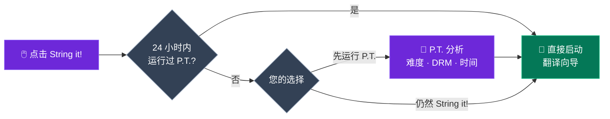
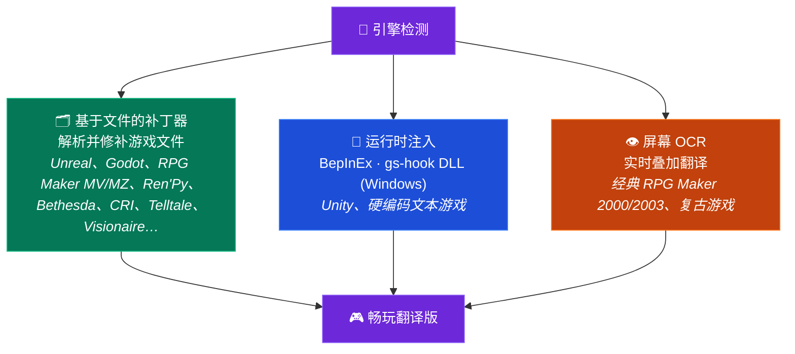

<p align="center">
  
</p>

<h1 align="center">GameStringer</h1>

<p align="center">
  <strong>使用 AI 将电子游戏翻译成任何语言的桌面应用。</strong><br>
  从您的库中选择一款游戏,选择一种语言,点击翻译 — 完成。
</p>

<p align="center">
  <a href="https://www.gamestringer.ai"></a>
  <a href="https://discord.gg/SjnD3Z7Uf8"></a>
  
  
  
  
  
  
</p>

<p align="center">
  <a href="https://www.gamestringer.ai">Website</a> ·
  <a href="https://discord.gg/SjnD3Z7Uf8"><strong>💬 Discord</strong></a> ·
  <a href="#help-wanted"><strong>🙏 招募帮助</strong></a> ·
  <a href="#-what-is-gamestringer">这是什么</a> ·
  <a href="#-download">下载</a> ·
  <a href="#-how-it-works">工作原理</a> ·
  <a href="#-the-prediction-tool-pt">P.T.</a> ·
  <a href="#-supported-game-engines">引擎</a> ·
  <a href="#-features">功能</a> ·
  <a href="#-build-from-source">构建</a>
</p>

<p align="center">
  <strong>🌍 用您的语言阅读:</strong><br>
  <a href="README.md">🇬🇧 English</a> ·
  <a href="README_IT.md">🇮🇹 Italiano</a> ·
  <a href="README_ES.md">🇪🇸 Español</a> ·
  <a href="README_FR.md">🇫🇷 Français</a> ·
  <a href="README_DE.md">🇩🇪 Deutsch</a> ·
  <a href="README_PT.md">🇧🇷 Português</a> ·
  <a href="README_JA.md">🇯🇵 日本語</a> ·
  🇨🇳 中文 ·
  <a href="README_KO.md">🇰🇷 한국어</a> ·
  <a href="README_RU.md">🇷🇺 Русский</a> ·
  <a href="README_PL.md">🇵🇱 Polski</a>
</p>

> ⚠️ **从 v1.8.x 升级?** v1.9.0 已从 Tauri v1 迁移到 **Tauri v2** — 自动更新程序无法完成这次跨越。请手动下载 **v1.9.1**:[GameStringer_1.9.1_x64-setup.exe](https://github.com/rouges78/GameStringer/releases/download/v1.9.1/GameStringer_1.9.1_x64-setup.exe)。之后的更新(v1.9.1 → v1.9.x)将自动进行。

<p align="center">
  <strong>🌍 提供 12 种语言</strong> — 在应用内切换语言(IT、EN、ES、FR、DE、PT、PL、RU、JA、ZH、KO、EL),或在<a href="https://www.gamestringer.ai">网站</a>上切换(11 种语言)。
</p>

---

> ### 💜 来自开发者的话
>
> GameStringer 由**一个人 — 也就是我 — 独立开发,而我患有帕金森病**,因此更新有时会比我希望的来得慢一些。**感谢您的耐心。** 我做这件事**不是为了钱**:我只是想改变游戏翻译的方式,把一个真正实用的工具交到玩家手中。**Discord 现已开放** 🎉 — [快来加入我们](https://discord.gg/SjnD3Z7Uf8),让我们一起交流、碰撞想法,携手把 GameStringer 做得更好。🙏
>
> — *Davide([@rouges78](https://github.com/rouges78))*

---

<a name="help-wanted"></a>

## 🙏 招募帮助 — 在真实游戏上测试并反馈

> **GameStringer 是一个个人的、源码可见的项目,而且还很年轻。** 它已经能处理 20+ 种引擎,但真实游戏千差万别 — 每一款作品存储文本的方式都略有不同。**你现在能做的最有用的事,就是在一款真实游戏上运行 GameStringer,并告诉我发生了什么。** 哪怕只是一句 *"它在第 X 步失败了"* 也非常宝贵。

**为什么这很重要:** 我一个人不可能测试外面成千上万款游戏。持续的、来自真实世界的**测试与反馈**,才能把 *"在我的测试样本上能用"* 变成 *"在你的游戏上也能用"*。你的报告会直接影响路线图 — 这正是社区决定项目成败的部分。

### 🧪 三种帮助方式(任选其一)

- **🎮 测试一款游戏并反馈。** 在你库里的某款游戏上运行它,然后提交一份简短的[兼容性报告](https://github.com/rouges78/GameStringer/discussions) — 引擎是否被正确检测?文本是否被提取?补丁是否成功应用且游戏仍能启动?
- **📦 分享一个翻译包。** 如果某个翻译能用,把它发布到应用内的 **Patch Hub**,让其他人也能用 — 你的名字会署在上面(声誉 + "已验证译者")。
- **🛠️ 贡献代码。** 新的引擎解析器、语言修复、QA 脚本 — 在仓库中留意 `good first issue` 标签。

### 📋 我们尤其需要测试和反馈的内容

- [ ] **真实作品上的引擎覆盖** — Unity(Mono **和** IL2CPP)、Unreal(`.locres`、`_P.pak`、IoStore)、Godot、RPG Maker **MV/MZ**、Ren'Py、Bethesda(BSA/BA2/ESP)、CRI(CPK)、Wolf RPG、TyranoScript、Visionaire、弹丸论破
- [ ] **经典 RPG Maker(2000/2003)** 通过屏幕上的 **OCR 叠加层** — 结果的可读性如何?
- [ ] **编码与控制码** — 游戏内的重音符号/CJK 是否正确?游戏内的标签/变量是否保持完好?
- [ ] **字体** — 非拉丁文字(CJK、西里尔、希腊)是否能在游戏内渲染,还是需要更换字体?
- [ ] **各语言的翻译质量** — 对你的语言/类型而言,哪个 AI 提供商给出的结果最好?
- [ ] **Patch Hub** — `.gspack` 翻译包的端到端发布与下载
- [ ] **首次运行引导与 UX** — 翻译你的第一款游戏是否清晰易懂?哪里让你困惑?
- [ ] **更新追踪器** — 在商店更新之后,它是否正确地标记出补丁需要重新应用?

### 📝 兼容性报告模板(复制粘贴)

```
- 游戏 / 商店 / 版本:
- 检测到的引擎(由 GameStringer):
- 到达的步骤:扫描 / 检测 / 提取 / 翻译 / 打补丁 / 已游玩
- 结果:✅ 可用 / ⚠️ 部分可用 / ❌ 失败
- 使用的 AI 提供商:
- 语言:
- 备注(哪里出错、编码、截图):
- 操作系统 + GameStringer 版本:
```

**在哪里发布:** [GitHub Discussions](https://github.com/rouges78/GameStringer/discussions) · 应用内的 **Community Hub**(支持 / 展示 / 请求) · 缺陷 → [Issues](https://github.com/rouges78/GameStringer/issues)。

GameStringer 是免费且源码可见的;网站和 AI 成本都由我自掏腰包,所以如果它为你节省了时间,一杯咖啡会让我很感激,但**绝不**强求:[Buy Me a Coffee](https://buymeacoffee.com/gamestringer) · [Ko-fi](https://ko-fi.com/gamestringer) · [GitHub Sponsors](https://github.com/sponsors/rouges78)。

---

## 🎮 什么是 GameStringer?

> **简单来说:** 选一款游戏 → 选你的语言 → 点一个按钮。GameStringer 会找到游戏的文本,用 AI 翻译它,再放回去 — 并且会先做好备份。无需 modding、无需命令行、无需任何技术知识。

GameStringer 是一款**桌面应用程序**(Windows、Linux 和 macOS),可让您翻译没有您所用语言的电子游戏。

大多数游戏将文本存储在文件中 — JSON、XML、CSV、`.locres`、`.rpy`、BSA/BA2、CPK、Unity Localization StringTable 以及许多其他格式。GameStringer **扫描您的游戏文件夹**,找到这些文件,将文本通过您选择的 **AI 翻译提供商**发送(OpenAI、Claude、Gemini、DeepSeek、Ollama 以及 20+ 其他),并将**翻译后的文本打补丁**回游戏。一键操作,无需技术知识。

对于在编译资源中锁定文本的 **Unity 游戏**,GameStringer **自动安装 BepInEx + XUnity.AutoTranslator** — 无需手动设置。对于 **Bethesda 游戏**(上古卷轴、辐射、星空),它原生解析 BSA/BA2/ESP。对于 **CRI Middleware 游戏**(女神异闻录、如龙),它处理 CPK/CRILAYLA/MSG/BMD。对于 **Unreal Engine**,它直接编辑 `.locres`。

**这不是一个机器翻译网站。** 这是一个完整的流水线:**使用 P.T. 分析 → 检测引擎 → 提取文本 → 使用 AI 翻译 → 质量检查 → 打补丁回去 → 畅玩。**

---

## 📥 下载

从 **[GitHub Releases](https://github.com/rouges78/GameStringer/releases)** 获取最新版本:

| 平台 | 文件 | 说明 |
|----------|------|-------|
| **Windows** | `GameStringer_1.15.0_x64-setup.exe` | 安装程序(推荐) |
| **Windows** | `GameStringer_1.15.0_x64-portable.zip` | 免安装 |
| **Windows** | `GameStringer_1.15.0_x64_en-US.msi` | MSI 备选 |
| **macOS** | `GameStringer_1.15.0_x64.dmg` | Intel Mac |
| **macOS** | `GameStringer_1.15.0_aarch64.dmg` | Apple Silicon |
| **Linux** | `GameStringer_1.15.0_amd64.AppImage` | 通用(推荐) |
| **Linux** | `GameStringer_1.15.0_amd64.deb` | Debian / Ubuntu |
| **Linux** | `GameStringer-1.15.0-1.x86_64.rpm` | Fedora / RHEL |

**要求:** Windows 10+、macOS 10.15+ 或 Linux(Ubuntu 22.04+、Fedora 38+)。4 GB 内存(本地 AI 需 8 GB+),500 MB 磁盘空间。更新经过**加密签名**并通过 Tauri Updater 分发(应用会用内置公钥验证每一次更新)。

> 🛡️ **杀毒软件或 SmartScreen 警告?** 这是一个已知的**误报** — 运行时翻译使用 DLL 注入(BepInEx / gs-hook),这是一种会让启发式扫描器起疑的技术,而每个新版本一开始的 SmartScreen 信誉都为零。**[请阅读 docs/ANTIVIRUS.md](docs/ANTIVIRUS.md)**,了解触发原因、如何验证下载文件,以及如何报告误报。

---

## 🚀 工作原理

1. **安装** GameStringer 并启动
2. **您的游戏库自动加载** — Steam、Epic、GOG、Origin、Ubisoft、Amazon、itch.io、Humble App、Game Jolt、Big Fish(秒级检测 800+ 游戏)
3. **选择一款游戏** → 可选择运行 **P.T.(Prediction Tool)** 查看难度、预计时间、最佳 LLM 链
4. 点击 **"String it!"** — GameStringer 自动扫描、提取、翻译和打补丁
5. **用您的语言畅玩** — 打补丁前始终创建备份

就是这样。无需命令行,无需手动编辑文件,无需 modding 经验。

### 流水线一览


---

## 🧠 Prediction Tool (P.T.)

> **GameStringer 中最强大的功能。** 不要盲目开始翻译 — 先分析。

P.T. 是一个在任何翻译*之前*运行的深度分析引擎。它扫描您的游戏文件夹,检测引擎,估算可翻译文本的量,并告诉您:

- **Difficulty Score 0–100** — 字符串量、引擎复杂度、DRM、编码、语言挑战的综合权重
- **预计时间**覆盖 **18 个 LLM 模型** — Ollama(Gemma 4、Qwen 3、Llama)、OpenAI GPT-4/4o、Claude 3.5、Gemini、DeepL、DeepSeek、Groq
- **5 个推荐的 LLM 链**:Local(隐私)、Cloud(质量)、Hybrid(平衡)、Budget、Premium — 每个都有成本和质量评分
- **DRM 检测**:Denuvo、VMProtect、Steam DRM、EAC、BattlEye — 在尝试前警告
- **编码分析**:逐文件检测 Shift-JIS、UTF-8、UTF-16、Big5、EUC-KR
- **翻译复杂度**:敬语、性别一致、RTL、注音/振假名、CJK 特定处理
- **置信度评分**和**工作流计划** — 点击 "String it!" 时将运行的确切步骤
- **导出报告**(JSON + Markdown)用于共享或存档

### P.T.Rank — 快速排行

在多款游戏上运行 P.T. 后,打开 **P.T.Rank** 可查看按难度排序的所有已分析标题。非常适合规划您的翻译队列:从轻松的开始,把 80 万字符串的 RPG 留到最后。

### Dry Run Scanner

不想一次分析一款游戏?从库页面运行 **Dry Run** 可批量扫描**整个 Steam 库(800+ 游戏)**,**零文件修改**。您将获得一个 JSON 报告,将每款游戏分类为 **Ready**(引擎支持 + 可提取字符串)、**Errors**(manifest 问题 / DRM 阻塞)或 **Unsupported**(未知引擎 / 无文本)。进度为实时的,且无需备份,因为未触及任何内容。

### String it! Smart Gate

游戏详情页上的 **"String it!"** 按钮很智能:如果游戏在过去 24 小时内已经由 P.T. 分析,它会直接启动翻译向导。否则它会建议先运行 P.T.(一键选择 "Run P.T. first" / "String it! anyway")。不再在 DRM 锁定或 5 分钟就能解决的游戏上浪费运行。



---

## 🎯 支持的游戏引擎

一次引擎检测,**三条翻译路线** — GameStringer 会自动选择最合适的一条:



GameStringer 支持具有不同深度级别的 **20+ 引擎**:

| 引擎 | 支持 | 工作原理 |
|--------|---------|--------------|
| **Unity** | ✅ 完整 | 自动安装 BepInEx + XUnity.AutoTranslator + Unity Localization Package 流水线(StringTable、SharedTableData、Addressables、Smart Strings) |
| **Unreal Engine** | ✅ 完整 | 使用 UnrealLocres 提取和修补 `.locres` |
| **Unreal _P.pak** | ✅ 完整 | 将 Mod 打包为 `<GameStringer>_P.pak`,通过 Paks 文件夹加载 |
| **Godot** | ✅ 完整 | 原生 `.translation` 文件支持 |
| **RPG Maker** | ✅ 完整 | MV/MZ JSON,通过 Trans 的 VX/Ace,通过 RMXP 的 XP |
| **Ren'Py** | ✅ 完整 | 带对话检测的原生 `.rpy` 脚本解析 |
| **GameMaker** | ⚡ 部分 | 通过 UndertaleModTool 集成 |
| **Telltale** | ✅ 完整 | `.langdb` / `.dlog` 支持 |
| **Wolf RPG** | ✅ 完整 | WolfTrans 集成 |
| **Kirikiri** | ✅ 完整 | `.ks` / `.scn` 解析 |
| **TyranoScript** | ✅ 完整 | 带 JSON 修补的 fast-path 提取器 |
| **Electron** | ✅ 完整 | ASAR 解包 + i18n JSON 检测 |
| **Bethesda(Skyrim/Fallout/Oblivion/Starfield)** | ✅ **NEW v1.9.0** | BSA v103-105 + BA2 GNRL/DX10 + ESP/ESM(FULL/DESC/NAM1)解析器,STRINGS/DLSTRINGS/ILSTRINGS |
| **CRI Middleware(女神异闻录/如龙/传说系列/龙珠)** | ✅ **NEW v1.9.0** | CPK + CRILAYLA + MSG/BMD/FTD,自动检测 Shift-JIS/UTF-8/UTF-16 |
| **Visionaire Studio** | ✅ 完整 | Daedalic 冒险游戏(Deponia、Edna 等) |
| **Danganronpa WAD** | ✅ 完整 | WAD 存档解析器 + STX 对话修补 |

> **Unity 游戏**受到特殊处理:如果没有找到可翻译文件,GameStringer 会检测到这是一款 Unity 游戏,并提供一键**自动安装 BepInEx + XUnity.AutoTranslator**。安装后只需启动游戏一次,然后重新扫描 — 所有文本都可翻译。
>
> ⚠️ **反作弊警告**:BepInEx(DLL 注入)可能触发反作弊系统(EAC、BattlEye、Vanguard)。GameStringer 包含反作弊检测并会警告您。**仅用于单人 / 离线游戏。** P.T. 在任何修改之前检测 DRM。

---

## ✨ 功能

### 🆕 v1.15.0 新增功能 — Ollama 调优与项目 ↔ Patch Hub

- **🎚 Ollama 推理参数面板** — 通过**忠实 / 平衡 / 创意**预设微调本地 Ollama 翻译,或切换到**专家模式**直接控制 temperature、top-p 等采样参数;所选设置会以非破坏方式接入每一次 Ollama 翻译调用
- **🔗 项目 ↔ Patch Hub 集成** — **将 `.gspack` 作为已完成项目导入**,**直接从项目预填充**并发布到 Hub,在**浏览 / 我的补丁**开关间切换,一键**应用到游戏**(并自动备份)
- **💬 应用内反馈小组件** — 无需离开应用即可发送反馈或报告问题
- **⚡ 更快的 Patch Hub** — 响应**缓存 + 限流**,在高负载下也能更流畅地浏览和下载
- **🐛 修复** — RSS 新闻 WebView 不再被 CORS 拦截,并新增一轮 **WCAG 2.1 AA 无障碍审计**

### 🆕 v1.14.0 新增功能 — 社区兼容性与坚不可摧的翻译包

- **🧭 兼容性遥测(可选加入)** — "翻译界的 ProtonDB":报告某个翻译是否可用,并在**游戏卡片上看到兼容性徽章**,由带反滥用防护的社区报告支撑,并有一个[公开统计页面](https://gamestringer.ai/compatibilita.html)
- **🔤 缺失字形检测 + 自动字体修复** — GameStringer 会解析游戏字体的字符映射表,检测你的语言字形是否缺失,并为基于文件的引擎(Ren'Py、RPG Maker)**自动安装匹配的 Noto 字体** — 不再出现文字变成豆腐块的情况
- **🛡 可验证的翻译包完整性** — 社区翻译包使用**聚合的 SHA-256** 验证,并具备路径穿越防护和对被篡改包的自动标记
- **💥 可选加入的崩溃报告** — 带重复崩溃签名的匿名报告,让崩溃更快得到修复
- **📚 稳健的库语言扫描** — 更可靠地检测游戏已自带的语言,并新增一个手动"检测语言"按钮
- **💬 Discord 已上线** — 加入 [discord.gg/SjnD3Z7Uf8](https://discord.gg/SjnD3Z7Uf8)
- **🧪 解析器回归套件** — 共享的二进制测试样本(Godot、.locres、STX、RPG Maker、CRI CPK、Bethesda)由 Rust 和 TS 解析器共同验证;发现并修复了 2 个真实缺陷
- **📰 更干净的新闻源** — 移除了 MediaWiki 的 diff 噪声,过滤掉了促销帖

### 🆕 v1.13.0 新增功能

- **🖥 实时 UE 翻译器标记为实验性** — Unreal 实时工具现在会预先声明其实验性状态,并在启动前检查游戏是否真的在运行
- **🎛 设置中的质量控制** — 为新的翻译质量功能(reflection 复检、语义检索)增加开关,并扩大了提供商白名单
- **🌐 站点 + i18n** — 站点上新增 v1.12.0 板块,配有信息图和开发者笔记,共 12 种语言;`aiQuality` / `semantic` / `lore` 键在所有语言环境中补齐
- **🐛 修复** — CI 现在从当前分支构建发布版,而不是从尚未创建的标签;在 RLS 强化下重建了 Supabase 论坛 INSERT 策略,并带有优雅的桥接退出机制;去重了迁移版本 `20260626`

### 🆕 v1.12.0 新增功能 — 更聪明、会自查的翻译

- **👁️ 视觉上下文翻译(VLM)** — 对于实时 / 屏幕翻译,AI 视觉模型现在会*看到画面*并结合该上下文进行翻译,不再对含糊的词乱猜(*"Chest"* 到底是宝箱还是身体部位?)。支持**本地**模型(Ollama)或 **OpenAI / Gemini**。截图会被原生裁剪和缩放以提升速度。
- **🪞 自我纠正的翻译(Reflection)** — 翻译之后,GameStringer 可以进行一次快速的第二遍复检,对照你的**术语表、语气和格式**审查自己的成果,只修正真正需要修正的那些行。默认是选择性的,因此保持又快又省。
- **🧠 语义记忆(RAG)** — 你的 Translation Memory 和术语表现在按**含义**匹配,而不仅仅是完全一致的词,因此即使措辞不同,你之前翻译过的短语也会被复用 — 让整款游戏的术语保持一致。完全本地(Ollama 嵌入);不可用时回退到关键词匹配。
- **⚡ 更流畅的实时翻译** — 重做了实时叠加流水线和原生图像处理,让屏幕翻译结果更快、更干净。
- **🔌 开箱即用更多提供商** — 扩大白名单,让更多后端直接可用:DeepL、Groq、Cerebras、Cohere、Together、Fireworks、Hugging Face、Azure Translator、DashScope、LibreTranslate、Lingva、MyMemory。

### 🆕 v1.11.2 新增功能

- **更多商店** — 除现有启动器外,新增对 **Humble App、Game Jolt 和 Big Fish Games** 的本地安装检测
- **翻译查询** — 通过 **PCGamingWiki** 查看游戏是否已自带你的语言,并在游戏视图中提供快捷的**意大利语 fan-patch 搜索链接**
- **发布到 Patch Hub** — 一步将已完成的项目发送到社区 **Patch Hub**(`app/projects` → 发布,复用 `publishPack`)
- **Community Hub 概览** — 新的落地面板,展示近期活动、最新翻译包和分类
- **意大利语翻译新闻** — 新增精选的 fan-translation RSS 源(Ctrl+Trad、OldGamesItalia、Romhacking.it、Language Pack Italia、Q-Gin 等)
- **String it! 无处不在** — Unity/Unreal/Godot 的一键路由 + **TyranoScript** 云端流水线
- **Unity** — 为 XUnity 提供本地 **Ollama** 桥接(CustomTranslate);BepInEx/XUnity/TMP/UABEA 下载均从 GitHub API 解析
- **Godot** — 重写的 `.pck` 解析器可读取真实的 **Godot 4.4+** 存档(在 *Slay the Spire 2* 上验证)
- **桌面可靠性** — 移除了最后的 Web `/api` 调用:编辑器使用本地 TM,翻译/导出/语音/商店调用都走原生后端

### 🆕 v1.10.2 新增功能

- **自动更新程序修复** — 解决了卡在"准备中…"状态、更新始终不开始下载的问题。一个陈旧的 React 更新对象被传给了 `downloadAndInstall`,且 `updating` 标志从未被重置;现在自动更新可以可靠地启动、下载并安装(`components/notifications/auto-updater.tsx`、`hooks/use-tauri-updater.ts`)
- **可靠的设置持久化** — 应用设置和 AI 提供商 API 密钥现在通过 `save_app_settings` / `load_app_settings` Tauri 命令可靠地保存到磁盘(`data_dir/GameStringer/settings.json`);此前部分设置未被持久化
- **从磁盘手动添加游戏** — 你现在可以通过从磁盘选取游戏文件夹来添加游戏,不再仅依赖库自动检测(Steam/Epic/等)(`lib/manual-games.ts`、`app/library/page.tsx`)

### 🆕 v1.9.1 新增功能

- **修复 CSP 阻断 Supabase** — Community Chat 被 Tauri v2 的严格内容安全策略悄悄拦截。将 `https://*.supabase.co` 和 `wss://*.supabase.co` 加入 `connect-src`
- **修复聊天自动连接** — 通过自定义事件在 `main-layout` 和 `persistent-chat` 之间协调认证,消除竞态条件
- **修复超时错误** — max-timeout 中的陈旧闭包导致即使聊天成功加载也会误报 "Tempo di caricamento troppo lungo"
- **macOS 构建** — 现已提供 DMG(Intel)和 `.app.tar.gz`(Apple Silicon)

### 🆕 v1.9.0 新增功能

- **统一在线状态** — Supabase Realtime + DB 回退,自动离开/自动上线,每 30 秒心跳
- **系统托盘通知** — 针对聊天、翻译、错误、更新、游戏、好友、新闻的原生 OS 通知,可配置免打扰时段
- **错误边界 + 崩溃恢复** — WidgetErrorBoundary(5 秒自动重试,最多 3 次)、带重新加载的 AppErrorBoundary
- **网络韧性 / 离线模式** — 网络监视器、状态栏(红/黄/绿)、指数退避重试、离线队列
- **角色声音配置(Voice Cloning)** — 从对话中自动提取角色风格,16 种语气,提示注入以保持翻译一致
- **微调基础设施** — 从人工修正生成数据集(Adaptive MT),4 种导出格式,通过 Ollama 的按游戏模型管理
- **代码拆分 / 懒加载** — 8 个重型组件转换为 React.lazy + Suspense 以加快启动
- **缺陷修复** — NetworkResilience 重复初始化 + 监听器泄漏、Supabase 400 user_profiles、托盘版本字符串、关键通知绕过免打扰时段

### 🤖 AI 翻译

- **20+ 提供商**:OpenAI、Claude、Gemini、DeepSeek、Mistral、Groq、DeepL、Ollama(本地)、LM Studio、TranslateGemma、HY-MT、Qwen 3、NLLB-200、Cerebras、Together AI、Fireworks、OpenRouter、Cohere、Lingva、MyMemory
- **Context-aware**:理解游戏类型、角色声音、语调、叙事 vs UI vs 对话
- **Translation Memory 和术语表**:整个项目的一致性,自动术语表提取
- **Auto-Select Engine**(NEW v1.7.0):`auto` 预设,根据目标语言 + 游戏类型动态排列提供商(欧洲语言用 DeepL、CJK 用 Claude、按类型加权)
- **Multi-LLM Compare**:并行运行多个提供商,为每个字符串选择最佳结果
- **Quality gates**:对每个翻译字符串的自动 QA 评分(0-100),带 ContentTypeBadge
- **Vision LLM Translator**:使用游戏内截图作为上下文(Ollama、Gemini、GPT-4o)
- **Live Quality Preview**:在批量翻译期间实时查看质量评分
- **RTL 支持**:自动方向检测和 `dir` 属性处理

### 🧠 P.T. — Prediction Tool (v1.9.0)

- **Difficulty Score 0-100**,带加权因素(量、引擎、DRM、编码、复杂度)
- **18 个 LLM 模型的时间估计**,包括 Gemma 4(27B MoE A4B / E4B / E2B)
- **5 个 LLM 链**(Local / Cloud / Hybrid / Budget / Premium),带成本和质量估计
- **DRM / 反作弊检测**(Denuvo、VMProtect、Steam DRM、EAC、BattlEye、Vanguard)
- 逐文件**编码分析**(Shift-JIS、UTF-8/16、Big5、EUC-KR)
- **翻译复杂度分析**(敬语、性别、CJK、注音、RTL)
- **P.T.Rank / Quick Ranking** — 按难度对所有已分析游戏排序
- **Dry Run Scanner** — 整个 Steam 库(800+ 游戏)的批量扫描,无修改
- **Workflow Orchestrator** — 实际执行引擎,具有 6+ 引擎的通用 fast path 和实时进度
- **预测缓存**(24 小时) — 立即重新打开之前分析过的游戏
- **导出报告**(JSON + Markdown)用于共享和存档

### 📚 游戏库

- **自动检测**:Steam(带 Family Sharing)、Epic、GOG Galaxy、Origin/EA、Ubisoft Connect、Amazon Games、itch.io、Humble App、Game Jolt、Big Fish Games
- 秒级从已安装库识别 **800+ 游戏**
- 带封面艺术、元数据、引擎徽章、VR 徽章、安装状态的**游戏卡片**
- **悬停快捷操作**:String it!、Batch、Community、P.T. — 全部一键
- **Game Update Tracker**:检测 Steam 何时更新了已翻译的游戏(通过 `buildid`),验证补丁完整性(BepInEx 文件、`_P.pak` 存在),如果需要重新打补丁则警告
- **"Stop monitoring"** 按钮以取消跟踪特定游戏

### 🔧 翻译工具

- **One-Click Translate**("String it!"):扫描 → 翻译 → 打补丁,单一流程
- **Batch Translation**:一次翻译整个游戏或文件夹
- **字幕翻译器**:SRT、VTT、ASS/SSA,保留时间轴
- **OCR Translator**:使用真实 Tauri Tesseract 后端从复古游戏(8-bit、16-bit、DOS 预设)提取文本
- **Voice Pipeline**:speech-to-text → 翻译 → text-to-speech,带 **Duration Matching**(NEW v1.7.0)— 自动调整速度以匹配原始音频时长
- **Lip Sync**(NEW v1.7.0):Rhubarb 集成用于唇形(viseme)生成(A-X),交互式时间轴,支持导出到 Unity(blend shapes)和 Unreal(FaceFX)
- **Gridly CSV Export/Import**(NEW v1.7.0):兼容 Gridly、Lokalise 和 Crowdin 的多语言列格式
- **实时叠加**:通过 VR/屏幕叠加在玩游戏时查看翻译
- **Auto-Translate Review**:带进度条的 "Translate all untranslated" 按钮
- **Lore Assistant**:了解游戏背景和对话的 RAG 聊天
- **Character Voice Profiles**:为每个角色定义个性、语调、说话模式
- **Translation Confidence Heatmap**:所有翻译质量的可视化概览

### 🎮 游戏引擎补丁器

- **Unity**:BepInEx + XUnity.AutoTranslator 自动安装程序,Unity Localization Package(StringTable、SharedTableData、Addressables 目录、Smart Strings 验证器)
- **Unreal Engine**:`.locres` 提取 + `_P.pak` Mod 打包
- **Bethesda Engine Patcher**(NEW v1.9.0):Skyrim LE/SE/AE、Fallout 3/NV/4、Oblivion、Starfield — BSA v103-105 + BA2 GNRL/DX10 + ESP/ESM(FULL/DESC/NAM1)
- **CRI Middleware Patcher**(NEW v1.9.0):女神异闻录 5 Royal、如龙、传说系列、龙珠 — CPK + CRILAYLA + MSG/BMD/FTD
- **Ren'Py**、**RPG Maker**、**Godot**、**GameMaker**、**Kirikiri**、**Wolf RPG**、**Telltale**、**Visionaire**、**Danganronpa WAD** — 全部带原生解析器
- **Wizard Stepper**:所有补丁器的共享多步 UI
- 每个补丁器的 **Universal PO Export**(gettext `.po`),带项目/语言/源/引擎元数据
- **自动备份**:在每次打补丁之前,带一键恢复

### 🔌 高级

- **Auto-Hook Scanner**:硬编码字符串的进程内存扫描(Windows WinAPI)
- **System Monitor**:本地 LLM 规划的实时 VRAM/RAM 使用
- **Ollama Setup Wizard**:本地 AI 的分步安装
- **Ollama Manager**:从 ollama.com 注册表自动发现模型 + 焦点/导航时自动刷新
- **Debug Console**:带日志拦截的集成控制台
- **Video Extractor**(v1.7.0):从复古/现代游戏中提取和转换 FMV 视频(VMD、BIK、SMK、USM、ROQ),支持 AI 升级(Real-ESRGAN),从游戏详情页直接链接
- **Plugin System**:第三方插件的设计文档(请参阅 `docs/PLUGIN_SYSTEM.md`)
- **Community Hub**:共享和下载 Translation Memories + GitHub Discussions 集成
- **Public API v1**:用于集成的 REST 端点(`/api/v1/translate`、`/api/v1/batch`)

### 💬 Community Chat

- 通过 Supabase Realtime 与其他翻译者进行**实时聊天**
- **4 个默认房间**:General、Translations、Feedback & Bugs、Announcements
- **自定义房间**:为特定游戏或项目创建房间
- **Auto-Bridge Auth**:您的 GameStringer 配置文件自动同步到 Supabase — 无需额外登录
- **在线状态**:查看每个房间中谁在线
- 带 RLS 强制所有权的**回复 / 编辑 / 删除**消息
- 右下角的**可展开抽屉小部件**

### ♿ 无障碍 (v1.9.0)

- **WCAG 2.1 AA sweep** — 图标按钮上的 `aria-label`、语义 `CardTitle` 标题、所有原语上的 `focus-visible`、skip-to-content 链接、`main` 地标、意大利语 `sr-only` 助手
- 所有动画中尊重 **`prefers-reduced-motion`**
- 尊重 **`forced-colors`**(Windows 高对比度模式)
- **12 种语言 UI**:IT、EN、ES、FR、DE、JA、ZH、KO、PT、RU、PL、EL(希腊语在 v1.10.0 加入)
- 带自动方向检测的 **RTL 布局支持**

### 🎨 Design System (v1.9.0)

- 通过 `cva` 的 **Card 变体**:default、muted、highlight、success、error、warning
- 包括 `xs` 和 `icon-sm` 的 **Button 尺寸**
- **文本工具**:`text-micro`(9px)、`text-2xs`(10px) — 不再有任意的 Tailwind
- **Radix UI 统一**:将 37 个文件从 `@radix-ui/react-*` 迁移到 `radix-ui`,删除了 27 个包
- **优化包**:radix-ui、framer-motion、recharts、cmdk 的 `optimizePackageImports`

### 🖥️ 应用

- **签名自动更新**:通过 Tauri Updater 从应用中一键更新
- **配置文件**:带恢复密钥的多个用户配置文件
- **Global Hotkeys**:`Ctrl+Shift+T` OCR、`Ctrl+Shift+Q` Quick Translate、`Ctrl+Alt+O` Overlay、`Alt+T` XUnity 切换
- **System Tray**:快捷操作、实时 Ollama 状态、工具子菜单、带偏好设置的原生 OS 通知
- **跨平台**:带原生构建的 Windows、macOS 和 Linux
- **Windows tray 修复**:防止子进程生成时的控制台闪烁循环

---

## 🔧 AI 提供商

| 提供商 | API Key | Free Tier | 最适合 |
|----------|---------|-----------|----------|
| **Ollama** | 否(本地) | ✅ 无限 | 隐私、离线 |
| **LM Studio** | 否(本地) | ✅ 无限 | 隐私、GGUF 模型 |
| **TranslateGemma** | 否(Ollama) | ✅ 无限 — 55 种语言,Google | **推荐起点** |
| **HY-MT1.5** | 否(Ollama) | ✅ 无限 — 约 1GB RAM,腾讯 | 低 RAM 机器 |
| **Qwen 3** | 否(Ollama) | ✅ 无限 — 多语言 | CJK 语言 |
| **Gemma 4** | 否(Ollama) | ✅ 无限 — 27B MoE A4B/E4B/E2B | 本地质量 |
| **Gemini** | 是 | ✅ 免费层(15 RPM) | **推荐云端** |
| **DeepSeek** | 是 | ✅ $0.14/1M input | 经济云端 |
| **Groq** | 是 | ✅ 14,400 请求/天 | 速度 |
| **Mistral** | 是 | ✅ 免费层 | 欧盟云端 |
| **OpenAI** | 是 | 付费 | GPT-4o 质量 |
| **Claude** | 是 | 付费 | 细微差别、长上下文 |
| **DeepL** | 是 | ✅ 500k 字符/月 | 欧洲语言 |
| **MyMemory** | 否 | ✅ 无限 | 回退 |
| **Lingva** | 否 | ✅ 无限 | Google MT 镜像 |
| **Cerebras** | 是 | ✅ 免费层 | 速度 |
| **Together AI** | 是 | ✅ $25 免费额度 | 开放模型 |
| **Fireworks** | 是 | ✅ 免费层 | 开放模型 |
| **OpenRouter** | 是 | ✅ 免费模型 | 模型多样性 |
| **NLLB-200** | 是 | ✅ 200 种语言 | 稀有语言 |
| **Cohere** | 是 | ✅ 免费试用 | RAG |

**推荐起点**:通过 Ollama 的 **TranslateGemma**(免费、本地、55 种语言)或 **Gemini**(免费层、云端)。低 RAM:**HY-MT1.5**(约 1GB)。最佳质量:**Claude 3.5** 或 **GPT-4o**。最佳 CJK:**Qwen 3**。

---

## 📖 文档

### 用户指南(12 种语言)

| | | |
|---|---|---|
| 🇮🇹 [Italiano](docs/GUIDA_UTENTE.md) | 🇬🇧 [English](docs/USER_GUIDE_EN.md) | 🇪🇸 [Español](docs/USER_GUIDE_ES.md) |
| 🇫🇷 [Français](docs/USER_GUIDE_FR.md) | 🇩🇪 [Deutsch](docs/USER_GUIDE_DE.md) | 🇯🇵 [日本語](docs/USER_GUIDE_JA.md) |
| 🇨🇳 [中文](docs/USER_GUIDE_ZH.md) | 🇰🇷 [한국어](docs/USER_GUIDE_KO.md) | 🇧🇷 [Português](docs/USER_GUIDE_PT.md) |
| 🇷🇺 [Русский](docs/USER_GUIDE_RU.md) | 🇵🇱 [Polski](docs/USER_GUIDE_PL.md) | 🇮🇷 [فارسی](docs/USER_GUIDE_FA.md) |

### 项目文档

- **[CHANGELOG.md](CHANGELOG.md)** — 完整版本历史
- **[ROADMAP.md](ROADMAP.md)** — 优先级排序的路线图(P0/P1/P2)
- **[docs/VERSIONING.md](docs/VERSIONING.md)** — 版本控制政策
- **[docs/PROJECT_STATUS.md](docs/PROJECT_STATUS.md)** — 当前状态一览
- **[docs/ANTIVIRUS.md](docs/ANTIVIRUS.md)** — 杀毒软件 / SmartScreen 误报
- **[PLUGIN_SYSTEM.md](docs/PLUGIN_SYSTEM.md)** — 插件架构设计
- **[LICENSE](LICENSE)** — Source-Available License v1.1
- **[docs/LEGAL.md](docs/LEGAL.md)** — 法律立场与可接受使用政策

---

## 🛠️ 从源码构建

**先决条件**:Node.js 18+、Rust 1.70+、npm。在 Linux 上还需要:`libwebkit2gtk-4.1-dev`、`libayatana-appindicator3-dev`、`librsvg2-dev`。

```bash
git clone https://github.com/rouges78/GameStringer.git
cd GameStringer
npm install
npm run dev          # 开发
npm run tauri:build  # 生产构建
```

Rust 后端:`cd src-tauri && cargo check` 以验证 Tauri 命令在您的平台上编译。

---

## 💖 支持

如果 GameStringer 帮助您用自己的语言玩游戏:

<p align="center">
  <a href="https://buymeacoffee.com/gamestringer">
    
  </a>
  <a href="https://ko-fi.com/gamestringer">
    
  </a>
  <a href="https://github.com/sponsors/rouges78">
    
  </a>
</p>

---

## 📜 许可证

**Source-Available License v1.1** — 源代码是公开的,您可以自己构建它,但它不是 OSI 批准的"开源"。

- ✅ 个人使用免费
- ✅ 可自由检查、构建和修改供自己使用
- ❌ 商业使用需要书面许可
- ❌ 修改版本的再分发需要书面许可

详情请参阅 [LICENSE](LICENSE),项目的法律立场与可接受使用政策请参阅 **[docs/LEGAL.md](docs/LEGAL.md)**。有问题?请打开一个 [Discussion](https://github.com/rouges78/GameStringer/discussions)。

---

## 🙏 Credits

- **[BepInEx](https://github.com/BepInEx/BepInEx)** — Unity modding 框架(BepInEx Team)
- **[XUnity.AutoTranslator](https://github.com/bbepis/XUnity.AutoTranslator)** — Unity 翻译框架(bbepis)
- **[UnrealLocres](https://github.com/akintos/UnrealLocres)** — Unreal `.locres` 解析器(akintos)
- **[UndertaleModTool](https://github.com/krzys-h/UndertaleModTool)** — GameMaker modding(krzys-h)
- **[Tauri](https://tauri.app)** — 桌面应用框架
- **[Tesseract.js](https://github.com/naptha/tesseract.js)** — OCR 引擎
- **[Ollama](https://ollama.com)** — 本地 LLM 运行时
- **[Supabase](https://supabase.com)** — Community Chat 的实时后端

---

<p align="center">
  用 ❤️ 为想用自己语言玩游戏的玩家制作<br>
  <strong>GameStringer v1.15.0</strong> · <a href="https://www.gamestringer.ai">gamestringer.ai</a> · © 2025-2026 GameStringer Team
</p>
